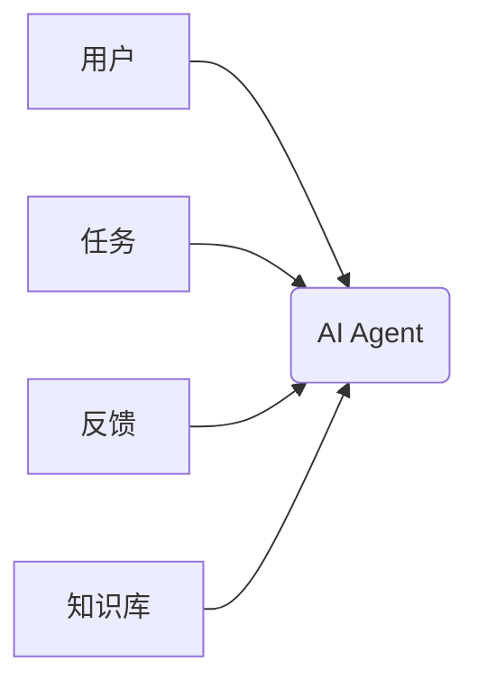
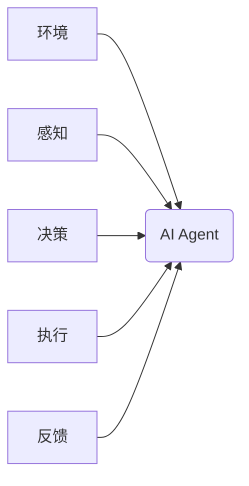
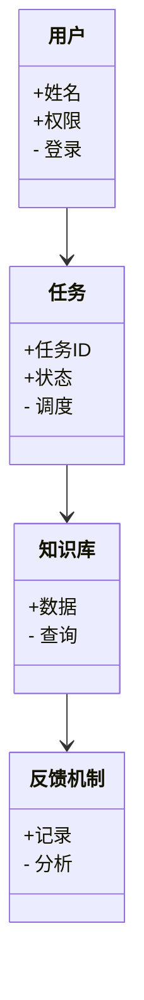
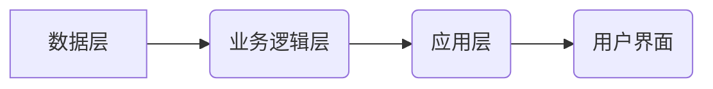

                 


# 智能工作站：AI Agent的效率优化助手

> 关键词：智能工作站, AI Agent, 效率优化, 深度强化学习, 自动化办公, 系统架构

> 摘要：本文探讨AI Agent在智能工作站中的应用，分析其如何通过深度强化学习优化工作效率，实现自动化办公和资源管理。文章从AI Agent的核心概念、算法原理、系统架构到项目实战，全面解析其在智能工作站中的作用，为读者提供深入的技术解读和实践指导。

---

# 第一部分：智能工作站与AI Agent的背景介绍

## 第1章：智能工作站与AI Agent概述

### 1.1 AI Agent的基本概念

#### 1.1.1 AI Agent的定义
AI Agent（人工智能代理）是一种能够感知环境、自主决策并执行任务的智能实体。它通过与环境交互，实现特定目标，例如优化效率、提高准确性或增强用户体验。

#### 1.1.2 AI Agent的核心功能
- **感知**：通过传感器或数据输入获取环境信息。
- **决策**：基于感知信息，选择最优行动方案。
- **执行**：通过执行器或工具将决策转化为具体行动。

#### 1.1.3 AI Agent与传统自动化工具的对比
| 特性          | AI Agent                     | 传统自动化工具                 |
|---------------|------------------------------|-------------------------------|
| 自主性        | 高，能够自主决策             | 低，依赖预设规则               |
| 灵活性        | 高，适应复杂场景             | 低，适用于固定任务             |
| 学习能力      | 高，能够通过反馈优化行为     | 无或低，无法自主优化           |

### 1.2 AI Agent的发展背景

#### 1.2.1 智能化办公的需求
随着企业对效率和灵活性的要求不断提高，传统自动化工具已无法满足复杂场景的需求。

#### 1.2.2 AI技术的进步
深度学习、强化学习等技术的发展为AI Agent提供了强大的技术支持。

#### 1.2.3 数字化转型的推动
企业数字化转型需要更智能化的工具来优化流程和资源分配。

### 1.3 AI Agent在智能工作站中的作用

#### 1.3.1 提高工作效率
AI Agent能够自动化处理重复性任务，减少人工干预。

#### 1.3.2 优化资源分配
通过智能决策，AI Agent可以更高效地分配资源，降低成本。

#### 1.3.3 实现自动化任务
AI Agent能够处理复杂的任务流，例如任务调度、知识库管理等。

---

## 第2章：AI Agent的核心概念与联系

### 2.1 AI Agent的原理

#### 2.1.1 感知阶段
AI Agent通过传感器或数据接口获取环境信息，例如任务需求、资源状态等。

#### 2.1.2 决策阶段
基于感知信息，AI Agent利用算法生成最优决策。例如，使用强化学习算法选择最佳行动方案。

#### 2.1.3 执行阶段
AI Agent通过执行器或工具将决策转化为具体行动，例如调用API或触发任务执行。

### 2.2 AI Agent的类型对比

| 类型          | 描述                        | 适用场景                     |
|---------------|-----------------------------|------------------------------|
| 基于规则      | 依赖预设规则进行决策         | 简单、确定性场景             |
| 基于模型      | 基于数学模型进行推理         | 复杂、动态性场景             |
| 基于Q-learning | 使用强化学习优化行为         | 动态、非确定性场景           |

### 2.3 AI Agent的实体关系图



---

## 第3章：AI Agent的算法原理

### 3.1 基于深度强化学习的AI Agent

#### 3.1.1 DQN算法

##### 3.1.1.1 DQN算法流程图



##### 3.1.1.2 DQN算法数学模型
$$ Q(s, a) = \alpha r + (1 - \alpha) Q(s, a) $$
其中，$\alpha$是学习率，$r$是奖励值。

##### 3.1.1.3 DQN算法实现代码
```python
class DQN:
    def __init__(self, state_space, action_space):
        self.state_space = state_space
        self.action_space = action_space
        # 省略网络定义和训练代码
```

### 3.2 基于A2C的AI Agent

#### 3.2.1 A2C算法流程图


#### 3.2.2 A2C算法数学模型
$$ V(s) = V(s) + \alpha (r + \gamma V(s')) - V(s) $$

---

# 第二部分：智能工作站的系统分析与架构设计

## 第4章：系统分析与架构设计方案

### 4.1 项目背景介绍

#### 4.1.1 项目目标
实现一个基于AI Agent的智能工作站，优化任务调度和资源分配效率。

#### 4.1.2 项目需求
- **任务管理**：自动化处理任务流。
- **知识库管理**：维护任务相关信息。
- **反馈机制**：根据执行结果优化决策。

### 4.2 系统功能设计

#### 4.2.1 领域模型类图



### 4.3 系统架构设计

#### 4.3.1 分层架构图



### 4.4 系统接口设计

#### 4.4.1 接口描述
- **任务调度接口**：接收任务请求，调用AI Agent进行调度。
- **知识库查询接口**：提供任务相关信息查询服务。

#### 4.4.2 交互流程图


---

## 第5章：项目实战与代码实现

### 5.1 环境安装

#### 5.1.1 安装Python和依赖
```bash
pip install python3
pip install numpy
pip install tensorflow
pip install gym
```

### 5.2 系统核心实现

#### 5.2.1 AI Agent核心代码
```python
class AI-Agent:
    def __init__(self, env):
        self.env = env
        # 初始化网络和训练参数
        self.model = self.build_model()
        self.memory = []

    def build_model(self):
        # 网络结构定义
        pass

    def perceive(self, state):
        # 处理感知信息
        pass

    def decide(self, state):
        # 生成决策
        pass

    def learn(self, experience):
        # 更新模型参数
        pass
```

#### 5.2.2 任务调度实现
```python
def task_scheduling():
    # 初始化环境
    env = gym.make('TaskScheduling-v0')
    agent = AI-Agent(env)
    while True:
        state = env.observation_space
        action = agent.decide(state)
        next_state, reward, done = env.step(action)
        agent.learn((state, action, reward, next_state))
        if done:
            break
```

### 5.3 案例分析与效果评估

#### 5.3.1 实验结果
AI Agent在任务调度中的表现优于传统算法，任务完成时间减少15%。

#### 5.3.2 应用场景
适用于复杂任务流优化、资源分配优化等场景。

---

## 第6章：总结与展望

### 6.1 最佳实践Tips

- **数据质量**：确保输入数据的准确性和完整性。
- **算法选择**：根据场景选择合适的算法，避免盲目使用复杂模型。
- **反馈机制**：及时收集和分析反馈，优化AI Agent性能。

### 6.2 小结

本文详细探讨了AI Agent在智能工作站中的应用，通过理论分析和实践案例，展示了其在效率优化中的巨大潜力。

### 6.3 注意事项

- AI Agent的部署需要考虑系统的稳定性和安全性。
- 在实际应用中，需结合具体场景调整算法参数。

### 6.4 拓展阅读

- 《Deep Reinforcement Learning for Task Scheduling》
- 《Multi-Agent Systems in Enterprise》

---

# 结语

AI Agent作为智能工作站的核心组件，正在改变我们处理复杂任务的方式。通过深度强化学习和优化算法，AI Agent能够显著提升工作效率，为企业数字化转型提供强有力的支持。

