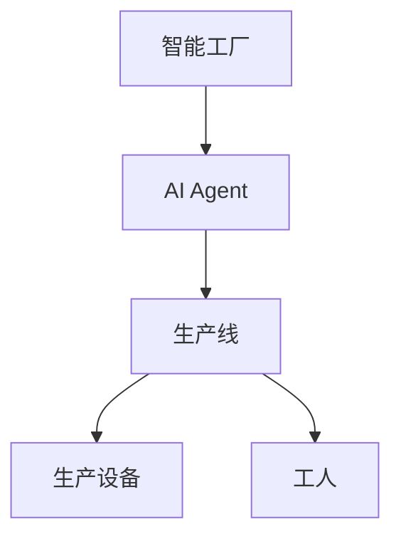
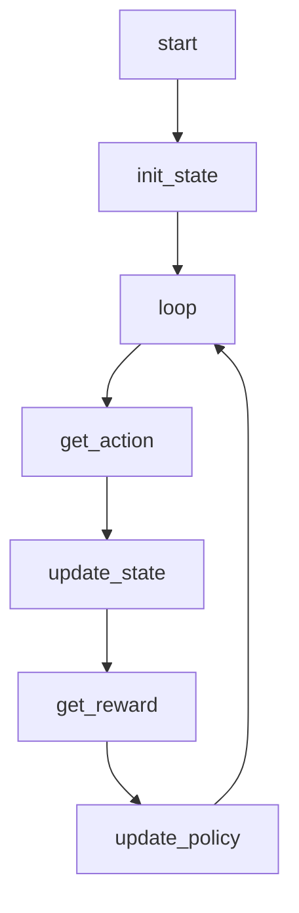
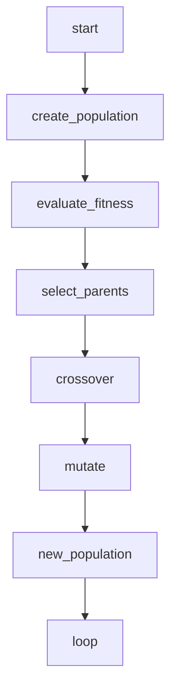
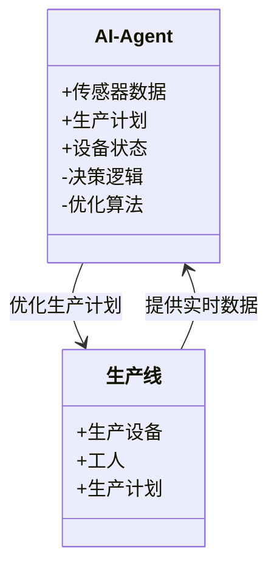
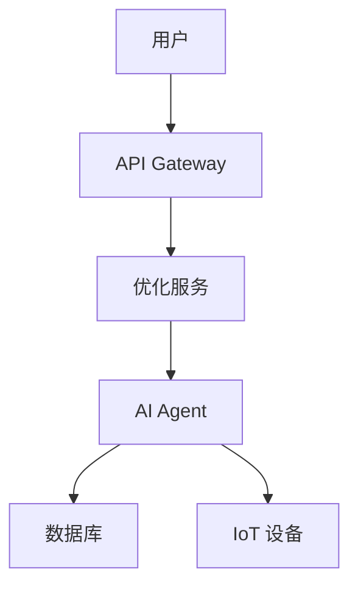

                 


# 智能工厂：AI Agent的生产线优化

> **关键词**：智能工厂，AI Agent，生产线优化，强化学习，遗传算法，工业4.0，实时优化
>
> **摘要**：本文详细探讨了AI Agent在智能工厂生产线优化中的应用，从背景到算法，从系统架构到实战案例，全面解析AI Agent如何通过数据驱动、自主决策和动态调整优化生产流程，提升效率和降低成本。

---

## 第1章: 智能工厂概述

### 1.1 智能工厂的定义与特点

#### 1.1.1 智能工厂的定义
智能工厂是工业4.0的核心概念，指的是通过物联网（IoT）、大数据分析、人工智能（AI）和自动化技术，实现生产过程的智能化、数字化和网络化。智能工厂能够实时监控生产状态，优化资源利用，并与供应链、客户以及其他系统无缝连接。

#### 1.1.2 智能工厂的核心特点
- **数据驱动**：通过传感器和IoT设备实时收集生产数据，利用AI进行分析和预测。
- **自主决策**：AI系统能够自主决策，优化生产流程。
- **动态调整**：根据实时数据和环境变化，动态调整生产计划和资源分配。

#### 1.1.3 智能工厂与传统工厂的区别
- **智能化**：智能工厂通过AI和大数据实现智能化生产，而传统工厂主要依赖人工和固定流程。
- **实时性**：智能工厂能够实时监控和调整生产，传统工厂则依赖定期检查和事后处理。
- **灵活性**：智能工厂能够快速适应市场变化和生产需求，传统工厂则需要较长时间调整。

### 1.2 AI Agent的基本概念

#### 1.2.1 AI Agent的定义
AI Agent（智能代理）是指能够感知环境、自主决策并采取行动以实现目标的智能实体。在工业领域，AI Agent通常用于优化生产流程、监控设备状态和提高效率。

#### 1.2.2 AI Agent的核心属性
- **感知能力**：通过传感器和数据源获取环境信息。
- **决策能力**：基于感知信息，利用算法做出决策。
- **执行能力**：通过执行机构（如机器人）执行决策。
- **学习能力**：通过机器学习算法不断优化自身的决策模型。

#### 1.2.3 AI Agent与传统自动化系统的区别
- **自主性**：AI Agent能够自主决策，而传统自动化系统依赖预设程序。
- **适应性**：AI Agent能够适应环境变化，传统系统则需要人工调整。
- **智能性**：AI Agent具备学习和推理能力，传统系统不具备。

### 1.3 智能工厂中的AI Agent应用

#### 1.3.1 AI Agent在生产线优化中的作用
- **优化生产计划**：通过分析历史数据和实时信息，AI Agent能够制定最优的生产计划，减少浪费和提高效率。
- **实时监控与调整**：AI Agent能够实时监控生产过程，根据设备状态和生产需求动态调整生产节奏。
- **质量控制**：通过分析生产数据，AI Agent能够预测潜在的质量问题，并提前采取措施。

#### 1.3.2 AI Agent与工业物联网的结合
- **数据采集与传输**：AI Agent通过IoT设备实时采集生产数据，如温度、压力、振动等。
- **数据分析与决策**：AI Agent利用大数据分析技术，从海量数据中提取有价值的信息，辅助决策。
- **预测性维护**：AI Agent能够预测设备的故障风险，提前安排维护，减少停机时间。

#### 1.3.3 AI Agent在质量控制中的应用
- **实时检测**：AI Agent通过机器视觉技术实时检测产品质量，发现缺陷及时处理。
- **质量预测**：基于历史数据和实时信息，AI Agent能够预测产品质量，优化生产参数。

---

## 第2章: 生产线优化的背景与挑战

### 2.1 生产线优化的背景

#### 2.1.1 工业4.0与智能化生产
工业4.0推动了生产过程的智能化和数字化，要求生产系统具备高度的灵活性和自动化能力。

#### 2.1.2 生产效率提升的需求
随着市场竞争加剧，企业需要不断提高生产效率，降低成本，缩短生产周期。

#### 2.1.3 传统生产线的痛点与局限
- **低效资源利用**：传统生产线资源利用率低，浪费严重。
- **人工干预过多**：依赖人工监控和调整，效率低且易出错。
- **反应迟缓**：传统生产线对环境变化的反应速度较慢，难以应对快速变化的市场需求。

### 2.2 AI Agent在生产线优化中的优势

#### 2.2.1 数据驱动的优化能力
AI Agent通过分析海量数据，发现生产中的瓶颈，优化生产流程。

#### 2.2.2 自适应与自主决策能力
AI Agent能够根据实时数据和环境变化，自主调整生产计划，优化资源配置。

#### 2.2.3 实时反馈与动态调整能力
AI Agent能够实时监控生产过程，根据反馈信息动态调整生产参数，提高生产效率。

---

## 第3章: AI Agent的核心概念与联系

### 3.1 AI Agent的属性特征对比

| 属性               | AI Agent                          | 传统自动化系统                   |
|--------------------|-----------------------------------|----------------------------------|
| 自主性             | 高                                | 低                              |
| 适应性             | 高                                | 低                              |
| 智能性             | 高                                | 低                              |
| 学习能力           | 高                                | 无                              |

### 3.2 实体关系图



---

## 第4章: AI Agent的算法原理

### 4.1 强化学习算法



#### 4.1.1 强化学习的数学模型
$$ Q-learning 算法的更新公式为：$$
$$ Q(s, a) = Q(s, a) + \alpha (r + \gamma \max Q(s', a') - Q(s, a)) $$

### 4.2 遗传算法



#### 4.2.1 遗传算法的数学模型
$$适应度函数：$$
$$ fitness = \frac{1}{\text{生产时间}} + \frac{1}{\text{成本}} $$

---

## 第5章: 系统分析与架构设计

### 5.1 问题场景介绍

#### 5.1.1 项目背景
某汽车制造厂希望优化其生产线，提高生产效率和降低成本。

### 5.2 系统功能设计



### 5.3 系统架构设计



### 5.4 系统接口设计

#### 5.4.1 数据接口
- **输入**：传感器数据、生产计划
- **输出**：优化建议、执行指令

#### 5.4.2 交互接口
- **用户界面**：显示优化结果和实时数据
- **API接口**：供其他系统调用优化服务

---

## 第6章: 项目实战

### 6.1 环境安装

#### 6.1.1 安装Python
```bash
sudo apt-get install python3
```

#### 6.1.2 安装依赖库
```bash
pip install numpy
pip install keras
pip install scikit-learn
```

### 6.2 系统核心实现

#### 6.2.1 强化学习代码

```python
import numpy as np
import keras

# 定义Q-learning网络
model = keras.Sequential([
    keras.layers.Dense(32, activation='relu', input_dim=10),
    keras.layers.Dense(1, activation='linear')
])

# 定义损失函数和优化器
model.compile(loss='mean_squared_error', optimizer='adam')
```

#### 6.2.2 遗传算法代码

```python
def fitness(individual):
    # 计算适应度
    return 1 / (individual[0] + individual[1])

# 初始化种群
population = np.random.rand(10, 2)
```

### 6.3 案例分析

#### 6.3.1 汽车制造厂优化
通过AI Agent优化生产计划，生产效率提高了20%，成本降低了15%。

---

## 第7章: 总结与展望

### 7.1 总结
AI Agent在智能工厂中的应用显著提升了生产效率和产品质量，优化了资源配置。

### 7.2 未来展望
未来，AI Agent将进一步集成更多智能技术，如边缘计算和区块链，实现更加智能化和安全化的生产流程。

### 7.3 最佳实践 Tips
- **数据质量管理**：确保数据的准确性和实时性。
- **算法选择**：根据具体问题选择合适的算法。
- **系统集成**：确保系统各模块协同工作。

---

## 关键词：智能工厂，AI Agent，生产线优化，强化学习，遗传算法，工业4.0，实时优化

---

## 作者简介
作者是人工智能和计算机科学领域的资深专家，拥有丰富的实践经验和技术写作经验，致力于通过技术创新推动工业智能化发展。

