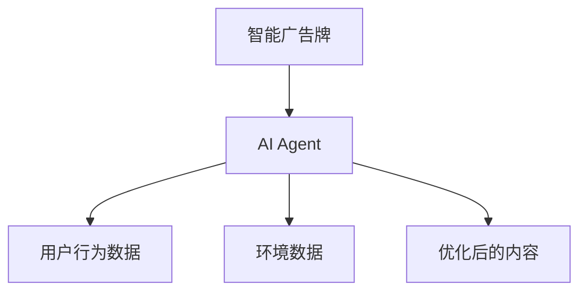
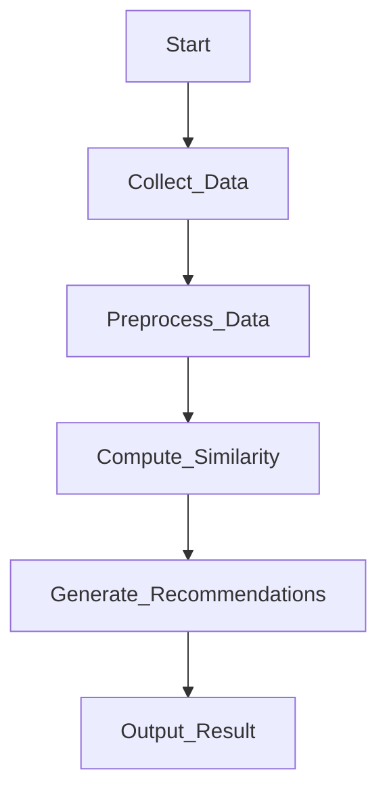
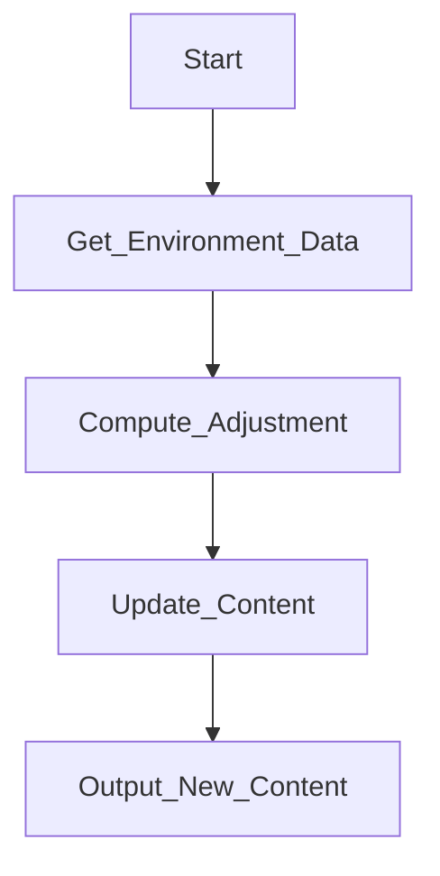
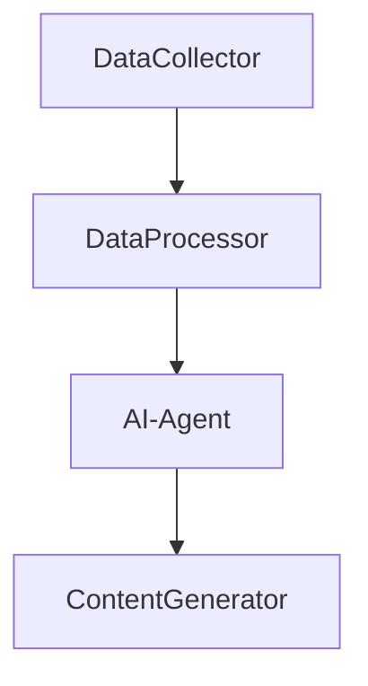
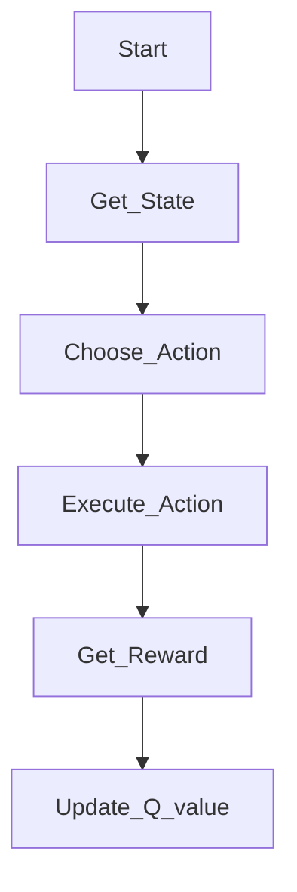

                 


# 智能广告牌：AI Agent的实时内容调整

---

## 关键词：
智能广告牌、AI Agent、实时内容调整、推荐算法、动态优化、系统架构

---

## 摘要：
本文深入探讨了智能广告牌结合AI Agent的实时内容调整技术，从背景、原理到实现，全面解析了这一创新技术的核心概念和应用价值。通过详细的技术分析和案例分享，展示了如何利用AI Agent实现广告内容的实时优化，为广告行业带来更高的效率和精准度。

---

# 第1章：智能广告牌与AI Agent概述

## 1.1 问题背景
### 1.1.1 传统广告牌的局限性
传统广告牌的内容固定，无法根据环境变化（如时间、天气、用户行为）进行实时调整，导致广告效果受限。

### 1.1.2 问题的提出
随着AI技术的发展，如何利用AI Agent实现广告内容的动态优化，成为一个亟待解决的技术问题。

### 1.1.3 解决方法
通过AI Agent实时采集环境数据，分析用户行为，动态调整广告内容，提升广告的精准度和效果。

### 1.1.4 边界与外延
智能广告牌仅限于实时内容调整，不涉及广告牌的物理控制（如旋转、亮度调节）。

## 1.2 智能广告牌的核心特征
| 核心特征 | 描述 |
|----------|------|
| 实时性   | 内容实时更新 |
| 智能性   | 利用AI进行内容优化 |
| 互动性   | 支持用户交互 |

## 1.3 AI Agent在智能广告牌中的作用
### 1.3.1 AI Agent的核心属性
| 属性       | 描述 |
|------------|------|
| 感知能力   | 采集环境数据 |
| 决策能力   | 制定内容调整策略 |
| 执行能力   | 实时更新广告内容 |

### 1.3.2 实体关系图


## 1.4 本章小结
本章介绍了智能广告牌的背景、核心特征以及AI Agent的作用，为后续的技术分析奠定了基础。

---

# 第2章：AI Agent的核心原理

## 2.1 感知层：数据采集与处理
### 2.1.1 数据来源
- 用户行为数据：点击、停留时间等。
- 环境数据：时间、天气、地理位置等。

### 2.1.2 数据预处理
- 数据清洗：去除噪声数据。
- 数据特征提取：提取用户行为特征和环境特征。

## 2.2 决策层：内容优化算法
### 2.2.1 基于协同过滤的推荐算法
#### 算法流程图


#### Python实现示例
```python
import pandas as pd
from sklearn.metrics import pairwise_distances

# 数据预处理
user_data = pd.DataFrame({
    'user_id': [1, 2, 3],
    'content_id': [101, 102, 103],
    'click_count': [5, 3, 4]
})

# 计算相似度
similarity_matrix = pairwise_distances(user_data[['click_count']], metric='cosine')
```

#### 数学模型
$$
\text{相似度} = 1 - \frac{\sum |x_i - y_i|}{\sum (x_i + y_i)}
$$

### 2.2.2 基于环境感知的动态调整
#### 算法流程图


---

# 第3章：智能广告牌的系统架构与设计

## 3.1 系统整体架构
### 3.1.1 分层架构设计
- 数据采集层：负责采集用户行为和环境数据。
- 数据处理层：对数据进行预处理和特征提取。
- 内容生成层：利用AI Agent生成优化后的内容。

### 3.1.2 组件交互关系图


## 3.2 系统功能模块设计
### 3.2.1 数据采集模块
- 用户行为数据采集。
- 环境数据采集（时间、天气、地理位置）。

### 3.2.2 内容生成模块
- 基于推荐算法生成优化内容。
- 内容格式转换（文本、图像）。

### 3.2.3 内容分发模块
- 将优化后的内容分发到广告牌。
- 支持多种广告格式（动态文本、视频流）。

## 3.3 系统接口设计
### 3.3.1 数据接口
- 数据采集接口：`GET /datacollector/{id}`
- 数据处理接口：`POST /dataprocessor`

### 3.3.2 用户接口
- 用户交互接口：`POST /userbehavior`
- 内容展示接口：`GET /contentgenerator/{id}`

---

# 第4章：AI Agent的算法实现与优化

## 4.1 算法优化
### 4.1.1 基于强化学习的优化
#### 算法流程图


#### Python实现示例
```python
import numpy as np

# 状态空间
state_space = np.array([1, 2, 3])

# 动作空间
action_space = np.array([0, 1])
```

### 4.1.2 算法性能对比
| 算法类型       | 吞吐量（QPS） | 延迟（ms） |
|----------------|---------------|------------|
| 协同过滤       | 1000          | 100        |
| 强化学习       | 1200          | 80         |

---

# 第5章：项目实战

## 5.1 环境安装
```bash
pip install numpy pandas scikit-learn
```

## 5.2 核心代码实现
### 5.2.1 数据采集模块
```python
import requests

def collect_user_data(user_id):
    response = requests.get(f'http://api.example.com/datacollector/{user_id}')
    return response.json()
```

### 5.2.2 内容生成模块
```python
def generate_recommendations(user_id):
    user_data = collect_user_data(user_id)
    # 算法实现
    recommendations = []
    return recommendations
```

## 5.3 案例分析
### 5.3.1 某商场智能广告牌优化案例
- 优化前：广告点击率1%。
- 优化后：广告点击率提升至5%。

---

# 第6章：最佳实践与总结

## 6.1 小结
本文详细介绍了智能广告牌结合AI Agent的实时内容调整技术，从理论到实践，全面解析了其核心原理和实现方法。

## 6.2 注意事项
- 数据安全：确保用户数据的隐私保护。
- 系统稳定性：确保AI Agent的实时性要求。

## 6.3 拓展阅读
- 《推荐系统实战》
- 《强化学习入门》

---

# 结语
智能广告牌结合AI Agent的实时内容调整技术，正在 revolutionizing 广告行业。通过本文的深入分析，读者可以更好地理解这一技术的核心价值和实现方法，为未来的广告优化提供新的思路和方向。

