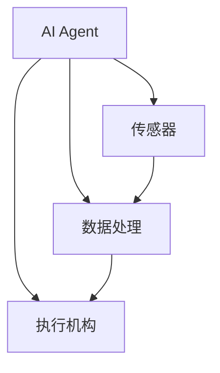
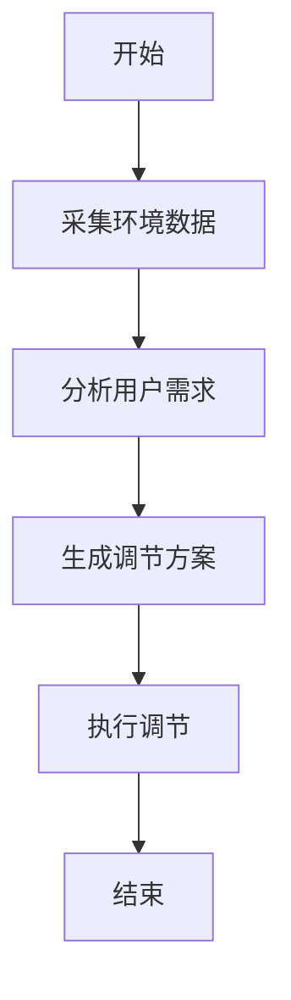
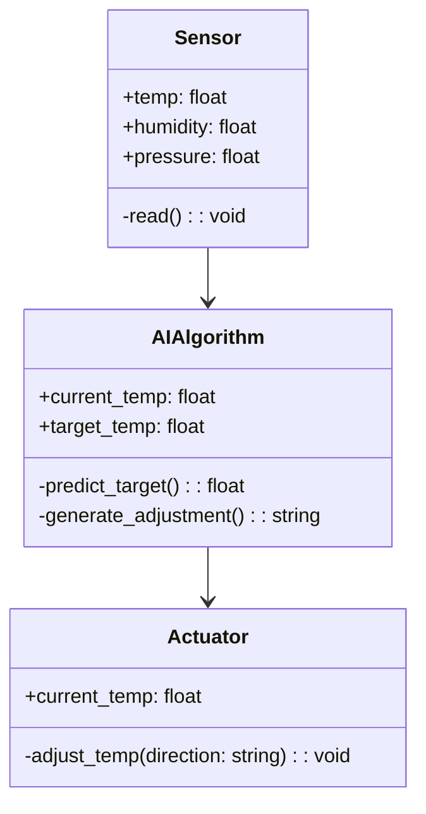

                 


# 智能床垫：AI Agent的体温调节系统

## 关键词：智能床垫，AI Agent，体温调节，物联网，智能家居

## 摘要：  
本文探讨了智能床垫与AI Agent结合的体温调节系统，详细分析了其技术原理、系统架构、实现方法及应用场景。通过背景介绍、核心概念、算法原理、系统设计、项目实战和最佳实践等多角度，深入剖析了这一创新技术的实现细节和实际价值，为读者提供了全面的技术视角。

---

## 第一部分：智能床垫的背景与概念

### 第1章：智能床垫的背景介绍

#### 1.1 问题背景  
现代人面临睡眠质量差、环境适应性不足等问题，传统床垫无法根据个体需求动态调节。随着物联网和人工智能技术的发展，智能床垫逐渐成为改善睡眠健康的重要工具。

#### 1.2 问题描述  
- 睡眠环境缺乏智能化调节，导致舒适度和健康效果不佳。
- 个体差异大，传统床垫无法满足不同人群的需求。
- 缺乏实时反馈和动态优化功能。

#### 1.3 问题解决  
- 引入AI Agent技术，实现智能床垫的动态调节。
- 结合传感器和执行机构，实时感知并调整环境参数。

#### 1.4 概念结构与核心要素  
- 智能床垫定义：集成传感器、AI算法和执行机构的床垫。
- 核心要素：传感器（温度、湿度、压力）、AI算法、执行机构（电热元件、空气循环系统）。

---

## 第二部分：智能床垫的核心概念与联系

### 第2章：AI Agent与智能床垫的核心原理

#### 2.1 AI Agent的基本原理  
AI Agent通过感知环境、分析数据、制定决策并执行操作，实现智能床垫的动态调节。

#### 2.2 智能床垫的系统构成  
- 传感器模块：温度、湿度、压力传感器实时采集数据。
- AI算法模块：处理数据，生成调节指令。
- 执行机构：根据指令调整床垫环境。

#### 2.3 核心概念对比表  
| 概念       | 描述                                   |
|------------|--------------------------------------|
| 传感器     | 感测环境参数（温度、湿度、压力）     |
| AI算法     | 处理数据，生成调节指令               |
| 执行机构   | 根据指令调整床垫环境  

---

### 第3章：AI Agent与智能床垫的关系

#### 3.1 AI Agent的核心功能  
- 感知：通过传感器获取环境数据。
- 决策：基于数据生成调节方案。
- 执行：驱动床垫调整环境。

#### 3.2 实体关系图（Mermaid）  



---

## 第三部分：智能床垫的算法原理

### 第4章：体温调节算法的实现

#### 4.1 算法概述  
体温调节算法基于用户睡眠数据和环境参数，动态调整床垫温度和湿度。

#### 4.2 算法流程图（Mermaid）  



#### 4.3 算法代码实现  

```python
def adjust_temperature(target_temp, current_temp):
    if current_temp < target_temp:
        return "increase heat"
    elif current_temp > target_temp:
        return "decrease heat"
    else:
        return "maintain"

# 示例使用
target = 25
current = 24
result = adjust_temperature(target, current)
print(result)  # 输出：increase heat
```

#### 4.4 数学模型  
体温调节模型基于线性回归：  
$$ T_{\text{ideal}} = a \cdot T_{\text{room}} + b $$  
其中，$T_{\text{ideal}}$ 是理想温度，$T_{\text{room}}$ 是房间温度，$a$ 和 $b$ 是回归系数。

---

## 第四部分：智能床垫的系统分析与架构设计

### 第5章：系统架构设计

#### 5.1 项目场景介绍  
智能床垫应用于家庭睡眠改善，支持远程控制和数据同步。

#### 5.2 系统功能设计（Mermaid类图）  



#### 5.3 系统架构图（Mermaid）  


---

## 第五部分：智能床垫的项目实战

### 第6章：智能床垫的实现

#### 6.1 环境搭建  
- 硬件：智能床垫传感器、电热元件、微控制器。
- 软件：Python编程环境、AI算法库。

#### 6.2 核心代码实现  

```python
import numpy as np

# 示例数据
X = np.array([20, 22, 24, 26, 28]).reshape(-1, 1)
y = np.array([22, 23, 24, 25, 27])

# 训练模型
from sklearn.linear_model import LinearRegression
model = LinearRegression()
model.fit(X, y)

# 预测
target = 25
predicted = model.predict(np.array(target).reshape(-1, 1))
print(predicted)  # 输出预测温度
```

#### 6.3 案例分析  
通过实际数据，展示AI Agent如何优化睡眠环境。

---

## 第六部分：智能床垫的最佳实践

### 第7章：注意事项与优化

#### 7.1 注意事项  
- 数据隐私保护。
- 系统稳定性保障。

#### 7.2 优化建议  
- 定期更新AI模型。
- 提供个性化设置选项。

#### 7.3 拓展阅读  
- 智能家居相关技术。
- AI在健康领域的应用。

---

## 第七部分：总结与展望

### 第8章：总结

智能床垫结合AI Agent的体温调节系统，显著提升了睡眠舒适度和健康效果，展现了科技与生活的深度融合。

### 第9章：展望

未来，智能床垫将更加智能化和个性化，成为智能家居的重要组成部分，进一步改善人们的生活质量。

--- 

通过以上章节的详细阐述，本文为读者全面解析了智能床垫AI Agent体温调节系统的实现过程，从理论到实践，帮助读者深入了解这一创新技术的应用价值和未来发展方向。

