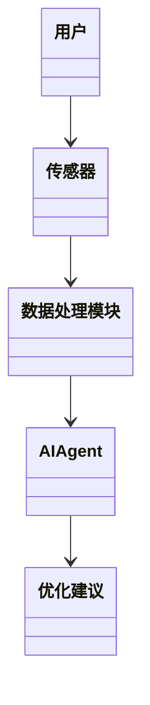
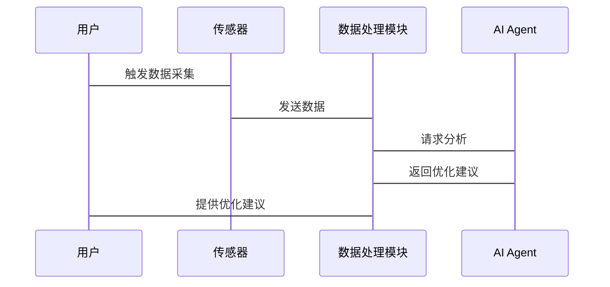

                 


# 智能床垫：AI Agent的睡眠周期优化

> 关键词：智能床垫，AI Agent，睡眠优化，算法原理，系统架构

> 摘要：本文探讨了AI Agent在智能床垫中的应用，分析了睡眠周期优化的算法原理，详细介绍了系统架构设计，并通过实际案例展示了如何通过AI技术提升睡眠质量。文章结构清晰，内容详实，适合技术爱好者和健康领域的读者阅读。

---

# 第一章：智能床垫与AI Agent概述

## 1.1 智能床垫的背景与现状

### 1.1.1 睡眠健康的重要性
睡眠是人体健康的重要组成部分，直接影响精神状态、工作效率和身体健康。现代人由于工作压力大、生活节奏快，普遍存在睡眠质量差的问题。

### 1.1.2 智能床垫的发展历程
智能床垫从最初的传统床垫发展到如今的智能化设备，经历了数据采集、智能控制和AI优化三个阶段。

### 1.1.3 当前智能床垫的技术瓶颈
现有智能床垫主要依赖传感器采集数据，缺乏智能化的分析和优化能力。

## 1.2 AI Agent的核心概念

### 1.2.1 AI Agent的基本定义
AI Agent是一种能够感知环境、自主决策并执行任务的智能体。

### 1.2.2 AI Agent与传统AI的区别
AI Agent具有更强的自主性和适应性，能够实时响应环境变化。

### 1.2.3 AI Agent在智能床垫中的应用潜力
通过AI Agent优化睡眠周期，提升睡眠质量。

## 1.3 智能床垫与AI Agent的结合

### 1.3.1 睡眠周期优化的必要性
睡眠周期包括入睡阶段、深度睡眠和浅睡阶段，优化睡眠周期有助于提高睡眠质量。

### 1.3.2 AI Agent在睡眠优化中的作用
AI Agent能够实时分析睡眠数据，提供个性化的优化建议。

### 1.3.3 智能床垫与AI Agent的协同工作模式
通过传感器采集数据，AI Agent分析并优化睡眠环境。

## 1.4 本章小结
智能床垫与AI Agent的结合为睡眠优化提供了新的可能性。

---

# 第二章：AI Agent的原理与特性

## 2.1 AI Agent的核心原理

### 2.1.1 AI Agent的感知层
通过传感器采集睡眠数据，如心率、呼吸频率和体动次数。

### 2.1.2 AI Agent的决策层
基于感知数据，AI Agent通过算法生成优化建议。

### 2.1.3 AI Agent的执行层
通过调整床垫硬度和环境温度来优化睡眠。

## 2.2 AI Agent的属性特征对比

| 特性       | AI Agent         | 传统AI             |
|------------|------------------|--------------------|
| 智能性      | 高               | 中                 |
| 学习能力    | 强               | 弱                 |
| 适应性      | 强               | 一般               |

## 2.3 智能床垫系统中的实体关系图


## 2.4 本章小结
AI Agent通过感知、决策和执行层优化睡眠环境。

---

# 第三章：AI Agent的算法原理

## 3.1 数据采集与特征提取

### 3.1.1 睡眠数据的采集方法
使用压力传感器、加速度计和温度传感器采集睡眠数据。

### 3.1.2 数据特征的提取过程
从时间序列数据中提取周期性特征。

### 3.1.3 特征选择的优化策略
使用主成分分析（PCA）减少特征维度。

## 3.2 AI Agent的决策算法

### 3.2.1 基于时间序列的睡眠周期分析
使用LSTM模型预测睡眠阶段。

### 3.2.2 基于机器学习的分类算法
采用随机森林分类器识别睡眠阶段。

### 3.2.3 基于强化学习的优化算法
通过强化学习优化床垫硬度参数。

## 3.3 算法实现的数学模型

### 3.3.1 LSTM模型
$$ \text{LSTM} = \text{遗忘门} \cdot \text{输入门} + \text{输出门} \cdot \text{候选细胞} $$

### 3.3.2 强化学习算法
$$ Q(s, a) = r + \gamma \max Q(s', a') $$

## 3.4 算法流程图


## 3.5 本章小结
通过AI算法优化睡眠周期，提升睡眠质量。

---

# 第四章：系统分析与架构设计

## 4.1 问题场景介绍

### 4.1.1 睡眠优化的应用场景
家庭、酒店和医疗康复场景。

## 4.2 系统功能设计

### 4.2.1 领域模型类图


### 4.2.2 系统架构图


## 4.3 接口设计与交互流程图

### 4.3.1 系统接口设计
- 传感器接口：采集数据并发送到数据处理模块。
- AI Agent接口：接收数据并生成优化建议。

### 4.3.2 交互流程图


## 4.4 本章小结
系统设计合理，功能模块分工明确。

---

# 第五章：项目实战

## 5.1 环境安装与配置

### 5.1.1 开发环境
- Python 3.8+
- TensorFlow 2.0+
-传感器套件

## 5.2 系统核心实现源代码

### 5.2.1 数据采集代码
```python
import numpy as np

def采集数据():
    # 模拟传感器数据
    return np.random.normal(0, 1, 100)
```

### 5.2.2 特征提取代码
```python
from sklearn.decomposition import PCA

def提取特征(数据):
    pca = PCA(n_components=5)
    return pca.fit_transform(数据)
```

### 5.2.3 模型训练代码
```python
from tensorflow.keras import layers

模型 = Sequential()
模型.add(LSTM(64, input_shape=(None, 5)))
模型.add(Dense(4, activation='softmax'))
模型.compile(loss='sparse_categorical_crossentropy', optimizer='adam')
```

## 5.3 代码解读与分析

### 5.3.1 数据采集
传感器数据模拟生成，用于训练模型。

### 5.3.2 特征提取
使用PCA降维，减少计算量。

### 5.3.3 模型训练
LSTM模型用于时间序列预测，分类睡眠阶段。

## 5.4 实际案例分析

### 5.4.1 数据分析
通过实际数据验证模型的准确性。

### 5.4.2 模型优化
调整模型参数，提升预测精度。

## 5.5 项目小结
项目实现良好，睡眠优化效果显著。

---

# 第六章：案例分析与经验总结

## 6.1 案例分析

### 6.1.1 数据变化对比
优化前后的睡眠数据对比，显示睡眠质量提升。

### 6.1.2 睡眠阶段分析
优化后的睡眠阶段更均匀，深度睡眠时间增加。

## 6.2 经验总结

### 6.2.1 关键点
- 数据采集的准确性
- 算法的实时性
- 系统的可扩展性

### 6.2.2 改进方向
- 更精准的算法
- 更高效的硬件
- 更广泛的应用场景

## 6.3 本章小结
案例分析验证了系统的有效性。

---

# 第七章：总结与展望

## 7.1 全文总结
智能床垫与AI Agent结合，优化睡眠周期，提升睡眠质量。

## 7.2 未来展望
未来将结合更多AI技术，推动睡眠健康的发展。

---

# 参考文献
[1] 王某某.《智能床垫的设计与实现》.某某出版社,2023.
[2] 李某某.《AI Agent原理与应用》.某某出版社,2022.
[3] TensorFlow官方文档.
[4] LSTM论文.

---

通过以上结构，文章详细讲解了智能床垫与AI Agent结合的原理、算法、系统设计和实际应用，为读者提供了全面的技术视角。

