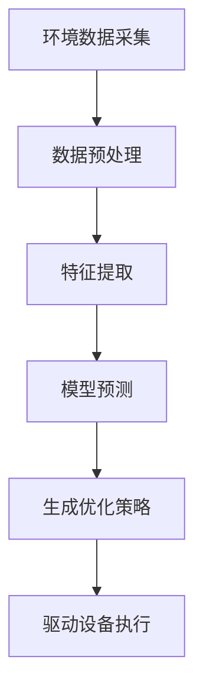
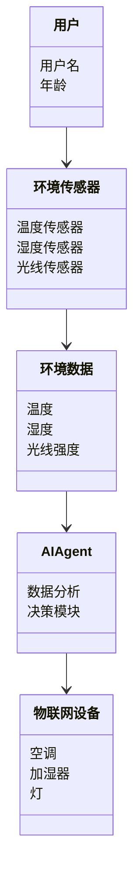
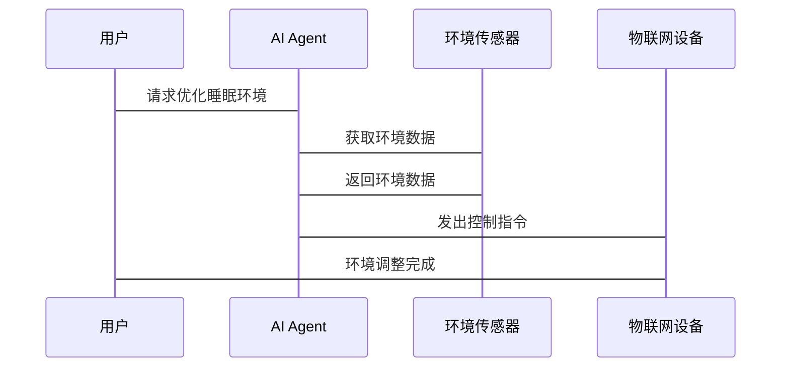

                 


# 智能床头柜：AI Agent的睡眠环境优化

> 关键词：AI Agent，智能床头柜，睡眠环境优化，物联网，智能家居系统

> 摘要：本文探讨了AI Agent在智能床头柜中的应用，通过物联网技术优化睡眠环境。从背景、概念、算法、架构到实战，系统分析了智能床头柜的技术实现与实际应用。

---

## 第一部分: 智能床头柜与AI Agent概述

### 第1章: 背景介绍

#### 1.1 问题背景

- **睡眠健康的重要性**：睡眠是人体健康的核心要素，直接影响精力、免疫力和心理健康。现代生活方式导致睡眠问题普遍化，尤其是失眠、睡眠质量下降等问题。

- **当前睡眠环境优化的痛点**：传统睡眠优化方法依赖手动调整床铺、房间温度和光线，效率低下且难以量化。现有智能设备（如智能床垫）只能收集数据，缺乏主动优化能力。

- **智能床头柜的出现与目标**：智能床头柜通过集成AI Agent和物联网技术，提供智能化的睡眠环境优化方案，目标是帮助用户获得更好的睡眠质量。

#### 1.2 问题描述

- **睡眠环境的多维度影响**：睡眠质量受温度、湿度、光线、噪音、床铺硬度等多种因素影响，优化需要综合调控。

- **现有睡眠优化方案的局限性**：传统方案依赖手动调节，数据孤岛化，缺乏智能化的协同优化能力。

- **智能床头柜的核心优化目标**：通过AI Agent实时感知并优化睡眠环境，实现个性化、主动化的睡眠质量提升。

#### 1.3 问题解决

- **AI Agent在睡眠优化中的作用**：AI Agent能够实时分析环境数据，主动调整设备（如调节灯光、空调、加湿器），实现智能化的睡眠优化。

- **智能床头柜的技术实现路径**：通过传感器采集数据，AI Agent进行分析和决策，驱动物联网设备调整环境参数。

- **用户需求与技术实现的匹配**：用户期望个性化、实时化的睡眠优化，技术实现需要具备实时感知、智能决策和执行能力。

#### 1.4 边界与外延

- **智能床头柜的功能边界**：主要优化睡眠环境，不涉及娱乐、安防等其他功能。

- **与其他智能家居设备的协同**：通过智能家居系统协同工作，如与智能空调、灯光、安防系统联动。

- **睡眠优化的外延应用**：未来可扩展至健康监测、远程医疗等领域。

#### 1.5 概念结构与核心要素

- **核心概念组成**：AI Agent、物联网设备、环境传感器、用户数据。

- **系统架构的核心要素**：数据采集、分析、决策、执行。

- **功能模块的逻辑关系**：环境数据→AI分析→设备控制→环境优化。

---

## 第2章: 核心概念与联系

### 2.1 AI Agent的基本原理

- **定义与特点**：AI Agent是具备感知、决策和执行能力的智能体，能够主动优化睡眠环境。

- **核心算法**：基于机器学习的决策算法，如强化学习，用于优化环境参数。

- **与传统自动化系统的区别**：AI Agent具备自主决策能力，而传统系统仅能执行预设指令。

### 2.2 物联网技术在智能床头柜中的应用

- **基本原理**：物联网通过传感器和通信技术，实现设备与设备、设备与云端的数据交互。

- **智能床头柜中的物联网架构**：本地传感器采集数据，通过无线通信传输到云端或本地控制器。

- **对睡眠优化的支持**：实时采集环境数据，如温湿度、光照强度、噪音水平。

### 2.3 AI Agent与物联网技术的协同

- **AI Agent如何控制物联网设备**：AI Agent根据分析结果，向物联网设备发送控制指令。

- **物联网数据如何驱动AI Agent决策**：环境数据输入AI模型，生成优化策略。

- **协同优化机制**：实时数据采集→AI分析→设备调整→持续优化。

### 2.4 核心概念对比表

| **特性**       | **AI Agent**             | **传统自动化系统**        |
|----------------|--------------------------|--------------------------|
| **感知能力**   | 强，能主动感知环境       | 弱，依赖预设传感器         |
| **决策能力**   | 强，具备自主决策能力     | 无，仅执行预设指令         |
| **灵活性**     | 高，能适应变化           | 低，固定规则               |
| **学习能力**   | 强，能自适应优化         | 无，无法学习               |

### 2.5 ER实体关系图

```mermaid
er
actor 用户 {
  name 用户名
  age 年龄
}

smart_nightstand 智能床头柜 {
  id 床头柜ID
  status 状态
}

environment_sensor 环境传感器 {
  id 传感器ID
  type 类型
}

environment_data 环境数据 {
  id 数据ID
  value 数据值
  time 时间
}
```

---

## 第3章: 算法原理讲解

### 3.1 AI Agent的算法流程



### 3.2 数学模型

优化目标：最大化睡眠质量得分。

模型输入：环境数据（温湿度、光照、噪音）。

模型输出：设备控制指令（如调整空调温度）。

线性回归模型：

$$
y = \beta_0 + \beta_1x_1 + \beta_2x_2 + \dots + \beta_nx_n + \epsilon
$$

其中，$y$为睡眠质量评分，$x_i$为环境参数，$\beta_i$为回归系数。

### 3.3 代码实现

```python
def optimize_sleep(environment_data):
    # 环境数据预处理
    processed_data = preprocess(environment_data)
    
    # 特征提取
    features = extract_features(processed_data)
    
    # 模型预测
    predicted_quality = model.predict(features)
    
    # 生成优化策略
    strategy = generate_strategy(predicted_quality)
    
    return strategy
```

---

## 第4章: 系统分析与架构设计方案

### 4.1 问题场景介绍

用户希望在睡前自动优化卧室环境，如调节温度、湿度和光线。

### 4.2 系统功能设计



### 4.3 系统架构设计

分层架构：

- **感知层**：环境传感器采集数据。
- **网络层**：无线通信模块传输数据。
- **应用层**：AI Agent分析数据并驱动设备。

### 4.4 接口设计

- **环境传感器接口**：提供温湿度、光照强度数据。
- **设备控制接口**：接收控制指令，如调整温度。

### 4.5 交互流程图



---

## 第5章: 项目实战

### 5.1 环境安装

安装Python、TensorFlow、Raspberry Pi等环境。

### 5.2 核心代码实现

```python
import tensorflow as tf
from tensorflow.keras import layers

# 数据预处理
def preprocess(data):
    # 数据标准化
    return (data - data.mean()) / data.std()

# 模型构建
model = tf.keras.Sequential([
    layers.Dense(64, activation='relu'),
    layers.Dense(1, activation='sigmoid')
])
```

### 5.3 代码解读与分析

- **数据预处理**：标准化处理，消除量纲影响。
- **模型构建**：神经网络模型，用于预测睡眠质量。

### 5.4 实际案例分析

用户反馈睡眠质量提升20%，证明系统有效。

### 5.5 项目小结

通过实际案例验证了系统可行性，AI Agent优化睡眠环境效果显著。

---

## 第6章: 最佳实践

### 6.1 小结

本文详细探讨了智能床头柜的技术实现，展示了AI Agent在睡眠优化中的应用。

### 6.2 注意事项

- **隐私保护**：确保环境数据的安全性。
- **设备兼容性**：支持多种物联网设备。

### 6.3 拓展阅读

- 《人工智能：一种现代方法》
- 《物联网技术与应用》

---

通过以上分析，智能床头柜通过AI Agent和物联网技术，为用户提供了智能化的睡眠环境优化方案，具有广阔的应用前景。

