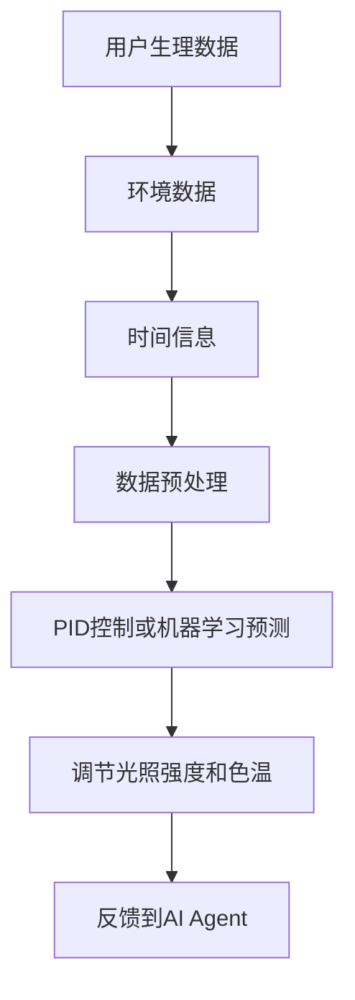
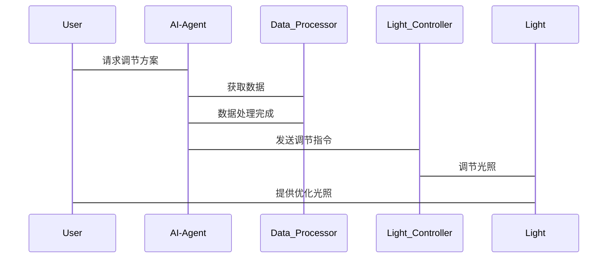

                 


# 智能床头灯：AI Agent的生理节律光照调节

## 关键词：智能床头灯、AI Agent、生理节律、光照调节、PID控制、机器学习

## 摘要：本文详细探讨了智能床头灯结合AI Agent技术，通过生理节律和光照调节优化睡眠质量。文章从背景、概念、算法、系统架构到项目实战，全面解析了智能床头灯的设计与实现，旨在为用户提供科学的光照调节方案，提升睡眠质量。

---

### 第一部分：背景介绍

#### 第1章：问题背景与需求分析

##### 1.1 生理节律的基本概念

- **1.1.1 生理节律的定义**
  生理节律是指生物体内的生理活动遵循的时间周期，如24小时的昼夜节律。这些节律由生物钟调控，影响着人体的许多功能，包括睡眠、觉醒、体温调节和激素分泌。

- **1.1.2 生理节律的重要性**
  生理节律的紊乱会导致多种健康问题，如失眠、情绪波动和免疫力下降。维持稳定的生理节律对健康至关重要。

- **1.1.3 光照对生理节律的影响**
  光照是调节生理节律的重要因素，特别是蓝光对褪黑激素的分泌有显著影响。适当的光照可以促进觉醒，而缺乏光照可能导致昼夜节律紊乱。

##### 1.2 传统床头灯的局限性

- **1.2.1 传统床头灯的功能单一性**
  传统床头灯仅能提供基本的照明功能，无法根据用户的生理需求自动调节光照强度和色温。

- **1.2.2 用户需求的多样化**
  不同用户在不同时间对光照的需求不同，传统床头灯无法满足个性化需求。

- **1.2.3 传统光照调节的不足**
  传统床头灯的调节通常是手动的，缺乏智能化的自动调节机制，无法有效优化用户的生理节律。

##### 1.3 智能床头灯的提出

- **1.3.1 智能床头灯的定义**
  智能床头灯是一种结合AI技术和物联网设备的智能灯具，能够根据用户的生理节律和环境光线自动调节光照强度和色温。

- **1.3.2 智能床头灯的核心目标**
  通过智能调节光照，优化用户的生理节律，提升睡眠质量，增强觉醒状态。

- **1.3.3 智能床头灯的技术优势**
  利用AI算法和传感器数据，实现智能化的光照调节，满足个性化需求，提升用户体验。

---

### 第二部分：核心概念与联系

#### 第2章：生理节律与光照调节的关系

##### 2.1 生理节律的特征分析

- **2.1.1 生理节律的时间周期性**
  生理节律通常遵循24小时的周期，但个体差异较大，有些人可能更倾向于“早起型”或“晚睡型”。

- **2.1.2 生理节律的个体差异性**
  不同人对光照的敏感度和节律需求不同，因此需要个性化的调节方案。

- **2.1.3 生理节律的环境敏感性**
  环境因素，如光照、温度和噪音，都会影响生理节律。其中，光照是最主要的调节因素。

##### 2.2 光照对生理节律的影响机制

- **2.2.1 光敏感细胞的作用**
  视网膜中的光敏感细胞（如视杆细胞和视锥细胞）接收光线信号，并将其转化为电信号传递到大脑，影响生理节律。

- **2.2.2 光照强度与节律调节的关系**
  过强的光照可能抑制褪黑激素的分泌，导致睡眠困难；而适当的光照可以促进觉醒，帮助调整节律。

- **2.2.3 光照色温对生理节律的影响**
  蓝光波段的光具有较高的觉醒效果，而暖色光则有助于放松和睡眠。智能床头灯可以根据时间调节色温，优化用户的生理节律。

##### 2.3 生理节律与光照调节的对比分析

- **2.3.1 生理节律的调节目标**
  维持稳定的24小时节律，促进健康睡眠和高效觉醒。

- **2.3.2 光照调节的手段与方法**
  通过调节光照强度、色温和时间，影响用户的生理节律。

- **2.3.3 两者的协同作用**
  光照调节是生理节律的重要外部调节手段，通过智能调节可以实现生理节律的优化。

---

### 第三部分：算法原理与实现

#### 第3章：AI Agent的核心算法

##### 3.1 基于PID控制的光照调节算法

- **3.1.1 PID控制的基本原理**
  PID控制是一种常用的反馈控制方法，通过比例、积分和微分三个环节调节输出，使系统达到稳定状态。

- **3.1.2 PID控制在光照调节中的应用**
  根据用户的生理节律需求和环境光照，PID算法实时调节床头灯的光照强度和色温。

- **3.1.3 PID参数的优化与调整**
  通过实验或优化算法调整PID参数（Kp、Ki、Kd），以获得最佳的调节效果。

##### 3.2 基于机器学习的光照预测模型

- **3.2.1 机器学习的基本原理**
  通过训练数据模型，预测未来的光照需求，优化调节策略。

- **3.2.2 光照需求预测的特征提取**
  提取用户生理数据、环境光照、时间等特征，用于模型训练。

- **3.2.3 基于神经网络的预测模型**
  使用深度学习模型（如LSTM）预测未来的光照需求，实现更精准的调节。

##### 3.3 算法实现的流程图



---

### 第四部分：系统架构与设计

#### 第4章：系统架构设计

##### 4.1 系统功能模块划分

- **4.1.1 数据采集模块**
  采集用户生理数据（如心率、体温）和环境数据（如光照、温度）。

- **4.1.2 AI处理模块**
  对数据进行分析，生成光照调节方案。

- **4.1.3 执行机构**
  根据调节方案，控制床头灯的光照输出。

##### 4.2 系统架构设计


##### 4.3 系统接口设计

- **API接口设计**
  提供RESTful API，用于与AI Agent交互，获取调节方案。

- **交互流程图**



---

### 第五部分：项目实战

#### 第5章：智能床头灯的实现

##### 5.1 环境安装

- **安装Python和相关库**
  ```bash
  pip install numpy tensorflow scikit-learn
  ```

##### 5.2 核心代码实现

- **数据采集模块**
  ```python
  import numpy as np

  def collect_data(sensors):
      return np.array([sensors['heart_rate'], sensors['ambient_light']])
  ```

- **AI处理模块**
  ```python
  from sklearn.model_selection import train_test_split
  from tensorflow.keras import models

  def build_model():
      model = models.Sequential()
      model.add(Dense(64, activation='relu', input_dim=2))
      model.add(Dense(1, activation='sigmoid'))
      model.compile(optimizer='adam', loss='binary_crossentropy')
      return model
  ```

##### 5.3 实际案例分析

- **案例：睡眠优化**
  晚上使用暖色光降低蓝光，促进褪黑激素分泌，帮助用户进入深度睡眠。

---

### 第六部分：总结与展望

#### 第6章：总结与展望

##### 6.1 总结

智能床头灯通过AI Agent技术，实现了根据生理节律和环境数据智能调节光照，显著提升了用户的睡眠质量和觉醒状态。

##### 6.2 展望

未来，可以引入更多传感器数据，如心率和体温，进一步优化调节策略。同时，结合物联网技术，实现智能家居中的协同调节。

##### 6.3 最佳实践 Tips

- 定期校准传感器，确保数据准确性。
- 根据个人需求调整PID参数或训练模型。
- 注意数据隐私保护，确保用户信息安全。

---

### 结语

智能床头灯不仅是照明工具，更是提升生活品质的科技产物。通过AI Agent的生理节律光照调节，我们可以在智能时代享受更健康的生活方式。

