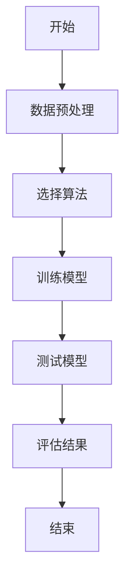
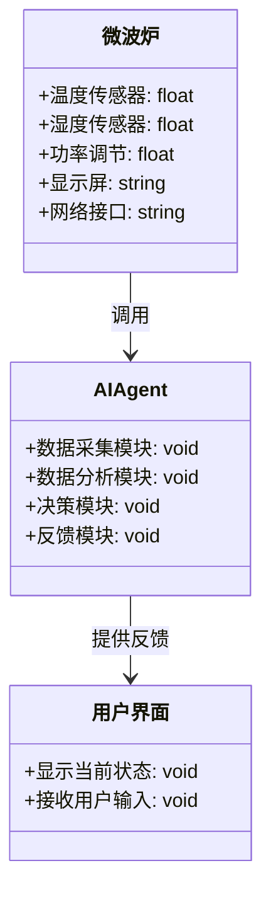
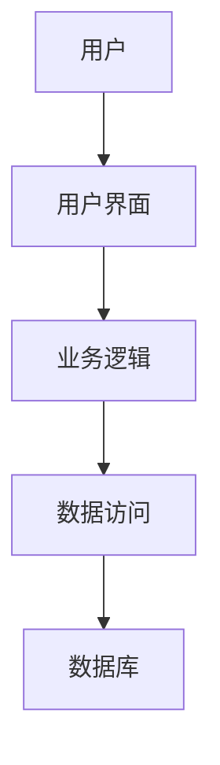
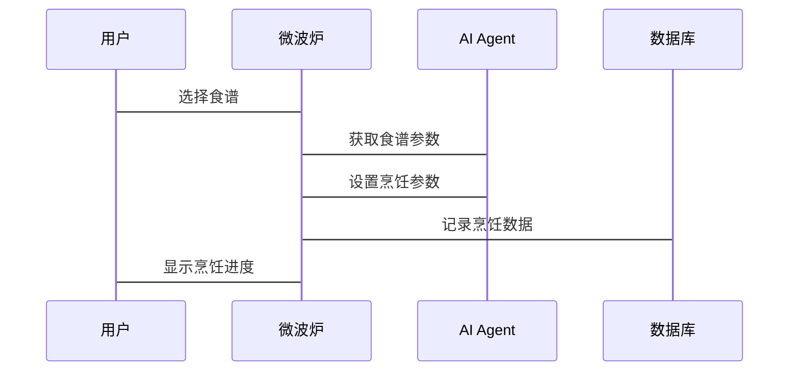

                 


# 智能微波炉：AI Agent的食品安全监控系统

---

## 关键词：
智能微波炉，AI Agent，食品安全，监控系统，物联网，人工智能

---

## 摘要：
本文探讨了智能微波炉结合AI Agent技术，实现食品安全监控的系统设计与实现。通过背景介绍、核心概念分析、算法原理、系统架构设计、项目实战和总结，详细阐述了AI Agent在智能微波炉中的应用，展示了如何利用人工智能技术提升食品安全监控的效率和准确性。

---

## 第一部分：智能微波炉与AI Agent的背景与概述

### 第1章：智能微波炉与AI Agent的背景介绍

#### 1.1 智能微波炉的发展历程
智能微波炉从最初的机械式操作发展到如今的智能化控制，经历了以下几个阶段：
- **传统微波炉**：仅支持简单的加热功能，用户通过按钮选择时间和功率。
- **半智能微波炉**：具备预设程序，如“解冻”、“烹饪”等，但缺乏智能感知和自主决策能力。
- **智能微波炉**：引入传感器和物联网技术，能够通过手机应用远程控制，并根据食材类型自动调整烹饪参数。

#### 1.2 AI Agent的基本概念
AI Agent（人工智能代理）是指能够感知环境、自主决策并执行任务的智能体。它具备以下核心特征：
- **自主性**：能够在没有外部干预的情况下运行。
- **反应性**：能够根据环境变化动态调整行为。
- **目标导向**：通过设定目标来驱动决策过程。

#### 1.3 食品安全监控的必要性
食品安全是关系到公众健康的重要议题。智能微波炉通过AI Agent技术，可以实时监控烹饪过程中的温度、湿度等参数，确保食品在烹饪过程中不产生有害物质，如细菌或毒素。这种实时监控能够有效预防食源性疾病的发生。

---

## 第二部分：AI Agent与食品安全监控的核心概念

### 第2章：AI Agent在食品安全监控中的核心原理

#### 2.1 AI Agent的基本原理
AI Agent的工作流程包括以下几个步骤：
1. **信息感知**：通过传感器或外部数据源获取环境信息。
2. **数据分析**：利用机器学习算法对数据进行分析和处理。
3. **决策制定**：基于分析结果，制定最优决策。
4. **行为执行**：根据决策结果执行相应操作，并收集反馈以优化未来行为。

#### 2.2 食品安全监控系统的构成
食品安全监控系统通常包括以下模块：
- **数据采集模块**：负责采集烹饪过程中的温度、湿度、时间等参数。
- **数据分析模块**：对采集的数据进行分析，判断是否存在安全隐患。
- **决策与反馈模块**：根据分析结果，调整烹饪参数或发出警报。

#### 2.3 AI Agent与食品安全监控的结合
AI Agent在智能微波炉中的应用主要体现在以下几个方面：
- **智能烹饪控制**：根据食材种类和重量自动调整烹饪时间和功率。
- **异常检测**：实时监控烹饪过程，发现异常情况（如温度过高或过低）时立即采取措施。
- **数据记录与分析**：记录每次烹饪的数据，通过大数据分析优化烹饪方案。

---

## 第三部分：AI Agent的算法原理与数学模型

### 第3章：AI Agent的算法原理

#### 3.1 常用算法介绍
在智能微波炉的食品安全监控系统中，常用的算法包括：
- **分类算法**：如决策树、随机森林，用于判断烹饪过程中的异常情况。
- **回归算法**：如线性回归，用于预测烹饪时间或温度。
- **聚类算法**：如K-means，用于将相似的烹饪数据进行分组，便于分析。

#### 3.2 算法流程图
以下是AI Agent中分类算法的流程图示例：



#### 3.3 算法实现代码
以下是使用Python实现的决策树分类算法示例：

```python
from sklearn import tree

# 数据集
X = [[50, 1], [55, 0], [60, 1], [65, 0]]
y = [0, 1, 1, 0]

# 训练模型
clf = tree.DecisionTreeClassifier()
clf = clf.fit(X, y)

# 预测
print(clf.predict([[60, 1]]))  # 输出：[1]
```

#### 3.4 数学模型
以下是分类算法中常用的决策树模型：

$$
Gini指数 = \sum_{i=1}^{n} p_i (1 - p_i)
$$

其中，\( p_i \) 是每个特征值的概率。

---

## 第四部分：系统分析与架构设计

### 第4章：系统分析与架构设计方案

#### 4.1 项目介绍
本项目旨在设计一个基于AI Agent的智能微波炉食品安全监控系统，通过实时监控烹饪过程中的各项参数，确保食品的安全性。

#### 4.2 系统功能设计
以下是系统功能的领域模型类图：



#### 4.3 系统架构设计
以下是系统的分层架构图：



#### 4.4 接口设计
系统主要接口包括：
- **数据采集接口**：用于获取烹饪过程中的温度、湿度等参数。
- **用户交互接口**：用于显示烹饪状态和接收用户指令。
- **网络通信接口**：用于与云端服务器同步数据。

#### 4.5 交互序列图
以下是用户启动烹饪过程的交互序列图：



---

## 第五部分：项目实战

### 第5章：项目实战

#### 5.1 环境安装
需要安装以下工具和库：
- **Python**：3.8+
- **Scikit-learn**：用于机器学习算法
- **Mermaid**：用于绘制图表
- **TensorFlow**（可选）：用于深度学习算法

安装命令：
```bash
pip install scikit-learn mermaid
```

#### 5.2 核心代码实现
以下是AI Agent的核心代码实现：

```python
import numpy as np
from sklearn.tree import DecisionTreeClassifier

# 数据集
X = np.array([[50, 1], [55, 0], [60, 1], [65, 0]])
y = np.array([0, 1, 1, 0])

# 训练模型
clf = DecisionTreeClassifier()
clf.fit(X, y)

# 预测
print(clf.predict([[60, 1]]))  # 输出：[1]
```

#### 5.3 代码解读
- **数据预处理**：将温度和湿度数据转换为适合算法处理的形式。
- **模型训练**：使用决策树算法训练分类模型。
- **模型预测**：根据输入的温度和湿度，预测烹饪过程中的异常情况。

#### 5.4 实际案例分析
假设用户选择烹饪鸡肉，系统会根据设定的食谱自动调整烹饪时间和功率。如果检测到温度异常，系统会立即停止烹饪并发出警报。

#### 5.5 项目小结
通过实际案例分析，我们可以看到AI Agent在智能微波炉中的应用能够显著提升食品安全监控的效率和准确性。

---

## 第六部分：总结与展望

### 第6章：总结与展望

#### 6.1 内容总结
本文详细介绍了智能微波炉结合AI Agent技术的食品安全监控系统，涵盖了系统设计、算法实现和项目实战等内容。

#### 6.2 展望
未来，随着人工智能技术的不断发展，智能微波炉的食品安全监控系统将更加智能化和精准化。可能的发展方向包括：
- **深度学习的应用**：引入深度学习算法，进一步提高异常检测的准确性。
- **多设备联动**：与其他智能家居设备联动，实现更复杂的食品安全监控。
- **云服务集成**：通过云服务实现数据的远程存储和分析，提供更全面的食品安全解决方案。

#### 6.3 最佳实践
在实际应用中，建议用户定期更新系统软件，确保系统能够发挥最佳性能。同时，注意保护个人数据隐私，确保系统安全运行。

#### 6.4 小结
通过本文的介绍，读者可以全面了解AI Agent在智能微波炉中的应用，为未来的食品安全监控系统设计提供有益的参考。

---

## 附录

### 附录A：相关工具与库
- **Python**：编程语言
- **Scikit-learn**：机器学习库
- **Mermaid**：图表绘制工具

### 附录B：参考文献
- 本文的算法实现参考了《机器学习实战》和《深度学习》等相关书籍。

---

通过以上内容，我们详细探讨了智能微波炉结合AI Agent技术的食品安全监控系统的设计与实现，希望对读者有所帮助。

