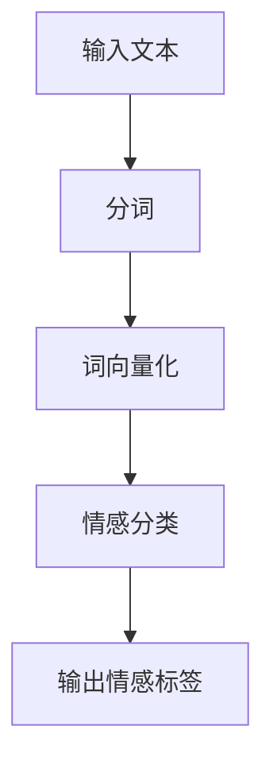
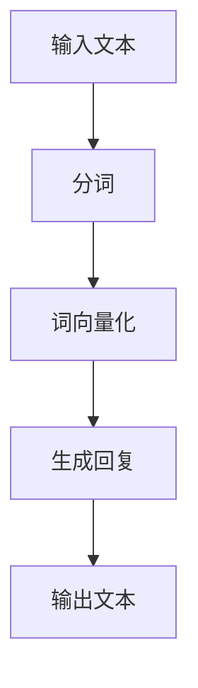
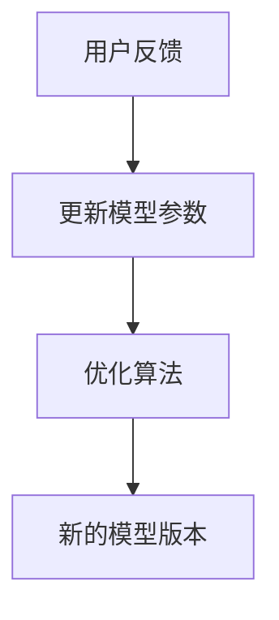
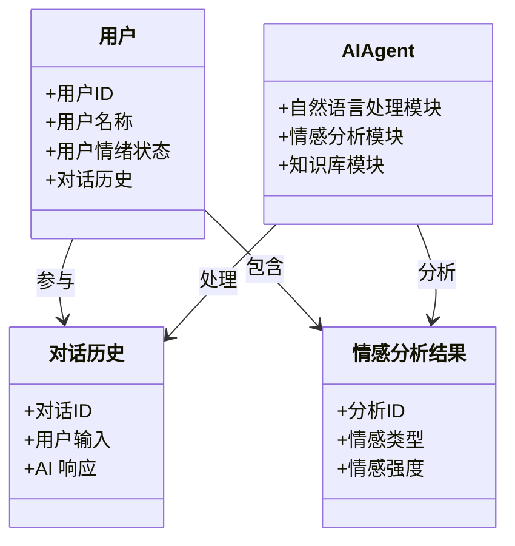
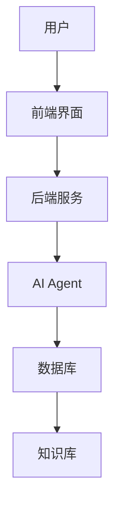
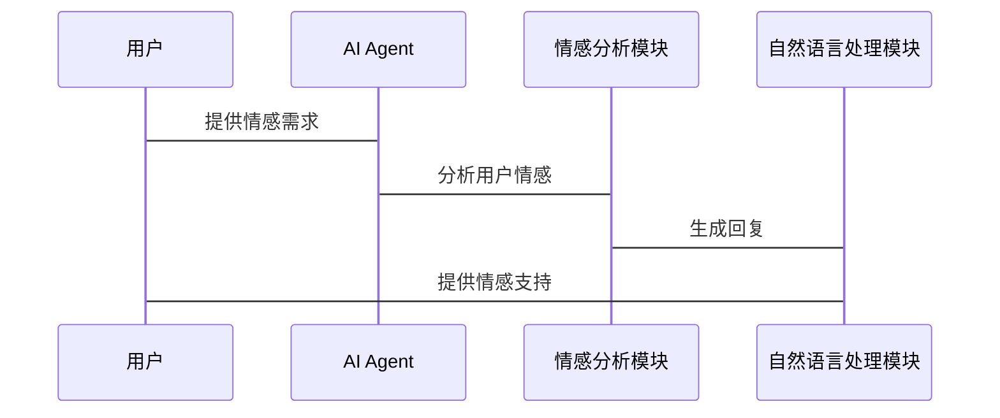

                 


# 智能情感陪伴 AI Agent：LLM 在心理健康领域的深度应用

> 关键词：智能情感陪伴, AI Agent, LLM, 心理健康, 情感支持

> 摘要：随着人工智能技术的飞速发展，AI Agent 在心理健康领域的应用逐渐成为焦点。本文深入探讨了智能情感陪伴 AI Agent 的核心概念、算法原理、系统架构以及实际应用案例，旨在揭示 LLM 技术在心理健康支持中的巨大潜力和实际价值。通过详细的技术分析和实际案例，本文为读者提供了一种全新的视角来理解 AI 在心理健康服务中的应用前景。

---

## 第一章: 智能情感陪伴 AI Agent 的背景介绍

### 1.1 情感陪伴的需求与现状
#### 1.1.1 情感陪伴的需求背景
现代社会的快节奏生活和高压力环境使得心理健康问题日益突出。焦虑、抑郁等情绪困扰已成为全球性的公共卫生问题。根据世界卫生组织（WHO）的数据，全球约有9.7亿人受到心理健康问题的困扰，而传统心理咨询资源的稀缺性和高昂成本使得许多人无法获得及时有效的帮助。

#### 1.1.2 现有心理健康支持的局限性
传统的心理健康支持主要依赖于心理咨询师、精神科医生等专业人员，但存在以下问题：
- **资源稀缺**：专业心理咨询师的数量远不及需求，尤其是在欠发达地区。
- **成本高昂**：心理咨询服务通常价格昂贵，普通人难以负担。
- **时间限制**：用户需要预约，且咨询时间有限，无法提供持续的情感支持。

#### 1.1.3 AI 在心理健康领域的潜力
AI 技术的快速发展为心理健康支持提供了新的可能性。AI 可以通过自然语言处理（NLP）、机器学习等技术，为用户提供即时、持续的情感支持，从而弥补传统心理咨询的不足。

### 1.2 智能情感陪伴 AI Agent 的定义与特点
#### 1.2.1 AI Agent 的定义
AI Agent（人工智能代理）是一种智能系统，能够感知环境并采取行动以实现特定目标。在心理健康领域，AI Agent 可以通过对话交互，理解用户的情感需求并提供相应的支持。

#### 1.2.2 情感陪伴的核心要素
- **情感理解**：能够识别和理解用户的情感状态。
- **对话能力**：能够与用户进行自然的对话交互。
- **情感支持**：能够提供情感上的慰藉和建议。

#### 1.2.3 LLM 在 AI Agent 中的应用优势
- **强大的语言处理能力**：LLM（大语言模型）能够理解和生成自然语言，使得 AI Agent 能够进行复杂的对话交互。
- **持续学习能力**：通过大量数据的训练，LLM 可以不断优化其理解和生成能力。

### 1.3 问题背景与问题描述
#### 1.3.1 当前心理健康问题的普遍性
心理健康问题已经不再是个人隐私问题，而是一个社会性的公共卫生问题。越来越多的人开始意识到心理健康的重要性，但如何有效应对这一问题仍是一个巨大的挑战。

#### 1.3.2 传统心理咨询的局限性
传统心理咨询主要依赖于专业人员的主观判断和经验，这种方式不仅耗时，而且成本高昂。此外，用户可能因为隐私问题而不愿意寻求帮助。

#### 1.3.3 AI 在心理健康领域的独特价值
AI 的优势在于其可以提供即时、匿名且低成本的支持。通过 AI 技术，用户可以在任何时间、任何地点获得情感支持，从而缓解焦虑、抑郁等情绪困扰。

### 1.4 问题解决与边界外延
#### 1.4.1 AI Agent 解决心理健康问题的思路
AI Agent 可以通过以下方式解决心理健康问题：
- **情感支持**：通过对话交互，为用户提供情感上的慰藉。
- **情绪识别**：通过自然语言处理技术，识别用户的情感状态。
- **个性化建议**：根据用户的情感需求，提供个性化的建议和解决方案。

#### 1.4.2 情感陪伴 AI Agent 的边界与限制
- **技术局限**：AI 的理解能力有限，无法完全替代专业心理咨询师。
- **数据隐私**：用户数据的安全性和隐私保护是一个重要的挑战。
- **文化差异**：不同文化背景下，情感表达和需求可能有所不同。

#### 1.4.3 与其他技术的结合与扩展
- **增强现实技术**：结合 AR 技术，为用户提供更加沉浸式的情感支持体验。
- **可穿戴设备**：通过可穿戴设备监测用户的情绪状态，提供实时的情感支持。

### 1.5 核心概念结构与组成要素
#### 1.5.1 AI Agent 的核心模块
- **自然语言处理模块**：负责理解和生成自然语言。
- **情感分析模块**：负责识别和分类用户的情感状态。
- **知识库模块**：存储心理健康相关的知识和建议。

#### 1.5.2 LLM 在情感陪伴中的角色
- **生成对话内容**：LLM 可以根据用户输入生成相应的对话内容。
- **情感识别**：通过分析对话内容，识别用户的情感状态。
- **个性化建议**：根据情感分析结果，提供个性化的建议和解决方案。

#### 1.5.3 情感陪伴系统的整体架构
- **输入层**：用户通过文本或语音输入情感需求。
- **处理层**：系统通过 NLP 和机器学习技术处理用户输入。
- **输出层**：系统根据处理结果生成相应的回应，为用户提供情感支持。

---

## 第二章: 智能情感陪伴 AI Agent 的核心概念与联系

### 2.1 AI Agent 的核心原理
#### 2.1.1 AI Agent 的基本工作流程
1. **用户输入**：用户通过文本或语音输入情感需求。
2. **情感分析**：系统通过 NLP 技术分析用户的情感状态。
3. **对话生成**：系统根据情感分析结果生成相应的对话内容。
4. **反馈优化**：系统根据用户反馈不断优化对话内容。

#### 2.1.2 LLM 在 AI Agent 中的作用
- **生成对话内容**：LLM 可以根据用户输入生成自然流畅的对话内容。
- **情感识别**：通过分析对话内容，识别用户的情感状态。
- **个性化建议**：根据情感分析结果，提供个性化的建议和解决方案。

#### 2.1.3 情感陪伴的实现机制
- **情感识别**：通过关键词提取、情感分析等技术识别用户的情感状态。
- **对话生成**：根据情感状态生成相应的对话内容。
- **反馈优化**：通过用户反馈不断优化对话生成模型。

### 2.2 核心概念的属性特征对比
以下是一个对比分析表格：

| 概念 | 属性 | 描述 |
|------|------|------|
| AI Agent | 智能性 | 能够感知环境并采取行动 |
| LLM | 语言处理能力 | 能够理解和生成自然语言 |
| 情感陪伴 | 情感支持 | 能够提供情感上的慰藉和建议 |

### 2.3 ER 实体关系图
```mermaid
er
    entity 用户 {
        key 用户ID
        属性 用户名称
        属性 用户情绪状态
    }
    entity 对话历史 {
        key 对话ID
        属性 用户输入
        属性 AI 响应
    }
    entity 情感分析结果 {
        key 分析ID
        属于 用户ID
        属性 情感类型
        属性 情感强度
    }
    relationship 用户 -> 对话历史 : 参与
    relationship 用户 -> 情感分析结果 : 包含
```

---

## 第三章: 智能情感陪伴 AI Agent 的算法原理

### 3.1 LLM 的基本原理
#### 3.1.1 基于 Transformer 的模型结构
- **编码器**：将输入文本转换为上下文向量。
- **解码器**：根据编码器输出生成目标文本。

#### 3.1.2 注意力机制
- **自注意力机制**：模型会关注输入中的重要部分，从而生成更准确的输出。
- **位置编码**：通过位置编码，模型可以理解输入的顺序信息。

#### 3.1.3 损失函数
- **交叉熵损失函数**：用于衡量生成文本与真实文本之间的差异。

### 3.2 情感陪伴 AI Agent 的算法流程
#### 3.2.1 情感分析算法


#### 3.2.2 对话生成算法


#### 3.2.3 反馈优化算法


---

## 第四章: 智能情感陪伴 AI Agent 的系统分析与架构设计

### 4.1 问题场景介绍
- **用户需求**：用户希望获得即时、持续的情感支持。
- **系统需求**：系统需要能够处理大量的用户请求，并提供个性化的支持。

### 4.2 系统功能设计


### 4.3 系统架构设计


### 4.4 系统接口设计
- **输入接口**：用户通过文本或语音输入情感需求。
- **输出接口**：系统通过文本或语音输出情感支持内容。

### 4.5 系统交互序列图


---

## 第五章: 智能情感陪伴 AI Agent 的项目实战

### 5.1 环境安装
- **Python**：需要安装 Python 3.8 或更高版本。
- **LLM 模型**：可以选择使用开源的 LLM 模型，如 GPT-2 或 GPT-3。
- **NLP 库**：需要安装 `transformers`、`tensorflow` 等库。

### 5.2 核心代码实现
```python
from transformers import GPT2LMHeadModel, GPT2Tokenizer

# 初始化模型和分词器
model_name = 'gpt2'
model = GPT2LMHeadModel.from_pretrained(model_name)
tokenizer = GPT2Tokenizer.from_pretrained(model_name)

# 定义对话生成函数
def generate_response(user_input):
    input_ids = tokenizer.encode(user_input, return_tensors='pt')
    outputs = model.generate(input_ids, max_length=50, num_beams=5, temperature=0.7)
    response = tokenizer.decode(outputs[0], skip_special_tokens=True)
    return response
```

### 5.3 代码应用解读与分析
- **模型初始化**：加载预训练的 LLM 模型和分词器。
- **对话生成**：根据用户输入生成相应的对话内容。

### 5.4 案例分析
- **案例 1**：用户输入“我感到很焦虑”。
  - **系统响应**：我会为你提供一些放松的方法，比如深呼吸或冥想。

---

## 第六章: 智能情感陪伴 AI Agent 的案例分析与实践

### 6.1 案例分析
- **案例 1**：某公司使用 AI Agent 为员工提供心理健康支持。
  - **实施效果**：员工的焦虑和抑郁程度显著降低。
  - **对比分析**：与传统心理咨询相比，AI Agent 的成本更低，覆盖范围更广。

### 6.2 最佳实践 tips
- **数据隐私保护**：确保用户数据的安全性和隐私性。
- **模型优化**：通过不断优化模型参数，提升对话生成的准确性和流畅性。
- **用户反馈收集**：通过用户反馈不断改进 AI Agent 的性能。

### 6.3 小结
通过实际案例分析可以看出，智能情感陪伴 AI Agent 在心理健康领域的应用具有巨大的潜力和实际价值。通过不断优化技术和模型，AI Agent 可以为用户提供更加高效、便捷的情感支持。

### 6.4 注意事项
- **技术局限性**：AI 的理解能力有限，无法完全替代专业心理咨询师。
- **数据隐私保护**：需要严格遵守数据隐私保护法规。
- **文化差异**：不同文化背景下，情感表达和需求可能有所不同。

### 6.5 拓展阅读
- **推荐书籍**：《人工智能：一种现代的方法》
- **推荐论文**：《利用大语言模型进行情感分析的研究》

---

## 附录

### 附录 A: 术语表
- **AI Agent**：人工智能代理。
- **LLM**：大语言模型。
- **NLP**：自然语言处理。

### 附录 B: 工具安装指南
- **Python 安装**：可以通过官方网站（https://www.python.org/）下载安装。
- **LLM 模型安装**：可以通过 Hugging Face（https://huggingface.co/）下载开源模型。

### 附录 C: 参考文献
- [1] World Health Organization. (2019). Mental Health.
- [2] Radford, A., et al. (2019). Improving language understanding using books about transformers.

---

通过以上章节的详细讲解和实际案例分析，我们可以看到，智能情感陪伴 AI Agent 在心理健康领域的应用前景广阔。随着技术的不断进步，AI Agent 有望为更多人提供高效、便捷的情感支持，从而改善全球的心理健康状况。

