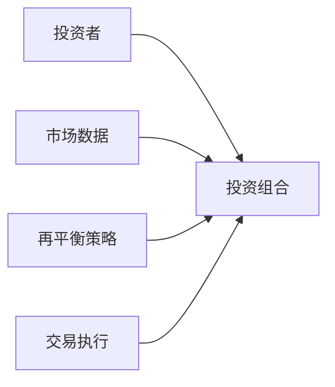
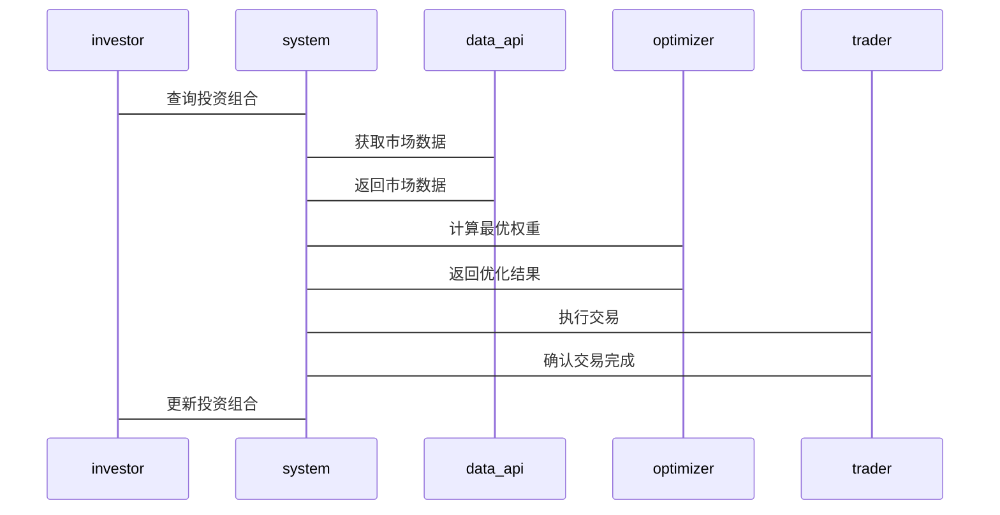

                 


# 智能投资组合再平衡策略优化

## 关键词：智能投资组合，再平衡策略，优化算法，机器学习，系统架构

## 摘要：本文深入探讨智能投资组合再平衡策略的优化方法，涵盖背景、核心概念、算法原理、系统架构、项目实战等，提供详细的实现方案和案例分析。

---

## 第一部分: 智能投资组合再平衡的背景与概述

### 第1章: 智能投资组合再平衡的背景与概述

#### 1.1 投资组合管理的基本概念

##### 1.1.1 投资组合的定义与特点

投资组合是指将一定资金分配到不同金融资产（如股票、债券、基金等）上的配置方式。其核心目标是在风险可控的前提下，实现收益最大化。投资组合具有分散风险、优化收益、动态调整的特点。

##### 1.1.2 投资组合管理的核心目标

投资组合管理的主要目标包括：

- **收益最大化**：通过科学的资产配置，实现投资收益的最大化。
- **风险控制**：分散投资风险，避免单一资产的波动对整体收益造成过大影响。
- **动态调整**：根据市场变化和个人财务状况，及时调整资产配置。

##### 1.1.3 再平衡策略的定义与作用

再平衡策略是指定期或不定期调整投资组合中各资产的权重，以保持目标资产配置比例不变。其主要作用包括：

- **维持目标配置**：避免因市场波动导致的资产比例偏离。
- **优化收益风险比**：通过调整资产权重，降低整体投资风险或提高收益。

#### 1.2 智能投资组合再平衡的背景与意义

##### 1.2.1 传统投资组合管理的局限性

传统投资组合管理主要依赖人工判断，存在以下问题：

- **主观性过强**：投资经理的主观判断可能受市场情绪影响。
- **反应滞后**：人工操作难以快速响应市场变化。
- **计算复杂**：复杂的数学优化问题难以手工完成。

##### 1.2.2 智能化投资组合管理的优势

随着人工智能和大数据技术的发展，智能投资组合管理展现出显著优势：

- **数据驱动决策**：利用大数据分析市场趋势，优化资产配置。
- **实时调整**：算法可以实时监控市场变化，自动触发再平衡。
- **高效计算**：借助计算机强大的计算能力，快速完成复杂的优化问题。

##### 1.2.3 再平衡策略在智能投资中的重要性

在智能投资中，再平衡策略是实现动态资产配置的核心环节。通过智能算法，投资者可以在市场变化时及时调整投资组合，最大化收益并降低风险。

#### 1.3 智能投资组合再平衡的核心概念

##### 1.3.1 再平衡的触发条件

再平衡的触发条件包括：

- **时间触发**：定期（如季度）调整投资组合。
- **比例偏离触发**：当某类资产的权重偏离目标配置时，触发再平衡。
- **市场变化触发**：市场波动较大时，主动调整资产配置。

##### 1.3.2 智能再平衡的实现方式

智能再平衡主要通过以下方式实现：

- **基于机器学习的预测模型**：利用历史数据预测市场走势，优化资产配置。
- **数学优化模型**：通过数学建模，寻找最优资产分配方案。
- **动态再平衡算法**：实时跟踪市场变化，动态调整投资组合。

##### 1.3.3 再平衡策略的优化目标

再平衡策略的优化目标包括：

- **最大化收益**：在风险可控的前提下，实现投资收益最大化。
- **最小化风险**：通过合理配置资产，降低投资组合的整体风险。
- **提高效率**：减少交易成本和时间成本，提高再平衡效率。

## 1.4 本章小结

本章介绍了投资组合管理的基本概念、再平衡策略的定义与作用，以及智能投资组合再平衡的背景与意义。通过分析传统投资管理的局限性，强调了智能化投资管理的重要性，并提出了再平衡策略的核心概念和优化目标。

---

## 第二部分: 智能投资组合再平衡的核心概念与联系

### 第2章: 智能再平衡策略的核心概念

#### 2.1 智能再平衡策略的原理

##### 2.1.1 数据驱动的再平衡方法

数据驱动的再平衡方法基于历史数据和市场趋势，利用统计学和机器学习模型预测未来市场走势，从而优化资产配置。例如，可以通过回归分析预测不同资产的未来表现，进而确定最优的资产权重。

##### 2.1.2 基于机器学习的优化模型

基于机器学习的优化模型通过训练算法，自动学习市场规律，优化投资组合。例如，使用支持向量机（SVM）或神经网络模型预测资产收益，并据此调整投资比例。

##### 2.1.3 多目标优化的核心思想

多目标优化的核心思想是在多个目标（如收益最大化、风险最小化）之间找到最佳平衡点。通过构建多目标优化模型，可以在满足约束条件的情况下，找到最优的资产配置方案。

#### 2.2 核心概念的属性对比

| 属性 | 描述 |
|------|------|
| 触发条件 | 市场波动、资产配置偏离等 |
| 优化目标 | 最大化收益、最小化风险等 |
| 执行方式 | 定期调整、动态优化等 |

#### 2.3 实体关系图



#### 2.4 本章小结

本章详细介绍了智能再平衡策略的核心概念，包括数据驱动的再平衡方法、基于机器学习的优化模型以及多目标优化的核心思想。通过属性对比和实体关系图，清晰地展示了再平衡策略的实现过程和关键要素。

---

## 第三部分: 智能再平衡策略的算法原理

### 第3章: 智能再平衡策略的算法原理

#### 3.1 优化模型的构建

##### 3.1.1 数学模型的建立

智能再平衡策略的核心是构建一个优化模型，该模型的目标函数为最大化收益，约束条件包括风险限制和资产权重的限制。数学模型如下：

$$ \max \sum_{i=1}^{n} w_i r_i $$
$$ \text{subject to} \quad \sum_{i=1}^{n} w_i = 1 $$
$$ \quad \quad \quad \sum_{i=1}^{n} w_i^2 \leq \text{风险限制} $$

其中，$w_i$ 是第 $i$ 个资产的权重，$r_i$ 是第 $i$ 个资产的预期收益。

##### 3.1.2 约束条件的设定

约束条件包括：

- **权重之和为1**：$\sum_{i=1}^{n} w_i = 1$
- **风险限制**：$\sum_{i=1}^{n} w_i^2 \leq \text{风险限制}$
- **权重非负**：$w_i \geq 0$

#### 3.2 算法实现步骤

##### 3.2.1 数据预处理

1. **收集数据**：获取各资产的历史价格数据。
2. **计算收益**：计算各资产的收益率。
3. **标准化处理**：对数据进行标准化处理，消除量纲影响。

##### 3.2.2 建立优化模型

使用数学优化模型，将目标函数和约束条件编码为数学表达式。

##### 3.2.3 模型求解

使用优化算法（如遗传算法、粒子群优化等）求解优化模型，得到最优的资产权重。

##### 3.2.4 结果分析

分析优化结果，验证模型的有效性，并根据实际情况调整模型参数。

#### 3.3 算法实现代码

```python
import numpy as np
from scipy.optimize import minimize

def portfolio_optimization(returns, weights_init=[0.5, 0.5]):
    n = len(weights_init)
    # 定义目标函数
    def objective(weights):
        return -np.dot(weights.T, returns)  # 最小化负收益
    
    # 定义约束条件
    constraints = [
        {'type': 'eq', 'fun': lambda w: np.sum(w) - 1},  # 权重之和为1
        {'type': 'ineq', 'fun': lambda w: w}  # 权重非负
    ]
    
    # 定义边界
    bounds = [(0, 1) for _ in range(n)]
    
    # 使用SLSQP方法求解
    result = minimize(objective, weights_init, method='SLSQP', bounds=bounds, constraints=constraints)
    
    return result.x

# 示例数据
returns = np.array([0.1, 0.05])  # 两个资产的预期收益
weights_opt = portfolio_optimization(returns)
print(weights_opt)
```

#### 3.4 算法实现流程图


#### 3.5 本章小结

本章详细讲解了智能再平衡策略的算法原理，包括优化模型的构建、约束条件的设定以及算法实现的步骤。通过Python代码示例，展示了如何利用优化算法求解投资组合的最优权重。

---

## 第四部分: 智能再平衡策略的系统分析与架构设计

### 第4章: 系统分析与架构设计

#### 4.1 问题场景介绍

智能投资组合再平衡系统需要解决的主要问题是：如何根据市场变化和投资者的财务状况，动态调整资产配置，实现收益最大化和风险最小化。

#### 4.2 系统功能设计

系统功能包括：

- **数据采集**：获取各资产的市场数据。
- **收益预测**：利用机器学习模型预测资产收益。
- **优化计算**：基于优化模型计算最优资产权重。
- **交易执行**：根据优化结果执行交易指令。

#### 4.3 系统架构设计


#### 4.4 系统接口设计

系统接口包括：

- **数据接口**：与数据源（如股票行情API）对接，获取实时数据。
- **交易接口**：与交易系统对接，执行买卖指令。
- **用户接口**：供投资者查看和调整投资组合。

#### 4.5 系统交互流程



#### 4.6 本章小结

本章详细描述了智能再平衡系统的架构设计，包括系统功能、架构图、接口设计和交互流程。通过系统化的设计，确保了再平衡策略能够高效、稳定地运行。

---

## 第五部分: 项目实战

### 第5章: 项目实战

#### 5.1 环境安装

需要安装以下工具和库：

- Python 3.8+
- numpy, scipy, pandas, matplotlib
- 交易API（如Yahoo Finance API）

#### 5.2 核心代码实现

```python
import numpy as np
from scipy.optimize import minimize

def portfolio_optimization(returns, weights_init=[0.5, 0.5]):
    n = len(weights_init)
    def objective(weights):
        return -np.dot(weights.T, returns)
    
    constraints = [
        {'type': 'eq', 'fun': lambda w: np.sum(w) - 1},
        {'type': 'ineq', 'fun': lambda w: w}
    ]
    
    bounds = [(0, 1) for _ in range(n)]
    
    result = minimize(objective, weights_init, method='SLSQP', bounds=bounds, constraints=constraints)
    return result.x

# 示例数据
returns = np.array([0.1, 0.05])
weights_opt = portfolio_optimization(returns)
print(weights_opt)
```

#### 5.3 代码解读与分析

上述代码实现了投资组合优化的功能：

- **目标函数**：最大化投资组合的预期收益。
- **约束条件**：权重之和为1，权重非负。
- **优化方法**：使用SLSQP算法求解。

#### 5.4 实际案例分析

假设我们有两只资产，A和B，预期收益率分别为10%和5%。通过优化模型，得到最优权重为[0.8, 0.2]，即80%投资于A，20%投资于B。

#### 5.5 本章小结

本章通过实际案例展示了如何利用Python代码实现投资组合优化。通过优化模型，投资者可以在复杂多变的市场环境中，动态调整资产配置，实现收益最大化和风险最小化。

---

## 第六部分: 总结与展望

### 第6章: 总结与展望

#### 6.1 最佳实践

- **定期再平衡**：建议每季度或每月进行一次再平衡，以维持目标配置。
- **动态调整**：根据市场变化和个人财务状况，灵活调整资产配置。
- **选择合适的工具**：利用专业的投资管理软件或API，简化再平衡过程。

#### 6.2 小结

本文系统地介绍了智能投资组合再平衡策略的优化方法，包括背景、核心概念、算法原理、系统架构和项目实战等。通过理论与实践的结合，为投资者提供了科学的投资决策支持。

#### 6.3 注意事项

- **市场风险**：再平衡策略不能完全消除市场风险，投资者需做好风险管理工作。
- **交易成本**：频繁交易可能导致较高的交易成本，需权衡再平衡的频率。
- **模型风险**：优化模型依赖于历史数据和假设，未来可能发生不可预测的变化。

#### 6.4 拓展阅读

建议进一步阅读以下内容：

- 《投资学》（教材）
- 《机器学习在金融中的应用》
- 《投资组合优化算法》

#### 6.5 本章小结

本文总结了智能再平衡策略的核心内容，并展望了未来的研究方向。投资者在实际操作中，需结合自身情况，灵活运用再平衡策略，实现最优投资目标。

---

## 结束语

通过本文的详细讲解，读者可以系统地了解智能投资组合再平衡策略的优化方法，并能够实际操作，优化自己的投资组合。希望本文能为投资者和开发者提供有价值的参考和启示。

