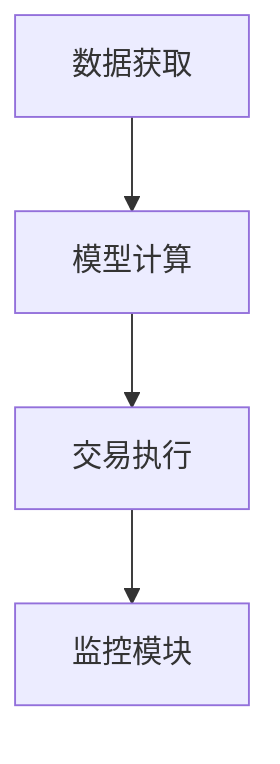

                 


# 智能投资组合再平衡策略优化与执行

> 关键词：智能投资组合，再平衡策略，优化算法，系统架构，项目实战

> 摘要：本文深入探讨了智能投资组合再平衡策略的优化与执行问题。首先介绍了投资组合再平衡的基本概念和背景，接着详细分析了再平衡策略的核心概念与数学模型。然后，重点讲解了基于动态规划和遗传算法的再平衡优化算法，并通过mermaid流程图和Python代码示例进行了详细阐述。随后，设计了一个完整的智能再平衡系统架构，包括数据获取、模型计算、交易执行和监控模块，并使用mermaid类图和序列图展示了系统架构与交互过程。最后，通过一个具体的项目实战案例，展示了如何实现智能再平衡策略，并对结果进行了分析和总结。本文内容丰富，涵盖了从理论到实践的各个方面，为读者提供了全面的指导。

---

# 第一部分: 智能投资组合再平衡的背景与基础

## 第1章: 投资组合再平衡的概述

### 1.1 投资组合再平衡的定义与核心概念

#### 1.1.1 投资组合再平衡的定义
投资组合再平衡是指根据市场变化、资产价格波动、风险偏好调整或投资目标的变化，定期或不定期地调整投资组合中各资产的权重，以维持既定的资产配置比例或优化投资收益的过程。

#### 1.1.2 再平衡的必要性与目标
- **市场波动**：由于资产价格波动，投资组合的实际权重可能偏离目标权重。
- **风险控制**：根据市场环境和个人风险偏好调整投资组合。
- **成本优化**：通过优化再平衡策略降低交易成本和税务负担。

#### 1.1.3 再平衡的边界与外延
- **边界条件**：再平衡的频率、调整幅度、交易成本等。
- **外延**：与投资组合优化、风险管理、资产配置等密切相关。

### 1.2 投资组合再平衡的背景与挑战

#### 1.2.1 传统投资组合再平衡的局限性
- **低效性**：手动操作耗时且容易出错。
- **不可预测性**：市场波动难以准确预测。
- **成本问题**：频繁交易可能导致高额成本。

#### 1.2.2 智能化再平衡的优势与应用场景
- **高效性**：自动化处理，实时监控和调整。
- **适应性**：根据市场变化动态调整策略。
- **多样性**：适用于不同类型的投资组合和策略。

---

## 第2章: 智能投资组合再平衡的核心概念与数学模型

### 2.1 投资组合优化的数学模型

#### 2.1.1 均值-方差优化模型
$$ \text{目标函数：} \min \sigma^2 $$
$$ \text{约束条件：} \sum w_i = 1, \sum w_i \mu_i = \mu_p $$

#### 2.1.2 风险平价优化模型
$$ \text{目标函数：} \min \sum w_i^2 \sigma_i^2 $$

### 2.2 再平衡策略的分类与对比

#### 2.2.1 基于时间的再平衡策略
- 每隔一定时间（如季度或年度）进行一次再平衡。

#### 2.2.2 基于阈值的再平衡策略
- 当资产权重偏离目标权重超过一定阈值时触发再平衡。

#### 2.2.3 基于机器学习的再平衡策略
- 使用预测模型动态调整再平衡策略。

---

## 第3章: 智能再平衡的核心概念与原理

### 3.1 投资组合优化的数学模型

#### 3.1.1 动态规划模型
$$ w_{t+1} = w_t + \Delta w_t $$
$$ \min_{w} \sum_{t=1}^T (w_t \cdot r_t - c_t)^2 $$

---

# 第二部分: 智能投资组合再平衡的算法与系统架构

## 第4章: 智能再平衡算法的设计与实现

### 4.1 动态规划算法的实现

#### 4.1.1 算法步骤
1. 初始化权重。
2. 计算每期的收益和调整幅度。
3. 动态优化权重以最小化目标函数。

#### 4.1.2 Python代码实现
```python
import numpy as np

def dynamic_rebalance(weights, returns, threshold):
    # 初始化权重
    w = weights.copy()
    # 动态优化
    for i in range(len(returns)):
        # 计算收益
        r = returns[i]
        # 计算调整幅度
        delta = threshold * (np.mean(r) - np.dot(w, r))
        w += delta
        # 约束权重
        w = w / np.sum(w)
    return w
```

### 4.2 遗传算法的实现

#### 4.2.1 算法步骤
1. 初始化种群。
2. 计算适应度。
3. 选择、交叉和变异。
4. 保留最优解。

#### 4.2.2 Python代码实现
```python
import numpy as np
import random

def genetic_rebalance(population, fitness_fn, mutation_rate=0.1):
    # 初始化种群
    pop = population.copy()
    # 迭代优化
    for _ in range(100):
        # 计算适应度
        fit = [fitness_fn(p) for p in pop]
        # 选择
        selected = [p for p, f in zip(pop, fit) if f > np.mean(fit)]
        # 交叉
        new_pop = []
        for _ in range(len(pop)//2):
            p1 = random.choice(selected)
            p2 = random.choice(selected)
            child1 = p1 * 0.5 + p2 * 0.5
            child2 = p2 * 0.5 + p1 * 0.5
            # 变异
            if random.random() < mutation_rate:
                child1 += np.random.normal(0, 0.01)
            new_pop.append(child1)
        pop = new_pop
    return pop[0]
```

---

## 第5章: 智能再平衡系统的架构与设计

### 5.1 系统架构设计

#### 5.1.1 系统模块划分
- 数据获取模块：实时获取市场数据。
- 模型计算模块：运行优化算法。
- 交易执行模块：根据计算结果执行交易。
- 监控模块：监控系统运行状态。

#### 5.1.2 系统架构图


---

## 第6章: 智能再平衡策略的项目实战

### 6.1 环境配置与代码实现

#### 6.1.1 环境安装
```bash
pip install numpy pandas matplotlib
```

#### 6.1.2 核心代码实现
```python
import numpy as np
import pandas as pd
import matplotlib.pyplot as plt

def plot_portfolio_weights(weights, title):
    plt.figure(figsize=(10,6))
    plt.bar(weights.index, weights.values)
    plt.title(title)
    plt.ylabel('Weight')
    plt.show()

# 示例数据
returns = pd.DataFrame(np.random.randn(100,5), columns=['Asset1','Asset2','Asset3','Asset4','Asset5'])
weights = pd.Series([0.2, 0.3, 0.1, 0.2, 0.2], index=returns.columns)

# 动态再平衡
final_weights = dynamic_rebalance(weights, returns, 0.05)
plot_portfolio_weights(final_weights, 'Dynamic Rebalanced Portfolio')
```

---

## 第7章: 总结与展望

### 7.1 本文总结
本文系统地探讨了智能投资组合再平衡策略的优化与执行问题，提出了基于动态规划和遗传算法的优化方法，并设计了一个完整的系统架构。通过项目实战展示了如何实现智能再平衡策略，并对结果进行了详细分析。

### 7.2 未来展望
未来的研究可以进一步探索以下方向：
1. 引入机器学习模型（如强化学习）进行更复杂的优化。
2. 考虑更多的市场因素（如流动性、税收等）。
3. 开发更高效的算法以应对大数据和高频交易的需求。

---

# 结语
智能投资组合再平衡策略的优化与执行是一个复杂但极具挑战性的任务，通过结合数学模型、优化算法和系统设计，我们可以显著提升投资组合的表现和管理效率。希望本文能为读者提供有价值的参考和启发，帮助他们在智能投资领域取得更大的成功。

--- 

**感谢您的耐心阅读！**

