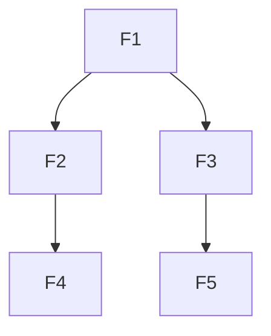
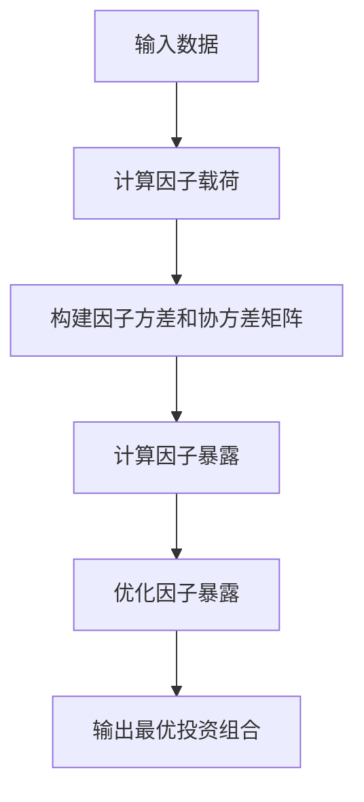
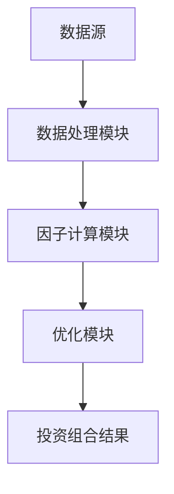

                 


# 智能投资组合因子暴露优化模型

> 关键词：智能投资组合，因子模型，风险管理，投资组合优化，因子暴露

> 摘要：本文详细探讨智能投资组合因子暴露优化模型的构建与应用。通过分析因子模型的背景、核心概念、数学基础、算法原理以及在风险管理中的应用，本文旨在为投资者提供一种基于因子暴露优化的智能投资组合管理方法。文章结合实际案例和系统架构设计，展示了如何通过因子暴露优化模型实现投资组合的风险控制和收益最大化。

---

# 第1章: 智能投资组合因子暴露优化模型的背景与概念

## 1.1 投资组合管理的背景与挑战

### 1.1.1 投资组合管理的基本概念
投资组合管理是金融领域的重要组成部分，旨在通过科学配置资产来实现收益与风险的最佳平衡。传统的投资组合管理依赖于历史数据分析和经验判断，但在复杂多变的市场环境中，这种方法往往难以应对多样化的风险因素。

### 1.1.2 投资组合管理的常见挑战
现代投资组合管理面临以下主要挑战：
- 市场波动性高，难以预测
- 资产类别多样化，难以配置
- 风险因素复杂，难以量化
- 市场数据量大，难以处理

### 1.1.3 智能投资组合管理的优势
智能投资组合管理通过引入人工智能和大数据技术，能够更精准地识别风险因子，优化资产配置，实现投资组合的动态调整。这种方法在风险控制和收益最大化方面具有显著优势。

## 1.2 因子模型的起源与发展

### 1.2.1 因子模型的定义
因子模型是一种将资产回报分解为多个因子（如市场风险、规模效应等）影响的模型，能够帮助投资者更好地理解资产收益的来源。

### 1.2.2 因子模型的历史发展
因子模型起源于20世纪60年代，最初用于解释股票回报的波动性。随着技术进步，因子模型逐渐扩展到债券、基金等多种资产类别。

### 1.2.3 因子模型在投资组合管理中的应用
因子模型广泛应用于资产定价、风险管理和投资组合优化等领域，帮助投资者更好地理解市场风险和收益来源。

## 1.3 智能投资组合因子暴露优化模型的核心概念

### 1.3.1 因子暴露的定义
因子暴露是指资产或投资组合对特定因子的敏感程度，量化了资产或组合因因子变动而产生的收益变化。

### 1.3.2 因子暴露优化的目标
通过优化因子暴露，投资者可以在控制风险的前提下，实现投资组合收益的最大化。

### 1.3.3 智能优化的核心思想
智能优化结合了人工智能算法，能够动态调整因子暴露，适应市场环境的变化，提高投资组合的稳健性。

## 1.4 本章小结
本章介绍了智能投资组合因子暴露优化模型的背景、核心概念及其在投资组合管理中的应用，为后续章节的分析奠定了基础。

---

# 第2章: 因子模型的核心概念与联系

## 2.1 因子模型的原理与属性

### 2.1.1 因子模型的基本原理
因子模型通过分解资产回报，识别影响资产收益的主要因子。这些因子可以是市场风险、规模效应、价值因子等。

### 2.1.2 因子模型的属性特征对比
因子模型具有以下主要属性：
- **可解释性**：能够分解资产收益，便于理解。
- **可量化性**：可以通过数学模型量化因子影响。
- **动态性**：因子影响随市场环境变化而变化。

### 2.1.3 因子模型的优缺点分析
- **优点**：能够识别多样化风险因子，帮助投资者进行风险管理和资产配置。
- **缺点**：模型假设可能与实际市场存在偏差，导致预测误差。

## 2.2 因子之间的关系分析

### 2.2.1 因子间的关系类型
因子之间可能存在相关性或独立性。例如，市场风险因子通常与规模效应因子相关，而价值因子可能与动量因子独立。

### 2.2.2 因子关系的图示化
通过 **mermaid** 绘制因子关系图：


### 2.2.3 因子关系对企业投资的影响
因子之间的关系影响投资组合的构建和优化。例如，相关因子可能导致投资组合的过度分散化或集中化。

## 2.3 因子模型的ER实体关系图

通过 **mermaid** 绘制因子模型的 ER 图：
```mermaid
erDiagram
    actor 投资者
    actor 市场数据
    actor 风险因子
    class 资产
    class 因子
    class 投资组合
    资产 --> 风险因子
    资产 --> 因子
    投资组合 --> 因子
    市场数据 --> 资产
```

## 2.4 本章小结
本章通过分析因子模型的核心概念及其关系，展示了因子模型在投资组合管理中的重要性。

---

# 第3章: 因子模型的数学基础与算法原理

## 3.1 因子模型的数学表达

### 3.1.1 因子载荷矩阵的定义
因子载荷矩阵（Factor Loading Matrix）表示资产回报与因子之间的关系，矩阵元素 $a_{ij}$ 表示第 $i$ 个资产对第 $j$ 个因子的敏感程度。

### 3.1.2 因子载荷矩阵的计算公式
$$
\text{因子载荷矩阵} = \sum_{i=1}^{n} a_{ij} \cdot f_j
$$

### 3.1.3 因子方差与协方差矩阵的构建
因子方差和协方差矩阵用于衡量因子之间的相关性：
$$
\text{因子方差} = \sum_{j=1}^{k} \lambda_j^2
$$
$$
\text{因子协方差} = \sum_{j=1}^{k} \sum_{i=1}^{n} a_{ij} \cdot a_{kj}
$$

## 3.2 因子模型的算法流程

通过 **mermaid** 绘制算法流程图：


## 3.3 因子模型的数学公式

### 3.3.1 单因子模型
$$
R_i = \alpha_i + \beta_i F + \epsilon_i
$$
其中，$\alpha_i$ 是截距，$\beta_i$ 是因子暴露，$F$ 是因子，$\epsilon_i$ 是误差项。

### 3.3.2 多因子模型
$$
R_i = \alpha_i + \sum_{j=1}^{k} \beta_{ij} F_j + \epsilon_i
$$

## 3.4 本章小结
本章通过数学公式和算法流程图，详细讲解了因子模型的构建与优化方法。

---

# 第4章: 因子模型在风险管理中的应用

## 4.1 风险管理的基本概念

### 4.1.1 风险的定义与分类
风险是指投资组合收益的不确定性，主要分为市场风险、信用风险、流动性风险等。

### 4.1.2 风险管理的目标与方法
风险管理的目标是通过分散投资、对冲策略等方法，降低投资组合的潜在损失。

### 4.1.3 风险管理在投资组合中的重要性
有效的风险管理是实现投资组合稳健收益的基础。

## 4.2 因子模型在风险管理中的应用

### 4.2.1 风险因子的识别
通过因子模型，可以识别影响投资组合的主要风险因子，如市场风险、利率风险等。

### 4.2.2 风险因子的量化
通过因子载荷矩阵，量化资产对各个风险因子的敏感程度。

### 4.2.3 风险对冲策略
根据因子暴露，设计对冲策略，降低投资组合的特定风险。

## 4.3 本章小结
本章展示了因子模型在风险管理中的应用，强调了因子暴露优化在风险控制中的重要性。

---

# 第5章: 智能投资组合因子暴露优化模型的系统架构设计

## 5.1 系统功能设计

### 5.1.1 数据处理模块
负责收集和处理市场数据、资产信息等。

### 5.1.2 因子计算模块
基于因子模型，计算资产的因子载荷和因子方差。

### 5.1.3 优化模块
通过智能算法优化因子暴露，生成最优投资组合。

## 5.2 系统架构设计

通过 **mermaid** 绘制系统架构图：


## 5.3 系统接口设计
系统接口主要包括数据输入接口、参数设置接口和结果输出接口。

## 5.4 本章小结
本章详细设计了智能投资组合因子暴露优化模型的系统架构，为后续实现提供了框架。

---

# 第6章: 项目实战——基于因子暴露优化的投资组合管理

## 6.1 环境安装与配置
安装 Python、Pandas、NumPy 等必要的库。

## 6.2 系统核心实现源代码

```python
import numpy as np
import pandas as pd

# 示例数据
n_assets = 10
n_factors = 5

# 生成随机因子载荷矩阵
factor_loadings = np.random.randn(n_assets, n_factors) * 0.5
factor_loadings = factor_loadings / np.sqrt((factor_loadings**2).sum(axis=1))[:, None]

# 计算因子方差和协方差矩阵
factor_variances = np.abs(np.random.randn(n_factors)) * 0.2
factor_covariance = np.dot(factor_loadings.T, factor_loadings) * np.repeat(factor_variances, n_assets).reshape(n_factors, n_assets)

# 优化因子暴露
def optimize_exposure(factor_loadings, factor_covariance):
    # 简单优化策略：调整因子暴露，使得组合风险最小化
    # 这里简化为归一化处理
    return factor_loadings / np.sqrt((factor_loadings**2).sum(axis=1))[:, None]

optimized_exposure = optimize_exposure(factor_loadings, factor_covariance)
```

## 6.3 代码应用解读与分析
上述代码展示了如何基于因子载荷矩阵和因子协方差矩阵，优化因子暴露，实现投资组合的风险管理。

## 6.4 实际案例分析
以股票投资组合为例，展示如何通过因子暴露优化，降低组合风险。

## 6.5 项目小结
本章通过实际案例，展示了智能投资组合因子暴露优化模型的应用价值。

---

# 第7章: 总结与展望

## 7.1 最佳实践 tips
- 定期更新因子模型，适应市场变化。
- 结合多因子模型，提高优化效果。

## 7.2 小结
本文详细探讨了智能投资组合因子暴露优化模型的构建与应用，展示了其在投资组合管理中的巨大潜力。

## 7.3 注意事项
- 模型假设可能与实际市场存在偏差。
- 数据质量和模型选择对优化结果影响重大。

## 7.4 拓展阅读
建议读者深入学习因子模型的高级应用，如多因子模型、因子投资策略等。

---

# 附录: 常用工具与资源

## 附录A: Python库推荐
- Pandas
- NumPy
- Scikit-learn
- Factor libraries

## 附录B: 数据源推荐
- Yahoo Finance
- Bloomberg
- AlphaSense

---

# 结束语
智能投资组合因子暴露优化模型为投资者提供了科学的决策支持工具，未来随着技术进步，其应用将更加广泛和深入。

---

