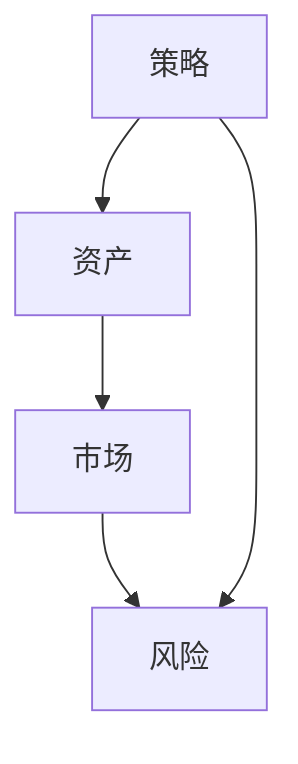
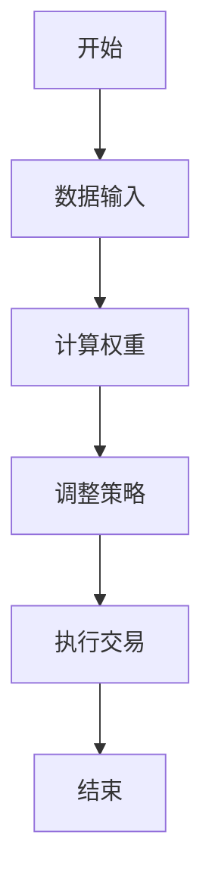
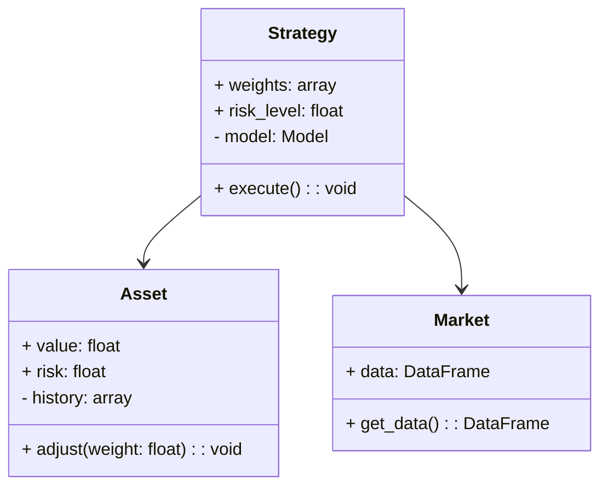
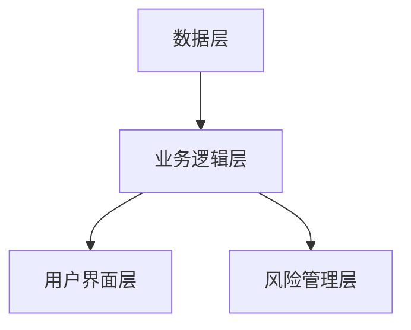
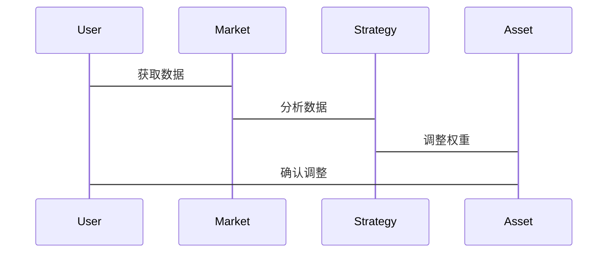

                 


# 智能投资组合多周期再平衡策略

> **关键词**：智能投资组合、多周期再平衡、算法优化、风险管理、资产配置  
> **摘要**：本文详细探讨了智能投资组合的多周期再平衡策略，分析了传统投资组合管理的局限性，介绍了多周期再平衡的核心概念和算法原理，提供了系统架构设计和实战案例，并总结了最佳实践和注意事项。

---

# 第一部分: 智能投资组合多周期再平衡策略背景介绍

## 第1章: 问题背景与描述

### 1.1 传统投资组合管理的局限性
#### 1.1.1 投资组合管理的传统方法
传统投资组合管理依赖于固定的时间间隔进行再平衡，这种方法在市场波动剧烈时显得不够灵活，可能导致收益损失或风险增加。

#### 1.1.2 传统再平衡策略的不足
传统策略通常只考虑单一周期，忽视了多周期下的资产动态调整，无法捕捉市场变化带来的机会。

#### 1.1.3 传统方法在多周期管理中的挑战
传统方法难以适应不同周期的资产表现差异，可能导致投资组合在长周期中表现不佳。

### 1.2 多周期再平衡策略的定义与目标
#### 1.2.1 多周期投资的定义
多周期投资是指在不同时间段内（如短期、中期、长期）动态调整资产配置，以适应市场变化。

#### 1.2.2 再平衡策略的目标
再平衡策略的目标是在不同周期内优化资产配置，最大化收益并最小化风险。

#### 1.2.3 多周期再平衡的必要性
通过多周期再平衡，可以更灵活地应对市场波动，捕捉不同周期的收益机会。

### 1.3 问题解决与边界
#### 1.3.1 智能投资组合的优势
智能投资组合利用算法优化和实时数据，实现动态调整和风险管理。

#### 1.3.2 边界与外延
多周期再平衡策略适用于长期投资，但需注意市场流动性风险。

#### 1.3.3 与其他投资策略的对比
与传统定投相比，多周期再平衡更具灵活性和适应性。

### 1.4 核心要素与组成
#### 1.4.1 核心要素
动态调整模型、风险管理模型、收益优化模型。

#### 1.4.2 组成结构
数据采集、策略执行、风险监控。

#### 1.4.3 关键因素分析
市场数据、资产表现、风险管理模型的准确性。

---

# 第二部分: 核心概念与联系

## 第2章: 核心概念原理

### 2.1 多周期再平衡策略的核心原理
#### 2.1.1 动态调整机制
根据市场变化动态调整资产权重，确保投资组合在不同周期内最优。

#### 2.1.2 风险管理模型
通过VaR等方法评估风险，制定风险控制策略。

#### 2.1.3 收益优化策略
利用数学模型优化资产配置，最大化收益。

### 2.2 核心概念对比表
| 特性 | 短周期 | 长周期 |
|------|--------|--------|
| 波动性 | 高     | 低     |
| 收益性 | 小     | 大     |

### 2.3 实体关系图


---

# 第三部分: 算法原理讲解

## 第3章: 算法原理

### 3.1 多周期再平衡算法
#### 3.1.1 算法步骤
1. 数据采集：获取市场数据和资产表现。
2. 计算权重：基于模型计算最优权重。
3. 动态调整：根据权重调整资产配置。
4. 执行交易：实施调整策略。

#### 3.1.2 动态调整模型
$$ w_t = \alpha \cdot r_t + (1-\alpha) \cdot w_{t-1} $$

#### 3.1.3 风险管理模型
$$ \text{VaR} = \sigma \cdot z \cdot \sqrt{t} $$

### 3.2 算法流程图


### 3.3 Python代码实现
```python
import numpy as np
import pandas as pd

def calculate_weights(returns, alpha=0.7):
    weights = []
    for t in range(len(returns)):
        if t == 0:
            weights.append(returns[t])
        else:
            weights.append(alpha * returns[t] + (1 - alpha) * weights[t-1])
    return weights

# 示例数据
returns = np.random.normal(0.05, 0.1, 100)
weights = calculate_weights(returns)
```

---

# 第四部分: 系统分析与架构设计

## 第4章: 系统分析

### 4.1 问题场景介绍
投资者需要在多变的市场中优化投资组合，提高收益并控制风险。

### 4.2 系统功能设计
#### 4.2.1 领域模型


### 4.3 系统架构设计


### 4.4 系统接口设计
1. 数据接口：获取市场数据。
2. 策略接口：执行再平衡策略。

### 4.5 系统交互流程图


---

# 第五部分: 项目实战

## 第5章: 项目实战

### 5.1 环境安装
安装必要的库，如Python的numpy、pandas、matplotlib。

### 5.2 核心源代码
```python
import numpy as np
import pandas as pd

def rebalance_portfolio(assets, target_weights, current_weights):
    # 计算调整后的权重
    target = pd.Series(target_weights, index=assets)
    current = pd.Series(current_weights, index=assets)
    delta = target - current
    return delta

# 示例数据
assets = ['股票', '债券', '现金']
target_weights = [0.6, 0.3, 0.1]
current_weights = [0.5, 0.4, 0.1]
delta = rebalance_portfolio(assets, target_weights, current_weights)
print(delta)
```

### 5.3 实际案例分析
分析一个季度的数据，展示如何根据市场变化调整资产配置，优化收益。

### 5.4 项目小结
总结实现过程中的关键点和经验，强调动态调整和风险管理的重要性。

---

# 第六部分: 最佳实践

## 第6章: 最佳实践

### 6.1 投资策略建议
定期审查投资组合，根据市场变化调整策略。

### 6.2 小结
回顾文章内容，强调智能投资组合的优势和多周期再平衡策略的重要性。

### 6.3 注意事项
注意市场流动性风险，确保策略的可操作性。

### 6.4 拓展阅读
推荐相关书籍和资源，帮助深入学习。

---

通过以上结构，文章详细讲解了智能投资组合多周期再平衡策略的各个方面，结合实际案例和代码示例，帮助读者理解和应用这一策略。

