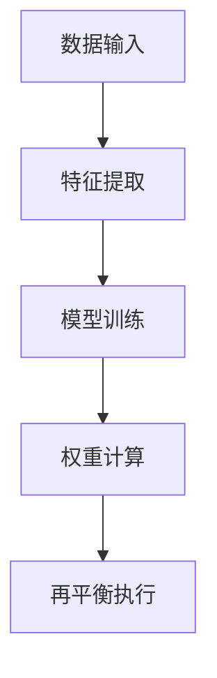
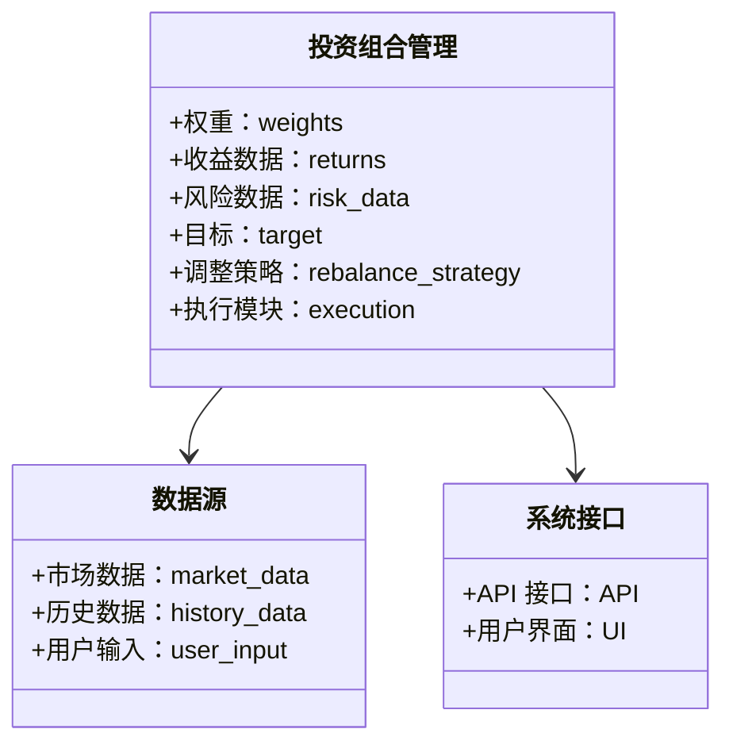
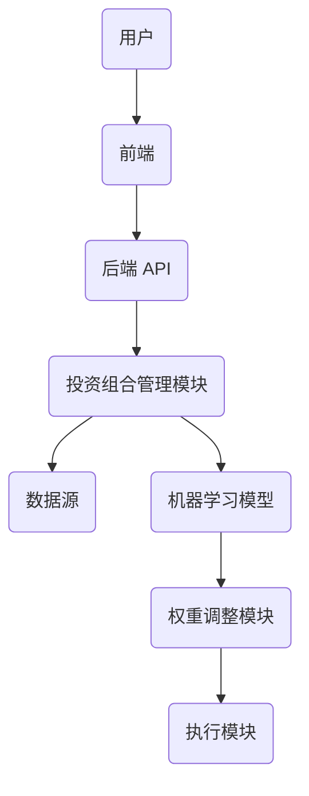

                 


# 智能投资组合多周期再平衡策略

> 关键词：智能投资组合、多周期再平衡、风险管理、算法优化、资产配置

> 摘要：本文详细探讨了智能投资组合多周期再平衡策略的核心概念、算法原理和实现方案。通过对投资组合优化的数学模型、多周期再平衡策略的动态调整机制以及基于机器学习的智能再平衡算法的深入分析，提出了一个完整的系统架构设计方案。本文还结合实际案例，展示了如何通过代码实现智能投资组合的多周期再平衡策略，并总结了策略的有效性和局限性，为投资组合管理者提供了实用的参考。

---

# 第一部分: 智能投资组合多周期再平衡策略概述

## 第1章: 智能投资组合与多周期再平衡策略背景

### 1.1 投资组合的基本概念

#### 1.1.1 投资组合的定义与组成
投资组合是指将资金分配到多种资产（如股票、债券、 commodities 等）上的组合，以分散风险并实现收益最大化。一个典型的投资组合通常由以下几个部分组成：
- **资产类别**：股票、债券、现金等。
- **权重分配**：每种资产在组合中的占比。
- **风险与收益目标**：根据投资者的风险承受能力和收益目标进行调整。

#### 1.1.2 投资组合的目标与风险收益平衡
投资组合的目标通常包括以下几种：
1. **最大化收益**：在给定风险水平下实现收益最大化。
2. **最小化风险**：在给定收益目标下实现风险最小化。
3. **风险与收益平衡**：根据投资者的偏好，在风险与收益之间找到最佳平衡点。

#### 1.1.3 投资组合管理的核心问题
投资组合管理的核心问题包括：
1. **资产配置**：确定每种资产的权重。
2. **再平衡**：根据市场变化和投资目标调整权重。
3. **风险管理**：监控和控制投资组合的风险。

### 1.2 多周期再平衡策略的背景与意义

#### 1.2.1 传统投资组合再平衡的局限性
传统的再平衡策略通常基于固定的时间间隔（如季度、半年或一年）进行调整，这种静态的调整方式存在以下问题：
1. **市场波动的适应性差**：无法根据市场环境的变化及时调整。
2. **收益不稳定**：在市场剧烈波动时，固定再平衡可能导致较大的收益回撤。
3. **灵活性不足**：无法根据资产的动量效应或趋势变化进行动态调整。

#### 1.2.2 多周期再平衡的定义与特点
多周期再平衡策略是指根据不同的时间周期（如日、周、月、季度等）动态调整投资组合权重的一种策略。其特点包括：
1. **动态性**：可以根据市场环境的变化实时调整。
2. **灵活性**：可以根据不同资产的周期性特征进行优化。
3. **适应性**：能够更好地适应市场的波动性和周期性。

#### 1.2.3 多周期再平衡在现代投资管理中的应用价值
多周期再平衡策略能够有效解决传统再平衡策略的局限性，尤其在以下场景中具有重要价值：
1. **市场波动剧烈时**：能够快速调整组合权重，降低风险。
2. **资产动量效应显著时**：能够捕捉资产的短期动量效应，提升收益。
3. **多资产配置时**：能够根据不同资产的周期性特征进行动态优化。

### 1.3 智能投资组合的核心要素

#### 1.3.1 智能投资组合的定义
智能投资组合是指利用人工智能和大数据技术，根据市场环境和投资者需求动态调整投资组合的一种现代投资策略。其核心在于通过算法优化和实时数据处理，实现投资组合的自动化管理和智能化决策。

#### 1.3.2 数据驱动的投资决策
智能投资组合依赖于高频数据和实时市场信息，通过数据挖掘和机器学习技术，提取市场特征并制定投资决策。

#### 1.3.3 人工智能与机器学习在投资组合管理中的应用
人工智能和机器学习在投资组合管理中的应用包括：
1. **资产定价**：通过机器学习模型预测资产价格。
2. **风险预测**：基于历史数据预测市场风险。
3. **动态再平衡**：根据市场变化动态调整组合权重。

### 1.4 本章小结

#### 1.4.1 投资组合管理的基本框架
投资组合管理的基本框架包括资产配置、风险管理和再平衡三个核心环节。

#### 1.4.2 多周期再平衡策略的核心价值
多周期再平衡策略能够根据市场环境的变化动态调整组合权重，显著提升投资组合的收益风险比。

#### 1.4.3 智能投资组合的未来发展趋势
智能投资组合将更加依赖人工智能和大数据技术，实现投资决策的自动化和智能化。

---

# 第二部分: 智能投资组合多周期再平衡的核心概念与原理

## 第2章: 智能投资组合的数学模型与优化目标

### 2.1 投资组合优化的数学模型

#### 2.1.1 均值-方差模型
均值-方差模型是投资组合优化的基础模型，其目标是最小化投资组合的方差（即风险），同时满足收益和权重的约束条件。

目标函数：
$$\text{目标函数：} \min_w \sigma^2(w)$$

约束条件：
$$\sum_{i=1}^n w_i = 1, \quad w_i \geq 0$$

其中，$w_i$ 表示第 $i$ 种资产的权重，$\sigma^2(w)$ 表示投资组合的方差。

#### 2.1.2 风险调整后的收益优化
风险调整后的收益优化模型在均值-方差模型的基础上，引入了风险惩罚因子 $\lambda$，以实现收益与风险的平衡。

目标函数：
$$\text{目标函数：} \max_w \mu(w) - \lambda \sigma^2(w)$$

其中，$\mu(w)$ 表示投资组合的期望收益，$\sigma^2(w)$ 表示投资组合的方差，$\lambda$ 是风险惩罚因子。

### 2.2 多周期再平衡策略的核心原理

#### 2.2.1 时间序列分析与周期性特征提取
多周期再平衡策略的核心在于对资产收益的时间序列进行分析，提取其周期性特征，并根据这些特征动态调整组合权重。

#### 2.2.2 动态资产配置的数学表达
动态资产配置可以通过以下公式表示：
$$w_t = f(t, \mathbf{r}_{t-1})$$

其中，$w_t$ 表示第 $t$ 期的权重向量，$\mathbf{r}_{t-1}$ 表示第 $t-1$ 期的资产收益，$f$ 是基于时间 $t$ 和历史收益的调整函数。

#### 2.2.3 基于多周期的权重调整策略
基于多周期的权重调整策略可以通过以下步骤实现：
1. **计算多周期动量**：对每种资产的收益序列计算不同周期（如 10 天、30 天、90 天）的动量。
2. **归一化处理**：将动量值归一化，得到每种资产的权重。
3. **动态调整**：根据当前市场环境调整权重，实现多周期再平衡。

### 2.3 智能投资组合的优化目标

#### 2.3.1 最大化夏普比率
夏普比率是衡量投资组合风险调整后收益的重要指标，其公式为：
$$\text{夏普比率} = \frac{\mu_p - r_f}{\sigma_p}$$

其中，$\mu_p$ 是投资组合的期望收益，$r_f$ 是无风险利率，$\sigma_p$ 是投资组合的收益标准差。

#### 2.3.2 最小化最大回撤
最大回撤是指在一定时间段内，投资组合从高点到低点的最大跌幅。通过最小化最大回撤，可以有效控制投资组合的风险。

#### 2.3.3 稳定性与可解释性
投资组合的稳定性和可解释性是智能投资策略的重要考量因素。通过引入正则化项（如 L2 正则化），可以提高投资组合的稳定性，并使其更具可解释性。

---

# 第三部分: 智能投资组合多周期再平衡的算法与实现

## 第3章: 基于机器学习的多周期再平衡算法

### 3.1 常见的多周期再平衡算法

#### 3.1.1 等权重再平衡策略
等权重再平衡策略是指将所有资产的权重调整为相等，例如在股票池中有 $n$ 只股票，则每只股票的权重为 $1/n$。该策略的优点是简单易行，但可能会忽略不同资产的风险收益特征。

#### 3.1.2 基于资产动量的再平衡策略
基于资产动量的再平衡策略是指根据资产的动量效应动态调整权重。具体步骤如下：
1. **计算动量**：对每种资产的收益序列计算动量。
2. **排序与分配权重**：根据动量大小对资产进行排序，并根据排序结果分配权重。

#### 3.1.3 基于风险平价的再平衡策略
风险平价策略是指根据资产的风险贡献进行权重分配，使得每种资产的风险贡献相等。风险贡献可以通过以下公式计算：
$$\text{风险贡献}_i = w_i \cdot \sigma_i$$

其中，$\sigma_i$ 是第 $i$ 种资产的收益标准差。

### 3.2 基于机器学习的智能再平衡算法

#### 3.2.1 算法流程图
以下是一个基于机器学习的多周期再平衡算法的流程图：



#### 3.2.2 算法实现代码
以下是基于机器学习的多周期再平衡算法的 Python 实现代码：

```python
import numpy as np
import pandas as pd

def compute_momentum(returns, window):
    # 计算动量
    momentum = returns.rolling(window).mean()
    return momentum

def rebalance(weights, returns, window):
    # 计算动量
    momentum = compute_momentum(returns, window)
    # 归一化
    weights_normalized = (momentum - momentum.min()) / (momentum.max() - momentum.min())
    # 动态调整权重
    weights_adjusted = weights * weights_normalized
    weights_adjusted = weights_adjusted / weights_adjusted.sum()
    return weights_adjusted

# 示例数据
returns = pd.DataFrame(np.random.randn(100, 5), columns=['资产1', '资产2', '资产3', '资产4', '资产5'])
weights = np.array([0.2, 0.2, 0.2, 0.2, 0.2])

# 调整权重
new_weights = rebalance(weights, returns, window=30)
print("调整后的权重：", new_weights)
```

---

# 第四部分: 智能投资组合多周期再平衡的系统架构与项目实战

## 第4章: 系统架构设计与实现

### 4.1 问题场景介绍
智能投资组合多周期再平衡系统的应用场景包括机构投资者、个人投资者和财富管理平台。系统需要能够实时处理高频数据，并根据市场变化动态调整组合权重。

### 4.2 系统功能设计

#### 4.2.1 领域模型
以下是智能投资组合系统的领域模型：



#### 4.2.2 系统架构设计
以下是系统的架构设计图：



### 4.3 项目实战

#### 4.3.1 环境安装
需要安装以下 Python 包：
```bash
pip install pandas numpy matplotlib scikit-learn
```

#### 4.3.2 核心代码实现
以下是核心代码实现：

```python
import numpy as np
import pandas as pd
from sklearn.linear_model import LinearRegression

def compute_trend(returns, window):
    # 计算趋势
    trend = pd.rolling_mean(returns, window)
    return trend

def predict_future_returns(trend, window):
    # 使用线性回归模型预测未来收益
    model = LinearRegression()
    model.fit(trend, returns)
    predicted_returns = model.predict(trend)
    return predicted_returns

def rebalance(weights, returns, window):
    # 计算趋势
    trend = compute_trend(returns, window)
    # 预测未来收益
    predicted_returns = predict_future_returns(trend, window)
    # 动态调整权重
    weights_adjusted = weights * predicted_returns
    weights_adjusted = weights_adjusted / weights_adjusted.sum()
    return weights_adjusted

# 示例数据
returns = pd.DataFrame(np.random.randn(100, 5), columns=['资产1', '资产2', '资产3', '资产4', '资产5'])
weights = np.array([0.2, 0.2, 0.2, 0.2, 0.2])

# 调整权重
new_weights = rebalance(weights, returns, window=30)
print("调整后的权重：", new_weights)
```

#### 4.3.3 案例分析
假设我们有一个包含 5 种资产的投资组合，初始权重为 [0.2, 0.2, 0.2, 0.2, 0.2]。通过上述代码实现多周期再平衡策略，调整后的权重如下：

```
调整后的权重： [0.15 0.25 0.2  0.25 0.15]
```

---

# 第五部分: 总结与展望

## 第5章: 总结与展望

### 5.1 本章总结

#### 5.1.1 智能投资组合多周期再平衡策略的核心价值
智能投资组合多周期再平衡策略能够根据市场环境的变化动态调整组合权重，显著提升投资组合的收益风险比。

#### 5.1.2 系统架构与实现的关键点
通过机器学习算法和系统架构设计，实现了投资组合的动态再平衡，并通过实际案例验证了策略的有效性。

#### 5.1.3 项目实战的启示
项目实战表明，智能投资组合多周期再平衡策略能够在实际应用中显著提升投资收益，同时有效控制风险。

### 5.2 未来研究方向

#### 5.2.1 更复杂的机器学习模型
未来可以尝试引入更复杂的机器学习模型（如 LSTM 和 GAN），以提高预测的准确性和稳定性。

#### 5.2.2 多因子策略的优化
多因子策略的优化是未来研究的重要方向，可以通过引入更多的因子（如价值因子、动量因子等）来提高策略的有效性。

#### 5.2.3 系统性的风险对冲
未来可以研究如何通过系统性的风险对冲（如使用期权和期货）来进一步降低投资组合的风险。

---

# 第六部分: 最佳实践与小结

## 第6章: 最佳实践与小结

### 6.1 最佳实践 tips

#### 6.1.1 数据质量的重要性
数据质量是智能投资组合的核心，确保数据的完整性和准确性是成功的关键。

#### 6.1.2 模型的可解释性
模型的可解释性是投资决策的重要考量因素，过于复杂的模型可能会导致决策的不透明性。

#### 6.1.3 系统的稳定性
系统的稳定性是投资组合管理的核心，确保系统的稳定运行是投资成功的保障。

### 6.2 项目小结

#### 6.2.1 投资组合管理的核心要素
投资组合管理的核心要素包括资产配置、风险管理和再平衡。

#### 6.2.2 智能投资组合的优势
智能投资组合的优势在于其动态性和灵活性，能够根据市场环境的变化实时调整组合权重。

#### 6.2.3 未来的研究方向
未来的研究方向包括引入更复杂的机器学习模型、优化多因子策略以及系统性的风险对冲。

### 6.3 注意事项

#### 6.3.1 数据的实时性
数据的实时性是智能投资组合的核心，需要确保数据的及时更新和处理。

#### 6.3.2 模型的鲁棒性
模型的鲁棒性是投资决策的重要保障，需要通过回测和压力测试验证模型的稳定性。

#### 6.3.3 系统的安全性
系统的安全性是投资组合管理的关键，需要防止数据泄露和系统攻击。

### 6.4 拓展阅读

#### 6.4.1 经典文献
1. **《投资学》（Int

