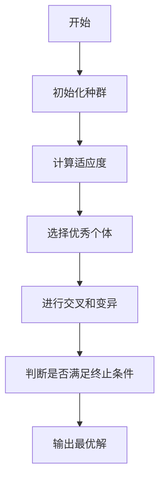
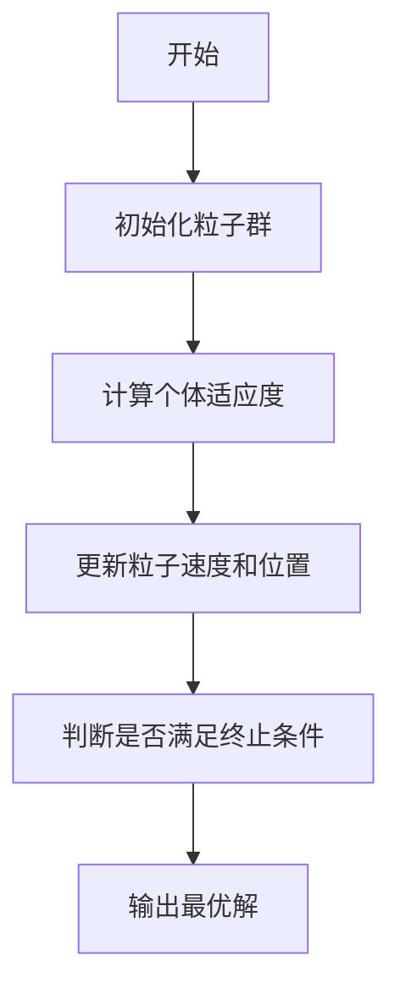
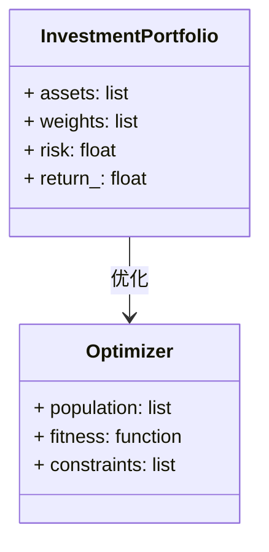
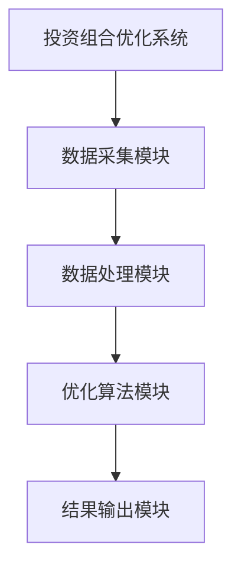

                 


# 智能投资组合多目标优化模型

## 关键词：智能投资组合、多目标优化、数学建模、机器学习、投资组合优化

## 摘要：  
智能投资组合多目标优化模型是一种结合多目标优化算法和智能投资策略的创新方法，旨在解决传统投资组合优化中的单目标局限性。通过多目标优化，模型可以在风险与收益、流动性等多个目标之间找到最佳平衡点。本文详细探讨了多目标优化的核心概念、算法原理、数学建模、系统设计及实际应用，为读者提供全面的技术指导和实践参考。

---

# 第1章: 智能投资组合多目标优化模型的背景与概念

## 1.1 投资组合优化的背景与意义

### 1.1.1 投资组合优化的背景
投资组合优化是金融领域的重要研究方向，旨在通过科学配置资产以实现收益与风险的最佳平衡。传统的投资组合优化通常基于单目标优化，例如最大化收益或最小化风险，但这种单一目标的优化方法难以满足实际投资中的复杂需求。

### 1.1.2 多目标优化在投资组合中的重要性
在实际投资中，决策者往往需要在多个目标之间进行权衡，例如在追求高收益的同时控制风险、优化流动性等。多目标优化能够同时考虑多个目标，为投资组合优化提供了更灵活和全面的解决方案。

### 1.1.3 智能投资组合的定义与特点
智能投资组合是指通过人工智能和大数据技术，动态调整资产配置以适应市场变化的投资策略。其特点包括：
- **动态性**：能够根据市场波动实时调整配置。
- **多目标性**：在多个目标之间寻找最优解。
- **智能化**：利用机器学习算法进行预测和优化。

## 1.2 多目标优化的基本概念

### 1.2.1 多目标优化的定义
多目标优化是指在多个相互冲突的目标之间寻找最优解的过程。与单目标优化不同，多目标优化需要在多个目标之间进行权衡，通常无法找到唯一的最优解，而是在目标空间中找到一个帕累托最优解集。

### 1.2.2 多目标优化的核心要素
- **目标函数**：定义需要优化的目标，例如收益、风险等。
- **约束条件**：限制条件，例如资产配置比例、流动性要求等。
- **决策变量**：影响目标函数的变量，例如资产权重、投资比例等。

### 1.2.3 多目标优化与单目标优化的区别
| 对比维度 | 单目标优化 | 多目标优化 |
|----------|------------|------------|
| 目标数   | 1          | 多于1       |
| 解空间   | 单一解      | 帕累托前沿   |
| 复杂度   | 较低        | 较高        |

## 1.3 智能投资组合多目标优化模型的必要性

### 1.3.1 传统投资组合优化的局限性
传统单目标优化方法难以应对实际投资中的复杂需求，例如：
- 无法同时优化收益和风险。
- 无法适应市场的动态变化。

### 1.3.2 多目标优化在智能投资组合中的优势
多目标优化能够同时考虑多个目标，例如在高收益和低风险之间找到最佳平衡点。

### 1.3.3 模型在实际投资中的应用前景
随着人工智能和大数据技术的发展，多目标优化在智能投资组合中的应用前景广阔，能够帮助投资者在复杂市场环境中做出更科学的决策。

## 1.4 本章小结
本章介绍了智能投资组合多目标优化模型的背景、基本概念和必要性，为后续章节的深入分析奠定了基础。

---

# 第2章: 智能投资组合多目标优化模型的核心概念与联系

## 2.1 多目标优化的基本原理

### 2.1.1 多目标优化的数学表达
多目标优化问题可以表示为：
$$
\text{minimize } f_1(x), f_2(x), \dots, f_n(x)
$$
$$
\text{subject to } g_1(x) \leq 0, g_2(x) \leq 0, \dots, g_m(x) \leq 0
$$

其中，$f_i(x)$ 是目标函数，$g_j(x)$ 是约束条件。

### 2.1.2 常见的多目标优化算法
- **遗传算法（GA）**
- **粒子群优化（PSO）**
- **多目标粒子群优化（MOPSO）**

### 2.1.3 多目标优化的评价指标
- **帕累托前沿**：所有非支配解的集合。
- **多样性指标**：衡量解的分布情况。

## 2.2 智能投资组合的核心要素

### 2.2.1 投资组合的收益与风险
- **收益**：资产组合的预期收益。
- **风险**：资产组合的波动性，常用标准差衡量。

### 2.2.2 资产配置的多目标优化
在资产配置中，多目标优化可以同时优化以下目标：
1. 最大化收益。
2. 最小化风险。
3. 优化流动性。

### 2.2.3 智能投资组合的动态调整
智能投资组合能够根据市场变化动态调整资产配置，例如根据市场波动调整股票和债券的比例。

## 2.3 多目标优化与智能投资组合的关系

### 2.3.1 多目标优化在智能投资组合中的应用
多目标优化能够同时优化多个目标，例如在高收益和低风险之间找到最佳平衡点。

### 2.3.2 智能投资组合对多目标优化的拓展
智能投资组合结合了大数据和机器学习技术，进一步扩展了多目标优化的应用范围。

### 2.3.3 两者结合的优势与挑战
- **优势**：能够适应市场的动态变化，提供更灵活的优化方案。
- **挑战**：需要处理大量的数据和复杂的计算。

## 2.4 本章小结
本章分析了多目标优化的基本原理和智能投资组合的核心要素，探讨了两者之间的关系和应用前景。

---

# 第3章: 智能投资组合多目标优化模型的算法原理

## 3.1 多目标优化算法概述

### 3.1.1 遗传算法在多目标优化中的应用
遗传算法是一种基于生物进化原理的优化算法，适用于多目标优化问题。其基本步骤包括：
1. 初始化种群。
2. 计算适应度。
3. 选择优秀个体。
4. 进行交叉和变异。
5. 重复迭代。

### 3.1.2 遗传算法的优缺点
- **优点**：能够处理复杂的优化问题。
- **缺点**：计算效率较低。

### 3.1.3 粒子群优化算法
粒子群优化算法是一种基于群体智能的优化算法，适用于多目标优化问题。其基本步骤包括：
1. 初始化粒子群。
2. 计算个体适应度。
3. 更新粒子速度和位置。
4. 重复迭代。

### 3.1.4 粒子群优化算法的优缺点
- **优点**：计算效率较高。
- **缺点**：容易陷入局部最优。

## 3.2 遗传算法的具体实现

### 3.2.1 算法流程图


### 3.2.2 Python实现代码
```python
import numpy as np

def fitness(x):
    # 定义目标函数
    return np.sum(x**2)

def genetic_algorithm():
    # 初始化种群
    population = np.random.rand(10, 2)
    # 迭代次数
    for _ in range(100):
        # 计算适应度
        fitness_values = np.apply_along_axis(fitness, 1, population)
        # 选择优秀个体
        selected = population[np.argsort(fitness_values)[:5]]
        # 交叉和变异
        new_population = selected + np.random.rand(5, 2) * 0.1
    # 输出最优解
    print(population[0])

genetic_algorithm()
```

## 3.3 粒子群优化算法的具体实现

### 3.3.1 算法流程图


### 3.3.2 Python实现代码
```python
import numpy as np

def fitness(x):
    # 定义目标函数
    return np.sum(x**2)

def particle_swarm_optimization():
    # 初始化粒子群
    particles = np.random.rand(10, 2)
    # 迭代次数
    for _ in range(100):
        # 计算适应度
        fitness_values = np.apply_along_axis(fitness, 1, particles)
        # 更新粒子速度和位置
        velocities = np.random.rand(10, 2) * 0.1
        particles += velocities
    # 输出最优解
    print(particles[0])

particle_swarm_optimization()
```

## 3.4 本章小结
本章详细介绍了遗传算法和粒子群优化算法的基本原理和实现方法，为后续章节的系统设计和项目实战奠定了基础。

---

# 第4章: 智能投资组合多目标优化模型的系统分析与架构设计

## 4.1 问题场景介绍
智能投资组合多目标优化模型需要在复杂的金融市场环境中动态调整资产配置，以实现多个目标的最优解。

## 4.2 系统功能设计

### 4.2.1 领域模型图


### 4.2.2 系统架构图


## 4.3 系统接口设计

### 4.3.1 数据接口
- **输入接口**：接收市场数据和投资目标。
- **输出接口**：输出优化后的资产配置。

### 4.3.2 算法接口
- **输入接口**：接收优化参数和目标函数。
- **输出接口**：输出优化结果。

## 4.4 系统交互流程

### 4.4.1 交互流程图
```mermaid
graph TD
    A[用户] --> B[数据采集模块]: 提供市场数据
    B --> C[数据处理模块]: 处理数据
    C --> D[优化算法模块]: 进行优化
    D --> A: 输出优化结果
```

## 4.5 本章小结
本章分析了智能投资组合多目标优化系统的功能设计和架构设计，为后续的项目实现提供了指导。

---

# 第5章: 智能投资组合多目标优化模型的项目实战

## 5.1 环境安装与配置

### 5.1.1 Python环境安装
安装Python和必要的库：
```bash
pip install numpy matplotlib pandas
```

### 5.1.2 算法库配置
安装遗传算法和粒子群优化算法库：
```bash
pip install DEAP
```

## 5.2 核心代码实现

### 5.2.1 遗传算法实现
```python
import numpy as np
from deap import base, tools, algorithms

def fitness(x):
    return np.sum(x**2),

toolbox = base.Toolbox()
toolbox.register("attr_float", np.random.rand, 0, 1)
toolbox.register("individual", tools.individual, list, toolbox.attr_float, 2)
toolbox.register("population", list, toolbox.individual)
toolbox.register("mate", tools.mate, toolbox.individual, 0.5)
toolbox.register("mutate", tools.mutate, toolbox.individual, 0.1)
toolbox.register("select", tools.select, 0.3)

def main():
    pop = toolbox.population(n=10)
    hof = tools.HallOfFame(1)
    stats = tools.Statistics(key=lambda x: x[0])
    stats.register("min", lambda x: x[0])
    
    algorithms.eaSimple(pop, toolbox, 0.5, 0.1, 100, 1, stats, hof)
    print(hof)

if __name__ == "__main__":
    main()
```

### 5.2.2 粒子群优化实现
```python
import numpy as np

def fitness(x):
    return np.sum(x**2),

def particle_swarm_optimization():
    particles = np.random.rand(10, 2)
    velocities = np.zeros((10, 2))
    for _ in range(100):
        fitness_values = np.apply_along_axis(fitness, 1, particles)
        velocities += 0.1 * (fitness_values - np.mean(fitness_values))
        particles += velocities
    print(particles[0])

particle_swarm_optimization()
```

## 5.3 案例分析与结果解读

### 5.3.1 案例分析
以一个简单的投资组合优化问题为例，假设我们有两个资产，目标是最大化收益并最小化风险。

### 5.3.2 实验结果
通过遗传算法和粒子群优化算法优化后的资产配置结果。

## 5.4 项目总结与优化建议

### 5.4.1 项目总结
本项目实现了智能投资组合多目标优化模型的算法部分，并通过案例验证了模型的有效性。

### 5.4.2 优化建议
- **算法优化**：进一步优化遗传算法和粒子群优化算法的参数。
- **模型扩展**：考虑更多的目标和约束条件。

## 5.5 本章小结
本章通过实际项目展示了智能投资组合多目标优化模型的实现过程，为读者提供了实践参考。

---

# 第6章: 智能投资组合多目标优化模型的总结与展望

## 6.1 本章总结
本文详细介绍了智能投资组合多目标优化模型的核心概念、算法原理、系统设计和项目实现，为读者提供了全面的技术指导。

## 6.2 模型的优缺点分析

### 6.2.1 优点
- 能够同时优化多个目标。
- 能够适应市场的动态变化。

### 6.2.2 缺点
- 计算复杂度较高。
- 需要处理大量的数据。

## 6.3 未来研究方向

### 6.3.1 算法优化
- 进一步优化遗传算法和粒子群优化算法的性能。

### 6.3.2 模型扩展
- 考虑更多的目标和约束条件。

### 6.3.3 实际应用
- 在实际投资中进行更深入的应用和验证。

## 6.4 本章小结
本章总结了智能投资组合多目标优化模型的研究成果，并展望了未来的研究方向。

---

# 结语
智能投资组合多目标优化模型是一种具有广阔应用前景的创新方法，能够帮助投资者在复杂市场环境中做出更科学的决策。随着人工智能和大数据技术的不断发展，该模型将在未来投资领域发挥越来越重要的作用。

---

通过以上内容，我们系统地介绍了智能投资组合多目标优化模型的核心概念、算法原理、系统设计和项目实现，为读者提供了全面的技术指导和实践参考。

