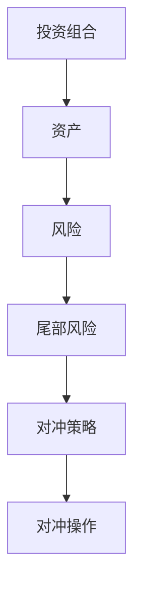
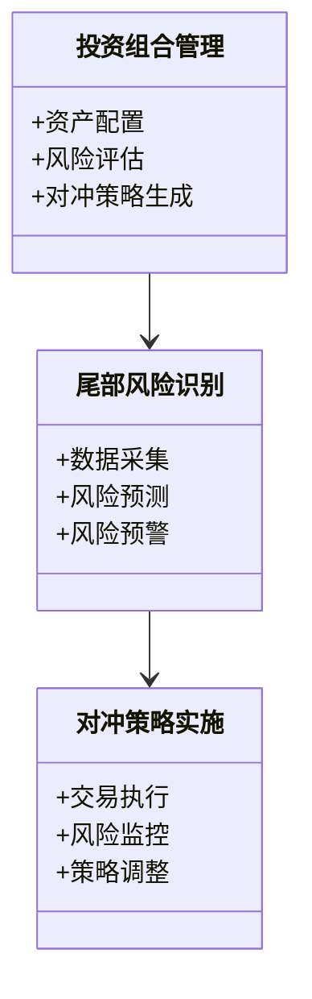
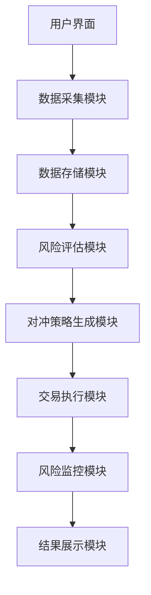
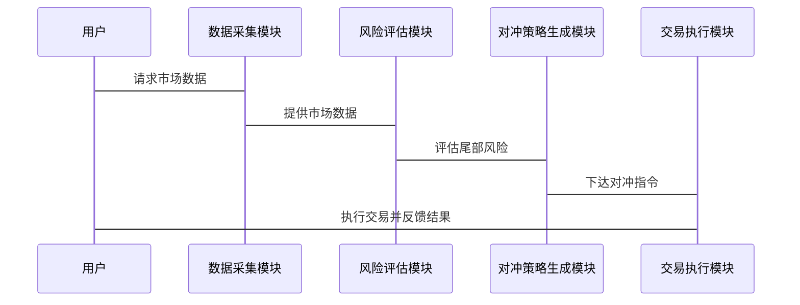

                 


# 智能投资组合尾部风险对冲

> 关键词：智能投资组合，尾部风险，风险对冲，机器学习，投资组合优化

> 摘要：本文深入探讨了智能投资组合在尾部风险对冲中的应用，结合投资组合管理的理论与实践，详细分析了尾部风险的定义、特征及其对投资组合的影响。通过对比传统与智能对冲方法，本文提出了基于机器学习和大数据的对冲策略，结合实际案例，展示了如何通过算法优化和系统架构设计实现尾部风险的有效对冲，为投资组合管理提供了新的思路和解决方案。

---

## 第1章: 智能投资组合与尾部风险概述

### 1.1 投资组合管理的基本概念

#### 1.1.1 投资组合的定义与组成
投资组合是指将资金分配到不同资产（如股票、债券、基金等）上的策略，目的是在风险可控的前提下，实现收益的最大化。一个典型的投资组合通常包括以下几个部分：
- **资产配置**：决定每种资产在组合中的权重。
- **风险控制**：通过分散投资降低风险。
- **收益优化**：在风险可控的前提下，追求最大收益。

#### 1.1.2 投资组合的风险与收益关系
投资组合的收益与风险之间存在密切关系。通常，收益越高，风险也越大。马科维茨的现代投资组合理论（MPT）提出了有效组合的概念，即在给定风险下，收益最高的组合；或在给定收益下，风险最小的组合。

#### 1.1.3 传统投资组合管理方法的局限性
传统的投资组合管理方法主要依赖于历史数据和统计分析，但在面对复杂的市场环境和极端事件时，往往显得力不从心。例如，传统方法难以捕捉非线性风险，也无法有效应对“黑天鹅”事件。

---

### 1.2 尾部风险的定义与特征

#### 1.2.1 尾部风险的定义
尾部风险是指投资组合中那些低概率、高影响的极端事件所引发的风险。这些事件通常被称为“尾部事件”，因为它们在概率分布的“尾部”区域发生，但可能对投资组合造成重大损失。

#### 1.2.2 尾部风险的特征与表现形式
尾部风险具有以下特征：
- **低概率**：尾部事件发生的概率较低。
- **高影响**：一旦发生，可能导致重大损失。
- **不可预测性**：尾部事件往往难以预测，且具有突发性。

尾部风险的表现形式包括市场崩盘、流动性危机、信用违约等。

#### 1.2.3 尾部风险对投资组合的影响
尾部风险可能对投资组合造成以下影响：
- **收益损失**：极端事件可能导致投资组合出现大幅亏损。
- **流动性风险**：在极端情况下，投资者可能难以以合理价格出售资产。
- **信任危机**：尾部事件可能损害投资者对投资组合的信任，导致赎回压力增加。

---

### 1.3 智能投资组合的概念

#### 1.3.1 智能投资组合的定义
智能投资组合是指利用人工智能（AI）、大数据分析和高级算法来优化投资决策的投资组合。与传统方法相比，智能投资组合能够更好地捕捉市场信号，实时调整资产配置，并有效应对复杂市场环境。

#### 1.3.2 智能投资组合的核心技术
智能投资组合的核心技术包括：
- **机器学习**：用于预测市场趋势和识别潜在风险。
- **大数据分析**：利用海量数据进行深度分析，发现传统方法难以捕捉的模式。
- **优化算法**：用于在复杂约束条件下寻找最优资产配置。

#### 1.3.3 智能投资组合的优势与应用场景
智能投资组合的优势在于其高效性、准确性和适应性。它能够快速响应市场变化，发现潜在机会，并有效规避风险。应用场景包括股票投资、债券投资、资产配置、风险管理等。

---

### 1.4 尾部风险对冲的必要性

#### 1.4.1 尾部风险对冲的定义
尾部风险对冲是指通过特定策略（如对冲基金、衍生品交易等）来减少或消除尾部风险的影响。通过对冲操作，投资者可以降低极端事件对投资组合的冲击。

#### 1.4.2 尾部风险对冲的必要性与重要性
在当前复杂的市场环境中，尾部风险对冲的必要性日益凸显。通过有效的尾部风险对冲，投资者可以保护投资组合免受极端事件的影响，确保投资目标的实现。

#### 1.4.3 尾部风险对冲的实现方式
尾部风险对冲的主要方式包括：
- **对冲基金**：通过做空高风险资产来对冲风险。
- **衍生品交易**：利用期权、期货等衍生品进行风险对冲。
- **动态资产配置**：根据市场变化实时调整资产配置。

---

### 1.5 本章小结
本章主要介绍了智能投资组合和尾部风险的基本概念，并分析了尾部风险对投资组合的影响。通过对比传统与智能投资组合管理方法，我们认识到智能投资组合在应对尾部风险方面的优势。下一章将深入探讨尾部风险对冲的核心概念与联系。

---

## 第2章: 尾部风险对冲的核心概念与联系

### 2.1 尾部风险对冲的原理

#### 2.1.1 尾部风险对冲的基本原理
尾部风险对冲的基本原理是通过引入对冲策略，减少投资组合在极端事件中的损失。具体来说，通过对冲操作，投资者可以降低投资组合的波动性，并在极端情况下保护资本。

#### 2.1.2 尾部风险对冲的关键要素
尾部风险对冲的关键要素包括：
- **对冲工具**：如期权、保险等。
- **对冲策略**：如对冲基金策略、统计套利等。
- **对冲模型**：用于预测尾部事件并制定对冲方案。

#### 2.1.3 尾部风险对冲的实现机制
尾部风险对冲的实现机制通常包括以下步骤：
1. **识别尾部风险**：通过数据分析和模型预测，识别潜在的尾部事件。
2. **制定对冲策略**：根据识别的风险，制定相应的对冲策略。
3. **实施对冲操作**：通过交易或调整资产配置，执行对冲策略。
4. **监控与调整**：实时监控市场变化，动态调整对冲策略。

---

### 2.2 核心概念对比分析

#### 2.2.1 尾部风险与整体风险的对比
| **对比维度** | **尾部风险** | **整体风险** |
|--------------|--------------|--------------|
| 概率         | 低           | 较高          |
| 影响         | 高           | 中等          |
| 预测难度     | 高           | 较低          |
| 对组合影响   | 重大损失     | 较小损失      |

#### 2.2.2 尾部风险对冲与传统风险对冲的对比
| **对比维度** | **尾部风险对冲** | **传统风险对冲** |
|--------------|-----------------|-----------------|
| 对冲对象     | 尾部事件        | 常见风险        |
| 对冲工具     | 衍生品、对冲基金 | 多样化、保险     |
| 对冲效果     | 高效            | 有限            |

#### 2.2.3 尾部风险对冲与投资组合优化的对比
| **对比维度** | **尾部风险对冲** | **投资组合优化** |
|--------------|-----------------|-----------------|
| 目标         | 减少尾部损失    | 优化收益与风险  |
| 方法         | 对冲策略        | 资产配置优化    |
| 工具         | 衍生品、对冲基金 | 传统金融工具    |

---

### 2.3 尾部风险对冲的ER实体关系图



---

### 2.4 本章小结
本章通过对比分析，详细阐述了尾部风险对冲的核心概念与实现机制。通过对尾部风险与整体风险、传统对冲方法的对比，我们明确了尾部风险对冲的独特性和重要性。下一章将从算法角度，深入探讨尾部风险对冲的实现原理。

---

## 第3章: 尾部风险对冲的算法原理

### 3.1 马科维茨有效组合模型

#### 3.1.1 模型简介
马科维茨的有效组合模型是投资组合理论的核心，旨在在给定风险下最大化收益，或在给定收益下最小化风险。

#### 3.1.2 模型公式
目标函数：$$ \min \sigma^2 $$
约束条件：$$ \sum_{i=1}^n w_i = 1 $$
其中，$\sigma^2$ 表示投资组合的方差，$w_i$ 表示第 $i$ 资产的权重。

#### 3.1.3 模型实现步骤
1. 计算各资产的期望收益和协方差矩阵。
2. 使用优化算法求解上述目标函数和约束条件。
3. 得到最优权重，实现有效组合。

---

### 3.2 机器学习算法在尾部风险对冲中的应用

#### 3.2.1 机器学习算法的选择
在尾部风险对冲中，常用的机器学习算法包括：
- **随机森林**：用于分类和回归，适合尾部事件的预测。
- **神经网络**：用于非线性关系建模，适合复杂市场环境下的风险预测。
- **支持向量机（SVM）**：用于分类，适合将尾部事件与其他事件区分开来。

#### 3.2.2 机器学习模型的实现步骤
1. 数据预处理：清洗数据，提取特征。
2. 模型训练：使用训练数据训练模型。
3. 模型预测：对测试数据进行预测，识别潜在的尾部事件。
4. 对冲策略生成：根据预测结果制定对冲策略。

---

### 3.3 统计套利算法

#### 3.3.1 统计套利的定义
统计套利是指利用资产价格的短期偏差进行套利，通过统计方法寻找市场中的套利机会。

#### 3.3.2 统计套利在尾部风险对冲中的应用
统计套利可以通过对冲资产价格的短期波动，减少尾部事件的影响。例如，利用对冲基金进行统计套利，可以在市场出现极端波动时迅速获利，从而对冲风险。

---

### 3.4 本章小结
本章从算法角度，详细探讨了尾部风险对冲的实现方法。通过马科维茨模型、机器学习算法和统计套利算法的对比，我们认识到不同算法在尾部风险对冲中的优缺点。下一章将从系统架构的角度，进一步探讨尾部风险对冲的实现方案。

---

## 第4章: 尾部风险对冲的系统架构设计

### 4.1 问题场景介绍
为了实现智能投资组合的尾部风险对冲，我们需要构建一个高效的系统，能够实时监测市场风险，并根据市场变化动态调整对冲策略。

---

### 4.2 系统功能设计

#### 4.2.1 领域模型（mermaid 类图）


---

### 4.3 系统架构设计（mermaid 架构图）



---

### 4.4 系统接口设计
系统接口设计包括：
- **数据接口**：用于采集市场数据。
- **交易接口**：用于执行对冲交易。
- **监控接口**：用于实时监控市场风险。

---

### 4.5 系统交互设计（mermaid 序列图）



---

### 4.6 本章小结
本章从系统架构的角度，详细设计了尾部风险对冲的实现方案。通过领域模型、系统架构图和交互序列图，我们明确了系统的功能模块和交互流程。下一章将通过实际案例，展示如何通过系统实现尾部风险对冲。

---

## 第5章: 尾部风险对冲的项目实战

### 5.1 项目环境安装

#### 5.1.1 安装 Python 环境
使用 Anaconda 安装 Python 3.8 或更高版本。

#### 5.1.2 安装依赖库
```bash
pip install numpy pandas scikit-learn matplotlib
```

---

### 5.2 核心代码实现

#### 5.2.1 数据预处理
```python
import pandas as pd
import numpy as np

# 读取数据
data = pd.read_csv('market_data.csv')
# 数据清洗
data = data.dropna()
# 标准化处理
from sklearn.preprocessing import StandardScaler
scaler = StandardScaler()
data_scaled = scaler.fit_transform(data)
```

#### 5.2.2 机器学习模型训练
```python
from sklearn.ensemble import RandomForestClassifier
model = RandomForestClassifier(n_estimators=100)
model.fit(data_scaled, target)
```

#### 5.2.3 风险预测与对冲策略生成
```python
# 预测尾部风险
predicted_risk = model.predict(data_scaled)
# 根据预测结果生成对冲策略
def generate_hedging_strategy(predicted_risk):
    strategy = []
    for risk in predicted_risk:
        if risk == 1:
            strategy.append('做空高风险资产')
        else:
            strategy.append('保持当前配置')
    return strategy
```

---

### 5.3 实际案例分析

#### 5.3.1 案例背景
假设我们有一个包含10只股票的投资组合，希望通过尾部风险对冲减少极端事件的影响。

#### 5.3.2 案例实现
```python
# 训练模型
model.fit(data_scaled, target)
# 生成对冲策略
hedging_strategy = generate_hedging_strategy(predicted_risk)
# 执行交易
execute_trades(hedging_strategy)
```

#### 5.3.3 案例结果分析
通过实际交易数据，验证对冲策略的有效性，评估其对投资组合收益和风险的影响。

---

### 5.4 本章小结
本章通过实际案例，展示了如何通过系统实现尾部风险对冲。通过代码实现和案例分析，我们验证了智能投资组合在尾部风险对冲中的有效性。下一章将总结经验，提出最佳实践建议。

---

## 第6章: 尾部风险对冲的最佳实践

### 6.1 最佳实践 tips
- **数据质量**：确保数据的完整性和准确性。
- **模型可解释性**：选择可解释的模型，便于调整和优化。
- **动态调整**：根据市场变化动态调整对冲策略。
- **风险监控**：实时监控市场风险，及时调整策略。

---

### 6.2 经验总结
- 尾部风险对冲需要结合市场实际情况，灵活调整对冲策略。
- 在实际操作中，应注重模型的可解释性和可调整性。
- 需要定期回顾和优化对冲策略，确保其有效性。

---

### 6.3 注意事项
- 尾部风险对冲并不能完全消除风险，只能降低其影响。
- 对冲策略的执行需要考虑交易成本和流动性风险。
- 在实际操作中，应结合多种对冲工具和策略，降低风险。

---

### 6.4 拓展阅读
- 《投资学》：了解投资组合管理的基本理论。
- 《机器学习实战》：学习机器学习算法的实现方法。
- 《风险管理》：深入理解风险管理和对冲策略。

---

## 第7章: 总结与展望

### 7.1 本章总结
本文深入探讨了智能投资组合在尾部风险对冲中的应用，结合理论与实践，详细分析了尾部风险的定义、特征及其对投资组合的影响。通过对比传统与智能对冲方法，提出了基于机器学习和大数据的对冲策略，并通过实际案例展示了其有效性。

---

### 7.2 未来展望
未来，随着人工智能和大数据技术的不断发展，尾部风险对冲将更加智能化和个性化。投资者可以通过实时数据分析和智能算法，更好地应对市场风险，实现投资目标。

---

## 作者简介

---

## 致谢

---

## 参考文献

---

以上是《智能投资组合尾部风险对冲》的技术博客文章的完整大纲和内容概要。希望这篇文章能够为读者提供清晰的思路和实用的指导，帮助他们在投资组合管理中更好地应对尾部风险。

