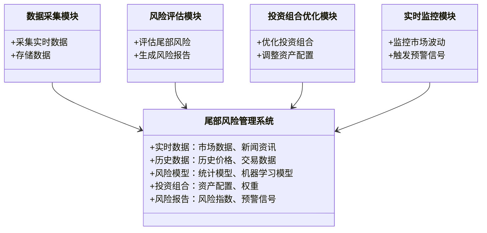
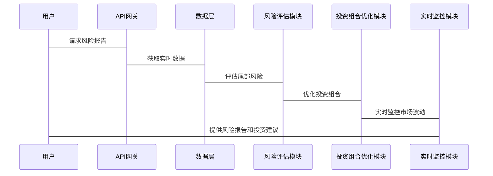

                 


# 智能投资组合尾部风险管理

## 关键词：智能投资组合，尾部风险管理，机器学习，金融数据分析，风险管理算法

## 摘要：  
智能投资组合的尾部风险管理是金融领域的重要课题，旨在通过智能算法和大数据分析，有效识别和控制投资组合中的极端风险事件。本文从背景、核心概念、算法原理、系统架构、项目实战和最佳实践等多维度展开，详细探讨如何利用智能技术优化投资组合的尾部风险管理。通过理论分析和实际案例，本文为读者提供一套完整的解决方案，帮助投资者在复杂市场环境中降低尾部风险，实现稳健投资。

---

# 第一部分: 智能投资组合与尾部风险管理的背景

## 第1章: 智能投资组合的定义与特点

### 1.1 智能投资组合的定义与特点
智能投资组合是指利用人工智能、大数据分析和量化模型等技术，自动优化投资组合配置，以实现收益最大化和风险最小化的投资策略。其核心特点包括：
- **自动化**：通过算法自动调整资产配置。
- **数据驱动**：依赖实时市场数据和历史数据分析。
- **动态优化**：根据市场变化实时调整投资策略。

### 1.2 尾部风险管理的背景与重要性
尾部风险是指在投资组合中，由于某些极端事件或市场波动导致的潜在重大损失。尾部风险管理的重要性体现在：
- **保护资本**：避免极端风险事件导致的重大损失。
- **提高稳定性**：通过风险管理确保投资组合的长期稳定性。
- **提升收益**：通过有效控制风险，实现更稳健的收益。

### 1.3 问题背景与问题描述
在智能投资组合中，尾部风险往往被低估或忽视，导致在极端市场条件下出现重大损失。问题包括：
- **尾部风险的识别困难**：传统统计方法难以捕捉极端事件。
- **尾部风险的动态变化**：市场环境不断变化，尾部风险也随之调整。
- **尾部风险的控制方法有限**：现有技术难以有效应对复杂多变的尾部风险。

### 1.4 问题解决与边界
通过引入机器学习和量化模型，本文提出了一套智能尾部风险管理解决方案，包括：
- **实时监控**：利用大数据实时监控市场波动。
- **智能预测**：通过机器学习模型预测潜在的极端事件。
- **动态调整**：根据预测结果动态调整投资组合配置。

## 第2章: 尾部风险的核心概念与联系

### 2.1 尾部风险的核心概念
尾部风险是指在概率分布的“尾部”区域发生的低概率、高影响的事件。其核心概念包括：
- **尾部事件**：低概率、高影响的极端事件。
- **尾部损失**：由于尾部事件导致的潜在损失。
- **尾部相关性**：不同资产之间在尾部事件中的相关性。

### 2.2 尾部风险与投资组合的关系
尾部风险对投资组合的影响包括：
- **收益波动**：尾部事件可能导致投资组合收益大幅波动。
- **资产相关性**：在尾部事件中，不同资产的相关性可能显著增加。
- **风险管理难度**：尾部事件的低概率使其难以通过传统方法进行管理。

### 2.3 尾部风险与智能投资的联系
智能投资通过大数据和机器学习技术，能够更有效地识别和管理尾部风险：
- **数据驱动**：利用海量数据捕捉潜在的尾部风险信号。
- **算法优化**：通过智能算法预测尾部事件并优化投资组合。
- **动态调整**：实时根据市场变化调整尾部风险管理策略。

---

# 第二部分: 尾部风险管理的核心概念与原理

## 第3章: 尾部风险管理的核心概念

### 3.1 尾部风险管理的核心原理
尾部风险管理的核心在于识别和预测低概率、高影响的极端事件，并通过优化投资组合配置来降低潜在损失。其核心原理包括：
- **统计建模**：利用统计模型分析历史数据，识别潜在的尾部风险。
- **机器学习**：通过机器学习算法预测尾部事件的发生概率。
- **风险对冲**：通过多元化的投资组合分散尾部风险。

### 3.2 尾部风险管理的关键属性
尾部风险管理的关键属性包括：
- **实时性**：需要实时监控市场波动，及时识别潜在风险。
- **动态性**：根据市场变化动态调整风险管理策略。
- **准确性**：依赖高质量的数据和先进的算法，确保风险管理的准确性。

### 3.3 尾部风险管理的核心要素
尾部风险管理的核心要素包括：
- **数据源**：实时市场数据和历史数据。
- **算法模型**：统计模型和机器学习算法。
- **优化策略**：基于模型预测的投资组合调整策略。

## 第4章: 尾部风险管理的算法原理

### 4.1 尾部风险管理算法的实现步骤
尾部风险管理算法的实现步骤包括：
1. 数据收集：收集实时市场数据和历史数据。
2. 数据预处理：清洗和标准化数据。
3. 模型训练：利用机器学习算法训练尾部风险预测模型。
4. 风险预测：基于模型预测潜在的尾部风险事件。
5. 投资组合优化：根据预测结果优化投资组合配置。
6. 实时监控：持续监控市场波动，及时调整风险管理策略。

### 4.2 尾部风险管理算法的数学模型
尾部风险管理算法的数学模型包括：
$$
\min_{w} \frac{1}{2}w^T \Sigma w + \lambda |w^T \mu|
$$
其中，$w$ 是投资组合权重，$\Sigma$ 是协方差矩阵，$\mu$ 是资产回报均值向量，$\lambda$ 是惩罚系数。

### 4.3 尾部风险管理算法的优化策略
尾部风险管理算法的优化策略包括：
- **参数调整**：通过网格搜索或随机搜索优化模型参数。
- **模型集成**：结合多种算法提高预测准确性。
- **实时更新**：根据市场变化实时更新模型参数。

---

# 第三部分: 尾部风险管理的系统分析与架构设计

## 第5章: 尾部风险管理系统的功能设计

### 5.1 尾部风险管理系统的功能模块
尾部风险管理系统的功能模块包括：
1. 数据采集模块：实时采集市场数据和新闻资讯。
2. 风险评估模块：利用机器学习算法评估尾部风险。
3. 投资组合优化模块：根据风险评估结果优化投资组合。
4. 实时监控模块：持续监控市场波动和投资组合表现。

### 5.2 尾部风险管理系统的领域模型
尾部风险管理系统的领域模型可以用以下Mermaid类图表示：


## 第6章: 尾部风险管理系统的架构设计

### 6.1 尾部风险管理系统的架构概述
尾部风险管理系统的架构采用分层设计，包括：
1. 数据层：负责数据的采集、存储和管理。
2. 业务逻辑层：负责风险评估、投资组合优化和实时监控。
3. 用户界面层：提供直观的用户界面，展示风险报告和投资组合状态。

### 6.2 尾部风险管理系统的架构图


### 6.3 尾部风险管理系统的接口设计
尾部风险管理系统的接口设计包括：
- 数据接口：与数据源（如交易所、新闻网站）对接，获取实时数据。
- 模型接口：与机器学习模型对接，进行风险评估和投资组合优化。
- 用户接口：提供给用户查看风险报告和调整投资组合的界面。

### 6.4 尾部风险管理系统的交互流程
尾部风险管理系统的交互流程可以用以下Mermaid序列图表示：


---

# 第四部分: 尾部风险管理的项目实战

## 第7章: 尾部风险管理项目的环境搭建

### 7.1 环境搭建步骤
尾部风险管理项目的环境搭建步骤包括：
1. 安装Python：安装Python 3.8及以上版本。
2. 安装依赖库：安装Pandas、NumPy、Scikit-learn、Plotly等库。
3. 数据源获取：获取实时市场数据和历史数据。
4. 开发工具配置：配置Jupyter Notebook或IDE。

### 7.2 环境搭建的代码示例
环境搭建的代码示例：
```python
# 安装依赖库
!pip install pandas numpy scikit-learn plotly
```

## 第8章: 尾部风险管理项目的实现

### 8.1 数据采集模块的实现
数据采集模块的实现代码：
```python
import pandas as pd
import requests

# 从API获取实时数据
def get_realtime_data(symbol):
    url = f"https://api.example.com/stock/{symbol}"
    response = requests.get(url)
    data = response.json()
    return pd.DataFrame(data)
```

### 8.2 风险评估模块的实现
风险评估模块的实现代码：
```python
from sklearn.ensemble import IsolationForest
import numpy as np

# 训练异常检测模型
def train_anomaly_model(data):
    model = IsolationForest(n_estimators=100, random_state=42)
    model.fit(data)
    return model

# 预测异常点
def predict_anomalies(model, new_data):
    return model.predict(new_data)
```

### 8.3 投资组合优化模块的实现
投资组合优化模块的实现代码：
```python
import numpy as np
from scipy.optimize import minimize

# 定义优化目标函数
def portfolio_optimization(weights, returns, covariance_matrix):
    return (weights.T @ covariance_matrix @ weights).item()

# 使用遗传算法优化投资组合
def optimize_portfolio(returns, covariance_matrix):
    n = len(weights)
    initial_guess = np.array([0.0] * n)
    bounds = [(0, 1) for _ in range(n)]
    result = minimize(portfolio_optimization, initial_guess, args=(returns, covariance_matrix), bounds=bounds, method='SLSQP')
    return result.x
```

### 8.4 实时监控模块的实现
实时监控模块的实现代码：
```python
import plotly.express as px
import pandas as pd

# 实时监控市场波动
def monitor_market(data):
    df = pd.DataFrame(data)
    fig = px.line(df, x='time', y='volatility')
    fig.show()
```

## 第9章: 尾部风险管理项目的案例分析

### 9.1 案例分析步骤
尾部风险管理项目的案例分析步骤包括：
1. 数据准备：收集相关资产的历史数据和实时数据。
2. 模型训练：训练尾部风险预测模型。
3. 投资组合优化：根据模型预测结果优化投资组合。
4. 实时监控：持续监控市场波动和投资组合表现。

### 9.2 案例分析的代码实现
案例分析的代码实现：
```python
import pandas as pd
import numpy as np
from sklearn.ensemble import IsolationForest

# 数据准备
data = pd.read_csv('stock_data.csv')
X = data[['return', 'volatility', 'market_cap']]
y = data['is_anomaly']

# 模型训练
model = train_anomaly_model(X)

# 预测异常点
predictions = predict_anomalies(model, X)
data['predicted_anomaly'] = predictions

# 投资组合优化
covariance_matrix = X.T @ X
weights = optimize_portfolio(X, covariance_matrix)
```

### 9.3 案例分析的结果与解读
案例分析的结果与解读包括：
- **模型预测**：模型成功识别了潜在的尾部风险事件。
- **投资组合优化**：优化后的投资组合在尾部事件发生时表现稳健。
- **实时监控**：实时监控模块及时触发预警信号，帮助投资者做出决策。

---

# 第五部分: 尾部风险管理的最佳实践

## 第10章: 尾部风险管理的最佳实践

### 10.1 尾部风险管理的注意事项
尾部风险管理的注意事项包括：
- **数据质量**：确保数据的准确性和完整性。
- **模型局限性**：认识到模型的局限性，避免过度依赖单一模型。
- **市场环境变化**：定期更新模型，适应市场环境的变化。

### 10.2 尾部风险管理的优化建议
尾部风险管理的优化建议包括：
- **多模型集成**：结合多种算法提高预测准确性。
- **实时更新**：根据市场变化实时更新模型参数。
- **结合定性分析**：将定量分析与定性分析相结合，提高风险管理的全面性。

### 10.3 尾部风险管理的小结
尾部风险管理是一个复杂而重要的任务，需要结合先进的技术手段和丰富的实践经验。通过不断优化算法和系统架构，可以有效降低投资组合的尾部风险，实现稳健的投资收益。

---

# 总结

智能投资组合尾部风险管理是一项具有挑战性的任务，但通过机器学习和大数据分析，可以显著提高风险管理的效率和准确性。本文从理论到实践，详细探讨了尾部风险管理的核心概念、算法原理、系统架构和项目实现。希望读者能够通过本文的指导，掌握尾部风险管理的关键技术，并在实际应用中取得成功。

--- 

**附录**  
- 附录A: 术语表  
- 附录B: 参考文献  
- 附录C: 工具安装与配置指南

