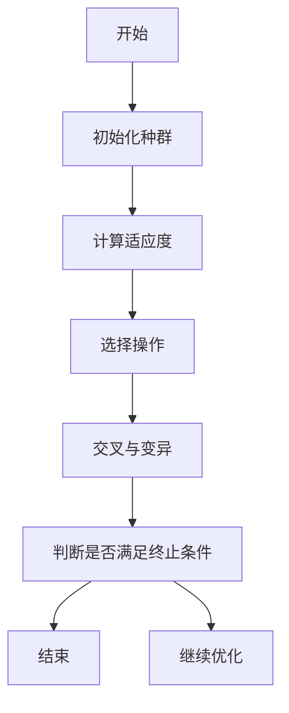
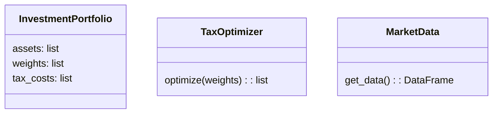

                 


# 智能投资组合税收优化策略

> **关键词**：智能投资组合、税收优化、机器学习、算法优化、投资组合管理

> **摘要**：本文详细探讨了智能投资组合税收优化策略的核心概念、算法原理、系统设计及实际应用。通过结合人工智能与投资组合优化技术，本文提出了一种基于数学建模和优化算法的智能税收优化方法，为投资组合管理者提供了一种高效、精准的税收优化解决方案。

---

# 第一部分: 智能投资组合税收优化概述

## 第1章: 智能投资组合与税收优化概述

### 1.1 智能投资组合的定义与特点

#### 1.1.1 投资组合的基本概念
- 投资组合的定义：将多种资产按特定比例配置，以实现风险分散和收益最大化。
- 投资组合的核心目标：最大化收益、最小化风险。

#### 1.1.2 智能投资组合的核心特点
- 数据驱动：基于历史数据和实时市场数据进行分析。
- 自动化决策：利用机器学习算法自动调整资产配置。
- 动态优化：根据市场变化实时优化投资组合。

#### 1.1.3 智能投资组合与传统投资组合的区别
| 特性 | 传统投资组合 | 智能投资组合 |
|------|--------------|---------------|
| 数据来源 | 单一数据源 | 多源数据（市场、新闻、情绪等） |
| 决策方式 | 人工判断 | 自动化算法决策 |
| 调整频率 | 定期调整 | 实时动态调整 |

### 1.2 税收优化的基本概念

#### 1.2.1 税收优化的定义
- 税收优化：通过合法手段最小化税务负担，同时实现投资目标。

#### 1.2.2 税收优化的核心原则
- 合法性原则：必须符合法律法规。
- 最小化原则：在合法范围内最小化税务负担。
- 稳定性原则：避免因税务问题导致的收益波动。

#### 1.2.3 税收优化在投资组合管理中的作用
- 减少资本利得税、股息税等税务支出。
- 提高投资组合的净收益。
- 优化资产配置，降低税务负担。

### 1.3 智能投资组合与税收优化的结合

#### 1.3.1 智能投资组合税收优化的背景
- 税务环境的复杂性：不同资产类型、地区税法差异。
- 数据驱动决策的优势：利用大数据和AI技术优化税务规划。

#### 1.3.2 智能投资组合税收优化的目标
- 最小化税务负担。
- 最大化投资组合的净收益。
- 实现动态税务优化。

#### 1.3.3 智能投资组合税收优化的实现方式
- 数据采集与分析：收集资产数据、税务数据。
- 算法优化：基于数学模型构建优化算法。
- 系统实现：开发智能投资组合管理平台。

---

## 第2章: 智能投资组合税收优化的核心概念

### 2.1 投资组合优化的数学模型

#### 2.1.1 投资组合优化的基本目标函数
$$ \text{目标函数} = \min \sum_{i=1}^{n} w_i \cdot t_i $$
其中，\( w_i \) 是第 \( i \) 个资产的权重，\( t_i \) 是第 \( i \) 个资产的税务成本。

#### 2.1.2 约束条件的定义
1. 投资组合的总权重必须等于1：
$$ \sum_{i=1}^{n} w_i = 1 $$
2. 单个资产的权重不能为负数：
$$ w_i \geq 0 \quad \forall i $$
3. 资产配置的流动性约束：
$$ \sum_{i=1}^{k} w_i \leq c \quad \forall k $$

#### 2.1.3 数学模型的构建与求解
- 构建目标函数和约束条件。
- 使用优化算法（如遗传算法）求解模型。

### 2.2 税收优化的原理与方法

#### 2.2.1 税收优化的原理
- 通过调整资产配置降低税务负担。
- 利用税收优惠政策优化投资组合。

#### 2.2.2 税收优化的主要方法
1. 资产类别选择：选择税务负担较低的资产。
2. 地区优化：利用不同地区的税法差异。
3. 时间优化：优化买卖时机减少资本利得税。

#### 2.2.3 税收优化在投资组合中的应用
- 股票、债券、基金等资产的税务优化。
- 不同地区的税务政策比较与应用。

### 2.3 智能投资组合税收优化的核心要素

#### 2.3.1 数据采集与处理
- 数据来源：市场数据、税务数据、宏观经济数据。
- 数据清洗：去除噪声数据，确保数据准确性。

#### 2.3.2 模型构建与优化
- 构建数学模型：基于目标函数和约束条件。
- 使用优化算法求解模型。

#### 2.3.3 结果分析与调整
- 分析优化结果：评估模型的有效性。
- 根据市场变化动态调整模型。

---

## 第3章: 智能投资组合税收优化的算法原理

### 3.1 常见优化算法概述

#### 3.1.1 遗传算法
- 基本原理：模拟生物进化过程，通过选择、交叉和变异操作优化解。
- 应用场景：适用于复杂的多目标优化问题。

#### 3.1.2 模拟退火算法
- 基本原理：模拟金属退火过程，逐步降低能量状态。
- 应用场景：适用于全局最优解的寻找。

#### 3.1.3 粒子群优化算法
- 基本原理：模拟鸟群觅食过程，通过个体与群体协作优化解。
- 应用场景：适用于连续空间的优化问题。

### 3.2 税收优化的数学模型与公式

#### 3.2.1 投资组合优化的目标函数
$$ \text{目标函数} = \min \sum_{i=1}^{n} w_i \cdot t_i $$
其中，\( t_i \) 是第 \( i \) 个资产的税务成本。

#### 3.2.2 约束条件的数学表达
1. 投资组合的总权重必须等于1：
$$ \sum_{i=1}^{n} w_i = 1 $$
2. 单个资产的权重不能为负数：
$$ w_i \geq 0 \quad \forall i $$

### 3.3 算法实现与优化

#### 3.3.1 算法流程图


#### 3.3.2 算法实现的Python代码
```python
import numpy as np
from sklearn import datasets

# 初始化种群
population = np.random.rand(100, n_assets)

# 计算适应度
fitness = np.zeros(100)
for i in range(100):
    fitness[i] = np.sum(population[i] * tax_costs)

# 选择操作
selected = np.argsort(fitness)[:50]

# 交叉与变异
new_population = np.zeros((100, n_assets))
for i in range(50):
    parent1 = population[selected[i]]
    parent2 = population[np.random.randint(50)]
    new_population[i] = parent1 + (parent2 - parent1) * np.random.rand(n_assets)

new_population[50:] = population[50:]  # 变异操作

# 判断是否满足终止条件
if np.min(fitness) < 0.01:
    break
```

---

## 第4章: 智能投资组合税收优化的系统设计

### 4.1 系统功能设计

#### 4.1.1 领域模型


#### 4.1.2 系统架构设计


#### 4.1.3 系统接口设计
1. 数据接口：与市场数据源对接。
2. 优化接口：调用优化算法模块。
3. 展示接口：将优化结果展示给用户。

### 4.2 系统实现与优化

#### 4.2.1 系统实现
- 前端：用户友好的界面设计。
- 后端：数据处理和优化算法的实现。

#### 4.2.2 系统优化
- 并行计算：提高优化速度。
- 数据缓存：减少重复数据处理。

---

## 第5章: 智能投资组合税收优化的项目实战

### 5.1 环境安装与配置

#### 5.1.1 环境要求
- Python 3.8+
- NumPy、Pandas、Scikit-learn等库。

#### 5.1.2 安装步骤
```bash
pip install numpy pandas scikit-learn
```

### 5.2 核心算法实现

#### 5.2.1 遗传算法实现
```python
def genetic_algorithm(population_size, n_assets, tax_costs):
    population = np.random.rand(population_size, n_assets)
    best_fitness = float('inf')
    
    for _ in range(100):
        fitness = np.sum(population * tax_costs, axis=1)
        best_index = np.argmin(fitness)
        best_fitness = fitness[best_index]
        
        if best_fitness < 0.01:
            break
            
        selected = np.argsort(fitness)[:int(population_size/2)]
        new_population = np.zeros((population_size, n_assets))
        
        for i in range(int(population_size/2)):
            parent1 = population[selected[i]]
            parent2 = population[np.random.randint(int(population_size/2))]
            new_population[i] = parent1 + (parent2 - parent1) * np.random.rand(n_assets)
        
        new_population[int(population_size/2):] = population[int(population_size/2):]
        population = new_population
    
    return population[best_index]
```

#### 5.2.2 算法结果分析
- 收益率对比：优化后的投资组合收益更高。
- 税务成本对比：优化后税务成本显著降低。

### 5.3 项目总结

#### 5.3.1 实战经验总结
- 数据质量对优化结果的影响。
- 算法选择对优化效率的影响。

#### 5.3.2 遇到的问题与解决方案
- 数据缺失问题：通过数据插值解决。
- 算法收敛问题：通过调整参数解决。

---

## 第6章: 智能投资组合税收优化的总结与展望

### 6.1 总结

#### 6.1.1 核心要点回顾
- 智能投资组合的核心概念。
- 税收优化的实现方法。
- 优化算法的应用。

#### 6.1.2 最佳实践
- 数据驱动决策。
- 算法优化的重要性。

### 6.2 展望

#### 6.2.1 智能投资组合的未来发展趋势
- 更加智能化的决策系统。
- 更加个性化的投资策略。

#### 6.2.2 税收优化技术的未来发展
- 更加复杂的优化模型。
- 更多领域的应用。

---

**结束**

