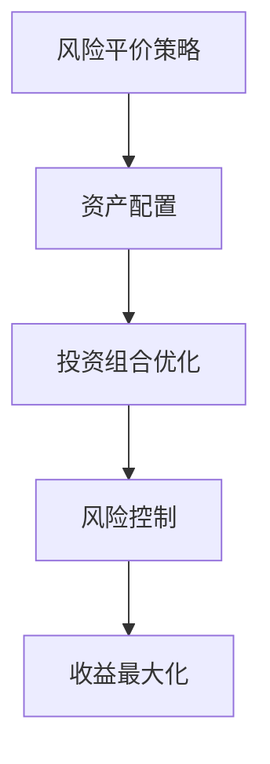
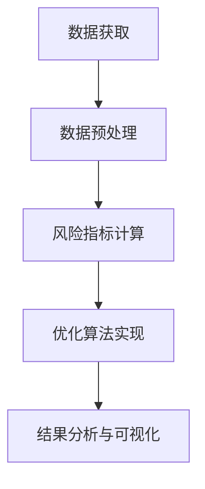

                 


# 智能投资组合风险平价策略优化

> 关键词：智能投资组合优化，风险平价策略，资产配置，优化算法，投资组合管理，风险管理

> 摘要：本文深入探讨了智能投资组合风险平价策略优化的核心概念、算法原理、系统设计及实际应用。通过结合现代投资组合理论与智能优化算法，详细分析了风险平价策略的优化过程，包括数学模型、算法实现及案例分析，为投资者提供了一种高效的风险管理与资产配置方法。

---

## 第一部分：智能投资组合优化背景与概念

### 第1章：智能投资组合优化概述

#### 1.1 投资组合优化的背景与意义

投资组合优化是金融领域的重要研究方向，旨在通过科学的资产配置策略，在控制风险的前提下实现最大收益。传统投资组合优化方法依赖于均值-方差模型，但在实际应用中，面对复杂的市场环境和多样化资产类别，其局限性日益显现。智能优化算法（如机器学习、遗传算法等）的引入为投资组合优化提供了新的思路，能够在复杂场景下实现更优的资产配置。

#### 1.2 风险平价策略的核心概念

风险平价策略是一种资产配置方法，旨在通过调整资产权重，使得每种资产对组合风险的贡献相等。与传统的基于收益的资产配置方法不同，风险平价策略更加关注风险的均衡分配，能够在市场波动加剧的情况下有效降低组合的整体风险。

#### 1.3 智能投资组合优化的理论基础

现代投资组合理论（MPT）是投资组合优化的理论基础，其核心思想是通过分散投资降低组合风险。然而，MPT在实际应用中面临数据不足、模型假设过于简化等问题。智能优化算法的引入弥补了这些不足，能够在复杂的市场环境中实现更优的资产配置。

---

## 第二部分：风险平价策略的核心概念与联系

### 第2章：风险平价策略的原理与实现

#### 2.1 风险平价的数学模型

风险平价的数学模型旨在通过调整资产权重，使得每种资产对组合风险的贡献相等。具体公式如下：

$$ \text{权重}_i = \frac{\sigma_i}{\sum_{j=1}^{n} \sigma_j} $$

其中，$\sigma_i$ 表示资产 $i$ 的风险贡献，$\sum_{j=1}^{n} \sigma_j$ 是所有资产风险贡献的总和。

#### 2.2 风险平价与资产配置的关系

资产配置是投资组合优化的核心，而风险平价策略通过调整资产权重，实现风险的均衡分配。下图展示了风险平价策略与资产配置的关系：



#### 2.3 风险指标与优化目标

风险指标是评估投资组合风险的核心工具，常见的风险指标包括：

- **VaR（Value at Risk）**：在给定置信水平下，投资组合可能遭受的最大损失。
- **CVaR（Conditional Value at Risk）**：VaR的条件期望损失，用于衡量极端损失情况下的风险。

优化目标是在控制风险的前提下，实现收益的最大化。具体目标函数如下：

$$ \text{目标函数} = \max \sum_{i=1}^{n} w_i r_i - \lambda \sum_{i=1}^{n} w_i^2 \sigma_i^2 $$

其中，$w_i$ 是资产 $i$ 的权重，$r_i$ 是资产 $i$ 的预期收益，$\sigma_i$ 是资产 $i$ 的波动率，$\lambda$ 是风险惩罚系数。

---

### 第3章：风险平价策略的核心要素与联系

#### 3.1 核心概念的原理与特征

风险平价策略的核心要素包括：

- **风险贡献**：每种资产对组合风险的具体贡献。
- **权重调整**：通过调整资产权重，使得每种资产的风险贡献相等。
- **组合稳定性**：风险平价策略能够提高投资组合的稳定性，降低市场波动对组合的影响。

#### 3.2 风险平价与传统资产配置的对比

下表展示了风险平价策略与传统资产配置策略的对比：

| 对比维度 | 风险平价策略 | 传统资产配置 |
|----------|---------------|--------------|
| 配置依据 | 风险贡献       | 收益预期       |
| 优化目标 | 风险均衡       | 收益最大化     |
| 适用场景 | 风险控制       | 收益导向       |

---

## 第三部分：风险平价策略的算法实现

### 第4章：算法原理与实现

#### 4.1 均值-方差优化算法

均值-方差优化是一种经典的优化算法，旨在在给定风险下实现最大收益。其数学模型如下：

$$ \min_w \sum_{i=1}^{n} w_i^2 \sigma_i^2 $$
$$ \text{subject to} \quad \sum_{i=1}^{n} w_i r_i = \mu $$

其中，$w$ 是权重向量，$\sigma_i$ 是资产 $i$ 的波动率，$r_i$ 是资产 $i$ 的预期收益，$\mu$ 是预期收益。

#### 4.2 风险平价优化算法

风险平价优化算法通过调整资产权重，使得每种资产的风险贡献相等。其数学模型如下：

$$ \min_w \sum_{i=1}^{n} \frac{w_i^2 \sigma_i^2}{\left(\sum_{j=1}^{n} w_j \sigma_j\right)^2} $$

其中，$\sigma_i$ 是资产 $i$ 的波动率，$w$ 是权重向量。

#### 4.3 算法实现步骤

1. 输入资产收益和波动率数据。
2. 计算每种资产的风险贡献。
3. 调整资产权重，使得每种资产的风险贡献相等。
4. 输出优化后的资产权重。

---

### 第5章：系统分析与架构设计

#### 5.1 问题场景介绍

投资组合优化系统需要处理以下问题：

- 数据获取与预处理
- 风险指标计算
- 优化算法实现
- 结果分析与可视化

#### 5.2 系统功能设计

系统功能模块包括：

- 数据获取模块：从数据源获取资产收益和波动率数据。
- 风险指标计算模块：计算VaR、CVaR等风险指标。
- 优化算法实现模块：实现均值-方差优化和风险平价优化算法。
- 结果分析与可视化模块：分析优化结果并进行可视化展示。

#### 5.3 系统架构设计

系统架构设计如下：



---

## 第四部分：项目实战

### 第6章：环境搭建与核心实现

#### 6.1 环境搭建

需要安装以下工具和库：

- Python 3.x
- NumPy
- Pandas
- Scipy
- Matplotlib

#### 6.2 核心实现

以下是风险平价优化算法的Python实现代码：

```python
import numpy as np
import scipy.optimize as opt

def risk_parity_optimization(returns, cov_matrix):
    n = returns.shape[1]
    def objective(weights, returns, cov_matrix):
        portfolio_variance = np.dot(weights, np.dot(cov_matrix, weights))
        risk_contribution = weights * (cov_matrix @ weights) / portfolio_variance
        return np.sum((risk_contribution - 1/n)**2)
    def constraint(weights):
        return np.sum(weights) - 1
    def bounds(weights):
        return (0, None)
    weights = opt.minimize(objective, np.array([1/n]*n), 
                            args=(returns, cov_matrix),
                            method='SLSQP',
                            constraints={'type': 'eq', 'fun': constraint},
                            bounds=[(0, None)]*n)
    return weights.x
```

---

## 第五部分：最佳实践与小结

### 第7章：最佳实践与总结

#### 7.1 最佳实践

- 数据获取与预处理：确保数据的准确性和完整性。
- 模型选择：根据具体需求选择合适的优化算法。
- 风险控制：定期监控和调整投资组合，降低风险。

#### 7.2 小结

智能投资组合风险平价策略优化是一种高效的风险管理方法，通过智能算法实现资产的最优配置。本文详细介绍了其核心概念、算法实现及系统设计，并通过实际案例展示了其应用价值。

---

通过以上步骤，您可以系统地理解和实现智能投资组合风险平价策略优化，为投资组合管理提供有力支持。

