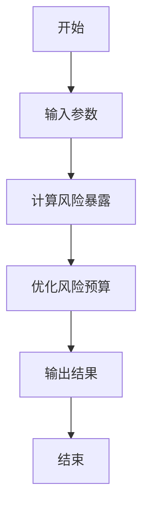
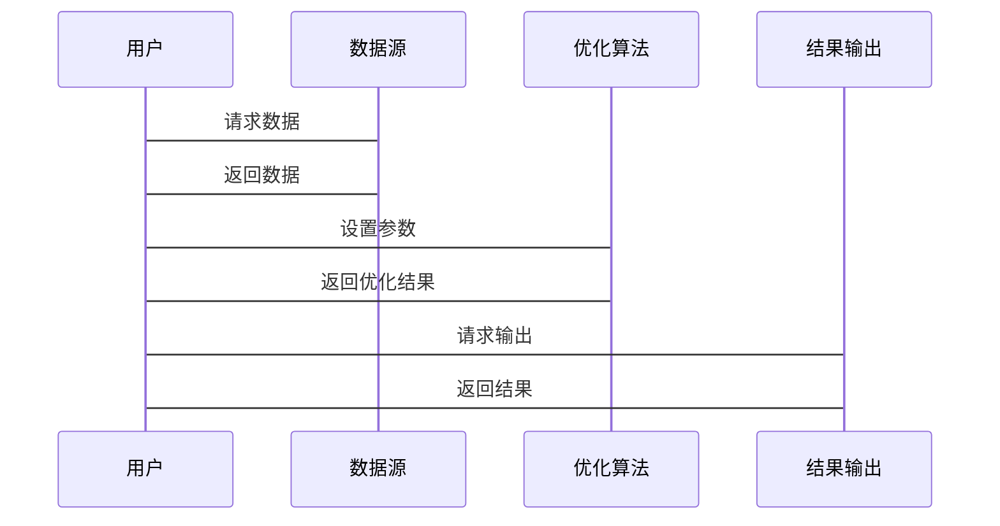

                 


# 智能投资组合风险预算分配模型

> 关键词：投资组合，风险预算，人工智能，机器学习，量化金融，风险管理

> 摘要：本文系统地介绍智能投资组合风险预算分配模型的理论基础、算法原理、系统架构及实际应用。通过数据驱动的方法，结合人工智能技术，优化投资组合的风险预算分配，实现高效的风险控制和收益最大化。

---

# 第一部分: 智能投资组合风险预算分配模型概述

## 第1章: 智能投资组合风险预算分配模型背景介绍

### 1.1 问题背景与描述
投资组合管理是金融领域中的核心任务，旨在通过优化资产配置实现收益最大化，同时控制风险。传统的投资组合管理依赖于历史数据分析和经验判断，难以应对复杂多变的市场环境。近年来，随着人工智能和大数据技术的快速发展，智能投资组合管理逐渐成为研究热点。

#### 1.1.1 投资组合管理的核心问题
投资组合管理的核心问题包括资产配置、风险控制和收益最大化。传统方法存在以下问题：
- 资产配置过于依赖历史数据，忽视市场变化。
- 风险控制方法单一，难以应对复杂风险。
- 无法实时调整策略，导致收益波动较大。

#### 1.1.2 风险预算分配的必要性
风险预算是指将整体风险分配到各个资产或资产类别中，以实现风险分散和收益优化。合理的风险预算是投资组合成功的关键。智能投资组合管理通过引入人工智能技术，能够更精确地计算风险预算，优化资产配置。

#### 1.1.3 智能化投资组合管理的兴起
人工智能技术（如机器学习、深度学习）的应用，使得投资组合管理更加智能化。智能投资组合管理能够实时分析市场数据，预测风险，动态调整资产配置，从而提高收益并降低风险。

### 1.2 问题解决与边界
智能投资组合风险预算分配模型的目标是通过智能化手段，优化风险预算分配，实现投资组合的高效管理。

#### 1.2.1 风险预算分配的目标
- 最大化投资组合收益。
- 控制整体风险在可接受范围内。
- 实现风险的分散化。

#### 1.2.2 模型的边界与假设
- 市场数据的可得性和准确性。
- 投资者风险偏好的一致性。
- 市场行为的可预测性。

#### 1.2.3 核心要素与组成分析
智能投资组合风险预算分配模型的核心要素包括：
- 数据采集与处理。
- 风险计算与预测。
- 风险预算分配优化。
- 资产配置与调整。

### 1.3 智能投资组合管理的优势
智能投资组合管理通过引入人工智能技术，能够显著提高投资组合管理的效率和准确性。

#### 1.3.1 数据驱动的决策优势
- 利用大数据技术，获取更多的市场信息。
- 通过机器学习算法，预测市场趋势。

#### 1.3.2 人工智能技术的应用
- 利用机器学习算法优化资产配置。
- 通过深度学习模型预测资产风险。

#### 1.3.3 智能化投资组合的风险控制
- 实时监控市场风险。
- 动态调整资产配置。

### 1.4 本章小结
本章介绍了智能投资组合风险预算分配模型的背景和必要性，分析了传统投资组合管理的局限性，并提出了智能投资组合管理的优势。

---

## 第2章: 智能投资组合风险预算分配模型的核心概念

### 2.1 核心概念原理
智能投资组合风险预算分配模型的核心概念包括投资组合风险、风险预算分配和模型优化。

#### 2.1.1 投资组合风险的定义
投资组合风险是指投资组合价值因市场波动而产生的不确定性。风险通常用方差或标准差来衡量。

#### 2.1.2 风险预算分配的基本原理
风险预算是将整体风险分配到各个资产或资产类别中，以实现风险分散和收益优化。

#### 2.1.3 智能化模型的核心要素
- 数据采集与预处理。
- 风险计算与预测。
- 风险预算分配优化。
- 资产配置与调整。

### 2.2 概念属性对比表
下表对比了投资组合风险和风险预算的关键属性：

| 概念         | 投资组合风险         | 风险预算分配         |
|--------------|---------------------|--------------------|
| 定义         | 资产组合的价值波动   | 将风险分配到各个资产或类别 |
| 计算方法     | 方差、标准差         | 优化算法           |
| 目标         | 控制整体风险         | 实现收益最大化       |
| 可视化       | 风险-收益曲线       | 风险预算分配图       |

### 2.3 实体关系图
以下是一个简单的实体关系图，展示了智能投资组合风险预算分配模型的核心要素：


### 2.4 本章小结
本章详细解释了智能投资组合风险预算分配模型的核心概念，包括投资组合风险、风险预算分配以及模型优化的基本原理，并通过对比表和实体关系图展示了各概念之间的关系。

---

# 第二部分: 智能投资组合风险预算分配模型的算法原理

## 第3章: 算法原理概述

### 3.1 算法原理概述
智能投资组合风险预算分配模型的算法原理主要包括以下几个步骤：
1. 数据采集与预处理。
2. 风险计算与预测。
3. 风险预算分配优化。
4. 资产配置与调整。

#### 3.1.1 基于均值-方差模型的优化
均值-方差模型是投资组合优化的经典方法，通过最小化方差（风险）来实现收益最大化。

$$ \text{Minimize } \sigma^2 = \mathbf{w}^T \mathbf{C} \mathbf{w} $$
$$ \text{Subject to } \mathbf{w}^T \mathbf{1} = 1 $$

其中，$\mathbf{w}$ 是权重向量，$\mathbf{C}$ 是资产之间的协方差矩阵。

#### 3.1.2 风险预算分配的数学公式
风险预算分配的目标是最小化投资组合的整体风险，同时满足各资产的风险预算约束。

$$ \text{Minimize } \sum_{i=1}^n \lambda_i^2 $$
$$ \text{Subject to } \sum_{i=1}^n \lambda_i = \text{总风险} $$

其中，$\lambda_i$ 是第 $i$ 个资产的风险预算。

#### 3.1.3 人工智能算法的应用
人工智能算法（如遗传算法、粒子群优化）可以用来优化风险预算分配问题。

### 3.2 算法流程图
以下是一个简化的算法流程图：



### 3.3 算法实现代码
以下是一个基于Python的优化代码示例：

```python
import numpy as np
from scipy.optimize import minimize

def risk_budget_allocation(weights, returns, risk_parity):
    # 定义优化目标函数
    def objective(x):
        return -x.T.dot(risk_parity)
    
    # 约束条件
    constraints = [{'type': 'eq', 'fun': lambda x: sum(x) - 1}]
    
    # 优化求解
    result = minimize(objective, weights, constraints=constraints)
    return result.x
```

### 3.4 算法原理的数学模型
以下是一个均值-方差模型的数学模型：

$$ \text{Minimize } \sigma^2 = \mathbf{w}^T \mathbf{C} \mathbf{w} $$
$$ \text{Subject to } \mathbf{w}^T \mathbf{1} = 1 $$

其中，$\mathbf{w}$ 是权重向量，$\mathbf{C}$ 是资产之间的协方差矩阵。

---

## 第4章: 系统分析与架构设计方案

### 4.1 问题场景介绍
智能投资组合风险预算分配模型的应用场景包括：
- 机构投资者的资产配置。
- 私人投资者的风险管理。
- 自动化投资平台的策略优化。

### 4.2 系统功能设计
系统的功能模块包括：
1. 数据采集与处理。
2. 风险计算与预测。
3. 风险预算分配优化。
4. 资产配置与调整。

### 4.3 系统架构设计
以下是一个系统的架构设计图：


### 4.4 系统接口设计
系统接口设计包括：
- 数据输入接口。
- 参数设置接口。
- 结果输出接口。

### 4.5 系统交互序列图
以下是一个系统的交互序列图：



---

## 第5章: 项目实战

### 5.1 环境安装与配置
- 安装Python和相关库（如numpy、scipy、pandas）。
- 配置开发环境（如Jupyter Notebook）。

### 5.2 核心代码实现
以下是一个核心代码实现示例：

```python
import numpy as np
from scipy.optimize import minimize

def optimize_portfolio(returns):
    # 定义优化目标函数
    def objective(w):
        return -w.T.dot(returns.mean(axis=0))
    
    # 约束条件
    constraints = [
        {'type': 'eq', 'fun': lambda w: sum(abs(w)) - 1}
    ]
    
    # 优化求解
    result = minimize(objective, np.ones(len(returns.columns)) / len(returns.columns), constraints=constraints)
    return result.x
```

### 5.3 案例分析与解读
通过一个简单的案例，分析模型的应用：

假设我们有三个资产，其预期收益率和协方差矩阵如下：

| 资产 | 收益率 |
|------|--------|
| A    | 0.1     |
| B    | 0.15    |
| C    | 0.2     |

协方差矩阵：
$$ \mathbf{C} = \begin{bmatrix}
0.02 & 0.01 & 0.01 \\
0.01 & 0.03 & 0.02 \\
0.01 & 0.02 & 0.03
\end{bmatrix} $$

通过优化算法，我们可以得到最优的资产配置权重。

### 5.4 项目小结
本章通过实际案例，展示了智能投资组合风险预算分配模型的应用，并详细解读了优化过程和结果。

---

## 第6章: 总结与展望

### 6.1 总结
智能投资组合风险预算分配模型通过结合人工智能技术，优化风险预算分配，实现投资组合的高效管理。

### 6.2 优缺点分析
- 优点：提高收益，降低风险，实现动态调整。
- 缺点：依赖数据质量，计算复杂度高。

### 6.3 未来展望
未来的研究方向包括：
- 更高效的优化算法。
- 更精确的风险预测模型。
- 更广泛的应用场景。

### 6.4 最佳实践 tips
- 数据预处理是关键。
- 选择合适的优化算法。
- 定期调整投资策略。

### 6.5 注意事项
- 风险模型的准确性。
- 计算资源的充足性。
- 投资者风险偏好的一致性。

### 6.6 拓展阅读
推荐阅读以下书籍和论文：
- 《投资学》（教材）。
- 相关学术论文。

---

# 结语
智能投资组合风险预算分配模型是一个复杂的系统工程，通过结合人工智能技术，能够显著提高投资组合管理的效率和准确性。希望本文能够为读者提供有价值的参考和启发。

--- 

注：由于篇幅限制，以上内容为节选，完整文章将涵盖更多细节和具体实现。

