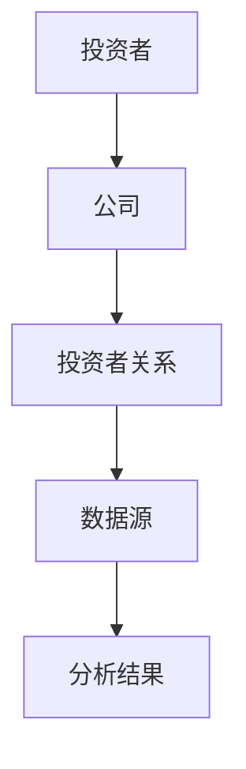
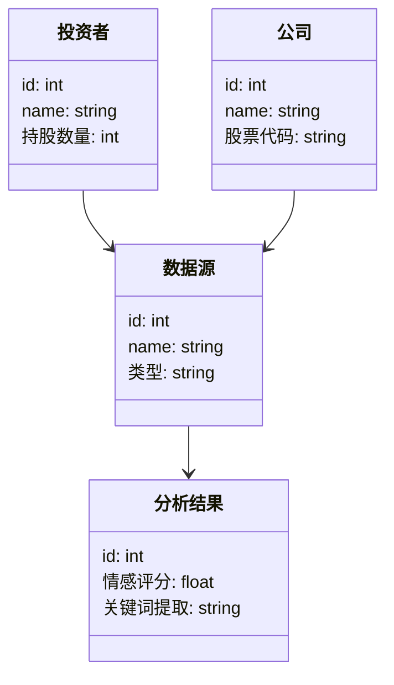

                 

# 第一部分: 智能投资者关系分析平台概述

# 第1章: 背景介绍

## 1.1 问题背景

### 1.1.1 投资者关系管理的现状与挑战
- 传统投资者关系管理依赖人工处理，效率低下
- 数据来源多样且复杂，难以统一处理
- 实时分析与决策支持的需求日益迫切

### 1.1.2 传统投资者关系分析的局限性
- 数据处理能力有限，难以应对海量数据
- 分析结果依赖人工经验，主观性较强
- 缺乏智能化的预测能力，难以提供前瞻性支持

### 1.1.3 智能化投资者关系分析的需求
- 引入人工智能技术，提高数据分析效率
- 通过机器学习实现智能化预测
- 提供实时、精准的决策支持

## 1.2 问题描述

### 1.2.1 投资者关系分析的核心问题
- 如何从海量数据中提取有价值的信息
- 如何准确识别投资者情感倾向
- 如何预测市场趋势并提供决策支持

### 1.2.2 数据来源的多样性与复杂性
- 包括新闻、社交媒体、财报等多源数据
- 数据格式多样，处理难度大
- 数据噪声多，清洗困难

### 1.2.3 实时分析与决策支持的需求
- 实时监控市场动态，及时反馈
- 快速生成分析报告，辅助决策
- 提供实时预警机制，规避风险

## 1.3 问题解决

### 1.3.1 智能投资者关系分析的定义
- 利用人工智能技术，对投资者关系进行智能化分析
- 通过大数据处理和机器学习，提供精准的分析结果
- 实现实时监控和预测，支持决策者制定策略

### 1.3.2 人工智能在投资者关系分析中的应用
- 自然语言处理技术用于文本分析
- 机器学习算法用于预测和分类
- 数据挖掘技术用于模式识别

### 1.3.3 平台的目标与功能定位
- 提供智能化的投资者关系分析工具
- 实现数据采集、处理、分析和可视化的全流程自动化
- 为投资者和企业提供精准的市场洞察

## 1.4 边界与外延

### 1.4.1 平台的功能边界
- 数据采集范围：限定于公开可用的投资者相关数据
- 分析范围：主要针对市场趋势和投资者情绪
- 输出形式：提供结构化的分析报告和可视化图表

### 1.4.2 与相关系统的区别与联系
- 与传统数据分析系统的区别：引入了人工智能技术，实现了自动化和智能化
- 与投资决策系统的联系：为决策系统提供实时数据支持和分析结果

### 1.4.3 未来可能的扩展方向
- 扩展至更多的数据源，如内部数据和非公开数据
- 增加更多分析维度，如宏观经济指标和行业趋势
- 引入更多机器学习模型，提升预测准确性

## 1.5 核心要素组成

### 1.5.1 数据采集模块
- 从多种数据源（如新闻、社交媒体、财报）采集投资者相关信息
- 数据清洗：去除无效数据和噪声
- 数据存储：将清洗后的数据存储在数据库中

### 1.5.2 数据处理模块
- 数据预处理：包括分词、去停用词等
- 数据标注：对文本进行情感倾向标注
- 数据转换：将数据转换为适合模型输入的格式

### 1.5.3 智能分析模块
- 情感分析：使用机器学习模型预测文本的情感倾向
- 实体识别：识别文本中的关键实体，如公司名称、人物等
- 关键词提取：提取文本中的关键词，用于主题分析

### 1.5.4 可视化展示模块
- 生成图表：如情感分布图、趋势图等
- 生成报告：包括分析结果的总结和建议
- 提供交互界面：用户可以通过界面查看实时数据和分析结果

# 第2章: 核心概念与联系

## 2.1 投资者关系分析平台的原理

### 2.1.1 自然语言处理在投资者关系分析中的应用
- 文本分词：将文本分割成词语或短语
- 实体识别：识别文本中的命名实体
- 情感分析：分析文本的情感倾向

### 2.1.2 大数据分析在投资者关系分析中的作用
- 数据清洗：处理海量数据中的噪声
- 数据挖掘：从数据中提取有价值的信息
- 数据可视化：将分析结果以图表形式展示

### 2.1.3 机器学习在投资者关系预测中的应用
- 监督学习：用于分类任务，如情感分类
- 无监督学习：用于主题挖掘和聚类分析
- 深度学习：用于复杂模式识别

## 2.2 核心概念对比

### 2.2.1 投资者关系分析与传统数据分析的对比
| 特性                | 传统数据分析          | 智能投资者关系分析       |
|---------------------|-----------------------|--------------------------|
| 数据处理            | 依赖人工处理          | 自动化处理               |
| 分析方法            | 基于统计分析          | 基于机器学习和自然语言处理 |
| 分析效率            | 较低                  | 较高                     |
| 分析深度            | 浅层                  | 深层                     |

### 2.2.2 人工智能技术在投资者关系分析中的优势
- 提高数据处理效率
- 实现智能化预测
- 提供实时分析能力

### 2.2.3 不同投资者关系分析方法的优劣势分析
- 传统方法：简单易懂，但效率低
- 基于规则的方法：处理特定场景，但灵活性差
- 机器学习方法：高效准确，但需要大量数据训练

## 2.3 ER实体关系图

## 2.4 领域模型类图

---

接下来，按照您的要求，我将继续按照目录大纲结构，逐步展开每个章节的内容，确保逻辑清晰、内容丰富且详细。请告诉我您希望从哪一章开始展开详细内容。

