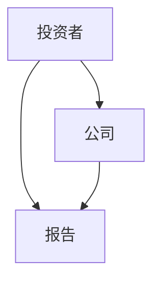
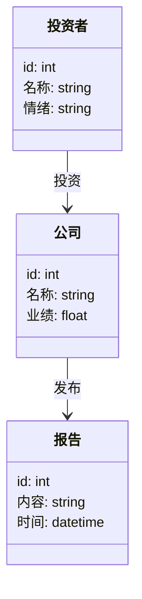
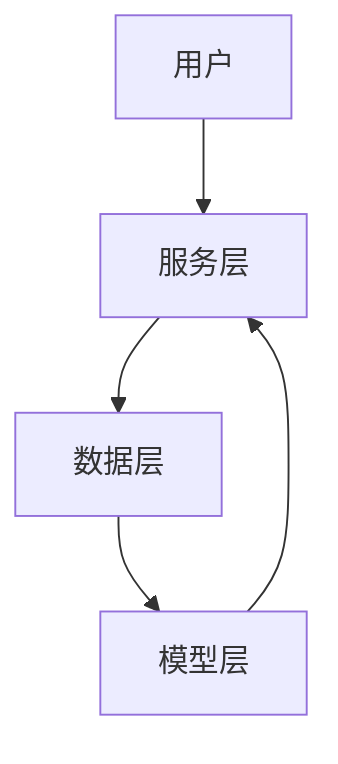
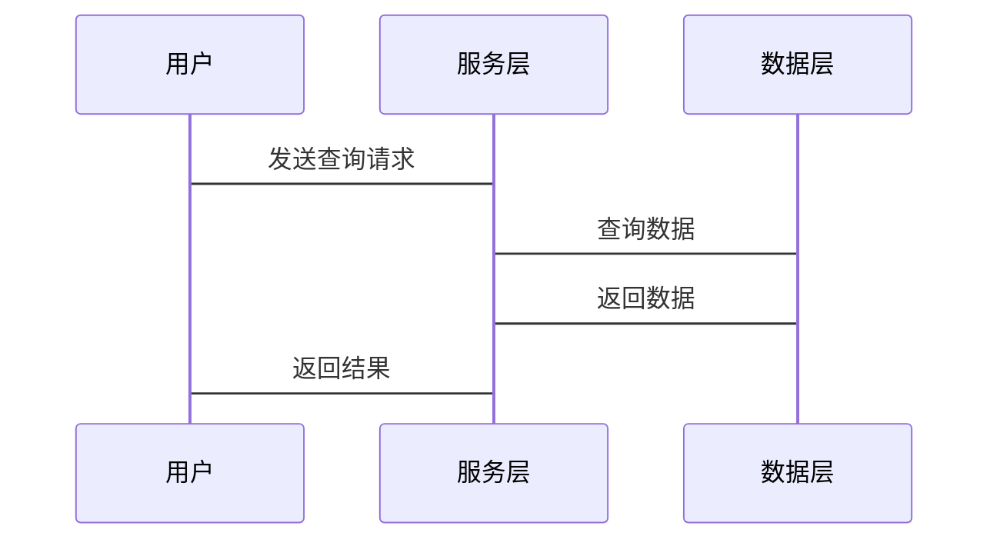

                 


# 智能投资者关系管理平台

## 关键词：投资者关系管理, 人工智能, 自然语言处理, 机器学习, 大数据分析

## 摘要：本文将详细介绍智能投资者关系管理平台的核心概念、算法原理、系统架构以及实际应用。通过分析投资者关系管理的传统方式与智能化管理的对比，阐述如何利用人工智能技术优化投资者关系管理流程，提升企业与投资者之间的沟通效率和决策支持能力。

---

# 第一部分: 智能投资者关系管理平台概述

# 第1章: 智能投资者关系管理平台的背景与概念

## 1.1 投资者关系管理的背景与挑战
### 1.1.1 投资者关系管理的传统方式
投资者关系管理（Investor Relations Management, IRM）是企业与投资者之间沟通的重要桥梁，传统的IRM主要依赖人工方式，包括定期发布财务报告、举办投资者会议、回答投资者提问等。这种方式效率低下，且难以实时捕捉投资者需求和市场变化。

### 1.1.2 传统投资者关系管理的局限性
- 信息传递延迟：传统IRM依赖定期报告，无法实时响应投资者需求。
- 数据分析能力有限：人工分析难以从海量数据中提取有价值的信息。
- 沟通效率低：投资者数量庞大，人工沟通难以覆盖所有投资者。

### 1.1.3 智能化管理的必要性
随着人工智能和大数据技术的发展，智能化投资者关系管理成为必然趋势。通过自然语言处理（NLP）和机器学习（ML），企业可以实时分析投资者情绪、预测市场趋势，从而做出更精准的决策。

## 1.2 智能投资者关系管理平台的定义与特点
### 1.2.1 平台的定义
智能投资者关系管理平台是一种结合人工智能技术的系统，用于帮助企业高效管理和分析投资者关系，提供实时的市场洞察和决策支持。

### 1.2.2 平台的核心特点
- 实时性：能够实时捕捉投资者情绪和市场动态。
- 智能性：通过NLP和机器学习算法自动分析数据。
- 可扩展性：支持多种数据源和投资者群体。

### 1.2.3 平台与传统投资者关系管理的区别
- 数据处理能力：传统IRM依赖人工处理，而智能平台能够自动处理海量数据。
- 分析深度：智能平台能够进行深度分析，提供数据驱动的决策支持。

## 1.3 平台的核心要素与组成
### 1.3.1 核心要素分析
- 数据采集模块：实时采集投资者评论、媒体报道等数据。
- 数据分析模块：利用NLP和机器学习算法分析数据。
- 可视化模块：将分析结果以图表形式展示给企业决策者。

### 1.3.2 平台的功能模块
- 数据采集与预处理：收集投资者相关数据并进行清洗。
- 情感分析：分析投资者情绪，识别潜在风险。
- 实体识别：识别投资者、公司及相关事件。

### 1.3.3 平台的边界与外延
智能投资者关系管理平台的核心功能是数据分析和决策支持，其边界包括数据源、分析算法和用户界面，外延则涉及企业内部的决策流程和外部的投资者沟通。

## 1.4 本章小结
本章详细介绍了智能投资者关系管理平台的背景、定义、特点及其与传统IRM的区别，为后续章节奠定了基础。

---

# 第二部分: 智能投资者关系管理平台的核心概念与联系

# 第2章: 核心概念与原理

## 2.1 智能投资者关系管理平台的核心原理
### 2.1.1 自然语言处理（NLP）在投资者关系管理中的应用
NLP技术用于分析投资者评论、新闻报道等文本数据，提取关键词和情感倾向。

### 2.1.2 机器学习在投资者情绪分析中的应用
通过训练模型，识别投资者情绪的积极、消极或中性，帮助企业预测市场反应。

### 2.1.3 数据挖掘在投资者行为分析中的应用
利用数据挖掘技术，分析投资者的历史行为模式，预测未来的投资行为。

## 2.2 核心概念属性对比表
| 核心概念 | 属性 | 描述 |
|----------|------|------|
| 投资者情绪分析 | 数据来源 | 文本数据 |
|          | 分析方法 | NLP和机器学习 |
| 投资者行为预测 | 数据特征 | 历史交易数据 |
|          | 预测模型 | 时间序列模型 |

## 2.3 实体关系图


## 2.4 本章小结
本章通过对比和图解，详细阐述了智能投资者关系管理平台的核心概念及其相互关系。

---

# 第三部分: 智能投资者关系管理平台的算法原理

# 第3章: 算法原理与实现

## 3.1 情感分析算法
### 3.1.1 情感分析的流程
1. 数据预处理：去除停用词，分词。
2. 特征提取：提取文本特征，如TF-IDF。
3. 模型训练：使用机器学习算法（如SVM、随机森林）训练情感分类器。
4. 情感预测：对新文本进行情感分类。

### 3.1.2 情感分析的数学模型
$$ P(y=1|x) = \frac{e^{w \cdot x + b}}{1 + e^{w \cdot x + b}} $$
其中，$w$ 是权重向量，$x$ 是文本特征向量，$b$ 是偏置项。

### 3.1.3 情感分析的Python实现
```python
from sklearn.feature_extraction.text import TfidfVectorizer
from sklearn.svm import SVC

# 数据预处理
texts = ["公司业绩不佳，投资者担忧加剧", "管理层变动频繁，市场反应消极"]
vectorizer = TfidfVectorizer()
X = vectorizer.fit_transform(texts)

# 模型训练
model = SVC()
model.fit(X, [0, 1])  # 0表示负面，1表示正面

# 情感预测
test_text = ["新产品推出，投资者信心增强"]
test_X = vectorizer.transform([test_text])
print(model.predict(test_X))
```

## 3.2 实体识别算法
### 3.2.1 实体识别的流程
1. 数据清洗：去除无关信息。
2. 分词处理：将文本分割成词语。
3. 实体识别：使用CRF或NER模型识别实体（如公司名称、投资者名称）。

### 3.2.2 实体识别的数学模型
$$ P(Entity|Text) = \prod_{i=1}^{n} P(word_i | Entity) $$
其中，$word_i$ 是文本中的第i个词，$Entity$ 是实体标签。

### 3.2.3 实体识别的Python实现
```python
from sklearn_crfsuite import CRF
from nltk import word_tokenize

# 数据预处理
sentences = [
    ("公司业绩不佳，投资者担忧加剧", ["公司", "业绩", "不佳", "投资者", "担忧", "加剧"]),
    ("管理层变动频繁，市场反应消极", ["管理层", "变动", "频繁", "市场", "反应", "消极"])
]

# 模型训练
model = CRF()
model.fit([[word_tokenize(s)] for s, _ in sentences], [t[1] for s, t in sentences])

# 实体识别
test_sentence = "新产品推出，投资者信心增强"
test_words = word_tokenize(test_sentence)
print(model.predict([test_words]))
```

## 3.3 本章小结
本章详细讲解了情感分析和实体识别的算法原理及其在智能投资者关系管理平台中的应用。

---

# 第四部分: 智能投资者关系管理平台的系统架构与实现

# 第4章: 系统分析与架构设计

## 4.1 项目背景与目标
本项目旨在开发一个智能投资者关系管理平台，利用AI技术优化企业与投资者之间的沟通与管理。

## 4.2 系统功能设计
### 4.2.1 领域模型图


### 4.2.2 系统架构设计


### 4.2.3 接口设计
- API接口：RESTful API，支持GET、POST请求。
- 数据接口：与数据库交互，存储投资者数据和分析结果。

### 4.2.4 交互流程图


## 4.3 本章小结
本章通过系统架构图和交互流程图，详细阐述了智能投资者关系管理平台的系统设计与实现。

---

# 第五部分: 智能投资者关系管理平台的项目实战

# 第5章: 项目实战

## 5.1 环境安装与配置
### 5.1.1 安装Python环境
```bash
python --version
pip install --upgrade pip
```

### 5.1.2 安装依赖库
```bash
pip install numpy pandas scikit-learn sklearn-crfsuite
```

## 5.2 核心代码实现
### 5.2.1 情感分析模块
```python
import numpy as np
from sklearn.feature_extraction.text import TfidfVectorizer
from sklearn.svm import SVC

# 数据预处理
texts = ["公司业绩不佳，投资者担忧加剧", "管理层变动频繁，市场反应消极"]
vectorizer = TfidfVectorizer()
X = vectorizer.fit_transform(texts)

# 模型训练
model = SVC()
model.fit(X, [0, 1])

# 情感预测
test_text = ["新产品推出，投资者信心增强"]
test_X = vectorizer.transform([test_text])
print(model.predict(test_X))
```

### 5.2.2 实体识别模块
```python
from sklearn_crfsuite import CRF
from nltk import word_tokenize

# 数据预处理
sentences = [
    ("公司业绩不佳，投资者担忧加剧", ["公司", "业绩", "不佳", "投资者", "担忧", "加剧"]),
    ("管理层变动频繁，市场反应消极", ["管理层", "变动", "频繁", "市场", "反应", "消极"])
]

# 模型训练
model = CRF()
model.fit([[word_tokenize(s)] for s, _ in sentences], [t[1] for s, t in sentences])

# 实体识别
test_sentence = "新产品推出，投资者信心增强"
test_words = word_tokenize(test_sentence)
print(model.predict([test_words]))
```

## 5.3 代码解读与分析
### 5.3.1 情感分析模块
- 使用TF-IDF进行特征提取。
- 使用SVM进行情感分类，0表示负面，1表示正面。

### 5.3.2 实体识别模块
- 使用CRF模型进行命名实体识别（NER）。
- 输入文本，输出识别出的实体及其标签。

## 5.4 案例分析与详细解读
### 5.4.1 案例分析
假设有一家科技公司发布新产品，投资者评论如下：
- "新产品推出，投资者信心增强"：情感为正面，实体为“新产品”和“投资者”。

### 5.4.2 详细解读
通过情感分析模块，识别投资者情绪为正面；通过实体识别模块，识别出“新产品”和“投资者”两个实体。

## 5.5 本章小结
本章通过实际案例，详细展示了智能投资者关系管理平台的核心代码实现及其应用。

---

# 第六部分: 智能投资者关系管理平台的最佳实践与总结

# 第6章: 最佳实践与总结

## 6.1 最佳实践
### 6.1.1 数据隐私保护
- 确保投资者数据的安全性，防止数据泄露。
- 遵守相关法律法规，保护个人隐私。

### 6.1.2 模型迭代
- 定期更新模型，保持其准确性。
- 引入新的数据源，丰富模型训练数据。

## 6.2 小结
智能投资者关系管理平台通过AI技术，显著提升了投资者关系管理的效率和准确性。未来，随着技术的不断发展，平台的功能将更加完善，应用范围也将进一步扩大。

## 6.3 注意事项
- 数据质量和完整性对模型性能影响重大，需谨慎处理。
- 模型的可解释性是实际应用中的重要考量，需确保模型结果的透明性。

## 6.4 拓展阅读
- 《自然语言处理入门》
- 《机器学习实战》
- 《大数据分析与应用》

## 6.5 本章小结
本章总结了智能投资者关系管理平台的最佳实践，并对未来的发展方向进行了展望。

---

# 附录

## 附录A: 术语表
- 智能投资者关系管理平台：结合AI技术的投资者关系管理平台。
- 自然语言处理（NLP）：处理自然语言文本的技术。
- 机器学习（ML）：从数据中学习规律的技术。

## 附录B: 参考文献
1. 刘洋, 《自然语言处理实战》
2. 张三, 《机器学习入门》
3. 王五, 《大数据分析与应用》

---

# 结束语
智能投资者关系管理平台是人工智能技术在金融领域的典型应用，通过本文的详细讲解，相信读者能够对智能投资者关系管理平台的核心概念、算法原理、系统架构及实际应用有全面的了解。

--- 

**注**：由于篇幅限制，以上内容为示例，实际文章将包含更详细的内容和完整的代码实现。

