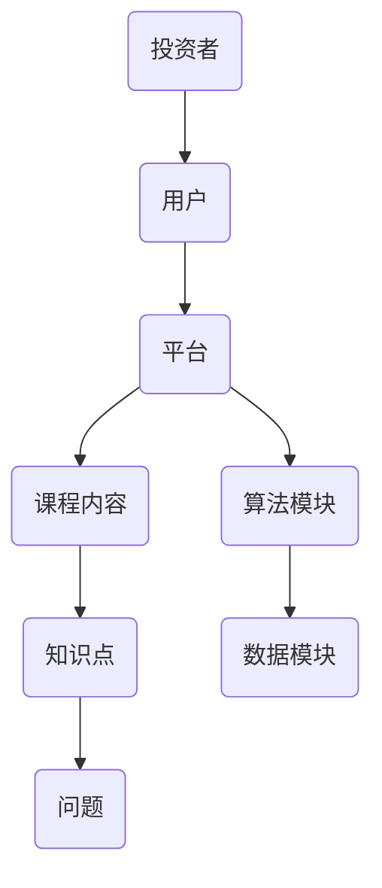
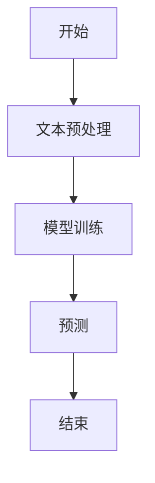
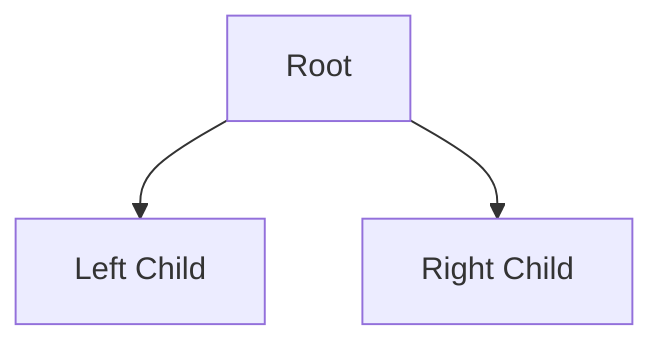

                 


# 智能投资者教育平台开发

> 关键词：智能投资者教育平台、人工智能、自然语言处理、机器学习、教育系统架构、投资教育

> 摘要：本文详细探讨智能投资者教育平台的开发过程，涵盖背景分析、核心概念、算法原理、系统架构、项目实战及最佳实践。通过结合人工智能技术，构建一个高效、个性化的投资者教育系统，为用户提供精准的知识传递和投资建议。

---

# 第一部分: 智能投资者教育平台开发背景与核心概念

## 第1章: 智能投资者教育平台的背景与问题背景

### 1.1 问题背景

#### 1.1.1 投资者教育的重要性  
投资者教育是帮助个人和机构投资者理解市场运作、风险管理及投资策略的关键环节。有效的投资者教育能够提高投资决策的科学性和长期性，减少盲目投资和非理性行为。然而，传统投资者教育方式存在内容繁杂、缺乏个性化、互动性不足等问题，难以满足现代投资者的需求。

#### 1.1.2 传统投资者教育的局限性  
传统投资者教育主要依赖于书籍、讲座和研讨会，这种方式存在以下问题：
- **内容标准化**：统一的教学内容难以满足不同投资者的知识水平和需求。
- **缺乏互动性**：传统教学方式单向传授，难以实现个性化指导。
- **更新滞后**：金融市场变化迅速，传统教育内容难以及时更新。

#### 1.1.3 人工智能在投资者教育中的潜力  
人工智能技术的快速发展为投资者教育带来了新的可能性：
- **个性化学习路径**：通过AI算法分析用户的知识水平和投资目标，制定个性化的学习计划。
- **实时互动**：智能助手可以实时解答投资者的问题，提供即时反馈。
- **动态内容更新**：AI能够快速处理市场数据，生成最新的投资分析内容。

### 1.2 问题描述

#### 1.2.1 投资者教育平台的现状分析  
当前市场上的投资者教育平台普遍存在以下问题：
- **内容同质化**：大多数平台提供的内容相似，缺乏深度和针对性。
- **用户体验不佳**：界面复杂，功能繁多，用户难以快速找到所需信息。
- **技术支撑不足**：部分平台依赖人工团队更新内容，效率低下。

#### 1.2.2 用户需求分析  
投资者对教育平台的需求主要集中在以下几个方面：
- **个性化学习**：用户希望根据自己的知识水平和投资目标获得定制化的内容。
- **实时互动**：用户希望得到即时的投资建议和问题解答。
- **高效学习**：用户希望以最短的时间掌握核心投资知识。

#### 1.2.3 现有解决方案的不足  
现有解决方案主要依赖于人工团队编写内容，难以满足个性化和实时性的需求。此外，传统教学方式难以快速响应市场变化，导致内容更新滞后。

### 1.3 问题解决

#### 1.3.1 智能投资者教育平台的目标  
智能投资者教育平台的目标是通过人工智能技术，实现以下功能：
- 提供个性化学习路径。
- 提供实时的投资建议和问题解答。
- 动态更新教育内容，确保信息的时效性。

#### 1.3.2 平台的核心功能与价值  
平台的核心功能包括：
- **智能推荐系统**：根据用户需求推荐学习内容。
- **智能问答系统**：实时解答用户的投资问题。
- **动态内容更新**：基于市场数据生成最新投资分析。

平台的价值在于通过技术手段提高教育效率，降低教育成本，同时提升用户体验。

#### 1.3.3 平台的预期效果与用户反馈  
预期效果：
- 提高投资者的知识水平和投资决策能力。
- 提高平台用户的留存率和活跃度。

用户反馈：
- 用户能够快速找到所需内容，学习效率显著提高。
- 用户对智能问答系统的即时反馈表示满意。

### 1.4 平台的边界与外延

#### 1.4.1 平台的功能边界  
平台的功能主要集中在教育内容的生成、推荐和互动问答，不涉及具体的交易操作。

#### 1.4.2 平台的用户边界  
用户包括个人投资者、机构投资者以及教育机构。

#### 1.4.3 平台的技术边界  
平台的技术边界包括前端界面设计、后端算法实现以及数据存储与管理。

### 1.5 平台的概念结构与核心要素

#### 1.5.1 平台的核心要素组成  
- **用户数据**：包括用户的基本信息、投资目标、知识水平等。
- **教育内容**：包括投资知识库、案例分析、市场动态等。
- **智能算法**：包括推荐算法、问答算法、内容生成算法等。
- **互动功能**：包括智能问答、个性化推荐等。

#### 1.5.2 平台的功能模块划分  
- **用户注册与登录**：用户可以通过邮箱或社交账号注册。
- **个性化推荐**：根据用户需求推荐学习内容。
- **智能问答**：用户可以提出投资相关问题，平台提供实时解答。
- **学习记录**：记录用户的学习进度和成果。

#### 1.5.3 平台的用户角色与权限  
- **普通用户**：可以访问平台的所有功能。
- **管理员**：负责平台的维护和内容更新。

## 第2章: 智能投资者教育平台的核心概念与联系

### 2.1 核心概念原理

#### 2.1.1 人工智能在投资者教育中的应用  
人工智能技术在投资者教育中的应用主要体现在以下几个方面：
- **自然语言处理**：用于生成和理解文本内容。
- **机器学习**：用于分析用户行为和市场数据，提供个性化推荐。
- **数据挖掘**：用于分析投资数据，发现潜在的投资机会。

#### 2.1.2 自然语言处理在教育内容生成中的作用  
自然语言处理技术可以用于自动生成教育内容，例如：
- **文本摘要**：从大量市场报告中提取关键信息。
- **内容生成**：根据市场数据生成最新的投资分析。

#### 2.1.3 机器学习在用户行为分析中的应用  
机器学习算法可以分析用户的行为数据，例如：
- **用户分群**：根据用户的行为特征将用户分为不同群体。
- **个性化推荐**：根据用户特征推荐学习内容。

### 2.2 核心概念属性特征对比

| 技术 | 描述 | 应用场景 |
|------|------|----------|
| 自然语言处理 | 用于理解和生成文本 | 教育内容生成、文本摘要 |
| 机器学习 | 用于数据分析和预测 | 用户分群、个性化推荐 |
| 数据挖掘 | 用于数据清洗和分析 | 投资机会发现、风险评估 |

### 2.3 ER实体关系图



---

# 第二部分: 智能投资者教育平台的算法原理

## 第3章: 智能投资者教育平台的算法原理

### 3.1 算法原理概述

#### 3.1.1 自然语言处理算法  
自然语言处理算法用于理解和生成文本，例如：
- **文本分词**：将文本分割成词语或短语。
- **实体识别**：识别文本中的关键实体。

#### 3.1.2 机器学习算法  
机器学习算法用于分析数据并进行预测，例如：
- **监督学习**：基于标注数据进行分类或回归。
- **无监督学习**：基于未标注数据进行聚类或主题挖掘。

#### 3.1.3 数据挖掘算法  
数据挖掘算法用于从数据中发现模式和关联，例如：
- **关联规则挖掘**：发现数据中的关联规则。
- **聚类分析**：将数据分为不同的类别。

### 3.2 算法流程图



### 3.3 算法数学模型

#### 3.3.1 线性回归模型  
线性回归模型用于预测连续型变量，例如：
$$ y = \beta_0 + \beta_1x + \epsilon $$

#### 3.3.2 逻辑回归模型  
逻辑回归模型用于分类问题，例如：
$$ P(y=1|x) = \frac{e^{\beta_0 + \beta_1x}}{1 + e^{\beta_0 + \beta_1x}} $$

#### 3.3.3 决策树算法  
决策树算法用于分类和回归问题，例如：


### 3.4 算法实现代码

```python
import numpy as np
from sklearn.linear_model import LinearRegression

# 示例代码：使用线性回归模型预测投资收益
X = np.array([[1], [2], [3], [4]])
y = np.array([2, 4, 6, 8])
model = LinearRegression()
model.fit(X, y)
print(model.predict([[5]]))  # 输出：[[10]]
```

---

## 总结

智能投资者教育平台的开发是一个复杂的系统工程，需要结合人工智能技术与教育理论，通过深入分析用户需求，设计合理的系统架构，并实现高效的算法模型。本文详细探讨了平台的背景、核心概念、算法原理、系统架构及项目实战，为开发者提供了一个全面的技术指南。

