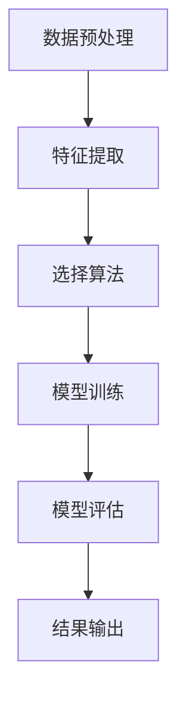
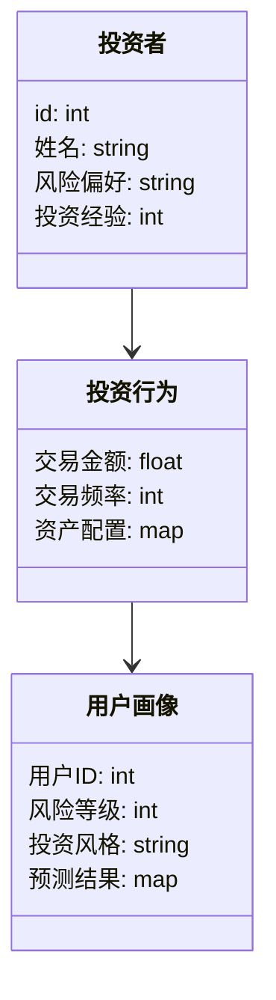
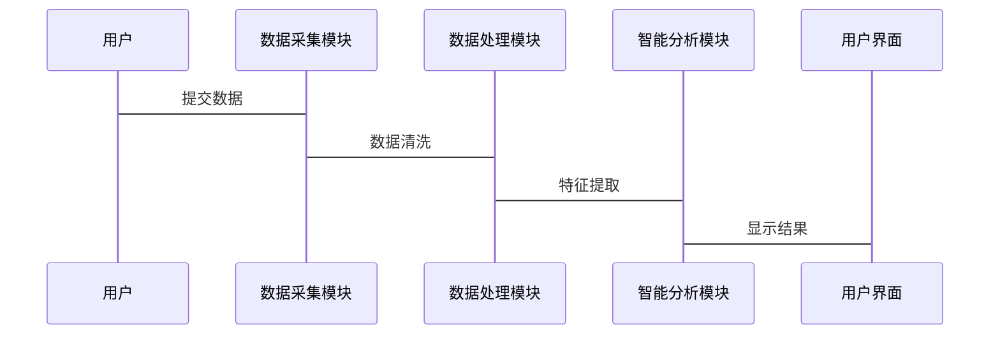

                 


# 智能投资者画像分析平台

> 关键词：投资者画像，智能分析，机器学习，系统架构，项目实战

> 摘要：智能投资者画像分析平台是一个基于人工智能和大数据分析的投资者画像构建和分析系统，旨在通过智能化的方法对投资者的行为、风险偏好和投资风格进行精准画像，从而为投资机构提供个性化的决策支持和风险评估服务。本文将从背景介绍、核心概念、算法原理、系统架构、项目实战和最佳实践等方面详细讲解智能投资者画像分析平台的构建过程和实现方法。

---

# 第一部分: 智能投资者画像分析平台背景与核心概念

## 第1章: 智能投资者画像分析平台背景介绍

### 1.1 问题背景
#### 1.1.1 投资者画像分析的必要性
- 投资者画像分析是投资机构进行客户细分和风险评估的重要工具。
- 传统投资者分析依赖人工经验，效率低且主观性强。
- 智能化投资者分析能够提高效率、降低成本并提升决策的准确性。

#### 1.1.2 当前传统投资者分析的局限性
- 数据来源单一，难以全面反映投资者特征。
- 分析方法简单，无法捕捉复杂的投资行为模式。
- 缺乏实时性，难以应对快速变化的市场环境。

#### 1.1.3 智能化投资者分析的机遇与挑战
- 人工智能和大数据技术的进步为投资者画像分析提供了新的可能性。
- 智能分析能够处理海量数据，发现隐藏的模式和关联。
- 智能系统需要处理高维数据和复杂场景，技术实现难度大。

### 1.2 问题描述
#### 1.2.1 投资者画像的核心要素
- 投资者的基本信息（年龄、性别、职业等）。
- 投资行为数据（交易频率、交易金额、资产配置等）。
- 风险偏好和投资风格（保守型、平衡型、激进型）。

#### 1.2.2 数据来源的多样性与复杂性
- 数据来源包括交易数据、市场数据、社交媒体数据等。
- 数据格式多样，需要进行清洗和预处理。

#### 1.2.3 分析目标的多维度性
- 投资者画像的构建需要综合分析多个维度的数据。
- 分析目标包括投资者分类、风险评估、投资行为预测等。

### 1.3 问题解决
#### 1.3.1 智能投资者画像的构建方法
- 基于机器学习的特征提取和聚类分析。
- 使用深度学习进行复杂模式识别。

#### 1.3.2 数据处理与特征提取
- 数据清洗、去噪和标准化。
- 特征选择和降维技术（如主成分分析）。

#### 1.3.3 智能分析与决策支持
- 基于画像的个性化投资建议。
- 风险评估和预警系统。

### 1.4 边界与外延
#### 1.4.1 投资者画像的适用范围
- 适用于机构投资者和个人投资者。
- 支持不同投资产品的画像分析。

#### 1.4.2 平台功能的边界
- 仅提供画像构建和分析功能，不直接参与投资决策。
- 支持与其他系统的数据接口。

#### 1.4.3 与其他系统的接口关系
- 与交易系统、客户管理系统等其他系统的数据对接。
- 提供标准化的API接口。

### 1.5 核心概念
#### 1.5.1 投资者画像的核心要素
- 投资者的基本属性（年龄、性别、职业）。
- 投资行为特征（交易频率、资产配置）。
- 风险偏好和投资风格。

#### 1.5.2 平台功能模块划分
- 数据采集模块。
- 画像构建模块。
- 智能分析模块。
- 决策支持模块。

#### 1.5.3 系统架构的核心组件
- 数据源。
- 数据处理模块。
- 智能分析引擎。
- 用户界面。

---

## 第2章: 智能投资者画像分析的核心概念与联系

### 2.1 核心概念原理
#### 2.1.1 投资者画像构建的原理
- 基于机器学习的特征提取和聚类分析。
- 使用深度学习进行复杂模式识别。

#### 2.1.2 数据特征提取的原理
- 数据清洗、去噪和标准化。
- 特征选择和降维技术（如主成分分析）。

#### 2.1.3 智能分析算法的原理
- 基于机器学习的分类、聚类和回归模型。
- 使用深度学习进行复杂模式识别。

### 2.2 核心概念属性特征对比
#### 2.2.1 投资者画像属性对比表格
| 属性 | 描述 | 示例 |
|------|------|------|
| 年龄 | 投资者的年龄 | 30-60岁 |
| 风险偏好 | 投资者对风险的承受能力 | 保守、平衡、激进 |
| 投资经验 | 投资者的投资经验 | 初级、中级、高级 |

### 2.3 ER实体关系图
```mermaid
erd
    投资者
    投资行为
    风险评估
    投资偏好
    平台系统
    交易数据
    用户画像
    分析报告
    风险模型
    系统接口
    数据源
    数据处理
    数据分析
    数据存储
 

---

接下来的章节将详细介绍算法原理、系统架构、项目实战和最佳实践。通过这些部分的详细讲解，读者可以全面理解智能投资者画像分析平台的构建和应用过程。

---

# 第二部分: 算法原理与数学模型

## 第3章: 算法原理

### 3.1 基于机器学习的投资者画像构建
#### 3.1.1 聚类分析
- 使用K-means算法进行投资者分类。
- 示例代码：
```python
from sklearn.cluster import KMeans
# 假设X是特征矩阵
kmeans = KMeans(n_clusters=3, random_state=42)
clusters = kmeans.fit_predict(X)
```

#### 3.1.2 分类算法
- 使用随机森林进行投资者行为预测。
- 示例代码：
```python
from sklearn.ensemble import RandomForestClassifier
rf = RandomForestClassifier(n_estimators=100, random_state=42)
rf.fit(X_train, y_train)
```

#### 3.1.3 回归分析
- 使用线性回归进行风险评估。
- 示例代码：
```python
from sklearn.linear_model import LinearRegression
regressor = LinearRegression()
regressor.fit(X_train, y_train)
```

### 3.2 算法流程图


### 3.3 数学模型
#### 3.3.1 聚类模型
- K-means算法的数学公式：
$$ J = \sum_{i=1}^{k} \sum_{j=1}^{n_i} (x_j - c_i)^2 $$

#### 3.3.2 分类模型
- 随机森林的分类概率计算：
$$ P(y|x) = \sum_{i=1}^{n} \frac{1}{n} \cdot I(t_i(y|x) = y) $$

---

## 第4章: 数学模型

### 4.1 投资者风险评估模型
#### 4.1.1 线性回归模型
$$ y = \beta_0 + \beta_1x_1 + \beta_2x_2 + \cdots + \beta_kx_k + \epsilon $$

#### 4.1.2 逻辑回归模型
$$ P(y=1|x) = \frac{e^{\beta_0 + \beta_1x_1 + \cdots + \beta_kx_k}}{1 + e^{\beta_0 + \beta_1x_1 + \cdots + \beta_kx_k}} $$

### 4.2 投资者行为预测模型
#### 4.2.1 时间序列分析
$$ ARIMA(p, d, q) $$

#### 4.2.2 随机森林模型
$$ P(y|x) = \sum_{i=1}^{n} \frac{1}{n} \cdot I(t_i(y|x) = y) $$

---

# 第三部分: 系统分析与架构设计

## 第5章: 系统分析与架构设计

### 5.1 问题场景介绍
#### 5.1.1 投资者画像分析的业务场景
- 投资者画像的构建和更新。
- 投资者风险评估和行为预测。

### 5.2 项目介绍
#### 5.2.1 项目目标
- 构建智能投资者画像分析系统。
- 提供个性化投资建议和风险评估。

### 5.3 系统功能设计
#### 5.3.1 领域模型


#### 5.3.2 系统架构设计


### 5.4 系统接口设计
#### 5.4.1 数据接口
- 数据输入接口：接受投资者数据。
- 数据输出接口：输出分析结果。

#### 5.4.2 API接口
- 提供RESTful API供其他系统调用。

### 5.5 系统交互流程图


---

# 第四部分: 项目实战

## 第6章: 项目实战

### 6.1 环境安装
#### 6.1.1 安装Python
```bash
python --version
pip install --upgrade pip
```

#### 6.1.2 安装机器学习库
```bash
pip install scikit-learn
pip install pandas
pip install numpy
```

### 6.2 系统核心实现
#### 6.2.1 数据采集模块
```python
import pandas as pd

def load_data():
    data = pd.read_csv('investors.csv')
    return data
```

#### 6.2.2 数据处理模块
```python
from sklearn.preprocessing import StandardScaler

def preprocess(data):
    scaler = StandardScaler()
    X_scaled = scaler.fit_transform(data)
    return X_scaled
```

#### 6.2.3 智能分析模块
```python
from sklearn.cluster import KMeans

def build_clusters(X_scaled):
    kmeans = KMeans(n_clusters=3, random_state=42)
    clusters = kmeans.fit_predict(X_scaled)
    return clusters
```

### 6.3 代码应用解读
#### 6.3.1 数据采集模块
- 读取CSV文件中的投资者数据。
- 数据清洗和预处理。

#### 6.3.2 数据处理模块
- 对数据进行标准化处理。
- 提供特征提取和降维功能。

#### 6.3.3 智能分析模块
- 使用K-means算法进行投资者分类。
- 输出聚类结果。

### 6.4 实际案例分析
#### 6.4.1 案例背景
- 数据来源：某投资机构的投资者交易数据。

#### 6.4.2 案例分析
- 数据清洗和特征提取。
- 聚类分析和风险评估。

### 6.5 项目小结
#### 6.5.1 项目成果
- 成功构建智能投资者画像分析系统。
- 提供个性化投资建议和风险评估。

#### 6.5.2 经验总结
- 数据质量对分析结果的影响。
- 算法选择对系统性能的影响。

---

## 第7章: 最佳实践

### 7.1 小结
- 智能投资者画像分析平台的核心价值在于数据驱动的投资者分析。
- 系统架构设计需要考虑数据的实时性和可扩展性。

### 7.2 注意事项
- 数据隐私和安全保护。
- 算法的可解释性和透明度。

### 7.3 拓展阅读
- 推荐阅读相关领域的书籍和论文。
- 关注最新的技术动态和行业趋势。

---

通过以上章节的详细讲解，读者可以全面掌握智能投资者画像分析平台的构建方法和应用技巧。

