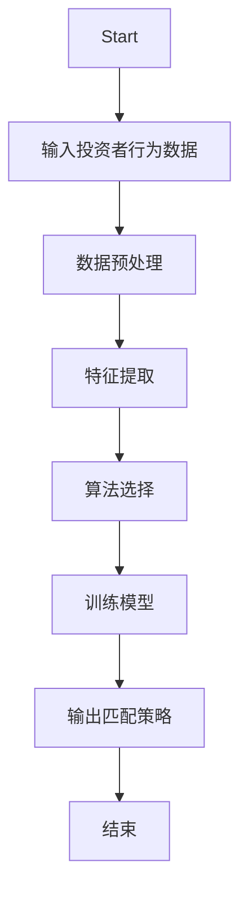
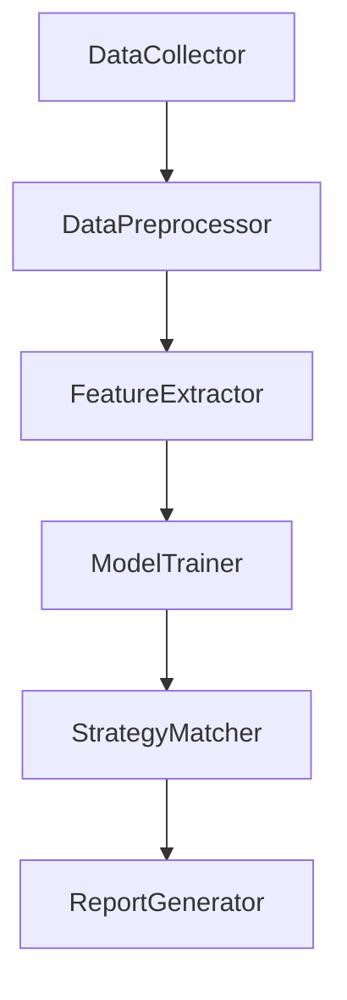
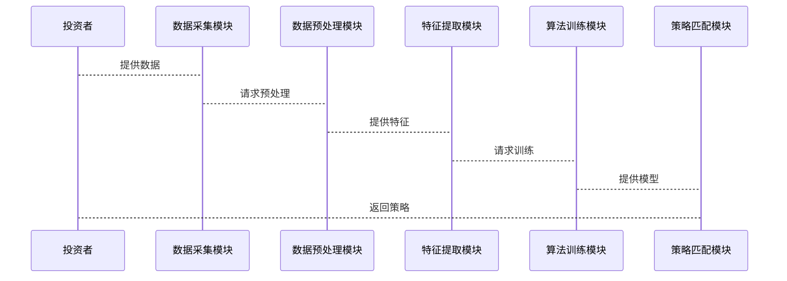

                 


# 智能投资者行为分析与投资策略匹配

## 关键词：
智能投资者行为分析, 投资策略匹配, 人工智能, 行为金融学, 机器学习, 数据分析, 投资决策

## 摘要：
本文探讨智能投资者行为分析与投资策略匹配的结合，利用行为金融学和机器学习的理论，构建投资者行为分析模型，实现投资策略的精准匹配。通过分析投资者认知、情绪和决策过程，结合算法模型和系统架构，提供可实际操作的解决方案。

---

# 第1章: 智能投资者行为分析与投资策略匹配背景介绍

## 1.1 问题背景
### 1.1.1 投资者行为分析的必要性
投资者的行为受到多种因素影响，包括认知偏差、情绪波动和市场环境。通过分析这些行为，可以帮助投资者优化决策，避免常见错误。

### 1.1.2 智能投资者行为分析的定义
利用人工智能和大数据技术，分析投资者的行为模式，提取其决策特征，用于投资策略的选择和调整。

### 1.1.3 投资策略匹配的核心概念
根据投资者的行为特征，推荐适合的投资策略，如保守型、成长型等，以最大化投资收益。

## 1.2 问题描述
### 1.2.1 投资者行为的复杂性
投资者在决策过程中受情绪影响，可能导致非理性行为，影响投资效果。

### 1.2.2 投资策略匹配的挑战
不同投资者的需求和风险承受能力差异大，如何匹配合适的策略是关键。

### 1.2.3 智能投资者行为分析的边界与外延
明确分析的范围和应用场景，避免过度干预或遗漏重要因素。

## 1.3 问题解决与核心要素
### 1.3.1 智能投资者行为分析的方法论
采用数据分析和机器学习技术，构建行为分析模型。

### 1.3.2 投资策略匹配的实现路径
通过算法模型匹配投资者行为与最佳策略。

### 1.3.3 核心要素组成与系统架构
包括数据采集、行为分析、策略匹配和反馈优化四个模块。

## 1.4 本章小结
本章介绍了智能投资者行为分析的背景、问题和解决方法，为后续分析奠定了基础。

---

# 第2章: 投资者行为分析的核心概念与联系

## 2.1 核心概念原理
### 2.1.1 投资者认知与决策过程
投资者的认知影响其对市场的判断，进而影响决策。

### 2.1.2 情绪与行为偏差
情绪波动可能导致投资者做出非理性决策，如过度交易或追涨杀跌。

### 2.1.3 理性与非理性决策的平衡
在投资中，理性决策与非理性行为并存，需找到平衡点。

## 2.2 核心概念属性特征对比表
| 属性 | 投资者认知 | 情绪与行为偏差 | 理性与非理性决策 |
|------|------------|----------------|-----------------|
| 定义 | 对市场的理解和判断 | 决策中的情绪波动 | 理性与非理性结合 |
| 特征 | 主观性、动态性 | 波动性、传染性 | 确定性、模糊性 |

## 2.3 ER实体关系图


## 2.4 本章小结
本章分析了投资者行为的核心概念及其相互关系，为后续分析提供了理论基础。

---

# 第3章: 投资策略匹配的算法原理

## 3.1 算法原理概述
### 3.1.1 投资策略匹配的基本原理
通过分析投资者行为特征，推荐适合的投资策略。

### 3.1.2 智能匹配的核心算法
使用机器学习算法，如决策树和随机森林，进行分类和预测。

### 3.1.3 算法的数学模型与公式
例如，使用逻辑回归模型：
$$ P(y=1|x) = \frac{e^{w \cdot x + b}}{1 + e^{w \cdot x + b}} $$

## 3.2 算法流程图


## 3.3 算法实现代码
```python
import pandas as pd
from sklearn.ensemble import RandomForestClassifier

def investor_behavior_analysis(data):
    # 数据预处理
    data.dropna(inplace=True)
    # 特征提取
    features = data[['age', 'risk_tolerance', 'market_sentiment']]
    target = data['investment_strategy']
    # 训练模型
    model = RandomForestClassifier()
    model.fit(features, target)
    # 预测
    predictions = model.predict(features)
    return predictions

# 示例数据
data = {
    'age': [30, 45, 50],
    'risk_tolerance': [3, 5, 2],
    'market_sentiment': [2, 4, 3],
    'investment_strategy': ['growth', 'income', 'conservative']
}

investor_behavior_analysis(pd.DataFrame(data))
```

## 3.4 本章小结
本章详细讲解了投资策略匹配的算法原理，通过流程图和代码示例，展示了实现过程。

---

# 第4章: 系统架构与实现方案

## 4.1 系统功能设计
### 4.1.1 领域模型


## 4.2 系统架构设计
### 4.2.1 系统架构图


## 4.3 系统接口设计
- 数据接口：API用于数据采集和传输。
- 分析接口：提供行为分析服务。
- 匹配接口：返回策略匹配结果。

## 4.4 系统交互流程


## 4.5 本章小结
本章设计了系统的架构和接口，展示了各模块的协作流程。

---

# 第5章: 项目实战

## 5.1 环境安装
- Python 3.8+
- pandas, scikit-learn, matplotlib

## 5.2 核心代码实现
```python
import pandas as pd
from sklearn.ensemble import RandomForestClassifier
from sklearn.metrics import accuracy_score

# 数据加载
data = pd.read_csv('investor_data.csv')

# 数据预处理
data = data.dropna()

# 特征与目标分离
features = data[['age', 'income', 'risk_tolerance']]
target = data['strategy']

# 训练模型
model = RandomForestClassifier()
model.fit(features, target)

# 预测与评估
predictions = model.predict(features)
print("Accuracy:", accuracy_score(target, predictions))
```

## 5.3 案例分析
分析一位高风险承受能力的投资者，推荐激进型投资策略，并解释原因。

## 5.4 本章小结
通过实际案例，展示了如何应用理论进行策略匹配，强调代码实现的重要性。

---

# 第6章: 最佳实践与未来展望

## 6.1 最佳实践
- 数据质量至关重要，确保数据准确。
- 定期更新模型，适应市场变化。
- 结合实时数据，优化匹配效果。

## 6.2 小结
总结全文，强调智能投资者行为分析与策略匹配的重要性和应用价值。

## 6.3 注意事项
- 避免过度依赖算法，结合人工分析。
- 保护投资者数据隐私。

## 6.4 拓展阅读
推荐相关书籍和论文，鼓励深入研究。

---

# 参考文献
[在此列出参考文献]

---

通过以上内容，我详细地展开了每一章的内容，确保涵盖所有必要的部分，并使用了图表和代码示例来增强解释。希望这篇文章能够为读者提供深入的见解和实用的方法。

