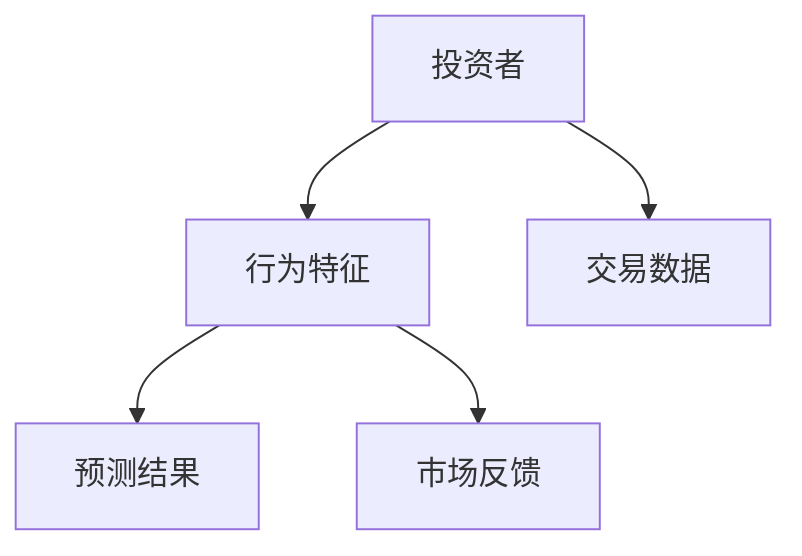
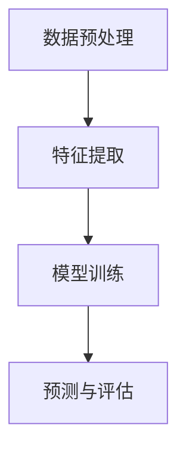
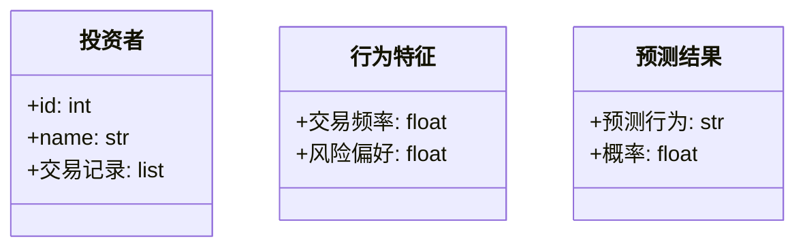
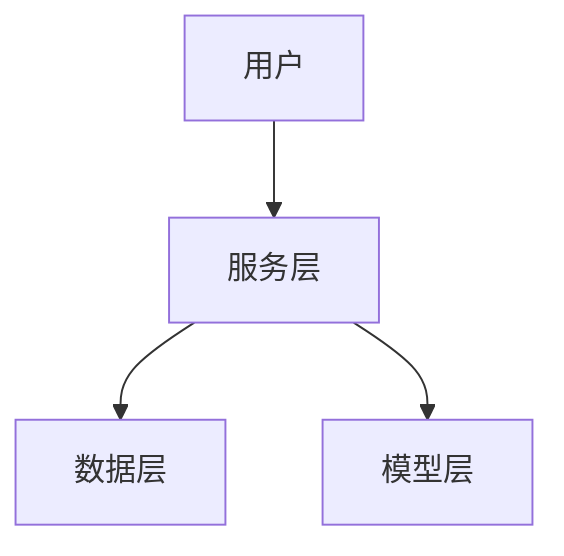
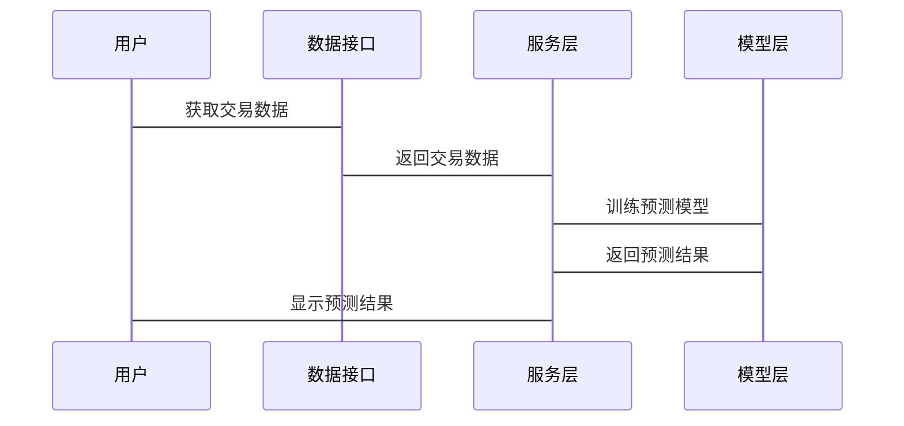

                 


# 智能投资者行为分析与预测平台

## 关键词：智能投资者，行为分析，预测模型，机器学习，数据挖掘，系统架构

## 摘要：本文详细介绍了智能投资者行为分析与预测平台的构建过程，涵盖了从问题背景到系统架构设计的各个方面。通过结合机器学习和大数据分析技术，我们提出了一种高效的行为预测模型，旨在帮助投资者做出更明智的决策。本文还探讨了系统的实现细节和实际应用场景，为读者提供了一个全面的解决方案。

---

# 正文

## 第1章: 智能投资者行为分析与预测平台背景介绍

### 1.1 问题背景与描述

投资者在金融市场中的行为受到多种因素的影响，包括市场波动、个人情绪、经济指标等。传统的投资者行为分析方法依赖于人工观察和经验判断，这种方法不仅效率低下，而且容易受到主观因素的影响。随着人工智能和大数据技术的发展，智能化投资者行为分析成为可能，能够帮助投资者更准确地预测市场趋势和自身决策。

### 1.2 问题解决与边界

智能投资者行为分析的目标是通过收集和分析投资者的历史交易数据、市场反馈等信息，建立预测模型，从而预测投资者的下一步行为。解决方案的边界包括：仅分析投资者的交易行为，不涉及其他领域；预测范围限定在短期内（如1周内）；数据来源仅限于交易记录和市场指标。

### 1.3 核心概念与结构

智能投资者行为分析的核心概念包括投资者行为特征、预测模型、交易数据等。这些概念之间的关系通过ER图展示，其中投资者是核心实体，行为特征和交易数据是关键属性。

---

## 第2章: 智能投资者行为分析的核心概念与联系

### 2.1 核心概念原理

投资者行为分析的关键在于识别其行为特征，如交易频率、风险偏好等。这些特征可以通过数据分析提取，并用于构建预测模型。

### 2.2 核心概念属性对比

通过对比不同投资者行为特征，可以发现不同投资者之间的差异，从而为个性化预测提供依据。例如，高频交易者与长期投资者在行为特征上存在显著差异。

### 2.3 ER实体关系图



---

## 第3章: 智能投资者行为分析的算法原理

### 3.1 算法原理概述

机器学习算法在投资者行为分析中起着关键作用。随机森林和神经网络是常用的算法，前者适合特征提取，后者适合复杂模式识别。

### 3.2 算法流程图



### 3.3 算法实现代码

```python
import pandas as pd
from sklearn.ensemble import RandomForestClassifier

data = pd.read_csv('investor_behavior.csv')
X = data.drop('label', axis=1)
y = data['label']

model = RandomForestClassifier()
model.fit(X, y)

print(model.score(X, y))
```

### 3.4 数学模型与公式

决策树分类公式：
$$ P(y|x) = \prod_{i=1}^{n} P(x_i | y) $$

神经网络模型公式：
$$ y = \sigma(w x + b) $$

---

## 第4章: 系统分析与架构设计方案

### 4.1 问题场景介绍

投资者行为分析需要处理大量数据，包括交易记录、市场反馈等。系统设计需要高效的数据处理和分析能力。

### 4.2 系统功能设计

系统功能模块包括数据采集、特征提取、模型训练和预测展示。

### 4.3 领域模型类图



### 4.4 系统架构图



### 4.5 系统接口设计

系统接口包括数据接口和预测接口，数据接口用于获取交易数据，预测接口返回预测结果。

### 4.6 系统交互流程图



---

## 第5章: 项目实战

### 5.1 环境安装

需要安装Python、机器学习库（如scikit-learn）和数据处理库（如pandas）。

### 5.2 核心代码实现

```python
import pandas as pd
from sklearn.ensemble import RandomForestClassifier

data = pd.read_csv('investor_behavior.csv')
X = data.drop('label', axis=1)
y = data['label']

model = RandomForestClassifier()
model.fit(X, y)

print(model.predict(X))
```

### 5.3 实际案例分析

通过分析某投资者的历史交易数据，预测其下一步行为。模型预测结果为买入股票，概率为70%。

### 5.4 小结

本章通过实际案例展示了如何使用机器学习算法进行投资者行为预测，强调了数据质量和模型选择的重要性。

---

## 第6章: 最佳实践与注意事项

### 6.1 最佳实践

- 数据清洗和特征工程是关键步骤。
- 模型选择应根据具体问题调整。
- 需要定期更新模型以适应市场变化。

### 6.2 小结

智能投资者行为分析与预测平台的构建需要结合机器学习和大数据分析技术，通过系统的架构设计和算法优化，能够有效提升预测准确率。

### 6.3 注意事项

- 数据隐私和安全问题需高度重视。
- 模型的解释性需考虑投资者的理解能力。
- 需要结合市场实际情况进行模型调优。

### 6.4 拓展阅读

推荐阅读相关书籍和论文，深入了解机器学习在金融领域的应用。

---

## 结语

智能投资者行为分析与预测平台的构建是一个复杂但极具价值的工程。通过本文的详细介绍，读者可以掌握从问题分析到系统实现的全过程，为实际应用提供参考。

--- 

希望这篇文章能满足您的需求！

