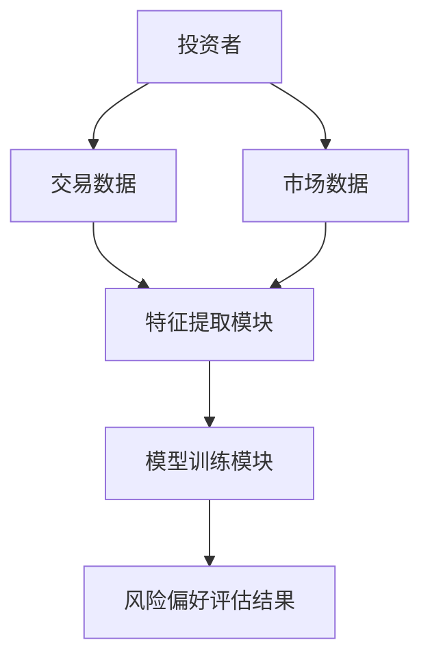
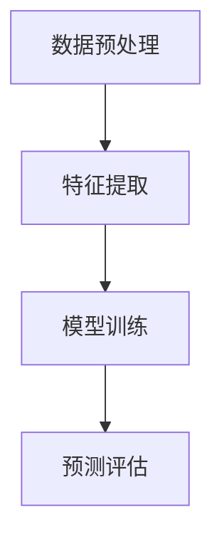
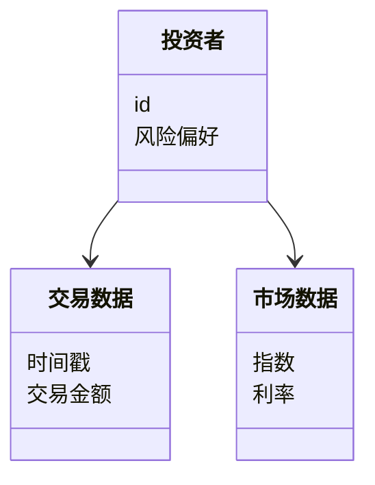
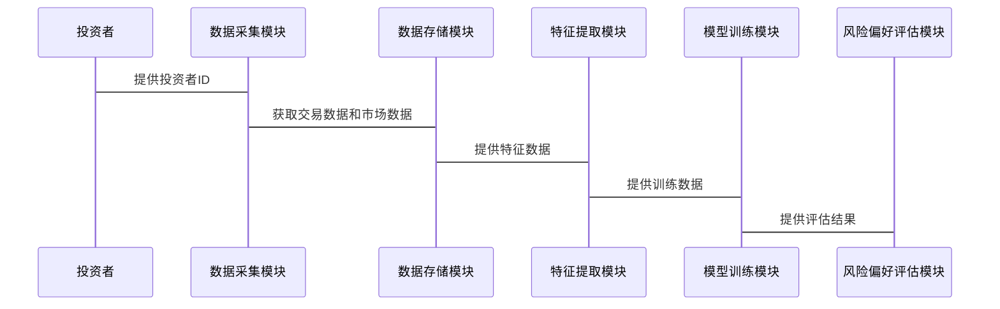

                 


# 智能投资者风险偏好动态评估

> 关键词：投资者风险偏好、动态评估、机器学习、系统架构、项目实战

> 摘要：本文系统地探讨了智能投资者风险偏好动态评估的核心概念、算法原理、系统架构和项目实现。通过背景介绍、核心概念分析、算法设计、系统实现等多方面的深入探讨，旨在为投资者提供一种动态、精准的风险偏好评估方法，助力投资决策的优化。

---

## 第1章 风险偏好动态评估的背景与核心概念

### 1.1 问题背景与目标

#### 1.1.1 风险偏好评估的背景与意义
在金融市场中，投资者的行为和决策受到风险偏好的显著影响。传统上，投资者的风险偏好是静态的，即假设在一段时间内投资者的风险承受能力不变。然而，市场环境的变化（如经济波动、政策调整）以及投资者个人情况的变化（如资产规模、生命周期阶段）都会导致其风险偏好的动态变化。因此，动态评估投资者的风险偏好具有重要的现实意义。

#### 1.1.2 风险偏好评估的局限性
- **静态评估的局限性**：传统的风险偏好评估方法假设投资者的风险偏好是固定的，忽视了市场环境和个人情况的变化。
- **数据不足**：传统的评估方法通常依赖于问卷调查或历史交易数据，难以捕捉投资者在不同市场条件下的实时行为。
- **模型的简化假设**：大多数传统模型假设投资者是理性的，忽视了投资者的心理因素和行为偏差。

#### 1.1.3 动态评估的目标
动态评估的核心目标是实时捕捉投资者风险偏好的变化，并根据这些变化提供动态的资产配置建议。

---

### 1.2 核心概念与系统架构

#### 1.2.1 风险偏好评估的系统模型
风险偏好动态评估系统是一个复杂的系统，包括数据采集、特征提取、模型训练、实时评估等多个模块。

#### 1.2.2 动态评估的核心要素
- **数据源**：包括投资者的交易数据、市场数据、投资者行为数据等。
- **特征提取**：从数据中提取与风险偏好相关的特征，如波动性、收益敏感性等。
- **模型训练**：基于历史数据训练模型，预测投资者的风险偏好变化。
- **实时评估**：根据实时数据更新投资者的风险偏好评估结果。

#### 1.2.3 系统架构的初步设想


---

## 第2章 风险偏好动态评估的算法原理

### 2.1 动态评估的数学模型

#### 2.1.1 风险偏好评估的基本公式
$$ R_i(t) = \alpha \cdot R_i(t-1) + \beta \cdot \Delta t $$
其中，$R_i(t)$ 表示投资者 $i$ 在时间 $t$ 的风险偏好，$\alpha$ 和 $\beta$ 是模型参数。

#### 2.1.2 动态评估的数学模型
$$ R_i(t) = f(R_i(t-1), S(t), P(t)) $$
其中，$S(t)$ 表示市场状态，$P(t)$ 表示投资者的个人特征。

#### 2.1.3 模型的优化与改进
通过引入机器学习算法（如LSTM）来捕捉时间序列中的复杂模式。

### 2.2 算法原理与流程

#### 2.2.1 算法的基本原理
使用LSTM网络对投资者的历史交易数据和市场数据进行建模，预测其风险偏好变化。

#### 2.2.2 算法的实现流程


#### 2.2.3 算法的复杂度分析
LSTM的时间复杂度为$O(T \cdot H)$，其中$T$是时间步数，$H$是隐藏层的大小。

### 2.3 代码实现与案例分析

#### 2.3.1 Python代码实现
```python
import numpy as np
from tensorflow.keras.layers import LSTM, Dense
from tensorflow.keras.models import Sequential

# 数据预处理
data = ...  # 输入数据

# 模型训练
model = Sequential()
model.add(LSTM(50, input_shape=(timesteps, features)))
model.add(Dense(1))
model.compile(loss='mean_squared_error', optimizer='adam')
model.fit(data, epochs=10, batch_size=32)
```

#### 2.3.2 代码的运行与测试
通过回测历史数据验证模型的预测能力。

---

## 第3章 系统分析与架构设计

### 3.1 系统功能设计

#### 3.1.1 领域模型类图


#### 3.1.2 系统架构设计


### 3.2 接口设计与交互流程

#### 3.2.1 系统接口设计
- 输入接口：投资者ID、时间戳。
- 输出接口：风险偏好评估结果。

#### 3.2.2 系统交互流程


---

## 第4章 项目实战

### 4.1 环境安装与配置

#### 4.1.1 开发环境
- Python 3.8+
- TensorFlow 2.0+
- Jupyter Notebook

### 4.2 核心代码实现

#### 4.2.1 数据预处理
```python
import pandas as pd

data = pd.read_csv('data.csv')
data['date'] = pd.to_datetime(data['date'])
data.set_index('date', inplace=True)
```

#### 4.2.2 模型实现
```python
model = Sequential()
model.add(LSTM(50, input_shape=(timesteps, features)))
model.add(Dense(1))
model.compile(loss='mean_squared_error', optimizer='adam')
```

### 4.3 案例分析与结果解读

#### 4.3.1 回测分析
- 训练模型并在历史数据上进行回测，计算准确率和MAE等指标。

### 4.4 项目总结
通过项目实战，验证了动态评估模型的有效性，并展示了其在实际投资中的应用价值。

---

## 第5章 最佳实践与总结

### 5.1 小结
动态评估投资者风险偏好是一种重要的方法，能够帮助投资者更好地应对市场变化。

### 5.2 注意事项
- 数据的实时性和准确性。
- 模型的鲁棒性和可解释性。

### 5.3 未来展望
探索更复杂的模型（如Transformer）在风险偏好评估中的应用。

### 5.4 拓展阅读
建议读者阅读相关领域的最新论文和书籍，深入理解动态评估的前沿技术。

