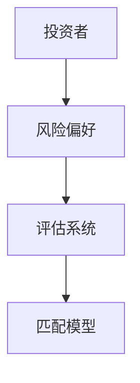
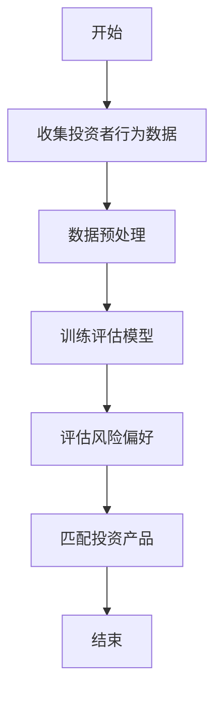
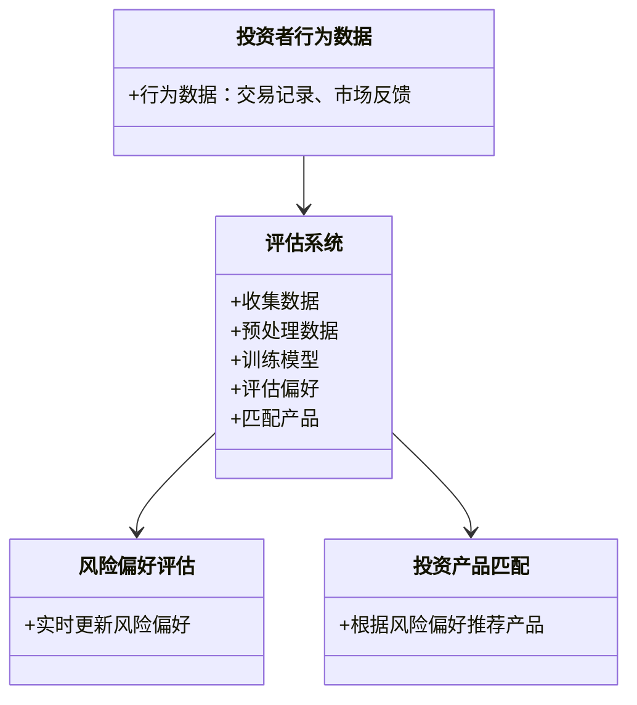
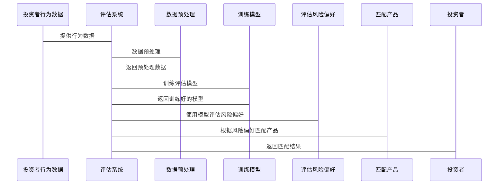

                 


# 智能投资者风险偏好动态评估与产品匹配

> 关键词：智能投资者，风险偏好动态评估，产品匹配，机器学习，金融系统架构

> 摘要：本文深入探讨智能投资者的风险偏好动态评估与产品匹配问题。通过分析投资者行为数据和市场变化，结合机器学习算法和系统架构设计，构建一个动态调整投资者风险偏好的模型，并实现个性化投资产品的精准匹配。文章从背景、概念、算法、系统架构、项目实战到最佳实践，全面阐述这一主题，为投资领域提供新的视角和解决方案。

---

## 第一部分：背景介绍

### 第1章：问题背景与目标

#### 1.1 投资者风险偏好评估的背景

- **传统投资决策的局限性**：传统的投资决策往往基于静态的投资者风险偏好评估，这种方法忽略了市场变化和投资者行为的动态性，可能导致投资策略与实际需求脱节。
- **风险偏好在投资中的重要性**：投资者的风险偏好直接影响其投资行为和决策，是制定个性化投资策略的核心依据。
- **动态评估的必要性**：市场环境和个人财务状况的变化会影响投资者的风险偏好，动态评估能够及时捕捉这些变化，优化投资策略。

#### 1.2 动态评估的核心目标

- **风险偏好的动态变化**：投资者的风险偏好并非一成不变，会受到市场波动、个人财务状况和心理因素的影响。
- **个性化投资策略的需求**：通过动态评估，为每位投资者量身定制适合其当前风险偏好的投资策略。
- **提高投资效率的目标**：动态评估能够帮助投资者在市场变化中及时调整投资组合，提高投资效率和收益。

#### 1.3 与传统评估方法的区别

- **传统静态评估的局限性**：传统评估方法通常基于历史数据和静态模型，无法适应市场的实时变化。
- **动态评估的优势**：动态评估能够实时捕捉投资者行为和市场变化，提供更精准的评估结果。
- **适应市场变化的能力**：动态评估能够根据市场波动和投资者行为变化，实时调整评估模型和策略。

### 第2章：核心概念与联系

#### 2.1 核心概念的定义与属性

- **智能投资者**：智能投资者是指通过技术手段（如机器学习、大数据分析）来优化投资决策的投资者。
- **风险偏好**：风险偏好是指投资者对风险的容忍程度和追求收益的态度。
- **动态评估系统**：动态评估系统是一种能够实时更新和调整投资者风险偏好的评估系统。

#### 2.2 核心概念的对比分析

| 比较维度 | 智能投资者 | 风险偏好 | 动态评估系统 |
|----------|------------|-----------|--------------|
| 定义     | 基于技术优化投资决策的投资者 | 投资者对风险的容忍程度 | 实时更新风险偏好的评估系统 |
| 属性     | 数据驱动、个性化、动态调整 | 风险厌恶、风险中性、风险寻求 | 实时性、动态性、准确性 |
| 关系     | 智能投资者的核心特征 | 风险偏好是投资决策的基础 | 动态评估系统用于优化风险偏好 |

#### 2.3 ER实体关系图



---

## 第二部分：算法原理与数学模型

### 第3章：动态评估的算法原理

#### 3.1 动态评估的算法流程



#### 3.2 算法实现代码

```python
import pandas as pd
from sklearn.metrics.pairwise import cosine_similarity

# 数据预处理
def preprocess_data(data):
    # 假设data是投资者行为数据
    # 这里进行归一化处理
    normalized_data = (data - data.mean()) / data.std()
    return normalized_data

# 训练评估模型
def train_model(normalized_data):
    # 使用机器学习模型（如协同过滤）进行训练
    # 返回模型
    pass

# 风险偏好评估
def evaluate_preference(model, normalized_data):
    # 使用模型预测风险偏好
    preferences = model.predict(normalized_data)
    return preferences

# 投资产品匹配
def match_products(preferences, products):
    # 根据风险偏好匹配适合的投资产品
    matched_products = []
    for pref in preferences:
        matched_products.append(find_best_product(pref))
    return matched_products
```

#### 3.3 数学模型与公式

- **风险偏好的计算公式**
  $$ R = \sum_{i=1}^{n} w_i \cdot x_i $$
  其中，$R$ 表示风险偏好，$w_i$ 表示第 $i$ 个因素的权重，$x_i$ 表示第 $i$ 个因素的值。

- **相似性计算公式（如余弦相似度）**
  $$ \text{similarity} = \frac{\sum_{i=1}^{n} x_i y_i}{\sqrt{\sum_{i=1}^{n} x_i^2} \cdot \sqrt{\sum_{i=1}^{n} y_i^2}} $$

---

## 第三部分：系统架构与实现

### 第4章：系统架构设计

#### 4.1 系统功能设计



#### 4.2 系统架构实现

- **数据接口设计**
  - 数据输入接口：接收投资者行为数据。
  - 数据输出接口：输出评估结果和匹配产品。

- **系统交互流程**



---

## 第四部分：项目实战与分析

### 第5章：项目实战

#### 5.1 环境安装

- **安装Python和相关库**
  ```bash
  pip install pandas scikit-learn matplotlib
  ```

#### 5.2 核心代码实现

```python
import pandas as pd
from sklearn.cluster import KMeans

# 数据加载
data = pd.read_csv('investor_behavior.csv')

# 数据预处理
processed_data = preprocess_data(data)

# 训练模型
model = train_model(processed_data)

# 评估风险偏好
preferences = evaluate_preference(model, processed_data)

# 匹配产品
matched_products = match_products(preferences, products)
```

#### 5.3 案例分析

- **案例背景**：假设一位投资者的风险偏好在市场波动后发生了变化。
- **数据分析**：通过机器学习模型实时更新风险偏好。
- **产品匹配**：根据新的风险偏好匹配适合的投资产品。

---

## 第五部分：最佳实践与总结

### 第6章：最佳实践

- **实时数据更新**：确保投资者行为数据的实时更新，以捕捉市场变化。
- **模型优化**：定期优化评估模型，提高评估精度。
- **用户隐私保护**：保护投资者数据隐私，确保系统安全性。

### 6.2 小结

- 动态评估的核心在于实时捕捉投资者行为和市场变化，优化投资策略。
- 通过机器学习和系统架构设计，可以实现高效的风险偏好评估和产品匹配。
- 未来的发展方向包括引入更多数据源和优化算法性能。

### 6.3 注意事项

- 数据质量和完整性直接影响评估结果，需谨慎处理。
- 系统性能优化是关键，确保实时处理能力。
- 用户体验设计需考虑投资者的使用习惯和需求。

### 6.4 拓展阅读

- 推荐阅读相关领域的书籍和论文，深入理解动态评估和机器学习的应用。

---

通过以上分析和实现，我们可以看到智能投资者风险偏好动态评估与产品匹配的关键在于实时数据处理、机器学习模型的应用和系统架构的设计。这种动态调整的方法能够帮助投资者在复杂多变的市场中做出更明智的投资决策。

