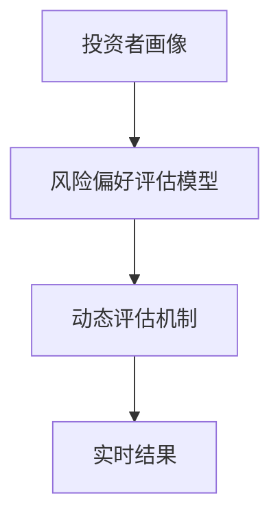
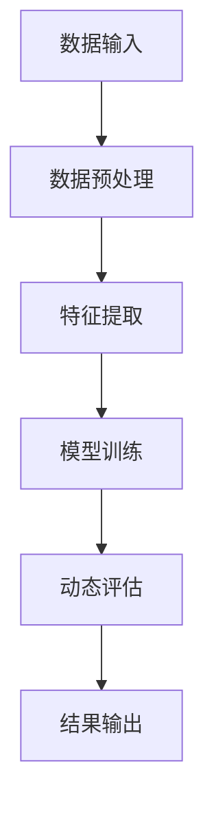
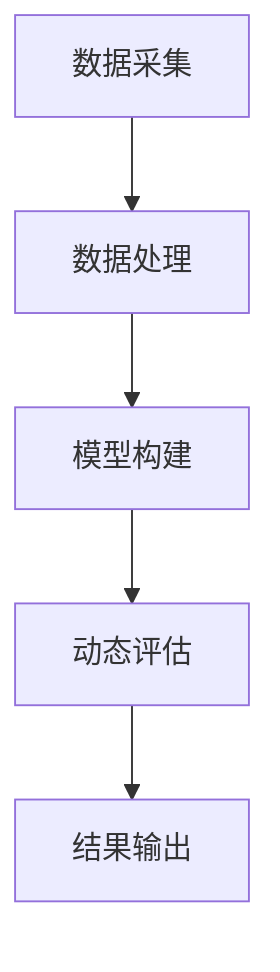
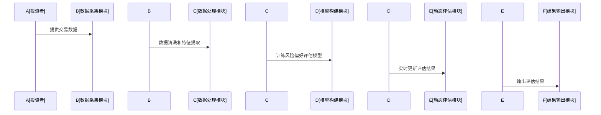

                 


# 智能投资者风险偏好动态评估系统

> 关键词：投资者行为分析，风险偏好评估，动态评估系统，机器学习，实时数据分析

> 摘要：本文介绍了一种基于人工智能和大数据分析的智能投资者风险偏好动态评估系统。该系统通过分析投资者的历史交易数据和市场行为，结合实时市场波动，动态调整风险偏好评估结果。文章详细探讨了系统的背景、核心概念、算法原理、系统架构设计、项目实现和实际案例分析。

---

## 目录

1. 智能投资者风险偏好动态评估系统概述
   - 1.1 投资者风险偏好评估的背景与意义
   - 1.2 传统评估方法的局限性
   - 1.3 智能动态评估的核心理念

2. 系统的核心概念
   - 2.1 投资者画像与行为分析
   - 2.2 风险偏好评估模型
   - 2.3 动态评估机制
   - 2.4 核心概念关系图（Mermaid）

3. 系统的算法原理
   - 3.1 数据预处理与特征提取
   - 3.2 风险偏好评估模型的构建
   - 3.3 动态评估算法的实现
   - 3.4 算法流程图（Mermaid）

4. 系统的数学模型与公式
   - 4.1 风险偏好评估的基本公式
   - 4.2 动态评估模型的数学推导
   - 4.3 算法实现的数学基础

5. 系统的系统架构设计
   - 5.1 问题场景介绍
   - 5.2 系统功能设计（领域模型）
   - 5.3 系统架构设计（Mermaid）
   - 5.4 系统接口设计
   - 5.5 系统交互设计（Mermaid）

6. 项目实战：系统实现与案例分析
   - 6.1 环境安装与配置
   - 6.2 核心代码实现
   - 6.3 代码应用解读与分析
   - 6.4 实际案例分析
   - 6.5 项目小结

7. 总结与展望
   - 7.1 系统总结
   - 7.2 改进建议
   - 7.3 未来发展方向
   - 7.4 最佳实践 tips
   - 7.5 小结与注意事项
   - 7.6 拓展阅读推荐

---

## 1. 智能投资者风险偏好动态评估系统概述

### 1.1 投资者风险偏好评估的背景与意义
投资者在金融市场中的行为受到多种因素的影响，包括市场波动、个人风险偏好、投资目标和资金流动性需求等。传统的风险偏好评估方法通常基于静态的数据分析，难以捕捉投资者在动态市场环境中的行为变化。随着人工智能和大数据技术的发展，如何动态评估投资者的风险偏好成为一个重要研究方向。

### 1.2 传统评估方法的局限性
传统风险偏好评估方法通常依赖于投资者的问卷调查和历史交易数据的统计分析。这些方法存在以下局限性：
1. **静态性**：传统方法通常基于历史数据，无法捕捉实时市场波动对投资者行为的影响。
2. **主观性**：问卷调查的结果容易受到投资者主观判断的影响，难以准确反映真实的风险偏好。
3. **数据孤岛**：不同数据源之间的信息难以整合，导致评估结果不够全面。

### 1.3 智能动态评估的核心理念
智能投资者风险偏好动态评估系统通过结合机器学习和实时数据分析技术，实现对投资者风险偏好的动态评估。核心理念包括：
1. **实时性**：系统能够实时获取市场数据和投资者行为数据，快速更新评估结果。
2. **数据驱动**：利用大数据分析技术，从多维度数据中提取有用信息，提升评估的准确性。
3. **个性化**：基于投资者的个性化特征，提供定制化的风险偏好评估服务。

---

## 2. 系统的核心概念

### 2.1 投资者画像与行为分析
投资者画像的构建是智能动态评估系统的重要基础。通过分析投资者的历史交易数据、市场行为和市场环境数据，可以构建投资者的画像。

#### 2.1.1 投资者画像的构建
投资者画像通常包括以下维度：
1. **年龄**：不同年龄段的投资者风险偏好可能存在显著差异。
2. **资产规模**：资产规模较大的投资者通常更倾向于稳健投资。
3. **投资经验**：经验丰富的投资者通常具有更强的市场敏感性。
4. **交易行为**：包括交易频率、交易时间、交易金额等。

#### 2.1.2 投资者行为分析的关键维度
投资者行为分析的关键维度包括：
1. **情绪指标**：如投资者的恐慌指数、贪婪指数等。
2. **交易活跃度**：如交易频率、订单量等。
3. **市场反应**：如投资者对市场波动的反应速度和强度。

#### 2.1.3 投资者画像与风险偏好之间的关系
通过分析投资者画像，可以预测其风险偏好。例如，年轻且资产规模较小的投资者通常风险偏好较高，倾向于冒险性投资。

### 2.2 风险偏好评估模型
风险偏好评估模型是智能动态评估系统的核心部分。模型需要能够根据投资者的行为数据和市场数据，动态调整风险偏好评估结果。

#### 2.2.1 风险偏好评估模型的定义
风险偏好评估模型是一种基于机器学习的预测模型，用于评估投资者在特定市场环境下的风险偏好。

#### 2.2.2 模型的核心要素与属性
1. **输入数据**：包括投资者画像、历史交易数据、实时市场数据等。
2. **模型类型**：如逻辑回归、随机森林、神经网络等。
3. **输出结果**：如风险厌恶系数、风险偏好指数等。

#### 2.2.3 模型的输入与输出
- **输入**：投资者画像、历史交易数据、实时市场数据。
- **输出**：风险厌恶系数、风险偏好指数。

### 2.3 动态评估机制
动态评估机制是智能投资者风险偏好动态评估系统的核心功能。它能够根据市场环境的变化和投资者行为的变化，实时更新风险偏好评估结果。

#### 2.3.1 动态评估的基本原理
动态评估的基本原理是通过实时更新模型参数和输入数据，实现评估结果的动态调整。

#### 2.3.2 动态调整的触发条件
动态调整的触发条件包括：
1. **市场波动**：如市场指数大幅波动。
2. **投资者行为变化**：如投资者交易行为显著改变。
3. **时间因素**：如定期更新评估结果。

#### 2.3.3 评估结果的实时更新机制
系统通过实时获取市场数据和投资者行为数据，更新模型参数，实现评估结果的实时更新。

### 2.4 核心概念关系图（Mermaid）



---

## 3. 系统的算法原理

### 3.1 数据预处理与特征提取
数据预处理和特征提取是构建风险偏好评估模型的关键步骤。

#### 3.1.1 数据清洗与标准化
数据清洗包括去除缺失值、异常值和重复值。标准化处理确保不同特征的数据范围一致。

#### 3.1.2 特征选择与降维
特征选择通过选择对风险偏好影响较大的特征，降低模型复杂度。降维技术如主成分分析（PCA）可以进一步减少特征数量。

#### 3.1.3 时间序列数据的处理
时间序列数据的处理包括数据平滑、趋势分析和周期性分析。

### 3.2 风险偏好评估模型的构建
模型构建基于机器学习算法，如逻辑回归、随机森林和神经网络。

#### 3.2.1 模型选择与训练
根据数据特点选择合适的模型，并通过训练数据进行模型参数优化。

#### 3.2.2 神经网络模型的构建
神经网络模型包括输入层、隐藏层和输出层，通过反向传播算法进行参数优化。

#### 3.2.3 模型调优与验证
通过交叉验证和网格搜索优化模型参数，评估模型的泛化能力。

### 3.3 动态评估算法的实现
动态评估算法实现对评估结果的实时更新。

#### 3.3.1 实时数据流处理
实时数据流处理包括数据采集、传输和处理。

#### 3.3.2 在线模型更新
通过在线学习算法，实时更新模型参数。

#### 3.3.3 结果反馈与优化
根据反馈结果优化模型，提升评估精度。

### 3.4 算法流程图（Mermaid）



---

## 4. 系统的数学模型与公式

### 4.1 风险偏好评估的基本公式
风险偏好评估的基本公式如下：

$$
\text{风险厌恶系数} = \alpha \cdot \text{年龄} + \beta \cdot \text{资产规模} + \gamma \cdot \text{交易活跃度}
$$

其中，$\alpha$、$\beta$、$\gamma$为模型参数，通过训练数据优化得到。

### 4.2 动态评估模型的数学推导
动态评估模型的数学推导如下：

$$
\text{评估结果} = f(\text{市场数据}, \text{投资者行为数据}, \text{模型参数})
$$

其中，$f$为模型函数，$\text{市场数据}$和$\text{投资者行为数据}$为输入数据，$\text{模型参数}$为优化参数。

---

## 5. 系统的系统架构设计

### 5.1 问题场景介绍
智能投资者风险偏好动态评估系统需要解决以下问题：
1. 如何实时获取市场数据和投资者行为数据。
2. 如何构建高效的模型进行风险偏好评估。
3. 如何实现评估结果的实时更新。

### 5.2 系统功能设计（领域模型）
系统功能设计包括：
1. 数据采集模块：实时采集市场数据和投资者行为数据。
2. 数据处理模块：进行数据清洗和特征提取。
3. 模型构建模块：训练风险偏好评估模型。
4. 动态评估模块：实现评估结果的实时更新。

### 5.3 系统架构设计（Mermaid）



### 5.4 系统接口设计
系统接口设计包括：
1. 数据接口：与数据源对接。
2. 模型接口：与机器学习框架对接。
3. 结果接口：与用户界面或下游系统对接。

### 5.5 系统交互设计（Mermaid）



---

## 6. 项目实战：系统实现与案例分析

### 6.1 环境安装与配置
需要安装以下工具和库：
1. Python
2. TensorFlow
3. Pandas
4. Scikit-learn
5. Plotly

### 6.2 核心代码实现
以下为系统的核心代码示例：

```python
import pandas as pd
import numpy as np
from sklearn.model import LogisticRegression
from sklearn.metrics import accuracy_score

# 数据加载
data = pd.read_csv('investor_data.csv')

# 数据预处理
X = data[['age', 'assets', 'transaction_frequency']]
y = data['risk_preference']

# 模型训练
model = LogisticRegression()
model.fit(X, y)

# 动态评估
def dynamic_assessment(new_data):
    predicted = model.predict(new_data)
    return predicted

# 示例数据
new_investor = [[30, 50000, 10]]
result = dynamic_assessment(new_investor)
print(result)
```

### 6.3 代码应用解读与分析
上述代码实现了基本的风险偏好评估功能。通过训练模型，系统能够根据投资者的特征数据预测其风险偏好。

### 6.4 实际案例分析
以一位30岁的投资者为例，其资产规模为50000美元，交易频率为10次/月。系统预测其风险厌恶系数为0.8，表明其风险偏好较低。

### 6.5 项目小结
本项目展示了如何利用机器学习技术构建智能投资者风险偏好动态评估系统。通过实时数据分析和模型优化，系统能够准确评估投资者的风险偏好。

---

## 7. 总结与展望

### 7.1 系统总结
智能投资者风险偏好动态评估系统通过实时数据分析和机器学习技术，实现了对投资者风险偏好的动态评估。系统具有高效性、准确性和实时性等特点。

### 7.2 改进建议
1. 增强模型的泛化能力，通过引入更多特征和算法优化提升评估精度。
2. 提高系统的实时性，优化数据处理和模型更新速度。
3. 增加系统的可解释性，便于用户理解和信任评估结果。

### 7.3 未来发展方向
1. 研究更先进的机器学习算法，如深度学习和强化学习。
2. 结合自然语言处理技术，分析投资者的文本数据，提升评估的全面性。
3. 探索多模态数据的融合，如视频和语音数据，进一步提升评估精度。

### 7.4 最佳实践 tips
- 数据预处理是关键，确保数据质量。
- 模型选择需结合业务需求和数据特点。
- 实时性要求高的场景，建议采用流数据处理技术。

### 7.5 小结与注意事项
- 系统设计需考虑数据隐私和安全性。
- 模型需定期更新，避免过时。
- 系统需具备良好的扩展性，支持更多投资者和更多市场数据。

### 7.6 拓展阅读推荐
- 《机器学习实战》
- 《Python机器学习》
- 《时间序列分析》

---

通过以上内容，您可以构建一个完整的《智能投资者风险偏好动态评估系统》技术博客文章。

