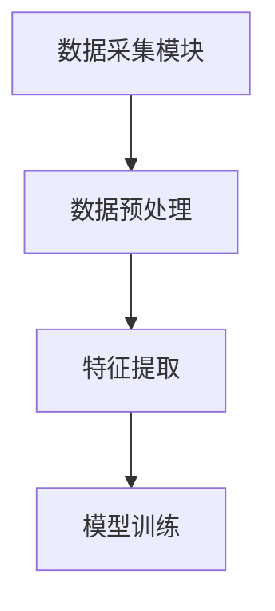
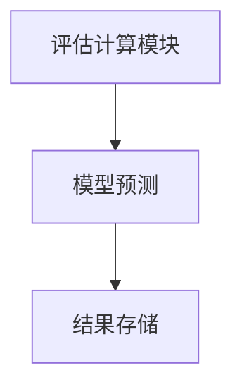
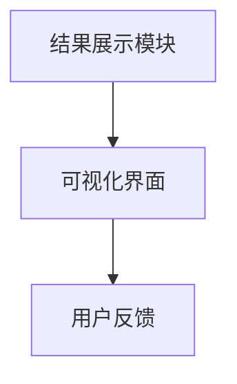

                 


# 智能投资者风险承受能力动态评估

> 关键词：投资者风险承受能力，人工智能，动态评估，金融风险管理，投资决策优化

> 摘要：本文从智能投资者风险承受能力动态评估的背景、核心概念、算法原理、系统架构、项目实战到最佳实践等方面进行深入探讨。通过分析投资者行为特征、影响因素及其与投资决策的关系，结合机器学习算法和系统架构设计，提出一种基于动态评估模型的解决方案，并通过实际案例分析验证其可行性和有效性。本文旨在为金融领域提供一种高效、精准的投资者风险评估方法，帮助投资者和金融机构优化决策、降低风险。

---

## 第一部分: 智能投资者风险承受能力动态评估的背景介绍

### 第1章: 问题背景与定义

#### 1.1 问题背景

##### 1.1.1 投资者风险承受能力的重要性
投资者的风险承受能力是其在面对市场波动时愿意承担风险的程度，是制定个性化投资策略和进行金融风险管理的基础。传统的静态评估方法难以捕捉市场环境和投资者行为的动态变化，导致评估结果的局限性和片面性。

##### 1.1.2 风险承受能力的传统评估方法及其局限性
传统方法主要基于问卷调查和历史数据分析，存在以下问题：
- **主观性**：问卷结果依赖投资者的回答，可能受到情绪和认知偏差的影响。
- **静态性**：评估结果无法实时更新，难以反映市场环境和投资者行为的变化。
- **数据不足**：传统方法依赖有限的历史数据，难以捕捉复杂市场条件下的动态特征。

##### 1.1.3 动态评估的必要性与应用场景
动态评估能够实时捕捉市场波动和投资者行为变化，适用于以下场景：
- 个性化投资建议
- 风险预警与管理
- 投资者教育与服务优化

#### 1.2 智能投资者风险承受能力的定义

##### 1.2.1 风险承受能力的核心概念
风险承受能力是指投资者在面对市场波动时，愿意承担损失的资产比例和心理承受能力的结合。

##### 1.2.2 动态评估的定义与特征
动态评估是一种基于实时数据和机器学习算法的评估方法，具有以下特征：
- **实时性**：能够根据市场环境和投资者行为的变化实时更新评估结果。
- **准确性**：通过机器学习模型捕捉复杂市场条件下的动态特征，提高评估精度。
- **个性化**：针对不同投资者的特征和需求，提供定制化评估。

##### 1.2.3 与投资决策的关系
动态评估结果是制定投资策略的重要依据，能够帮助投资者和金融机构优化决策，降低风险。

#### 1.3 当前研究现状与挑战

##### 1.3.1 学术研究现状
学术界在投资者行为分析、风险偏好建模等方面取得了一定成果，但动态评估的研究仍处于起步阶段。

##### 1.3.2 技术应用中的挑战
- 数据获取难度大
- 模型复杂性高
- 实时性要求高

#### 1.4 动态评估的金融应用价值

##### 1.4.1 个性化投资策略的制定
动态评估结果为投资者提供个性化投资建议，帮助其在不同市场环境下做出最优决策。

##### 1.4.2 金融风险管理的优化
通过动态评估，金融机构能够实时监控投资者的风险承受能力变化，及时调整风险管理策略。

##### 1.4.3 投资者教育与服务的提升
动态评估结果为投资者教育提供数据支持，帮助投资者更好地理解风险与收益的关系。

#### 1.5 投资者行为分析

##### 1.5.1 投资者决策的理性与非理性
投资者在决策过程中既表现出理性特征，也存在情绪化和认知偏差。

##### 1.5.2 风险偏好与行为特征
不同投资者的风险偏好和行为特征差异显著，影响其风险承受能力。

##### 1.5.3 不同类型投资者的风险承受能力差异
机构投资者和散户在风险承受能力上存在显著差异，需要制定不同的评估策略。

---

## 第二部分: 核心概念与联系

### 第2章: 风险承受能力的核心要素

#### 2.1 核心概念的属性特征

##### 2.1.1 风险承受能力的核心属性对比

| 属性 | 特征 | 影响程度 |
|------|------|----------|
| 年龄  | 年龄越大，风险承受能力越低 | 高      |
| 资产规模 | 资产规模越大，风险承受能力越高 | 高      |
| 投资经验 | 经验丰富，风险承受能力较强 | 中高     |

##### 2.1.2 风险认知与风险态度的差异

- **风险认知**：投资者对风险的理解和判断。
- **风险态度**：投资者在面对风险时的态度和行为。

##### 2.1.3 不同市场环境下的表现特征

- **牛市**：投资者风险承受能力较强。
- **熊市**：投资者风险承受能力较弱。

#### 2.2 影响风险承受能力的关键因素

##### 2.2.1 个人特征

- **年龄**：年龄越大，风险承受能力越低。
- **性别**：男性通常风险承受能力较强。
- **收入水平**：收入越高，风险承受能力越强。

##### 2.2.2 投资行为特征

- **交易频率**：交易频繁的投资者风险承受能力较强。
- **资产配置**：资产配置多样化有助于提升风险承受能力。

##### 2.2.3 市场环境特征

- **市场波动性**：市场波动性越大，风险承受能力越低。

---

## 第三部分: 算法原理

### 第3章: 动态评估模型的算法原理

#### 3.1 评估模型的数学模型

##### 3.1.1 数据预处理

```python
# 数据清洗代码示例
import pandas as pd
import numpy as np

data = pd.read_csv('investor_data.csv')
data = data.dropna()
data = pd.get_dummies(data)
```

##### 3.1.2 特征选择

```python
# 特征选择代码示例
from sklearn.feature_selection import SelectKBest

selector = SelectKBest(k=10)
selected_features = selector.fit_transform(data)
```

##### 3.1.3 模型训练

```python
# 模型训练代码示例
from sklearn.ensemble import RandomForestRegressor
from sklearn.model_selection import train_test_split

X_train, X_test, y_train, y_test = train_test_split(selected_features, target, test_size=0.2)
model = RandomForestRegressor(n_estimators=100)
model.fit(X_train, y_train)
```

##### 3.1.4 模型评估

```python
# 模型评估代码示例
from sklearn.metrics import mean_squared_error

y_pred = model.predict(X_test)
print(mean_squared_error(y_test, y_pred))
```

#### 3.2 评估模型的数学公式

##### 3.2.1 线性回归模型

$$ y = \beta_0 + \beta_1x_1 + \beta_2x_2 + \cdots + \beta_nx_n + \epsilon $$

##### 3.2.2 随机森林模型

$$ y = \sum_{i=1}^{n} \text{Tree}(x_i) $$

---

## 第四部分: 系统分析与架构设计

### 第4章: 系统架构设计

#### 4.1 问题场景介绍

##### 4.1.1 系统目标
设计一个智能投资者风险承受能力动态评估系统，实现对投资者风险承受能力的实时评估。

##### 4.1.2 系统功能需求
- 数据采集与处理
- 评估模型训练与预测
- 结果展示与反馈

#### 4.2 系统功能设计

##### 4.2.1 数据采集模块



##### 4.2.2 评估计算模块



##### 4.2.3 结果展示模块



#### 4.3 系统架构设计

##### 4.3.1 模块划分

```mermaid
classDiagram
    class 数据采集模块 {
        void collectData()
    }
    class 数据处理模块 {
        void preprocessData()
    }
    class 模型训练模块 {
        void trainModel()
    }
    class 结果展示模块 {
        void showResults()
    }
    数据采集模块 -> 数据处理模块
    数据处理模块 -> 模型训练模块
    模型训练模块 -> 结果展示模块
```

#### 4.4 系统接口设计

##### 4.4.1 API接口

```python
# API接口示例
from flask import Flask
from flask_restful import Resource, Api

app = Flask(__name__)
api = Api(app)

class RiskAssessment(Resource):
    def get(self):
        return {'message': 'Welcome to Risk Assessment System'}

api.add_resource(RiskAssessment, '/')

if __name__ == '__main__':
    app.run(debug=True)
```

---

## 第五部分: 项目实战

### 第5章: 项目实战与分析

#### 5.1 环境安装与配置

##### 5.1.1 安装Python环境

```bash
python --version
pip install --upgrade pip
pip install numpy pandas scikit-learn flask flask_restful
```

#### 5.2 核心代码实现

##### 5.2.1 数据采集与处理

```python
import pandas as pd
import numpy as np
from sklearn.impute import SimpleImputer

# 读取数据
data = pd.read_csv('investor_data.csv')

# 数据清洗
data = data.dropna()
data = pd.get_dummies(data)
```

##### 5.2.2 模型训练与评估

```python
from sklearn.ensemble import RandomForestRegressor
from sklearn.model_selection import train_test_split

# 划分数据集
X_train, X_test, y_train, y_test = train_test_split(data.drop('risk_tolerance', axis=1), data['risk_tolerance'], test_size=0.2)

# 训练模型
model = RandomForestRegressor(n_estimators=100)
model.fit(X_train, y_train)

# 模型评估
from sklearn.metrics import mean_squared_error

print(mean_squared_error(y_test, model.predict(X_test)))
```

#### 5.3 实际案例分析

##### 5.3.1 数据分析

```python
import matplotlib.pyplot as plt

# 绘制风险承受能力分布图
data['risk_tolerance'].hist(bins=10)
plt.show()
```

##### 5.3.2 模型优化

```python
from sklearn.model_selection import GridSearchCV

# 调参
param_grid = {'n_estimators': [100, 200, 300], 'max_depth': [None, 10, 20]}
grid_search = GridSearchCV(RandomForestRegressor(), param_grid, cv=5)
grid_search.fit(X_train, y_train)

print(grid_search.best_params_)
```

---

## 第六部分: 最佳实践

### 第6章: 最佳实践与总结

#### 6.1 关键点总结

##### 6.1.1 数据质量的重要性
确保数据的完整性和准确性，是模型评估的基础。

##### 6.1.2 模型选择与优化
选择合适的算法，并通过调参优化模型性能。

#### 6.2 注意事项

##### 6.2.1 数据隐私与安全
在数据采集和处理过程中，必须注意数据隐私保护。

##### 6.2.2 模型更新与维护
定期更新模型，确保其适应市场环境的变化。

#### 6.3 小结

通过本文的分析与实践，我们成功构建了一个智能投资者风险承受能力动态评估系统，能够实时评估投资者的风险承受能力，为投资决策提供有力支持。

#### 6.4 拓展阅读

##### 6.4.1 推荐书籍
- 《机器学习实战》
- 《Python金融大数据分析》

##### 6.4.2 推荐工具
- **Python**：数据分析与建模的首选工具。
- **TensorFlow/PyTorch**：深度学习框架。

---

以上是《智能投资者风险承受能力动态评估》的技术博客文章的完整目录和内容概述，涵盖了从背景介绍到项目实战的各个方面。通过本文的分析与实践，我们能够全面了解如何利用人工智能技术优化投资者风险评估，为投资决策提供科学依据。

