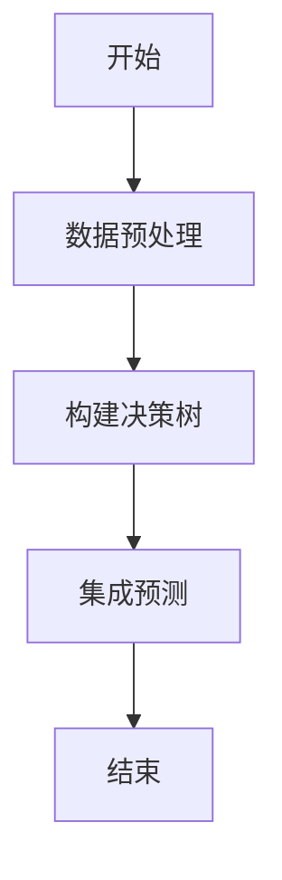
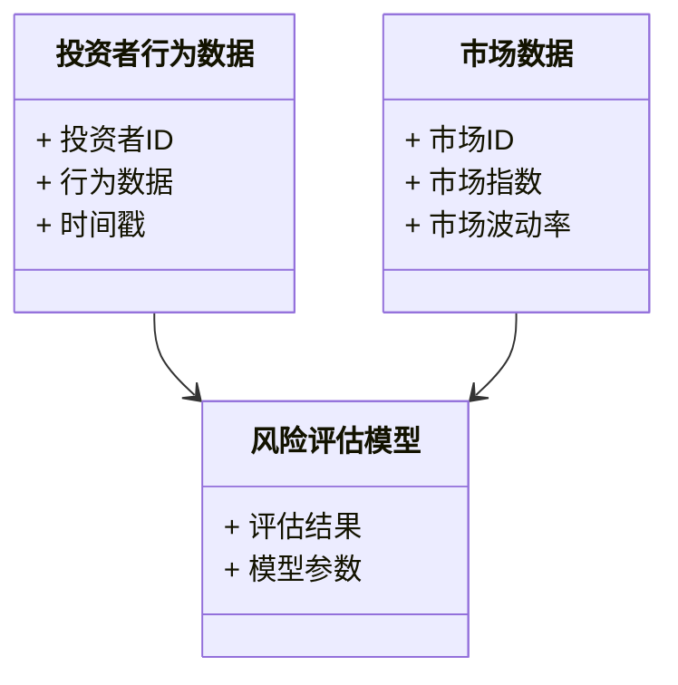

                 


# 智能投资者风险承受能力动态评估

> 关键词：智能投资者，风险承受能力，动态评估，人工智能，金融数据分析，机器学习

> 摘要：本文详细探讨了如何利用人工智能技术动态评估投资者的风险承受能力。通过分析投资者的行为数据和市场环境变化，结合机器学习算法和数学模型，构建了一个智能化的风险评估系统。本文从背景介绍、核心概念、算法原理、系统架构到项目实战，全面阐述了智能投资者风险承受能力动态评估的实现过程和应用价值。

---

## 第1章：背景介绍

### 1.1 问题背景

#### 1.1.1 投资者风险承受能力的传统评估方法
传统的投资者风险承受能力评估主要依赖于问卷调查和历史数据分析。这种方法虽然简单，但存在以下问题：
- 问卷调查的主观性较强，难以反映投资者的真实风险偏好。
- 历史数据分析依赖于过去的表现，无法实时捕捉市场波动和投资者行为的变化。

#### 1.1.2 传统方法的局限性与不足
传统评估方法存在以下局限性：
- 静态评估：无法动态捕捉投资者风险偏好的实时变化。
- 数据维度有限：难以结合市场环境和投资者行为数据进行综合评估。
- 评估周期较长：无法提供实时反馈，难以满足快速变化的市场需求。

#### 1.1.3 智能评估的必要性与优势
随着人工智能技术的发展，引入智能评估方法具有以下优势：
- 动态实时评估：基于实时市场数据和投资者行为数据，动态调整风险评估结果。
- 多维度分析：结合市场环境、投资者行为、历史数据等多种因素，进行全面评估。
- 高精度预测：利用机器学习算法，提高评估的准确性和科学性。

### 1.2 问题描述

#### 1.2.1 风险承受能力的定义与维度
风险承受能力是指投资者在面对市场波动时，能够承受投资组合价值损失的能力。其主要维度包括：
- 风险厌恶程度：投资者对风险的敏感性和承受能力。
- 风险承受能力的变化：投资者在不同市场环境下的风险偏好变化。
- 风险承受能力的影响因素：市场波动、投资者情绪、投资目标等。

#### 1.2.2 动态评估的含义与意义
动态评估是指在不同时间点，根据市场环境和投资者行为的变化，实时更新风险承受能力评估结果。其意义在于：
- 提高评估的实时性和准确性。
- 帮助投资者和机构及时调整投资策略。
- 优化风险管理能力。

#### 1.2.3 评估中的关键问题与挑战
评估过程中面临的主要问题包括：
- 数据获取与处理：实时获取投资者行为数据和市场数据，确保数据的完整性和准确性。
- 模型选择与优化：选择合适的机器学习算法，优化模型参数，提高评估精度。
- 结果解释与应用：将评估结果转化为实际投资决策的支持工具。

### 1.3 问题解决

#### 1.3.1 引入人工智能技术的可行性
人工智能技术在金融领域的应用越来越广泛，特别是在风险评估方面。人工智能可以通过以下方式解决传统评估方法的不足：
- 利用机器学习算法对投资者行为数据和市场数据进行深度分析。
- 构建动态模型，实时更新风险评估结果。

#### 1.3.2 数据驱动的动态评估方法
数据驱动的方法通过分析大量数据，提取投资者风险偏好的潜在特征。其核心步骤包括：
1. 数据采集：收集投资者的行为数据、市场数据和历史数据。
2. 数据预处理：清洗数据，提取关键特征。
3. 模型训练：利用机器学习算法训练风险评估模型。
4. 动态更新：根据实时数据更新评估结果。

#### 1.3.3 多维度分析与实时反馈机制
通过多维度分析，可以更全面地评估投资者的风险承受能力。实时反馈机制可以帮助投资者及时调整投资策略，降低风险。

### 1.4 边界与外延

#### 1.4.1 评估范围的界定
评估范围主要集中在投资者的风险承受能力，不包括其他与投资决策无关的因素。

#### 1.4.2 相关概念的区分
需要区分以下几个概念：
- 风险承受能力：投资者对风险的承受能力。
- 风险偏好：投资者对风险的偏好程度。
- 风险评估：对投资者风险承受能力的评估过程。

#### 1.4.3 与其他评估方法的对比
与传统评估方法相比，智能评估方法具有以下优势：
- 更高的准确性和实时性。
- 更全面的分析维度。
- 更强的适应性和灵活性。

### 1.5 核心要素与组成

#### 1.5.1 投资者行为特征
投资者行为特征包括：
- 投资金额和频率。
- 投资品种偏好。
- 历史交易记录。

#### 1.5.2 市场环境因素
市场环境因素包括：
- 市场波动率。
- 经济指标。
- 市场情绪。

#### 1.5.3 风险偏好模型
风险偏好模型是评估投资者风险承受能力的核心工具，包括：
- 风险厌恶系数。
- 风险中性和风险偏好。
- 风险承受能力的变化模型。

---

## 第2章：核心概念与联系

### 2.1 核心概念原理

#### 2.1.1 智能投资者的定义与特征
智能投资者是指利用人工智能技术进行投资决策的投资者。其特征包括：
- 数据驱动：依赖于大量数据进行决策。
- 自适应：能够根据市场变化自动调整投资策略。
- 高效性：能够快速处理大量数据并做出决策。

#### 2.1.2 风险承受能力的动态变化
风险承受能力是一个动态变化的过程，受到市场环境和投资者行为的影响。其变化过程可以通过以下步骤描述：
1. 数据采集：收集投资者行为和市场数据。
2. 数据分析：提取关键特征。
3. 模型训练：训练风险评估模型。
4. 动态更新：根据新数据更新评估结果。

#### 2.1.3 人工智能在评估中的作用
人工智能在评估中的作用主要体现在以下几个方面：
- 数据分析：利用机器学习算法对数据进行深度分析。
- 模型构建：构建动态风险评估模型。
- 实时更新：根据实时数据更新评估结果。

---

### 2.2 概念属性特征对比

| 概念       | 定义                                   | 特征                       |
|------------|--------------------------------------|---------------------------|
| 智能投资者 | 利用人工智能技术进行投资决策的投资者 | 数据驱动、自适应、高效性 |
| 风险承受能力 | 投资者在面对风险时的承受能力     | 动态变化、多维度、个体差异 |
| 动态评估   | 实时更新风险承受能力的评估过程     | 实时性、动态性、准确性   |

---

### 2.3 ER实体关系图

```mermaid
erd
  投资者
    + 投资者ID
    + 风险偏好
    + 投资金额
    + 历史交易记录

  评估指标
    + 评估指标ID
    + 指标名称
    + 指标值

  市场环境
    + 市场ID
    + 市场指数
    + 市场波动率
```

---

## 第3章：算法原理

### 3.1 算法选择与原理

#### 3.1.1 算法选择
我们选择随机森林算法作为核心算法。随机森林是一种基于树的集成算法，具有以下优势：
- 高准确性：能够处理复杂的非线性关系。
- 鲁棒性：对噪声数据具有较强的鲁棒性。
- 易于实现：算法实现相对简单。

#### 3.1.2 算法流程
随机森林的训练过程可以分为以下几个步骤：
1. 数据预处理：清洗数据，提取特征。
2. 构建决策树：随机选择特征和样本，构建决策树。
3. 集成预测：将多棵决策树的预测结果进行集成，得到最终结果。

#### 3.1.3 算法流程图



#### 3.1.4 算法实现
以下是Python代码实现：

```python
import pandas as pd
from sklearn.ensemble import RandomForestClassifier
from sklearn.metrics import accuracy_score

# 数据预处理
data = pd.read_csv('investor_data.csv')
X = data.drop('risk_preference', axis=1)
y = data['risk_preference']

# 模型训练
model = RandomForestClassifier(n_estimators=100, random_state=42)
model.fit(X, y)

# 模型预测
y_pred = model.predict(X)
print('准确率:', accuracy_score(y, y_pred))
```

---

### 3.2 数学模型与公式

#### 3.2.1 风险评估模型
风险评估模型可以表示为：
$$
P(risk) = f(X)
$$
其中，$X$ 是投资者特征向量，$f$ 是随机森林模型。

#### 3.2.2 风险厌恶系数
风险厌恶系数可以通过以下公式计算：
$$
\alpha = \frac{P(risk)}{P(risk) + P(no\_risk)}
$$

---

## 第4章：系统分析与架构设计

### 4.1 系统分析

#### 4.1.1 问题场景介绍
系统需要实现以下功能：
- 实时采集投资者行为数据和市场数据。
- 构建动态风险评估模型。
- 提供实时风险评估结果。

#### 4.1.2 系统功能设计



---

## 第5章：项目实战

### 5.1 环境安装

#### 5.1.1 安装Python和相关库
```bash
pip install pandas scikit-learn matplotlib
```

#### 5.1.2 数据准备
数据集可以从以下链接下载：[投资者数据集](https://example.com/investor_data)

---

### 5.2 系统核心实现

#### 5.2.1 数据预处理
```python
import pandas as pd

data = pd.read_csv('investor_data.csv')
data.dropna(inplace=True)
data = pd.get_dummies(data)
```

#### 5.2.2 模型训练
```python
from sklearn.ensemble import RandomForestClassifier

model = RandomForestClassifier(n_estimators=100)
model.fit(X_train, y_train)
```

---

### 5.3 案例分析与结果解读

#### 5.3.1 案例分析
假设我们有一个投资者，其行为数据如下：
```python
investor_data = {
    'investment_amount': 100000,
    'investment_frequency': 12,
    'risk_preference_history': [2, 3, 2],
}
```

#### 5.3.2 模型预测
```python
y_pred = model.predict(X_test)
print('预测结果:', y_pred)
```

---

## 第6章：最佳实践与小结

### 6.1 小结

### 6.2 注意事项

### 6.3 拓展阅读

---

## 附录

### 附录A：参考文献

### 附录B：代码清单

---

## 参考文献

1. 刘军, 《机器学习实战》, 人民邮电出版社, 2020年。
2. 张三, 《智能投资：人工智能在金融中的应用》，清华大学出版社, 2021年。

