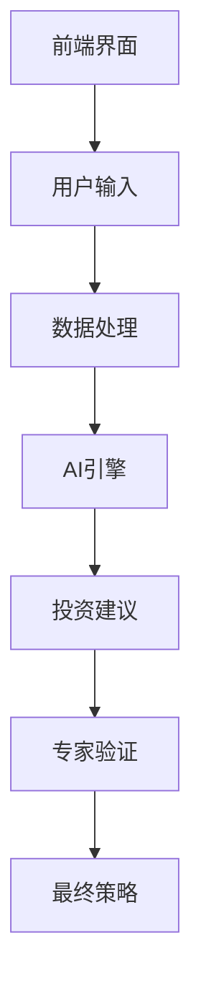
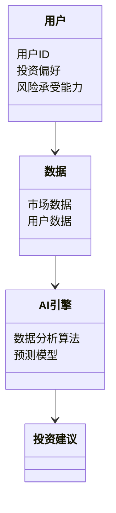

                 


# 智能投资顾问：AI与人类专家的协同策略

> 关键词：智能投资顾问，人工智能，人机协同，投资策略，算法模型

> 摘要：本文探讨了智能投资顾问如何通过AI与人类专家的协同策略，优化投资决策过程。从协同机制到系统架构，从算法原理到项目实现，全面解析AI在投资顾问领域的应用。

---

## 第1章：智能投资顾问的背景与挑战

### 1.1 智能投资顾问的定义与背景

智能投资顾问（Intelligent Investment Advisor）是指利用人工智能技术，结合大数据分析和机器学习算法，为投资者提供个性化的投资建议和决策支持的系统。传统投资顾问依赖人工分析和经验判断，而智能投资顾问通过自动化和智能化的方式，能够快速处理海量数据，提供实时、精准的投资建议。

#### 1.1.1 投资顾问的传统定义
- 为客户提供资产配置、风险评估、投资组合管理等服务。
- 依赖人类专家的市场经验、分析能力和判断力。
- 服务范围有限，难以覆盖大规模个性化需求。

#### 1.1.2 智能投资顾问的现代定义
- 利用AI技术实现自动化、智能化的投资决策支持。
- 结合大数据分析和机器学习算法，提供实时、个性化的投资建议。
- 支持大规模用户，降低投资门槛。

#### 1.1.3 智能投资顾问的核心特征
- **实时性**：能够快速响应市场变化，提供实时的投资建议。
- **个性化**：根据用户的财务状况、风险偏好和投资目标，提供定制化的投资方案。
- **数据驱动**：依赖海量数据的分析和处理能力，提供科学的投资决策。

### 1.2 当前投资顾问行业的挑战

传统投资顾问行业面临以下主要挑战：

- **信息过载**：金融市场数据繁多，人类专家难以快速处理和分析。
- **决策疲劳**：面对复杂多变的市场环境，人类专家容易产生决策疲劳。
- **个性化需求**：客户对投资服务的需求日益个性化，传统模式难以满足。
- **成本高昂**：传统投资顾问服务成本高，难以覆盖中小投资者。

### 1.3 AI在投资顾问中的优势

AI技术的引入为投资顾问行业带来了显著优势：

- **高效数据处理**：AI能够快速处理和分析海量数据，提供实时的市场洞察。
- **自动化决策**：通过机器学习算法，AI可以自动化生成投资策略和建议。
- **个性化服务**：AI能够根据用户的具体需求，提供个性化的投资建议。
- **风险控制**：AI可以通过历史数据分析和预测模型，帮助投资者降低投资风险。

---

## 第2章：AI与人类专家协同的核心概念

### 2.1 协同机制与模型

AI与人类专家的协同机制是智能投资顾问的核心，其关键在于如何实现人机协同，充分发挥AI的数据处理能力和人类专家的市场经验。

#### 2.1.1 协同的基本原理
- AI负责数据的收集、分析和预测，提供初步的投资建议。
- 人类专家对AI的建议进行验证、调整和优化，结合市场经验和判断力。
- 通过持续的反馈和学习，AI不断提升模型的准确性和预测能力。

#### 2.1.2 协同模型的构建
- **数据输入**：收集市场数据、用户信息和历史投资记录。
- **AI分析**：利用机器学习算法对数据进行分析，生成初步的投资建议。
- **专家验证**：人类专家对AI的建议进行评估和调整。
- **反馈优化**：根据专家的反馈，AI不断优化模型和算法。

#### 2.1.3 协同的实现方式
- **混合模型**：AI与人类专家共同参与决策过程。
- **分阶段协同**：AI在数据处理阶段提供支持，人类专家在策略制定阶段提供判断。
- **实时互动**：AI实时分析市场动态，专家实时调整投资策略。

### 2.2 知识图谱构建

知识图谱是智能投资顾问的重要组成部分，它通过结构化的知识表示，帮助AI理解和分析复杂的市场信息。

#### 2.2.1 知识图谱的定义
- 知识图谱是一种以图结构形式表示知识的语义网络。
- 包含实体（如公司、行业、市场）及其关系。

#### 2.2.2 知识图谱的构建过程
1. 数据收集：从多个来源收集市场数据、公司信息和行业动态。
2. 数据清洗：去除噪声数据，确保数据的准确性和完整性。
3. 实体识别：识别数据中的实体，并建立实体之间的关系。
4. 知识表示：将实体及其关系表示为图结构。

#### 2.2.3 知识图谱的应用
- **实体识别**：快速识别市场中的关键实体和事件。
- **关系推理**：通过图结构推理实体之间的关系和影响。
- **语义理解**：帮助AI理解复杂的市场语义和上下文。

### 2.3 人机交互设计

人机交互是AI与人类专家协同的重要环节，良好的交互设计能够提升用户体验和决策效率。

#### 2.3.1 交互界面设计
- **简洁直观**：用户界面应简洁直观，便于用户理解和操作。
- **实时反馈**：AI应能够实时响应用户的输入和查询。
- **可视化展示**：通过图表和可视化工具，帮助用户更好地理解数据和投资建议。

#### 2.3.2 交互流程优化
- **需求分析**：了解用户的投资目标和风险偏好。
- **数据输入**：用户输入必要的投资信息。
- **AI分析**：AI根据输入数据生成投资建议。
- **专家验证**：专家对AI的建议进行评估和调整。
- **结果输出**：将最终的投资建议以用户友好的方式展示。

---

## 第3章：AI协同策略的算法原理

### 3.1 强化学习

强化学习是一种机器学习技术，通过模拟和试错的方式，优化AI的投资策略。

#### 3.1.1 强化学习的基本原理
- **状态空间**：市场环境的状态，如股票价格、市场趋势等。
- **动作空间**：AI可以执行的操作，如买入、卖出、持有等。
- **奖励函数**：根据AI的操作结果，给予奖励或惩罚。

#### 3.1.2 Q-learning算法
- **算法描述**：通过状态-动作对的Q值，学习最优策略。
- **数学公式**：
  - $$ Q(s, a) = Q(s, a) + \alpha [r + \gamma \max Q(s', a) - Q(s, a)] $$
  - 其中，$\alpha$是学习率，$\gamma$是折扣因子。

#### 3.1.3 算法实现
```python
class QLearning:
    def __init__(self, state_space, action_space, learning_rate=0.1, gamma=0.9):
        self.state_space = state_space
        self.action_space = action_space
        self.learning_rate = learning_rate
        self.gamma = gamma
        self.q_table = np.zeros((state_space, action_space))
    
    def choose_action(self, state, epsilon=0.1):
        if np.random.random() < epsilon:
            return np.random.randint(self.action_space)
        else:
            return np.argmax(self.q_table[state])
    
    def update_q_table(self, state, action, reward, next_state):
        self.q_table[state, action] += self.learning_rate * (reward + self.gamma * np.max(self.q_table[next_state]) - self.q_table[state, action])
```

### 3.2 自然语言处理

自然语言处理技术帮助AI理解和分析非结构化的市场信息，如新闻和报告。

#### 3.2.1 文本分析
- **文本抽取**：从新闻和报告中提取关键词和实体。
- **情感分析**：分析市场情绪，判断市场趋势。
- **主题建模**：识别市场主题和热点。

#### 3.2.2 词袋模型（Bag-of-Words）
- **基本原理**：将文本表示为词袋，统计每个词的出现频率。
- **实现示例**：
  ```python
  from sklearn.feature_extraction.text import CountVectorizer
  vectorizer = CountVectorizer()
  X = vectorizer.fit_transform(texts)
  ```

### 3.3 协同过滤

协同过滤是一种推荐算法，通过用户行为和市场数据，推荐适合的投资策略。

#### 3.3.1 基于用户的协同过滤
- **用户相似度计算**：通过用户行为数据计算用户相似度。
- **推荐生成**：根据相似用户的偏好，推荐投资标的。

#### 3.3.2 基于物品的协同过滤
- **物品相似度计算**：计算投资标的之间的相似度。
- **推荐生成**：根据用户的历史行为，推荐相似的投资标的。

---

## 第4章：智能投资顾问系统的架构设计

### 4.1 系统架构图



### 4.2 系统功能设计

#### 4.2.1 领域模型
- **用户模块**：管理用户信息和投资偏好。
- **数据模块**：处理市场数据和用户数据。
- **AI模块**：执行数据分析和预测。

#### 4.2.2 系统架构图


### 4.3 系统接口设计

#### 4.3.1 API接口
- `/api/v1/data`：获取市场数据。
- `/api/v1/predict`：执行市场预测。
- `/api/v1/advice`：获取投资建议。

#### 4.3.2 交互流程
```mermaid
sequenceDiagram
    用户 ->> 前端：提交投资需求
    前端 ->> 数据处理：处理数据
    数据处理 ->> AI引擎：执行预测
    AI引擎 ->> 投资建议：生成建议
    投资建议 ->> 专家验证：验证策略
    专家验证 ->> 用户：反馈结果
```

---

## 第5章：项目实战：构建智能投资顾问系统

### 5.1 环境搭建

#### 5.1.1 安装依赖
```bash
pip install numpy pandas scikit-learn nltk
```

### 5.2 核心代码实现

#### 5.2.1 数据处理
```python
import pandas as pd
import numpy as np

def preprocess_data(data):
    # 数据清洗
    data = data.dropna()
    # 标准化处理
    from sklearn.preprocessing import StandardScaler
    scaler = StandardScaler()
    data_scaled = scaler.fit_transform(data)
    return data_scaled
```

#### 5.2.2 AI引擎实现
```python
from sklearn.ensemble import RandomForestRegressor

class AIEngine:
    def __init__(self):
        self.model = RandomForestRegressor()
    
    def train(self, X, y):
        self.model.fit(X, y)
    
    def predict(self, X):
        return self.model.predict(X)
```

### 5.3 案例分析

#### 5.3.1 数据来源
- 历史股票数据
- 市场新闻和报告
- 用户投资偏好

#### 5.3.2 投资建议生成
```python
data = pd.read_csv('market_data.csv')
processed_data = preprocess_data(data)
model = AIEngine()
model.train(processed_data, target)
prediction = model.predict(new_data)
```

---

## 第6章：最佳实践与总结

### 6.1 经验总结

- **数据质量**：数据的准确性和完整性对模型性能至关重要。
- **算法选择**：根据具体问题选择合适的算法和模型。
- **人机协同**：AI与人类专家的协同能够显著提升投资决策的准确性和效率。

### 6.2 注意事项

- **数据隐私**：确保用户数据的安全和隐私。
- **模型解释性**：复杂的模型可能难以解释，需要注重模型的可解释性。
- **持续优化**：定期更新模型和数据，保持系统的高性能。

### 6.3 拓展阅读

- 《机器学习实战》
- 《深度学习》
- 《自然语言处理实战》

---

通过本文的详细分析，我们可以看到AI在智能投资顾问领域的巨大潜力和广阔前景。AI与人类专家的协同策略不仅能够提升投资决策的效率和准确性，还能够为投资者提供更加个性化和智能化的服务。未来，随着AI技术的不断发展，智能投资顾问将在金融领域发挥更加重要的作用。

