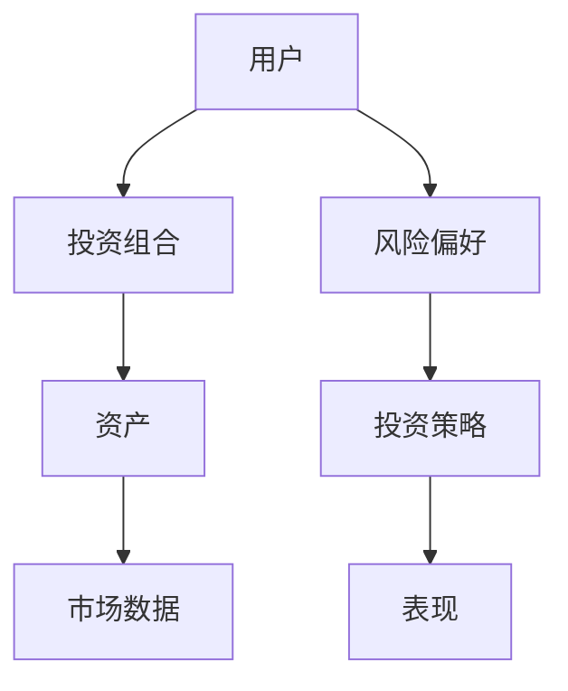
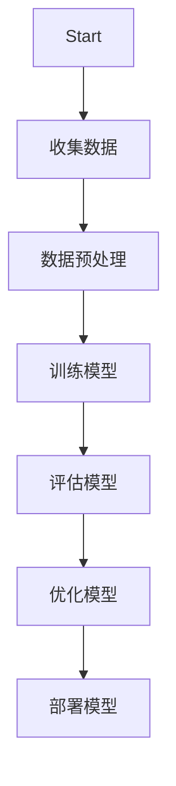
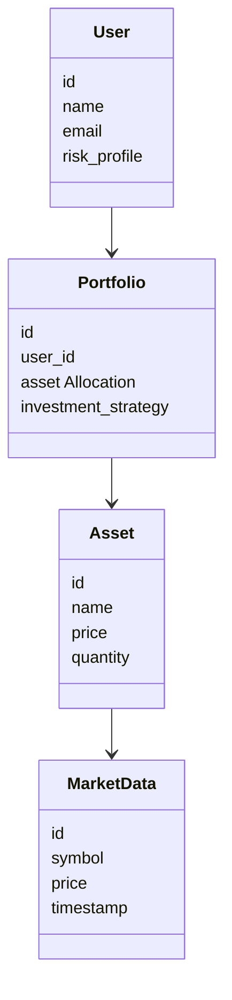

                 


# 智能投顾平台的架构设计与实现

> 关键词：智能投顾，人工智能，系统架构，算法实现，金融投资

> 摘要：智能投顾是一种结合人工智能和金融投资的新兴领域，旨在为投资者提供个性化的投资建议和资产配置方案。本文将从智能投顾平台的核心概念、算法原理、系统架构设计、功能实现、项目实战等多个方面进行详细分析，探讨智能投顾平台的实现过程。

---

# 第1章: 智能投顾平台概述

## 1.1 智能投顾的定义与背景

### 1.1.1 智能投顾的定义
智能投顾（Smart Wealth Management）是一种基于人工智能和大数据分析的金融投资服务模式，旨在为投资者提供个性化的投资建议、资产配置和风险管理方案。通过算法模型，智能投顾能够快速分析市场数据、用户需求和投资目标，生成最优的投资策略。

### 1.1.2 智能投顾的发展现状
随着人工智能和大数据技术的快速发展，智能投顾在全球范围内得到了广泛应用。尤其是在互联网金融领域，智能投顾平台通过提供便捷、低成本的投资服务，吸引了大量个人投资者。

### 1.1.3 智能投顾的核心价值
智能投顾的核心价值在于其能够通过算法模型实现投资决策的自动化和个性化。与传统投资顾问相比，智能投顾具有以下优势：
- **低成本**：通过自动化服务降低人力成本。
- **高效性**：能够快速处理大量数据并生成投资建议。
- **个性化**：基于用户的风险偏好和投资目标，提供定制化的投资方案。

## 1.2 智能投顾平台的功能与特点

### 1.2.1 智能投顾平台的功能模块
智能投顾平台通常包含以下功能模块：
- **用户画像**：通过收集用户的投资目标、风险偏好、财务状况等信息，生成用户画像。
- **风险评估**：基于用户画像，评估用户的风险承受能力。
- **投资策略生成**：根据市场数据和用户需求，生成最优的投资策略。
- **投资组合优化**：动态调整投资组合，以最大化收益并最小化风险。
- **市场监控与预警**：实时监控市场动态，并在出现潜在风险时发出预警。

### 1.2.2 智能投顾平台的特点
智能投顾平台的特点包括：
- **数据驱动**：依赖于大量市场数据和用户数据进行分析和决策。
- **算法驱动**：通过机器学习和优化算法生成投资策略。
- **实时性**：能够实时监控市场动态并快速调整投资组合。

### 1.2.3 智能投顾与传统投顾的区别
智能投顾与传统投顾的主要区别如下：
- **服务成本**：智能投顾成本更低，传统投顾成本较高。
- **服务效率**：智能投顾能够快速处理大量数据，传统投顾依赖人工分析。
- **服务个性化**：智能投顾能够提供个性化服务，传统投顾则以标准化服务为主。

## 1.3 智能投顾平台的应用场景

### 1.3.1 个人投资者的应用场景
个人投资者通常具有较小的资金规模，但对投资收益和风险控制有较高的需求。智能投顾平台能够为个人投资者提供便捷的投资工具和个性化的投资建议。

### 1.3.2 机构投资者的应用场景
机构投资者通常具有较大的资金规模，对市场趋势和投资策略有较高的敏感性。智能投顾平台能够为机构投资者提供市场监控、风险预警和投资组合优化等服务。

### 1.3.3 智能投顾平台的边界与外延
智能投顾平台的边界包括：
- **数据范围**：平台需要获取哪些数据？
- **服务范围**：平台能够提供哪些服务？
- **用户范围**：平台的目标用户是谁？

智能投顾平台的外延包括：
- **数据源**：市场数据、用户数据、新闻数据等。
- **服务扩展**：投资教育、市场分析、风险管理等。

## 1.4 智能投顾平台的核心要素

### 1.4.1 数据驱动的核心要素
智能投顾平台的核心要素包括：
- **数据采集**：收集市场数据、用户数据等。
- **数据处理**：对数据进行清洗、转换和分析。
- **数据存储**：将数据存储在数据库中，便于后续分析。

### 1.4.2 人工智能算法的核心要素
人工智能算法的核心要素包括：
- **特征提取**：从数据中提取有用的特征。
- **模型训练**：训练机器学习模型。
- **模型预测**：利用模型生成投资建议。

### 1.4.3 平台架构的核心要素
平台架构的核心要素包括：
- **前端界面**：用户与平台的交互界面。
- **后端服务**：处理用户请求和数据。
- **数据库**：存储数据和模型。

## 1.5 本章小结

---

# 第2章: 智能投顾平台的核心概念与联系

## 2.1 核心概念原理

### 2.1.1 人工智能在智能投顾中的应用
人工智能在智能投顾中的应用包括：
- **机器学习**：用于市场预测和投资策略生成。
- **自然语言处理**：用于新闻分析和情感分析。
- **强化学习**：用于动态调整投资组合。

### 2.1.2 数据分析与投资决策的关系
数据分析是投资决策的基础。通过对市场数据和用户数据的分析，智能投顾平台能够生成个性化投资建议。

### 2.1.3 系统架构对智能投顾的影响
系统架构决定了平台的性能和扩展性。合理的架构设计能够提高平台的运行效率和用户体验。

## 2.2 核心概念属性特征对比

### 2.2.1 不同智能投顾平台的对比分析
不同智能投顾平台的主要区别在于：
- **服务功能**：功能模块的差异。
- **技术实现**：算法模型的差异。
- **用户体验**：界面设计的差异。

### 2.2.2 数据驱动与算法驱动的对比
数据驱动和算法驱动的主要区别在于：
- **数据依赖性**：数据驱动依赖于大量数据，算法驱动依赖于算法模型。
- **灵活性**：数据驱动更灵活，算法驱动更稳定。

### 2.2.3 个性化服务与标准化服务的对比
个性化服务和标准化服务的主要区别在于：
- **服务对象**：个性化服务针对特定用户，标准化服务针对广泛用户。
- **服务成本**：个性化服务成本较高，标准化服务成本较低。

## 2.3 ER实体关系图架构



## 2.4 本章小结

---

# 第3章: 智能投顾平台的算法原理

## 3.1 算法原理概述

### 3.1.1 机器学习在智能投顾中的应用
机器学习在智能投顾中的应用包括：
- **回归分析**：用于预测市场趋势。
- **分类算法**：用于风险评估和投资类别划分。
- **聚类分析**：用于客户分群和市场分析。

### 3.1.2 自然语言处理在智能投顾中的应用
自然语言处理在智能投顾中的应用包括：
- **新闻分析**：通过分析新闻文本，预测市场趋势。
- **情感分析**：通过分析投资者情绪，辅助投资决策。

### 3.1.3 时间序列分析在智能投顾中的应用
时间序列分析在智能投顾中的应用包括：
- **市场预测**：通过历史数据预测未来市场走势。
- **异常检测**：通过分析时间序列数据，发现市场异常情况。

## 3.2 算法实现流程

### 3.2.1 机器学习算法实现流程


### 3.2.2 算法实现代码示例
```python
import numpy as np
import pandas as pd
from sklearn.model_selection import train_test_split
from sklearn.linear_model import LinearRegression

# 数据加载与预处理
data = pd.read_csv('market_data.csv')
X = data[['market_return', 'risk_free_rate']]
y = data['portfolio_return']

# 数据划分
X_train, X_test, y_train, y_test = train_test_split(X, y, test_size=0.2, random_state=42)

# 模型训练
model = LinearRegression()
model.fit(X_train, y_train)

# 模型评估
score = model.score(X_test, y_test)
print(f'模型评分：{score}')

# 模型预测
predictions = model.predict(X_test)
```

## 3.3 本章小结

---

# 第4章: 智能投顾平台的系统架构设计

## 4.1 问题场景介绍
智能投顾平台需要处理大量的市场数据和用户数据，同时需要快速响应用户的请求。系统架构设计需要考虑性能、扩展性和安全性。

## 4.2 系统功能设计

### 4.2.1 领域模型设计


### 4.2.2 系统架构设计
```mermaid
graph TD
    User[用户] --> API Gateway[API网关]
    API Gateway --> Service1[服务1]
    Service1 --> Database[数据库]
    Service1 --> Service2[服务2]
    Service2 --> Database
    Database --> Cache[缓存]
    Cache --> Service3[服务3]
```

## 4.3 系统接口设计
系统接口设计需要考虑以下方面：
- **RESTful API**：提供标准的接口规范。
- **认证与授权**：确保数据安全性。
- **错误处理**：处理可能出现的错误和异常。

## 4.4 系统交互设计
系统交互设计需要考虑以下方面：
- **用户登录与注册**：用户通过API网关登录或注册。
- **数据查询与提交**：用户通过API查询数据或提交请求。
- **响应与反馈**：系统通过API返回响应或反馈。

## 4.5 本章小结

---

# 第5章: 智能投顾平台的项目实战

## 5.1 环境安装
智能投顾平台的开发环境需要以下工具：
- **Python**：编程语言。
- **Jupyter Notebook**：数据分析与可视化工具。
- **Git**：版本控制工具。
- **Docker**：容器化部署工具。

## 5.2 系统核心实现源代码
```python
import numpy as np
import pandas as pd
from sklearn.model_selection import train_test_split
from sklearn.linear_model import LinearRegression

# 数据加载与预处理
data = pd.read_csv('market_data.csv')
X = data[['market_return', 'risk_free_rate']]
y = data['portfolio_return']

# 数据划分
X_train, X_test, y_train, y_test = train_test_split(X, y, test_size=0.2, random_state=42)

# 模型训练
model = LinearRegression()
model.fit(X_train, y_train)

# 模型评估
score = model.score(X_test, y_test)
print(f'模型评分：{score}')

# 模型预测
predictions = model.predict(X_test)
```

## 5.3 代码应用解读与分析
代码解读与分析需要从以下几个方面进行：
- **数据加载**：如何加载和处理数据？
- **模型训练**：如何训练模型？
- **模型评估**：如何评估模型性能？
- **模型预测**：如何利用模型进行预测？

## 5.4 实际案例分析和详细讲解剖析
实际案例分析需要从以下几个方面进行：
- **案例背景**：案例的背景和目标。
- **数据准备**：案例所需的数据来源和预处理。
- **模型实现**：案例中模型的具体实现。
- **结果分析**：案例结果的分析和解读。

## 5.5 项目小结

---

# 第6章: 最佳实践与小结

## 6.1 最佳实践
智能投顾平台的开发需要注意以下几点：
- **数据安全**：确保用户数据的安全性。
- **算法优化**：不断优化算法模型以提高准确性。
- **用户体验**：注重用户体验设计，提高用户满意度。

## 6.2 小结
智能投顾平台的开发和实现是一个复杂的过程，需要结合人工智能、大数据分析和系统架构设计等多方面的知识。通过本文的分析，我们可以更好地理解智能投顾平台的核心概念、算法原理和系统架构设计。

## 6.3 注意事项
智能投顾平台的开发需要注意以下几点：
- **合规性**：遵守相关法律法规。
- **可扩展性**：设计可扩展的系统架构。
- **可维护性**：注重代码的可维护性和可读性。

## 6.4 拓展阅读
推荐以下几本书籍和资源：
- 《机器学习实战》
- 《深入浅出人工智能》
- 《系统架构设计实战》

---

# 附录: 总结

智能投顾平台的架构设计与实现是一个复杂的系统工程，需要结合人工智能、大数据分析和系统架构设计等多方面的知识。本文从核心概念、算法原理、系统架构设计、功能实现、项目实战等多个方面进行了详细分析，为读者提供了一个全面的视角。希望本文能够为智能投顾平台的开发和实现提供有价值的参考。

