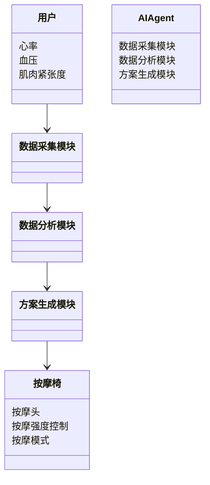
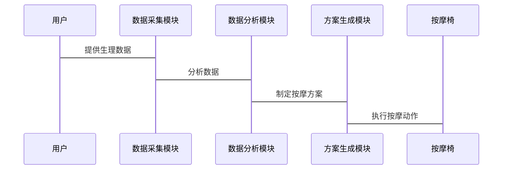

                 


# 智能按摩椅：AI Agent的个性化按摩方案

> **关键词**：智能按摩椅、AI Agent、个性化按摩、健康监测、数据驱动
>
> **摘要**：随着人工智能技术的发展，智能按摩椅通过集成AI Agent实现了个性化的按摩体验。本文探讨了AI Agent在智能按摩椅中的应用，从背景、技术原理到系统设计，再到项目实战，详细分析了如何利用AI技术为用户提供定制化的健康解决方案。

---

## 第一部分：智能按摩椅的背景与概念

### 第1章：智能按摩椅的发展历程

#### 1.1 传统按摩椅的功能与局限性

- **1.1.1 传统按摩椅的基本功能**
  - 按摩椅的基本功能包括揉捏、敲打、推拿等，主要通过机械结构实现固定模式的按摩。
  - 传统按摩椅通常需要用户手动选择模式，缺乏智能化和个性化。

- **1.1.2 传统按摩椅的局限性**
  - 无法根据用户的身体状况实时调整按摩强度和模式。
  - 缺乏数据分析能力，无法提供个性化的健康建议。
  - 体验单一，难以满足不同用户的需求。

- **1.1.3 智能化升级的必要性**
  - 随着人们对健康关注度的提升，对个性化健康解决方案的需求日益增长。
  - AI技术的进步为按摩椅的智能化提供了可能性。

#### 1.2 AI Agent的基本概念

- **1.2.1 人工智能代理的定义**
  - AI Agent是指能够感知环境、自主决策并执行任务的智能体。
  - 在智能按摩椅中，AI Agent负责数据采集、分析和决策。

- **1.2.2 AI Agent的核心功能**
  - **感知**：通过传感器采集用户的生理数据，如心率、血压、肌肉紧张度等。
  - **决策**：基于数据分析，制定个性化的按摩方案。
  - **执行**：通过机械结构执行按摩动作。

- **1.2.3 AI Agent在智能按摩椅中的应用**
  - AI Agent能够实时分析用户的健康数据，动态调整按摩方案。
  - 提供个性化的健康建议，优化用户体验。

#### 1.3 个性化按摩方案的重要性

- **1.3.1 用户需求的多样性**
  - 不同用户的身体状况、健康需求和偏好各异。
  - 个性化方案能够提高按摩效果，满足用户多样化的需求。

- **1.3.2 个性化按摩的健康效益**
  - 根据用户的健康状况调整按摩强度和模式，能够更有效地缓解肌肉紧张和改善血液循环。
  - 个性化方案有助于预防和治疗健康问题，提升整体健康水平。

- **1.3.3 个性化方案的技术实现**
  - 利用AI算法分析用户数据，制定个性化按摩方案。
  - 结合反馈机制，动态优化按摩方案。

---

## 第二部分：AI Agent的核心概念与技术原理

### 第2章：AI Agent的核心概念与原理

#### 2.1 AI Agent的基本原理

- **2.1.1 数据采集与处理**
  - 智能按摩椅通过传感器采集用户的生理数据，如心率、血压、肌肉紧张度、体温等。
  - 数据采集模块负责将这些数据传输到AI Agent进行处理。

- **2.1.2 用户健康数据分析**
  - AI Agent对采集到的数据进行分析，识别用户的健康状况和潜在问题。
  - 数据分析包括统计分析、机器学习模型预测等。

- **2.1.3 按摩方案生成**
  - 基于数据分析结果，AI Agent制定个性化的按摩方案，包括按摩强度、模式和时间。

#### 2.2 AI Agent的感知、决策与执行

- **2.2.1 感知模块：数据采集与分析**
  - 感知模块负责采集用户的生理数据，并将其转化为可分析的格式。
  - 数据分析模块通过算法识别用户的健康状况和需求。

- **2.2.2 决策模块：健康评估与方案制定**
  - 决策模块基于数据分析结果，制定个性化的按摩方案。
  - 方案制定考虑用户的健康状况、偏好和历史数据。

- **2.2.3 执行模块：按摩椅的机械控制**
  - 执行模块根据决策模块的指令，控制按摩椅的机械结构执行按摩动作。
  - 执行过程中，AI Agent实时监测用户的反馈，动态调整方案。

#### 2.3 AI Agent与智能按摩椅的结合

- **2.3.1 系统架构概述**
  - 系统架构包括感知层、决策层和执行层。
  - 感知层负责数据采集，决策层负责数据分析和方案制定，执行层负责按摩动作的执行。

- **2.3.2 各模块的协同工作**
  - 感知模块与决策模块协同，确保数据的实时采集和分析。
  - 决策模块与执行模块协同，实现按摩方案的动态调整。

- **2.3.3 系统的整体流程**
  - 用户使用按摩椅时，AI Agent实时采集生理数据。
  - 数据分析模块根据数据制定个性化方案。
  - 执行模块根据方案执行按摩动作，并实时反馈数据。

---

## 第三部分：AI Agent的算法原理与数学模型

### 第3章：AI Agent的算法原理

#### 3.1 数据预处理与特征提取

- **3.1.1 数据清洗与标准化**
  - 数据清洗：去除噪声数据和异常值。
  - 数据标准化：将不同量纲的数据转化为统一尺度。

- **3.1.2 特征选择与降维**
  - 特征选择：根据数据的重要性选择关键特征。
  - 降维技术：如主成分分析（PCA），降低数据维度。

- **3.1.3 数据增强技术**
  - 数据增强：通过增加数据多样性，提高模型的泛化能力。

#### 3.2 健康评估模型的构建

- **3.2.1 模型选择与训练**
  - 选择适合的机器学习模型，如随机森林、支持向量机（SVM）或神经网络。
  - 数据集分为训练集和测试集，进行模型训练和验证。

- **3.2.2 模型评估与优化**
  - 评估指标：准确率、召回率、F1分数等。
  - 模型优化：调整超参数，防止过拟合或欠拟合。

- **3.2.3 模型的可解释性**
  - 可解释性：通过特征重要性分析，理解模型的决策依据。

#### 3.3 按摩方案生成算法

- **3.3.1 基于规则的方案生成**
  - 预定义规则：如根据心率高低调整按摩强度。

- **3.3.2 基于机器学习的方案生成**
  - 使用回归模型或分类模型，预测最佳按摩方案。
  - 示例：使用随机森林模型，根据用户数据预测按摩强度。

---

### 3.4 数学模型与公式

#### 3.4.1 健康评估模型

$$
健康评估 = \sum_{i=1}^{n} w_i \cdot x_i
$$

其中：
- $w_i$ 是特征 $x_i$ 的权重。
- $x_i$ 是特征 $x_i$ 的值。

#### 3.4.2 按摩强度预测模型

$$
强度预测 = \alpha \cdot \text{心率} + \beta \cdot \text{肌肉紧张度} + \gamma
$$

其中：
- $\alpha$, $\beta$ 是模型参数。
- $\gamma$ 是常数项。

---

## 第四部分：系统分析与架构设计

### 第4章：系统分析与架构设计方案

#### 4.1 项目背景与需求分析

- **4.1.1 项目背景**
  - 提升用户体验，满足个性化健康需求。

- **4.1.2 系统功能需求**
  - 数据采集：心率、血压、肌肉紧张度等。
  - 数据分析：健康评估，个性化方案生成。
  - 系统控制：按摩椅机械结构控制。

#### 4.2 系统功能设计

- **4.2.1 领域模型（Mermaid类图）**



- **4.2.2 系统架构设计（Mermaid架构图）**


- **4.2.3 系统接口设计**
  - 数据接口：用户数据的输入和输出。
  - 控制接口：按摩椅的机械控制。

- **4.2.4 系统交互流程（Mermaid序列图）**



---

## 第五部分：项目实战

### 第5章：项目实战

#### 5.1 环境搭建与开发工具

- **5.1.1 环境安装**
  - 安装Python、TensorFlow、NumPy等工具。

- **5.1.2 开发工具**
  - 使用Jupyter Notebook进行数据分析和模型训练。

#### 5.2 核心代码实现

```python
import numpy as np
from sklearn.ensemble import RandomForestRegressor

# 示例数据
X = np.array([[70, 120, 0.8], [75, 130, 0.9], [80, 140, 1.0]])
y = np.array([0.7, 0.8, 0.9])

# 训练模型
model = RandomForestRegressor(n_estimators=100)
model.fit(X, y)

# 预测按摩强度
new_user = np.array([[72, 125, 0.85]])
prediction = model.predict(new_user)
print("预测的按摩强度为：", prediction)
```

#### 5.3 代码解读与分析

- **5.3.1 数据预处理**
  - 数据清洗和标准化。

- **5.3.2 模型训练**
  - 使用随机森林模型训练按摩强度预测模型。

- **5.3.3 模型评估**
  - 使用测试集评估模型的准确性。

#### 5.4 实际案例分析

- **案例1**：用户A，心率72，血压125/80，肌肉紧张度0.85。
  - 预测按摩强度为0.75，推荐轻柔模式。

#### 5.5 项目总结

- **5.5.1 成果**
  - 成功实现个性化的按摩方案生成。

- **5.5.2 经验**
  - 数据质量对模型性能的影响至关重要。

---

## 第六部分：最佳实践与展望

### 第6章：最佳实践

#### 6.1 数据隐私与安全

- 确保用户数据的安全，遵守相关隐私法规。

#### 6.2 模型优化与维护

- 定期更新模型，提升预测准确性。

#### 6.3 用户反馈与改进

- 收集用户反馈，持续优化按摩方案。

#### 6.4 拓展应用

- 结合其他健康设备，提供更全面的健康解决方案。

---

## 第七部分：小结

### 7.1 总结

- 本文详细探讨了AI Agent在智能按摩椅中的应用，从背景到技术实现，再到项目实战，全面分析了个性化按摩方案的实现过程。

### 7.2 展望

- 未来，随着AI技术的进一步发展，智能按摩椅将更加智能化和个性化，为用户带来更优质的健康体验。

---

通过以上结构，文章系统地介绍了智能按摩椅与AI Agent的结合，从理论到实践，为读者提供了全面的知识和实际应用案例。

