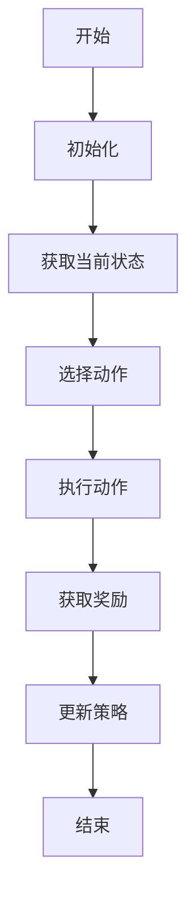
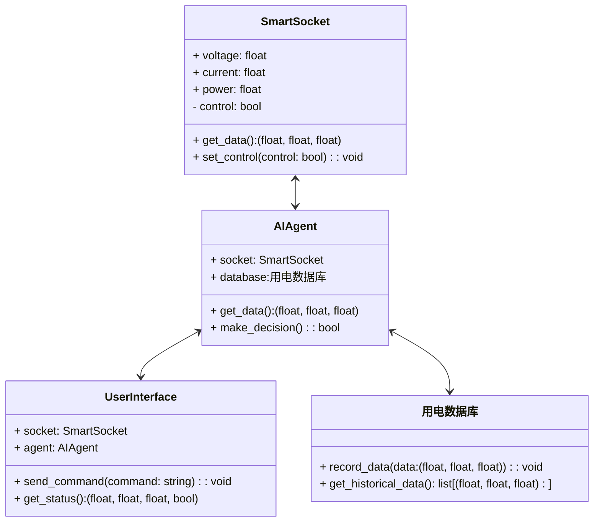
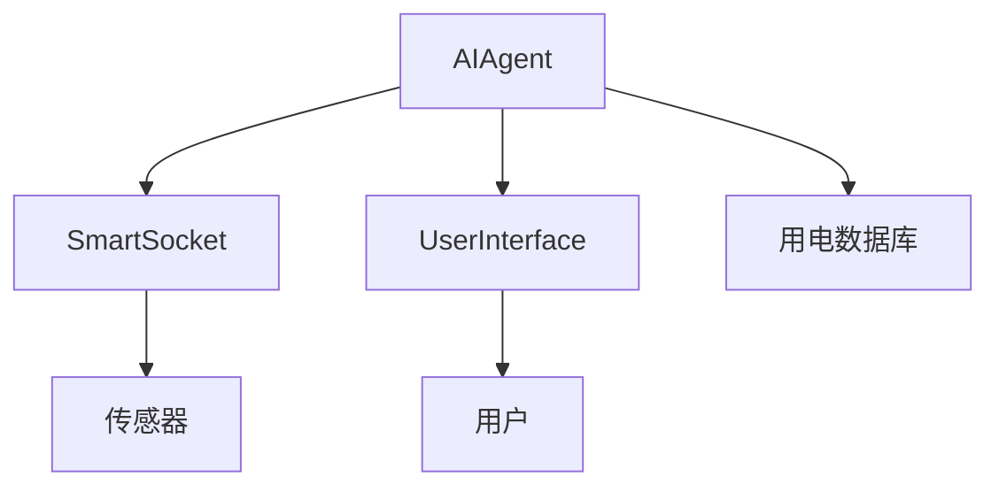
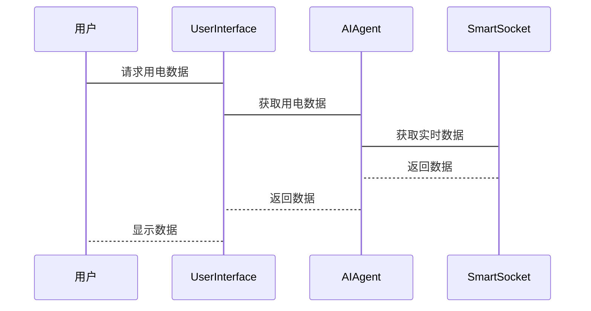

                 


# 智能插座：AI Agent的用电优化管理

> 关键词：智能插座，AI Agent，用电优化，强化学习，系统架构，项目实战

> 摘要：本文详细探讨了智能插座与AI Agent结合的用电优化管理技术。通过分析智能插座的定义、用电优化管理的必要性，以及AI Agent在智能插座中的应用，本文进一步阐述了AI Agent的核心概念与原理、用电优化算法的设计与实现、系统架构的规划与实现、项目实战的部署与案例分析，以及最佳实践的总结与拓展。文章内容丰富，逻辑清晰，旨在为读者提供从理论到实践的全面指导。

---

## 第一部分：背景介绍

### 第1章：智能插座的定义与特点

#### 1.1 智能插座的定义
智能插座是一种集成智能控制技术的电器插座，能够通过互联网或局域网与智能设备连接，实现远程控制、定时开关、电量监测等功能。与传统插座相比，智能插座具备以下特点：

- **智能化**：支持Wi-Fi、蓝牙或 ZigBee 等通信协议，能够与智能家居系统或其他智能设备联动。
- **数据采集**：内置电量传感器，能够实时采集电压、电流、功率等数据。
- **远程控制**：通过手机App或智能家居系统，用户可以远程控制插座的开关状态。
- **定时功能**：支持定时开关，用户可以根据需求设置开关时间表。
- **电量管理**：通过数据分析，智能插座可以提供用电量统计、电费估算等服务。

#### 1.2 用电优化管理的必要性
随着全球能源危机的加剧和环保意识的增强，用电优化管理变得尤为重要。智能插座作为智能家居的重要组成部分，可以通过AI Agent实现用电的智能化管理，从而达到节能减排的目标。

- **能源浪费**：传统插座无法实时监测用电情况，容易导致能源浪费。
- **电费支出**：通过优化用电管理，可以有效降低用户的电费支出。
- **环保需求**：减少不必要的用电，有助于降低碳排放，保护环境。

#### 1.3 AI Agent在智能插座中的应用
AI Agent（智能代理）是一种能够感知环境并自主决策的智能实体，能够根据用户需求和环境信息做出最优决策。在智能插座中，AI Agent主要负责以下工作：

- **实时监测**：通过传感器实时监测用电情况。
- **智能决策**：根据用电数据和用户需求，优化用电方案。
- **用户交互**：通过App或语音助手与用户交互，提供用电建议。

### 第2章：用电优化管理的背景

#### 2.1 用电优化管理的背景
用电优化管理是指通过智能设备和技术手段，对电力的使用进行科学规划和管理，以达到节能减排的目的。随着智能家居的普及和AI技术的发展，用电优化管理已经成为现代家庭和企业不可或缺的一部分。

- **智能家居的发展**：智能家居的普及为用电优化管理提供了基础。
- **能源危机的加剧**：全球能源资源的紧缺性促使人们更加关注用电管理。
- **环保意识的增强**：环保理念的深入人心使得用电优化管理成为社会关注的焦点。

#### 2.2 AI Agent与智能插座的结合
AI Agent与智能插座的结合，使得用电优化管理更加智能化和自动化。AI Agent可以通过分析用电数据，制定最优的用电方案，并通过智能插座实现对电器的智能控制。

- **数据采集**：智能插座通过传感器采集电压、电流、功率等数据。
- **数据分析**：AI Agent对采集的数据进行分析，识别用电模式和异常情况。
- **决策制定**：AI Agent根据分析结果，制定最优的用电方案。
- **执行控制**：通过智能插座对电器进行开关控制，实现用电优化。

---

## 第二部分：核心概念与联系

### 第3章：AI Agent的核心概念

#### 3.1 AI Agent的定义与原理
AI Agent是一种能够感知环境、自主决策的智能实体。它能够通过传感器获取环境信息，通过算法分析信息并做出决策，最终通过执行器实现对环境的控制。

- **感知环境**：通过传感器获取环境数据。
- **分析数据**：通过算法对数据进行分析，识别模式和趋势。
- **制定决策**：根据分析结果，制定最优的决策。
- **执行操作**：通过执行器对环境进行控制。

#### 3.2 AI Agent与智能插座的联系
AI Agent与智能插座的联系主要体现在以下几个方面：

- **数据采集**：AI Agent通过智能插座的传感器获取用电数据。
- **智能决策**：AI Agent根据用电数据和用户需求，制定用电优化方案。
- **执行控制**：AI Agent通过智能插座对电器进行开关控制，实现用电优化。

#### 3.3 AI Agent与智能插座的属性对比
以下是AI Agent与智能插座的属性对比：

| 属性       | AI Agent                          | 智能插座                          |
|------------|-----------------------------------|-----------------------------------|
| 功能       | 数据分析、决策制定、执行操作    | 采集数据、远程控制、定时开关      |
| 依赖       | 传感器、网络、算法               | 电力数据、网络、用户指令          |
| 目标       | 优化用电方案、降低能耗           | 实现智能控制、优化用电管理         |

#### 3.4 AI Agent与智能插座的ER实体关系图
以下是AI Agent与智能插座的实体关系图：

```mermaid
er
actor: 用户
agent: AI Agent
device: 智能插座
sensor: 传感器
database: 用电数据库

actor --> agent: 提供用电需求
agent --> device: 发送控制指令
agent --> sensor: 获取用电数据
agent --> database: 存储用电数据
```

---

## 第三部分：算法原理讲解

### 第4章：用电优化算法的设计与实现

#### 4.1 算法原理
用电优化算法的核心是通过强化学习（Reinforcement Learning）来训练AI Agent，使其能够在不同用电场景下做出最优决策。以下是强化学习的基本原理：

- **状态（State）**：当前用电环境的状态，例如电压、电流、功率等。
- **动作（Action）**：AI Agent可以执行的动作，例如开启或关闭插座。
- **奖励（Reward）**：根据动作的结果，AI Agent获得的奖励或惩罚。

#### 4.2 算法流程
以下是用电优化算法的流程图：



#### 4.3 算法代码实现
以下是用电优化算法的Python代码实现：

```python
import numpy as np
import gym
from gym import spaces

class ElectricUsageEnv(gym.Env):
    def __init__(self):
        super().__init__()
        self.action_space = spaces.Discrete(2)  # 开启或关闭
        self.observation_space = spaces.Box(low=0, high=1000, shape=(1,))  # 用电数据
        self.current_state = 0

    def reset(self):
        self.current_state = 0
        return self.current_state

    def step(self, action):
        # 根据动作更新状态
        if action == 1:  # 开启
            self.current_state += 100
        else:            # 关闭
            self.current_state -= 50
        reward = self.current_state <= 500  # 奖励条件
        done = self.current_state >= 1000  # 终止条件
        return self.current_state, reward, done, {}

# 初始化环境
env = ElectricUsageEnv()
state = env.reset()

# 强化学习算法（Q-learning）
Q = np.zeros(env.observation_space.shape + (env.action_space.n,))  # Q表

# 参数设置
learning_rate = 0.1
gamma = 0.9

for _ in range(1000):
    action = np.argmax(Q[state]) if state != 0 else 0
    next_state, reward, done, _ = env.step(action)
    Q[state][action] = Q[state][action] + learning_rate * (reward + gamma * np.max(Q[next_state]) - Q[state][action])
    state = next_state
    if done:
        break
```

#### 4.4 算法数学模型
以下是强化学习算法的数学模型：

$$ Q(s, a) = Q(s, a) + \alpha \cdot (r + \gamma \cdot \max Q(s', a) - Q(s, a)) $$

其中：
- \( Q(s, a) \) 表示状态 \( s \) 下动作 \( a \) 的 Q 值。
- \( \alpha \) 表示学习率。
- \( r \) 表示奖励。
- \( \gamma \) 表示折扣因子。
- \( \max Q(s', a) \) 表示下一个状态下的最大 Q 值。

---

## 第四部分：系统分析与架构设计

### 第5章：系统架构设计

#### 5.1 项目场景介绍
本项目旨在通过智能插座与AI Agent的结合，实现用电优化管理。系统主要包括智能插座、AI Agent、用户终端和用电数据库四部分。

#### 5.2 系统功能设计
以下是系统功能设计的类图：



#### 5.3 系统架构设计
以下是系统架构设计的架构图：



#### 5.4 系统接口设计
以下是系统接口设计的交互流程图：



---

## 第五部分：项目实战

### 第6章：项目实战

#### 6.1 环境安装
以下是项目环境安装的代码：

```bash
pip install gym numpy
```

#### 6.2 系统核心实现
以下是系统核心实现的代码：

```python
import gym
from gym import spaces

class SmartSocket:
    def __init__(self):
        self.voltage = 220
        self.current = 0
        self.power = 0
        self.control = False

    def get_data(self):
        return self.voltage, self.current, self.power

    def set_control(self, control):
        self.control = control
        if control:
            self.current += 5
        else:
            self.current -= 2

class AIAgent:
    def __init__(self, socket):
        self.socket = socket
        self.data = None

    def get_data(self):
        return self.socket.get_data()

    def make_decision(self):
        voltage, current, power = self.get_data()
        if current > 10:
            return False  # 关闭
        else:
            return True   # 开启

# 初始化智能插座
socket = SmartSocket()
# 初始化AI Agent
agent = AIAgent(socket)

# 执行决策
decision = agent.make_decision()
agent.socket.set_control(decision)
```

#### 6.3 项目案例分析
以下是项目案例分析的代码：

```python
# 训练AI Agent
env = ElectricUsageEnv()
Q = np.zeros(env.observation_space.shape + (env.action_space.n,))

# 参数设置
learning_rate = 0.1
gamma = 0.9

for _ in range(1000):
    action = np.argmax(Q[state]) if state != 0 else 0
    next_state, reward, done, _ = env.step(action)
    Q[state][action] = Q[state][action] + learning_rate * (reward + gamma * np.max(Q[next_state]) - Q[state][action])
    state = next_state
    if done:
        break
```

#### 6.4 项目总结
通过本次项目实战，我们成功实现了智能插座与AI Agent的结合，验证了用电优化管理的可行性。AI Agent通过强化学习算法，能够在不同用电场景下做出最优决策，从而实现用电的智能化管理。

---

## 第六部分：最佳实践

### 第7章：总结与展望

#### 7.1 小结
本文详细探讨了智能插座与AI Agent结合的用电优化管理技术，从理论到实践，全面分析了智能插座的定义与特点、AI Agent的核心概念与原理、用电优化算法的设计与实现、系统架构的规划与实现，以及项目实战的部署与案例分析。

#### 7.2 注意事项
在实际应用中，需要注意以下几点：

- **数据隐私**：智能插座采集的用电数据涉及用户隐私，需要严格保护。
- **系统稳定性**：AI Agent的决策可能会对电器运行产生影响，需要确保系统的稳定性。
- **算法优化**：强化学习算法的训练需要大量的数据和计算资源，需要不断优化算法性能。

#### 7.3 拓展阅读
以下是拓展阅读的推荐书籍和资源：

- **《强化学习（ Reinforcement Learning）》**：深入讲解强化学习的理论与应用。
- **《智能系统与AI Agent》**：系统介绍AI Agent的设计与实现。
- **《智能家居与物联网》**：全面分析智能家居的系统设计与实现。

---

通过本文的系统分析和实践，我们相信智能插座与AI Agent的结合将在未来的用电优化管理中发挥重要作用。希望本文能够为读者提供有价值的参考和启发。

