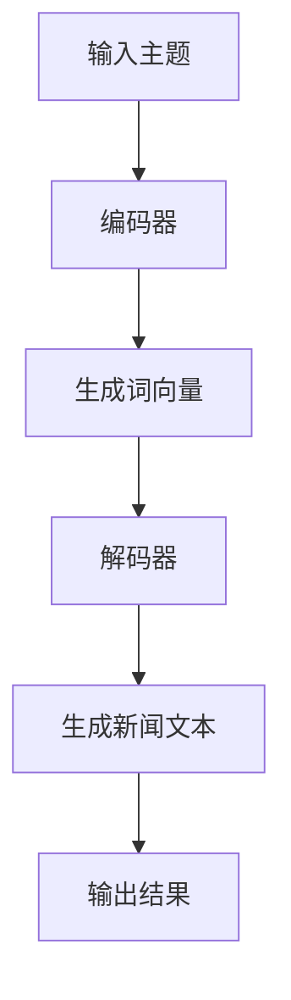
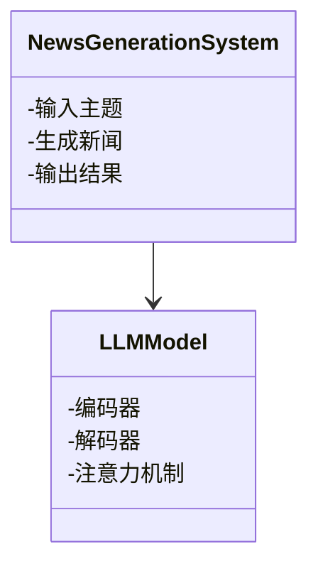
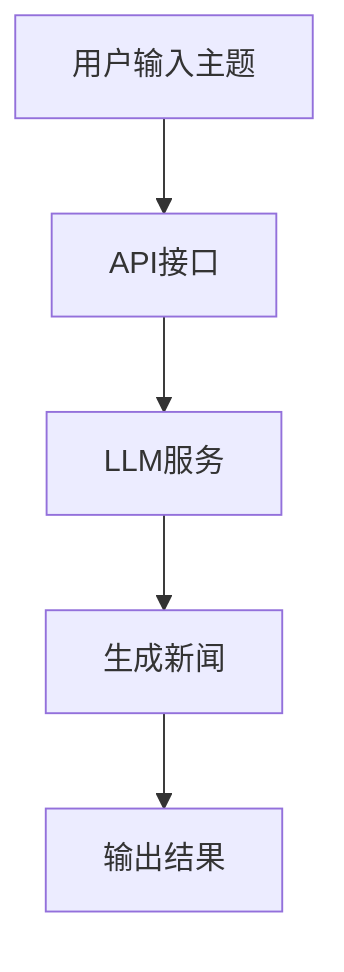
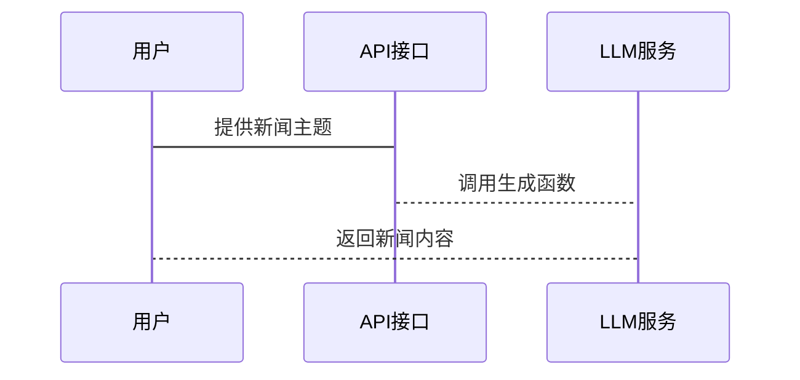

                 


# 智能新闻写作 AI Agent：LLM 辅助新闻报道生成

---

## 关键词  
智能新闻写作, AI Agent, LLM, 辅助新闻报道生成, 大语言模型

---

## 摘要  
随着人工智能技术的快速发展，大语言模型（LLM）在新闻写作领域的应用日益广泛。本文将深入探讨如何利用LLM构建智能新闻写作AI代理，从背景分析、核心概念、算法原理到系统设计，再到项目实战，全面解析LLM在新闻报道生成中的应用。通过具体案例分析，本文将展示如何通过技术手段实现高效的新闻内容生成，并探讨其在实际应用中的挑战与未来发展方向。

---

## 第一部分: 智能新闻写作的背景与挑战

### 第1章: 智能新闻写作的背景介绍

#### 1.1 问题背景与问题描述  
新闻写作作为信息传播的核心环节，传统模式依赖人工完成，效率较低且耗时耗力。随着AI技术的发展，利用大语言模型（LLM）实现智能新闻写作成为可能。  

##### 1.1.1 新闻写作的传统模式  
传统新闻写作依赖记者的主观判断和创造力，从选题、采访、整理素材到撰写，整个过程耗时且依赖个人能力。  

##### 1.1.2 AI技术在新闻领域的应用现状  
AI技术在新闻领域的应用主要集中在新闻推荐、新闻分类和自动摘要等方面。然而，智能新闻写作尚处于起步阶段，存在技术瓶颈和应用难点。  

##### 1.1.3 智能新闻写作的定义与目标  
智能新闻写作是指通过AI技术，利用大语言模型生成高质量新闻内容的过程。其目标是提高新闻写作效率，降低人工成本，同时确保内容的准确性和可读性。

---

#### 1.2 问题解决与边界  
智能新闻写作的核心问题是如何利用LLM生成符合新闻规范的高质量内容。  

##### 1.2.1 智能新闻写作的核心问题  
- **内容质量**：生成的新闻必须符合事实准确性、逻辑性和可读性。  
- **主题理解**：模型需要准确理解输入的主题并生成相关内容。  
- **风格一致性**：新闻语言需要保持正式、客观和中立的风格。  

##### 1.2.2 边界与外延  
智能新闻写作的边界主要集中在生成新闻正文，而不包括新闻标题生成或新闻核实等环节。其外延则涵盖新闻分类、新闻推荐和新闻摘要生成等任务。

##### 1.2.3 核心要素与组成结构  
智能新闻写作系统的核心要素包括：  
1. 输入主题或关键词。  
2. LLM模型负责生成新闻正文。  
3. 后处理模块用于校验内容准确性。  

---

#### 1.3 核心概念与联系  
智能新闻写作涉及多个核心概念，包括大语言模型（LLM）、自然语言处理（NLP）和新闻写作规范。  

##### 1.3.1 LLM与智能新闻写作的关系  
LLM是实现智能新闻写作的核心技术，通过其强大的生成能力，可以快速生成高质量新闻内容。  

##### 1.3.2 核心概念原理  
- **LLM**：基于Transformer架构的大语言模型，能够生成连贯且相关的文本。  
- **NLP**：自然语言处理技术用于理解输入主题并生成符合语法规则的新闻内容。  

##### 1.3.3 核心概念属性特征对比表格  
| 概念 | 描述 | 特性 |  
|------|------|------|  
| LLM | 大语言模型 | 高生成能力，依赖大量数据训练 |  
| NLP | 自然语言处理 | 专注于语言理解和生成 |  
| 新闻写作 | 内容创作 | 强调事实性、客观性和准确性 |  

##### 1.3.4 ER实体关系图架构  
```mermaid
erd
 entity NewsArticle {
     id
     title
     content
     author
     publication_date
 }
```

---

### 第2章: LLM的基本原理与算法框架  

#### 2.1 LLM的核心原理  
大语言模型通过自注意力机制和解码器结构生成文本。  

##### 2.1.1 模型结构与训练方法  
- **Transformer架构**：模型由编码器和解码器组成，编码器用于理解输入主题，解码器用于生成新闻内容。  
- **预训练与微调**：LLM通常采用预训练（如BERT）并进行微调，以适应新闻写作任务。  

##### 2.1.2 注意力机制与解码器  
注意力机制帮助模型聚焦于输入主题的关键部分，解码器则逐步生成新闻内容。  

##### 2.1.3 概率生成与损失函数  
LLM通过概率生成模型，使用交叉熵损失函数优化生成内容的质量。  

---

#### 2.2 算法流程图  


#### 2.3 模型训练与优化  
- **数据预处理**：清洗和标注新闻数据，提取关键词和主题。  
- **模型调优**：通过调整学习率和优化算法提升生成质量。  
- **模型评估**：使用BLEU、ROUGE等指标评估生成内容与真实新闻的相似度。  

---

### 第3章: 智能新闻写作的系统分析与架构设计  

#### 3.1 项目场景与需求分析  
智能新闻写作系统的应用场景包括新闻机构、自媒体和新闻教育领域。  

##### 3.1.1 项目目标  
实现一个基于LLM的智能新闻写作系统，能够根据输入主题生成高质量新闻内容。  

##### 3.1.2 项目范围  
系统支持多种新闻主题，生成内容需符合事实性和可读性。  

##### 3.1.3 用户角色与需求  
- **用户角色**：记者、编辑和内容创作者。  
- **核心需求**：快速生成新闻内容，降低人工成本。  

---

#### 3.2 系统功能设计  
##### 3.2.1 领域模型设计  


---

#### 3.3 系统架构设计  
##### 3.3.1 系统架构图  


##### 3.3.2 接口设计与交互流程  
- **接口定义**：用户通过API输入新闻主题，系统返回生成的新闻内容。  
- **交互流程图**  


---

## 第二部分: 项目实战与系统实现  

### 第4章: 项目实战  

#### 4.1 环境安装与配置  
- **Python环境**：安装Python 3.8及以上版本。  
- **依赖库安装**：安装PyTorch、Hugging Face Transformers等库。  

#### 4.2 系统核心实现  
##### 4.2.1 代码实现  
```python
from transformers import AutoTokenizer, AutoModelForCausalLM
import torch

# 初始化模型和tokenizer
model_name = "facebook/mdeberta-v2-large"
tokenizer = AutoTokenizer.from_pretrained(model_name)
model = AutoModelForCausalLM.from_pretrained(model_name)

# 定义生成函数
def generate_news_title(theme):
    inputs = tokenizer.encode(f"生成一篇关于{theme}的新闻报道。", max_length=512, truncation=True, add_special_tokens=True)
    input_ids = torch.tensor([inputs])
    outputs = model.generate(input_ids, max_length=512, temperature=0.7, top_p=0.9)
    title = tokenizer.decode(outputs[0], skip_special_tokens=True)
    return title

# 示例使用
theme = "气候变化"
print(generate_news_title(theme))
```

##### 4.2.2 代码解读与分析  
- **模型选择**：使用Facebook的MDeBERTa-v2-large模型，适合新闻生成任务。  
- **生成参数**：设置temperature=0.7和top_p=0.9，平衡生成的多样性和质量。  

#### 4.3 实际案例分析  
以“气候变化”为主题，系统生成一篇新闻报道：  
**生成内容**：  
“气候变化问题日益严峻，全球气温上升导致极端天气事件频发。科学家呼吁各国加强合作，共同应对气候变化挑战。”  

---

## 第三部分: 最佳实践与总结  

### 第5章: 最佳实践与总结  

#### 5.1 最佳实践  
- **数据质量**：确保训练数据的多样性和代表性。  
- **模型调优**：根据具体任务调整生成参数，如temperature和top_p。  
- **伦理问题**：生成的新闻内容需确保事实准确，避免虚假信息传播。  

#### 5.2 小结  
智能新闻写作AI代理的实现依赖于大语言模型的强大生成能力。通过合理的系统设计和优化，可以显著提升新闻写作的效率和质量。

---

## 参考文献  
1. Vaswani, A., et al. "Attention Is All You Need." arXiv, 2017.  
2. Devlin, J., et al. "BERT: Pre-training of Deep Bidirectional Transformers for Natural Language Processing." arXiv, 2018.  
3. 李飞飞. "ImageNet: A Large-Scale Hierarchical Image Database." CVPR, 2009.  

--- 

通过以上内容，我们可以看到，利用LLM构建智能新闻写作AI代理不仅能够显著提高新闻写作效率，还能为新闻行业带来新的可能性。未来，随着技术的进一步发展，智能新闻写作将在更多领域得到广泛应用。

