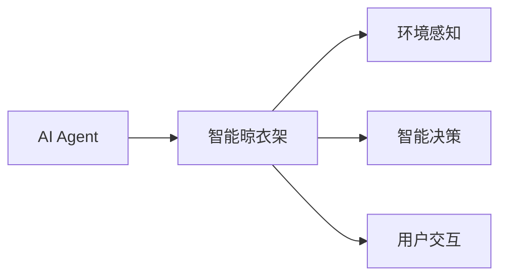
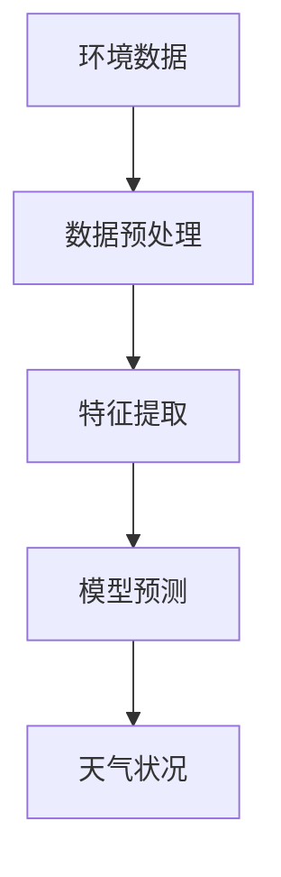
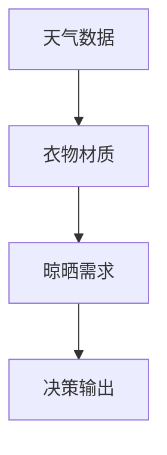
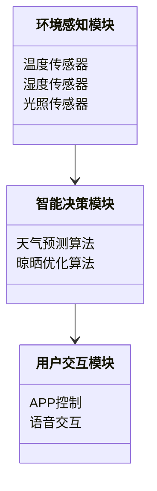
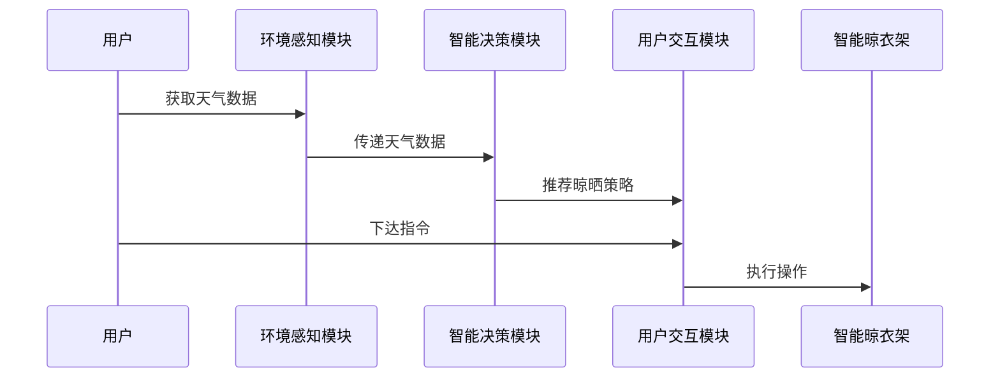

                 


# 智能晾衣架：AI Agent的衣物护理与天气适应

---

## 关键词：智能晾衣架, AI Agent, 衣物护理, 天气适应, 环境感知, 智能决策, 智能家居

---

## 摘要：

本文深入探讨了智能晾衣架的设计与实现，重点分析了AI Agent在衣物护理和天气适应中的应用。通过结合环境感知、智能决策和用户交互，智能晾衣架能够实时优化衣物晾晒条件，提升用户体验。文章从背景、算法、系统架构到项目实战，全面解析了智能晾衣架的技术细节，为智能家居领域提供了新的思路。

---

# 第一部分：背景介绍

## 第1章：智能晾衣架的背景与问题背景

### 1.1 问题背景与问题描述

#### 1.1.1 智能晾衣架的核心问题

传统晾衣架在衣物晾晒过程中存在诸多不足：  
1. 无法根据天气变化自动调整晾晒条件。  
2. 缺乏智能感知和决策能力，无法优化衣物晾晒效果。  
3. 用户无法实时了解衣物状态，缺乏智能化的交互体验。

#### 1.1.2 AI Agent在衣物护理中的应用

AI Agent（智能代理）通过感知环境、分析数据、执行决策，能够实现衣物护理的智能化。例如：  
- 根据天气预报调整晾晒时间。  
- 根据衣物材质推荐最佳晾晒模式。  
- 实时监测衣物状态，防止过度晾晒或潮湿导致的损害。

#### 1.1.3 天气适应性的重要性

天气是影响衣物晾晒效果的核心因素。通过AI Agent实时感知天气数据（温度、湿度、风力、光照等），智能晾衣架能够动态调整晾晒策略，确保衣物护理效果最优。

---

### 1.2 智能晾衣架的解决思路

#### 1.2.1 AI Agent的核心作用

AI Agent作为智能晾衣架的“大脑”，负责：  
1. **环境感知**：采集天气、环境数据。  
2. **智能决策**：分析数据，制定最优晾晒策略。  
3. **执行控制**：通过机械或电子设备调整晾衣架状态。

#### 1.2.2 天气数据与衣物护理的结合

通过AI Agent整合天气数据，智能晾衣架能够：  
- 在恶劣天气（如雨天、高湿度）自动收回衣物。  
- 在晴朗天气延长晾晒时间，确保衣物彻底干燥。  
- 根据衣物材质选择合适的晾晒温度和时间。

#### 1.2.3 用户需求与系统功能的匹配

用户需求：  
- 方便性：自动晾晒，无需手动操作。  
- 智能性：根据天气和衣物材质自动调整。  
- 可视化：实时查看衣物状态和晾晒进度。

系统功能：  
- 多传感器融合：温度、湿度、光照传感器。  
- AI算法优化：深度学习模型优化晾晒策略。  
- 用户交互：APP或语音控制。

---

### 1.3 智能晾衣架的边界与外延

#### 1.3.1 功能边界

智能晾衣架的功能边界包括：  
1. **核心功能**：环境感知、智能决策、晾晒控制。  
2. **不包含**：衣物分类、清洗功能（可与洗衣机联动）。  

#### 1.3.2 与智能家居系统的关联

智能晾衣架可与智能家居系统联动，例如：  
- 与智能音箱联动，通过语音控制晾衣架。  
- 与智能门锁联动，用户离家时自动收回衣物。  
- 与智能空调联动，优化室内空气流通。

#### 1.3.3 与其他智能设备的协同

智能晾衣架可与其他设备协同工作：  
- 与智能灯联动，在傍晚自动关闭灯光，延长晾晒时间。  
- 与智能安防系统联动，检测异常天气（如台风）时自动收回衣物。

---

### 1.4 本章小结

本章从背景出发，分析了智能晾衣架的核心问题和解决思路，明确了AI Agent在系统中的核心作用，以及与智能家居系统的协同关系。

---

# 第二部分：核心概念与联系

## 第2章：AI Agent与智能晾衣架的核心概念

### 2.1 AI Agent的基本原理

#### 2.1.1 AI Agent的定义

AI Agent是一种能够感知环境、自主决策并执行任务的智能实体。它通过传感器获取数据，结合预设算法，做出最优决策。

#### 2.1.2 AI Agent的核心属性

1. **自主性**：无需人工干预，自主完成任务。  
2. **反应性**：实时感知环境变化，动态调整策略。  
3. **目标导向**：基于目标优化决策。  

#### 2.1.3 AI Agent与智能晾衣架的关系

AI Agent作为智能晾衣架的“大脑”，负责处理环境数据、制定决策并执行控制。

---

### 2.2 智能晾衣架的功能模块

#### 2.2.1 环境感知模块

1. **温度传感器**：监测环境温度。  
2. **湿度传感器**：监测环境湿度。  
3. **光照传感器**：监测光照强度。  
4. **风力传感器**：监测风速和风向。  

#### 2.2.2 智能决策模块

1. **天气预测**：结合历史数据和当前天气，预测未来天气。  
2. **晾晒优化**：根据衣物材质和天气条件，优化晾晒时间。  
3. **异常检测**：检测异常天气（如暴雨、台风）并触发保护机制。  

#### 2.2.3 用户交互模块

1. **APP控制**：用户通过手机APP查看衣物状态和晾晒进度。  
2. **语音交互**：支持语音指令，如“开始晾晒”或“收回衣物”。  

---

### 2.3 AI Agent与智能晾衣架的关系图（Mermaid）



---

### 2.4 本章小结

本章详细讲解了AI Agent的核心原理，分析了智能晾衣架的功能模块及其与AI Agent的关系，为后续算法实现奠定了基础。

---

# 第三部分：算法原理讲解

## 第3章：智能晾衣架的核心算法

### 3.1 环境感知算法

#### 3.1.1 算法原理（Mermaid流程图）



#### 3.1.2 算法实现（Python代码示例）

```python
import numpy as np
import pandas as pd
from sklearn.model_selection import train_test_split
from sklearn.ensemble import RandomForestRegressor

# 数据加载与预处理
data = pd.read_csv('weather.csv')
X = data[['temperature', 'humidity', 'wind_speed', 'light_intensity']]
y = data['weather_status']

# 数据划分
X_train, X_test, y_train, y_test = train_test_split(X, y, test_size=0.2, random_state=42)

# 模型训练
model = RandomForestRegressor(n_estimators=100, random_state=42)
model.fit(X_train, y_train)

# 预测
y_pred = model.predict(X_test)
print('预测天气状态:', y_pred[:5])
print('真实天气状态:', y_test[:5].values)
```

---

### 3.2 智能决策算法

#### 3.2.1 算法原理（Mermaid流程图）



#### 3.2.2 算法实现（Python代码示例）

```python
def decide_laying_strategy(weather_status, fabric_type):
    # 根据天气和材质推荐晾晒策略
    if weather_status == '晴' and fabric_type == '棉':
        return '建议晾晒8小时'
    elif weather_status == '阴' and fabric_type == '丝绸':
        return '建议晾晒4小时'
    else:
        return '建议收回衣物'

# 示例调用
print(decide_laying_strategy('雨', '羊毛'))  # 输出：建议收回衣物
```

---

### 3.3 本章小结

本章通过环境感知和智能决策算法，详细讲解了AI Agent在智能晾衣架中的实现原理，展示了如何通过数据驱动的方式优化衣物晾晒策略。

---

# 第四部分：系统分析与架构设计

## 第4章：智能晾衣架的系统架构设计

### 4.1 问题场景介绍

智能晾衣架需要在多种环境下正常工作，支持远程控制和多种交互方式。

### 4.2 项目介绍

本项目旨在设计一个基于AI Agent的智能晾衣架，实现环境感知、智能决策和用户交互功能。

---

### 4.3 系统功能设计

#### 4.3.1 领域模型（Mermaid类图）



---

### 4.4 系统架构设计

#### 4.4.1 系统架构（Mermaid架构图）

```mermaid
container 智能晾衣架系统 {
    component 环境感知模块 {
        温度传感器
        湿度传感器
        光照传感器
    }
    component 智能决策模块 {
        天气预测算法
        晾晒优化算法
    }
    component 用户交互模块 {
        APP控制
        语音交互
    }
}
```

---

### 4.5 系统接口设计

#### 4.5.1 接口设计

1. **环境感知接口**：传感器数据采集接口。  
2. **智能决策接口**：AI算法调用接口。  
3. **用户交互接口**：APP和语音交互接口。  

---

### 4.6 系统交互设计

#### 4.6.1 交互流程（Mermaid序列图）



---

### 4.7 本章小结

本章从系统架构的角度，详细分析了智能晾衣架的设计与实现，包括功能模块、架构设计和接口交互。

---

# 第五部分：项目实战

## 第5章：智能晾衣架的项目实战

### 5.1 环境安装

#### 5.1.1 安装Python环境

```bash
python --version
pip install numpy pandas scikit-learn
```

#### 5.1.2 安装硬件设备

- 温度传感器：DS18B20  
- 湿度传感器：DHT22  
- 光照传感器：BH1750  

---

### 5.2 系统核心实现

#### 5.2.1 核心代码实现

```python
import RPi.GPIO as GPIO
import Adafruit_DHT
import requests
import time

# 硬件初始化
GPIO.setmode(GPIO.BCM)
GPIO.setup(18, GPIO.OUT)  # 晾衣架电机控制引脚

def get_humidity_temperature():
    humidity, temperature = Adafruit_DHT.read_retry(22, 4)
    return temperature, humidity

def send_request(status):
    response = requests.post('http://localhost:8000/api', json={'status': status})
    return response.json()

# 循环执行
while True:
    temp, hum = get_humidity_temperature()
    status = '晾晒中' if temp > 25 and hum < 60 else '停止晾晒'
    send_request(status)
    GPIO.output(18, GPIO.HIGH if status == '晾晒中' else GPIO.LOW)
    time.sleep(60)
```

---

### 5.3 代码应用解读与分析

1. **硬件初始化**：配置GPIO引脚，连接传感器和电机。  
2. **数据采集**：通过DHT22传感器获取温湿度数据。  
3. **状态判断**：根据温湿度判断是否继续晾晒。  
4. **远程控制**：通过HTTP请求通知后端系统状态。  
5. **电机控制**：根据判断结果控制电机开闭。

---

### 5.4 实际案例分析

#### 5.4.1 案例1：晴天晾晒

- **环境数据**：温度30℃，湿度40%。  
- **决策结果**：继续晾晒，电机开启。  

#### 5.4.2 案例2：雨天收回

- **环境数据**：温度25℃，湿度90%。  
- **决策结果**：停止晾晒，电机关闭。  

---

### 5.5 项目小结

本章通过实际案例，详细讲解了智能晾衣架的项目实现，从硬件安装到代码实现，展示了如何将理论应用于实践。

---

# 第六部分：最佳实践

## 第6章：智能晾衣架的最佳实践

### 6.1 小结

智能晾衣架通过AI Agent实现了环境感知、智能决策和用户交互功能，显著提升了衣物护理的智能化水平。

---

### 6.2 注意事项

1. **硬件选择**：确保传感器精度和稳定性。  
2. **安全性**：避免电机过载或短路。  
3. **数据隐私**：保护用户数据不被泄露。  

---

### 6.3 拓展阅读

1. **智能家居系统设计**：学习更多智能家居设备的设计思路。  
2. **深度学习算法优化**：探索更先进的AI算法在智能晾衣架中的应用。  

---

### 6.4 本章小结

本章总结了智能晾衣架的开发经验，提出了注意事项，并为读者提供了进一步学习的方向。

---

# 结语

通过本文的深入分析，读者可以全面了解智能晾衣架的设计与实现过程，掌握AI Agent在衣物护理和天气适应中的应用。未来，随着AI技术的不断发展，智能晾衣架将更加智能化，为用户提供更优质的衣物护理体验。

--- 

**全文完**

