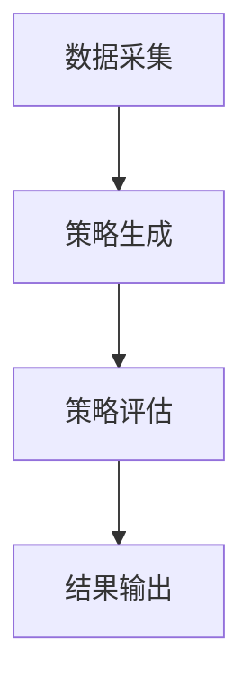
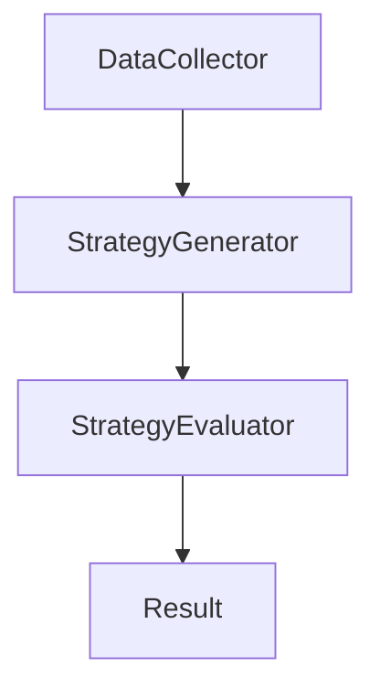
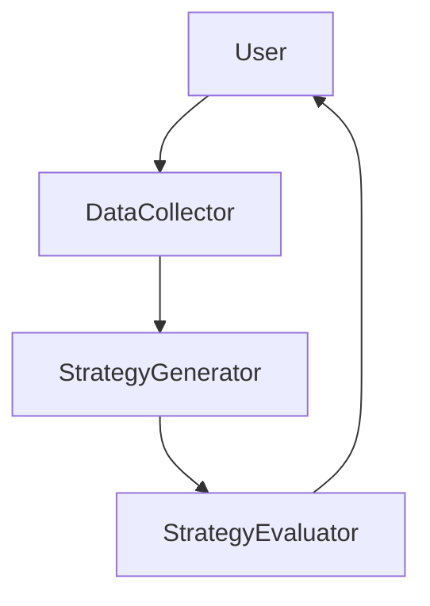

                 


# 智能期权交易策略生成器

> 关键词：智能期权交易、策略生成器、人工智能、强化学习、期权交易策略、金融算法

> 摘要：本文详细探讨了智能期权交易策略生成器的设计与实现。通过结合人工智能技术，特别是强化学习算法，提出了一个高效的策略生成系统。文章从背景、原理、算法、系统架构到项目实战，全面分析了智能期权交易策略生成器的各个关键环节，并通过具体案例展示了其实际应用价值。

---

## 第1章: 智能期权交易策略生成器的背景与意义

### 1.1 智能期权交易的背景

期权交易是一种复杂的金融衍生品交易方式，其核心在于通过对市场波动率、标的资产价格走势等多因素的分析，制定出最优的买入或卖出策略。然而，传统的人工交易模式存在以下问题：

1. **交易效率低**：交易员需要实时监控市场数据，分析技术指标，制定交易策略，过程耗时且容易出错。
2. **策略单一性**：交易员的主观判断容易受到情绪影响，难以覆盖所有可能的市场情况。
3. **市场波动性大**：期权交易涉及复杂的数学模型和概率计算，人工操作难以快速适应市场变化。

智能期权交易策略生成器通过结合机器学习、强化学习等人工智能技术，能够实时分析市场数据，自动优化交易策略，从而提高交易效率和收益。

### 1.2 期权的基本概念与交易机制

期权是一种金融衍生品，赋予持有者在未来某一特定时间以特定价格买入或卖出标的资产的权利。期权交易的核心在于确定标的资产的价格走势和波动率，从而制定买入或卖出期权的策略。

#### 1.2.1 期权的定义与分类

- **看涨期权**：买入期权，赋予持有者在未来以固定价格买入标的资产的权利。
- **看跌期权**：卖出期权，赋予持有者在未来以固定价格卖出标的资产的权利。
- **欧式期权**：只能在到期日行使权利。
- **美式期权**：可以在到期日前的任何时间行使权利。

#### 1.2.2 期权定价模型简介

期权的定价通常基于Black-Scholes模型，该模型考虑了标的资产价格、执行价格、波动率、时间、利率等因素，计算出期权的理论价格。公式如下：

$$ C = S_0 \cdot N(d_1) - K e^{-rT} \cdot N(d_2) $$

其中：
- $S_0$：标的资产当前价格
- $K$：执行价格
- $r$：无风险利率
- $T$：到期时间
- $N(d)$：标准正态分布的累积分布函数
- $d_1 = \frac{\ln(S_0/K) + (r + \sigma^2/2)T}{\sigma \sqrt{T}}$
- $d_2 = d_1 - \sigma \sqrt{T}$

#### 1.2.3 期权交易的基本策略

期权交易的基本策略包括：
1. **买入看涨期权**：预期标的资产价格上涨。
2. **卖出看涨期权**：预期标的资产价格下跌。
3. **买入看跌期权**：预期标的资产价格下跌。
4. **卖出看跌期权**：预期标的资产价格上涨。

### 1.3 智能生成策略的优势

智能期权交易策略生成器通过人工智能技术，能够实时分析市场数据，优化交易策略，从而显著提高交易效率和收益。其优势包括：

1. **提高交易效率**：通过自动化分析市场数据，快速生成最优策略。
2. **增强策略多样性**：利用机器学习算法，探索更多潜在的交易策略。
3. **降低人为情绪干扰**：避免交易员情绪波动对交易决策的影响。

---

## 第2章: 智能期权交易策略生成器的核心概念

### 2.1 生成器的基本原理

智能期权交易策略生成器基于强化学习算法，通过不断优化策略参数，生成最优的交易策略。其核心原理如下：

1. **强化学习算法**：通过定义状态空间、动作空间和奖励函数，训练策略生成器不断优化交易策略。
2. **特征工程**：将市场数据（如K线图、技术指标）转化为策略生成器的输入特征。
3. **策略评估**：通过回测和风险指标评估生成的交易策略的优劣。

#### 2.1.1 强化学习算法

强化学习是一种通过试错机制优化决策过程的算法。在智能期权交易策略生成器中，强化学习算法通过不断调整策略参数，找到最优的交易策略。

##### Q-Learning算法

Q-Learning是一种经典的强化学习算法，其核心思想是通过维护一个Q表，记录每个状态-动作对的最优价值。公式如下：

$$ Q(s, a) = Q(s, a) + \alpha \cdot (r + \gamma \cdot \max_{a'} Q(s', a') - Q(s, a)) $$

其中：
- $s$：当前状态
- $a$：当前动作
- $r$：获得的奖励
- $\alpha$：学习率
- $\gamma$：折扣因子
- $s'$：下一个状态

##### 动作空间与状态空间

在智能期权交易策略生成器中，状态空间可以包括标的资产的价格、波动率、时间等市场数据，动作空间则包括买入、卖出、持有等交易动作。

#### 2.1.2 特征工程

特征工程是将市场数据转化为策略生成器的输入特征的过程。常用的市场数据特征包括：
- 标的资产价格（K线图）
- 技术指标（如RSI、MACD、布林带等）
- 市场波动率
- 时间因素

通过特征工程，策略生成器能够更好地理解市场数据，生成更优的交易策略。

### 2.2 策略生成器的输入与输出

智能期权交易策略生成器的输入是市场数据和交易规则，输出是具体的交易策略。输入包括：
- 标的资产价格数据
- 技术指标数据
- 风险参数

输出包括：
- 买入或卖出信号
- 交易量建议
- 止损和止盈点位

### 2.3 策略评估指标

策略评估是智能期权交易策略生成器的重要组成部分，常用的评估指标包括：
- 净收益（Net Profit）
- 夏普比率（Sharpe Ratio）
- 最大回撤（Maximum Drawdown）
- 盈利因子（Profit Factor）

---

## 第3章: 算法原理的详细讲解

### 3.1 强化学习算法的数学模型

在智能期权交易策略生成器中，强化学习算法的核心是Q-Learning算法。通过不断地更新Q表，找到最优的交易策略。

#### Q-Learning算法的数学模型

Q-Learning算法的目标是找到一个最优策略，使得在长期的累计奖励最大化。其数学模型如下：

$$ Q(s, a) = Q(s, a) + \alpha \cdot (r + \gamma \cdot \max_{a'} Q(s', a') - Q(s, a)) $$

其中：
- $\alpha$：学习率
- $\gamma$：折扣因子
- $s$：当前状态
- $a$：当前动作
- $s'$：下一个状态
- $r$：获得的奖励

#### 算法实现的Python代码示例

以下是一个简单的Q-Learning算法的Python实现示例：

```python
import numpy as np
import random

class QLearning:
    def __init__(self, state_space, action_space):
        self.state_space = state_space
        self.action_space = action_space
        self.q_table = np.zeros((state_space, action_space))
    
    def choose_action(self, state, epsilon=0.1):
        if random.random() < epsilon:
            return random.randint(0, self.action_space - 1)
        else:
            return np.argmax(self.q_table[state])
    
    def update_q_table(self, current_state, action, reward, next_state, learning_rate=0.1, gamma=0.9):
        self.q_table[current_state, action] = self.q_table[current_state, action] + learning_rate * (reward + gamma * np.max(self.q_table[next_state, :]) - self.q_table[current_state, action])
```

### 3.2 算法实现的详细步骤

1. **定义状态空间和动作空间**：根据市场数据，定义状态空间和动作空间。
2. **初始化Q表**：初始化一个Q表，记录每个状态-动作对的Q值。
3. **选择动作**：根据当前状态和策略，选择一个动作。
4. **执行动作并获得奖励**：根据选择的动作执行交易，并获得奖励。
5. **更新Q表**：根据奖励更新Q表，优化策略。

---

## 第4章: 系统分析与架构设计方案

### 4.1 系统功能设计

智能期权交易策略生成器的功能模块包括：
1. **数据采集模块**：采集市场数据（如K线图、技术指标）。
2. **策略生成模块**：基于强化学习算法，生成交易策略。
3. **策略评估模块**：评估生成的交易策略的优劣。

#### 系统功能流程图



### 4.2 系统架构设计

智能期权交易策略生成器的系统架构包括：
1. **数据采集模块**：负责采集市场数据。
2. **策略生成模块**：基于强化学习算法，生成交易策略。
3. **策略评估模块**：评估生成的交易策略的优劣。

#### 系统架构图



### 4.3 系统接口设计

智能期权交易策略生成器的系统接口包括：
1. **数据接口**：负责数据的输入输出。
2. **策略接口**：负责策略生成和优化。
3. **评估接口**：负责策略评估和结果输出。

### 4.4 系统交互流程图



---

## 第5章: 项目实战

### 5.1 环境配置

智能期权交易策略生成器的环境配置包括：
1. **Python环境**：安装Python和必要的库（如numpy、pandas、matplotlib）。
2. **数据源**：获取市场数据（如K线图、技术指标）。

### 5.2 核心代码实现

以下是智能期权交易策略生成器的核心代码实现：

```python
import numpy as np
import pandas as pd
import matplotlib.pyplot as plt

# 数据预处理
data = pd.read_csv('market_data.csv')
data['SMA'] = data['Close'].rolling(20).mean()  # 计算20日移动平均线

# 策略生成
class StrategyGenerator:
    def __init__(self):
        self.states = [' bullish', ' bearish']
        self.actions = [' buy', ' sell']
        self.q_table = np.zeros((2, 2))
    
    def choose_action(self, state, epsilon=0.1):
        if random.random() < epsilon:
            return random.randint(0, 1)
        else:
            return np.argmax(self.q_table[self.states.index(state)])
    
    def update_q_table(self, current_state, action, reward, next_state, learning_rate=0.1, gamma=0.9):
        self.q_table[self.states.index(current_state), action] = self.q_table[self.states.index(current_state), action] + learning_rate * (reward + gamma * np.max(self.q_table[self.states.index(next_state)]) - self.q_table[self.states.index(current_state), action])

# 策略评估
def backtest(strategy, data):
    portfolio = []
    for i in range(len(data)):
        state = 'bullish' if data['SMA'][i] > data['Close'][i] else 'bearish'
        action = strategy.choose_action(state)
        if action == 0:
            portfolio.append('buy')
        else:
            portfolio.append('sell')
    return portfolio

# 生成策略
strategy = StrategyGenerator()
portfolio = backtest(strategy, data)

# 可视化结果
plt.plot(portfolio)
plt.title('交易策略生成结果')
plt.xlabel('时间')
plt.ylabel('交易信号')
plt.show()
```

### 5.3 案例分析与结果解读

以下是一个具体的案例分析：

假设我们有一个包含标的资产价格数据和20日移动平均线（SMA）的数据集。我们使用智能期权交易策略生成器生成交易策略，并通过回测分析策略的有效性。

1. **数据预处理**：读取数据并计算20日移动平均线。
2. **策略生成**：基于强化学习算法，生成交易策略。
3. **策略评估**：通过回测分析策略的有效性。

---

## 第6章: 最佳实践与小结

### 6.1 最佳实践

1. **数据质量**：确保输入数据的准确性和完整性。
2. **算法优化**：根据实际需求优化算法参数。
3. **风险控制**：制定有效的风险控制策略。

### 6.2 小结

智能期权交易策略生成器是一种基于人工智能技术的高效交易工具，能够通过自动化分析市场数据，优化交易策略，从而提高交易效率和收益。本文通过详细分析智能期权交易策略生成器的各个关键环节，展示了其在实际应用中的巨大潜力。

---

## 第7章: 注意事项与拓展阅读

### 7.1 注意事项

1. **市场风险**：智能期权交易策略生成器无法完全消除市场风险。
2. **算法局限性**：算法的有效性依赖于数据质量和模型设计。
3. **合规性**：使用智能期权交易策略生成器需遵守相关法律法规。

### 7.2 拓展阅读

1. **强化学习在金融中的应用**：深入探讨强化学习在金融领域的其他应用。
2. **期权定价模型**：进一步学习期权定价模型的数学原理。
3. **机器学习在金融时间序列分析中的应用**：研究机器学习在金融时间序列分析中的应用。

---

通过本文的详细讲解，读者可以全面了解智能期权交易策略生成器的设计与实现，并能够根据实际需求，灵活应用相关技术。

