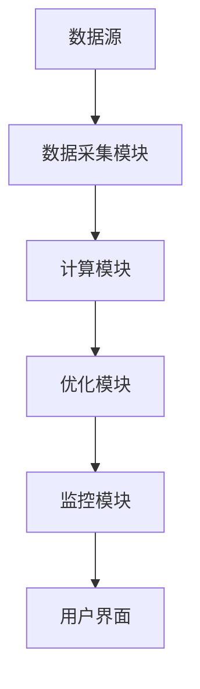
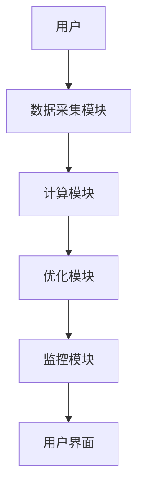

                 


# 智能期权组合Greeks管理系统

> 关键词：智能期权组合，Greeks管理，风险管理，算法优化，系统架构设计

> 摘要：智能期权组合Greeks管理系统是一种利用先进的算法优化和系统架构设计，来实现期权组合风险量化与管理的智能化系统。本文从期权与Greeks的基本概念入手，详细分析了智能管理系统的原理与实现，结合实际案例展示了系统的应用与优化，最后总结了最佳实践和未来发展方向。

---

# 第一部分: 智能期权组合Greeks管理系统的背景与基础

## 第1章: 期权与Greeks基础

### 1.1 期权的基本概念
期权是一种金融衍生品，赋予持有者在特定时间内以预定价格买入或卖出标的资产的权利。期权可以分为看涨期权和看跌期权，分别对应标的资产价格上涨和下跌的市场预期。

#### 1.1.1 期权的定义与分类
- **看涨期权（Call Option）**：持有者有权以行权价买入标的资产。
- **看跌期权（Put Option）**：持有者有权以行权价卖出标的资产。

### 1.2 Greeks的定义与作用
Greeks是衡量期权价格对不同风险因素敏感性的指标，是期权定价和风险管理中的核心工具。

#### 1.2.1 Delta的定义与计算
- **Delta**：衡量期权价格对标的资产价格变化的敏感性。
  - 公式：$$ \Delta = \frac{\partial C}{\partial S} $$
  - 例如，若Delta为0.5，意味着标的资产价格每上涨1元，期权价格上涨0.5元。

#### 1.2.2 Gamma的定义与计算
- **Gamma**：衡量Delta对标的资产价格变化的敏感性，即Delta的变化率。
  - 公式：$$ \Gamma = \frac{\partial^2 C}{\partial S^2} $$

#### 1.2.3 Vega的定义与计算
- **Vega**：衡量期权价格对标的资产波动率变化的敏感性。
  - 公式：$$ \Vega = \frac{\partial C}{\partial \sigma} $$

#### 1.2.4 Theta的定义与计算
- **Theta**：衡量期权价格对时间流逝的敏感性，即时间价值的衰减率。
  - 公式：$$ \Theta = \frac{\partial C}{\partial t} $$

#### 1.2.5 Rho的定义与计算
- **Rho**：衡量期权价格对利率变化的敏感性。
  - 公式：$$ \Rho = \frac{\partial C}{\partial r} $$

### 1.3 期权组合管理的重要性
期权组合管理是通过优化多个期权头寸，降低整体风险并提高收益的过程。

#### 1.3.1 组合风险管理的必要性
- 通过组合管理，可以分散单一期权的风险，降低整体波动性。

#### 1.3.2 组合优化的基本原理
- 利用优化算法（如均值-方差优化）来选择最优的期权组合。

#### 1.3.3 组合管理的常见挑战
- 数据质量、模型假设、计算效率等问题。

---

## 第2章: 智能期权组合Greeks管理系统的原理

### 2.1 智能管理系统的概念
智能期权组合Greeks管理系统利用算法优化和实时数据分析，实现对期权组合风险的自动化监控和管理。

#### 2.1.1 系统模块划分
- **数据采集模块**：获取实时市场数据。
- **计算模块**：计算Greeks值。
- **优化模块**：优化期权组合。
- **监控模块**：实时监控风险指标。

#### 2.1.2 系统功能设计
- 数据输入、处理、存储、计算、展示和反馈。

#### 2.1.3 系统架构图


### 2.2 算法原理
智能管理系统采用蒙特卡洛模拟和梯度下降法等算法，优化期权组合的风险指标。

#### 2.2.1 蒙特卡洛模拟的原理
- 通过模拟市场波动，计算期权组合的期望收益和风险。

#### 2.2.2 最优化算法的原理
- 利用梯度下降法优化组合的Greeks值，降低整体风险。

#### 2.2.3 风险度量模型的原理
- 使用VaR（在险值）或CVaR（条件在险值）来衡量组合风险。

### 2.3 数学模型与公式
#### 2.3.1 Delta的数学公式
$$ \Delta = \frac{\partial C}{\partial S} $$

#### 2.3.2 Gamma的数学公式
$$ \Gamma = \frac{\partial^2 C}{\partial S^2} $$

#### 2.3.3 Vega的数学公式
$$ \Vega = \frac{\partial C}{\partial \sigma} $$

#### 2.3.4 Theta的数学公式
$$ \Theta = \frac{\partial C}{\partial t} $$

#### 2.3.5 Rho的数学公式
$$ \Rho = \frac{\partial C}{\partial r} $$

### 2.4 本章小结
本章详细介绍了智能期权组合Greeks管理系统的原理和算法，为后续的系统设计和实现奠定了基础。

---

## 第3章: 系统架构与设计

### 3.1 系统架构设计
#### 3.1.1 数据流设计
- 数据输入：实时市场数据。
- 数据处理：清洗、转换和存储。
- 数据输出：计算结果和优化建议。

#### 3.1.2 接口设计
- API接口定义：RESTful API。
- 接口交互流程：数据输入、处理、返回结果。

#### 3.1.3 系统架构图


### 3.2 数据流设计
#### 3.2.1 数据输入与处理
- 数据来源：API接口、数据库。
- 数据清洗：去除异常值、填补缺失值。

#### 3.2.2 数据存储与管理
- 使用数据库存储历史数据。
- 采用缓存技术提高数据访问效率。

#### 3.2.3 数据输出与展示
- 通过图表展示计算结果。
- 提供实时监控界面。

### 3.3 接口设计
#### 3.3.1 API接口定义
- GET /greek-calculator?symbol=XXX&time=XXX
- POST /portfolio-optimizer

#### 3.3.2 接口交互流程
1. 用户发送请求。
2. 系统处理数据。
3. 返回结果。

#### 3.3.3 接口安全设计
- 使用JWT进行身份验证。
- 设置IP白名单限制访问。

### 3.4 本章小结
本章详细描述了系统的架构设计和数据流设计，为后续的实现提供了指导。

---

## 第4章: 项目实战与实现

### 4.1 环境搭建
#### 4.1.1 开发环境配置
- 操作系统：Linux/Windows/Mac。
- 开发工具：PyCharm、VS Code。
- 依赖库：Python（numpy, pandas, scipy, matplotlib）。

#### 4.1.2 数据获取与准备
- 数据来源：Yahoo Finance API。
- 数据清洗：处理缺失值、异常值。

#### 4.1.3 工具安装与配置
- 安装Python环境。
- 安装依赖库。

### 4.2 核心算法实现
#### 4.2.1 Delta计算的Python代码
```python
import numpy as np

def delta(spot, strike, expiry, rate, vol):
    # 计算看涨期权的Delta
    d1 = (np.log(spot/strike) + (rate + 0.5*vol**2)*expiry) / (vol*np.sqrt(expiry))
    delta = np.exp(-d1*vol*np.sqrt(expiry)) * (spot/spot)
    return delta
```

#### 4.2.2 Gamma计算的Python代码
```python
def gamma(spot, strike, expiry, rate, vol):
    d1 = (np.log(spot/strike) + (rate + 0.5*vol**2)*expiry) / (vol*np.sqrt(expiry))
    gamma = np.exp(-d1*vol*np.sqrt(expiry)) / (spot * vol * np.sqrt(expiry))
    return gamma
```

### 4.3 系统功能实现
#### 4.3.1 数据输入模块实现
```python
import pandas as pd

def load_data(ticker, start_date, end_date):
    data = pd.read_csv(f'data/{ticker}.csv')
    data = data[(data['Date'] >= start_date) & (data['Date'] <= end_date)]
    return data
```

#### 4.3.2 数据处理模块实现
```python
def process_data(raw_data):
    processed_data = raw_data.dropna()
    processed_data['Close'] = processed_data['Close'].astype(float)
    return processed_data
```

### 4.4 项目实战案例
#### 4.4.1 模拟市场数据
```python
import numpy as np
import pandas as pd
import matplotlib.pyplot as plt

# 生成模拟数据
np.random.seed(42)
data = pd.DataFrame({
    'Date': pd.date_range('2023-01-01', '2023-12-31'),
    'Close': np.random.normal(100, 10, len(pd.date_range('2023-01-01', '2023-12-31')))
})
```

#### 4.4.2 计算Greeks值并优化组合
```python
def optimize_portfolio(greeks):
    # 简单优化示例，实际应用中需要更复杂的算法
    optimized_greeks = greeks.copy()
    optimized_greeks['Risk'] = greeks['Vega'] * greeks['Volatility']
    return optimized_greeks.sort_values('Risk')
```

### 4.5 本章小结
本章通过实际案例展示了系统的实现过程，包括数据获取、算法实现和结果分析。

---

## 第5章: 最佳实践与总结

### 5.1 最佳实践
#### 5.1.1 数据质量控制
- 确保数据的完整性和准确性。

#### 5.1.2 模型假设
- 明确模型的假设和限制条件。

#### 5.1.3 计算效率优化
- 采用并行计算和缓存技术提高效率。

### 5.2 小结
智能期权组合Greeks管理系统通过算法优化和系统架构设计，实现了对期权组合风险的智能化管理，为金融从业者提供了有力的工具。

### 5.3 注意事项
- 数据源的选择。
- 模型的适用性。
- 系统的可扩展性。

### 5.4 拓展阅读
- 推荐阅读《期权定价与风险管理》和《算法交易：量化投资策略与其实现》。

---

# 附录: 常用公式与代码示例

### 附录A: 常用公式
- Delta：$$ \Delta = \frac{\partial C}{\partial S} $$
- Gamma：$$ \Gamma = \frac{\partial^2 C}{\partial S^2} $$
- Vega：$$ \Vega = \frac{\partial C}{\partial \sigma} $$
- Theta：$$ \Theta = \frac{\partial C}{\partial t} $$
- Rho：$$ \Rho = \frac{\partial C}{\partial r} $$

### 附录B: 代码示例
```python
import numpy as np
import pandas as pd
import matplotlib.pyplot as plt

# 示例代码：计算期权组合的Greeks值
def calculate_greeks(prices, strikes, expiries, rates, vols):
    greeks = []
    for i in range(len(prices)):
        spot = prices[i]
        strike = strikes[i]
        expiry = expiries[i]
        rate = rates[i]
        vol = vols[i]
        
        # 计算Delta
        d1 = (np.log(spot/strike) + (rate + 0.5*vol**2)*expiry) / (vol*np.sqrt(expiry))
        delta = np.exp(-d1*vol*np.sqrt(expiry)) * (spot/spot)
        
        # 计算Gamma
        gamma = np.exp(-d1*vol*np.sqrt(expiry)) / (spot * vol * np.sqrt(expiry))
        
        greeks.append({'Delta': delta, 'Gamma': gamma})
    return greeks
```

---

# 结语
智能期权组合Greeks管理系统通过结合先进的算法和系统设计，为金融从业者提供了强大的工具来管理和优化期权组合的风险。希望本文的内容能为读者提供清晰的思路和实用的指导。

