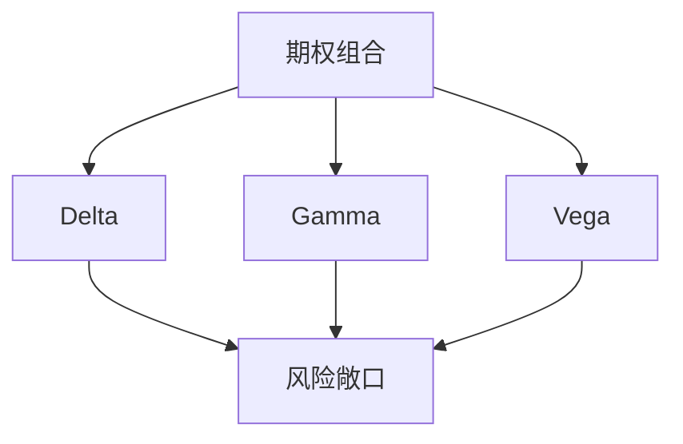
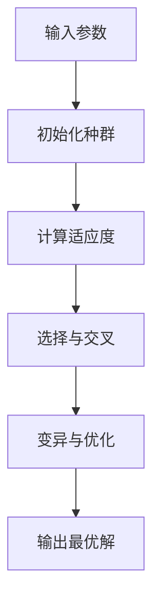
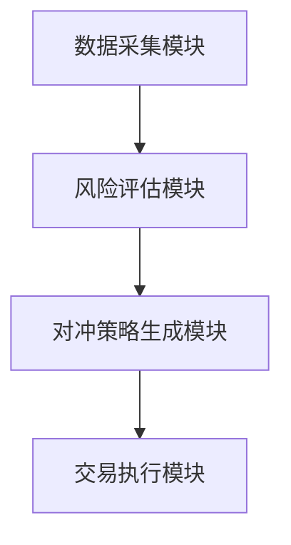
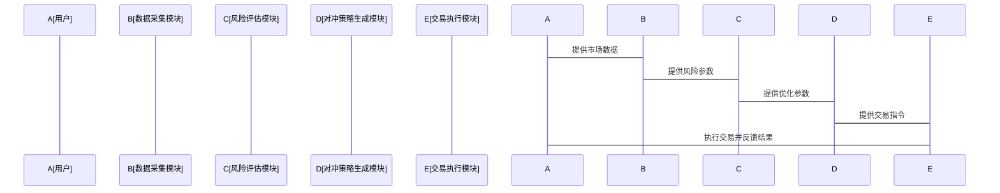

                 


# 智能期权组合风险敞口管理与对冲系统

> 关键词：智能期权，风险敞口，对冲系统，遗传算法，粒子群优化，深度学习

> 摘要：本文详细探讨智能期权组合风险敞口管理与对冲系统的理论基础、算法原理、系统架构及项目实现。通过结合现代金融理论与智能算法，提出了一种高效的风险管理与对冲策略，旨在帮助投资者在复杂多变的期权市场中实现稳健的投资回报。

---

# 第一部分: 智能期权组合风险敞口管理与对冲系统概述

## 第1章: 智能期权组合风险敞口管理与对冲系统概述

### 1.1 智能期权组合风险敞口管理的背景与意义

#### 1.1.1 期权市场的基本概念与特点
期权是一种金融衍生品，赋予持有者在特定时间以特定价格买入或卖出标的资产的权利。期权市场具有高杠杆、高波动性和非线性收益的特点，这使得风险管理尤为重要。

#### 1.1.2 风险敞口管理的核心问题
在期权交易中，风险敞口主要表现为价格波动、波动率变化、利率变动等多重风险因素的叠加。传统的风险敞口管理方法难以应对复杂市场环境下的动态风险。

#### 1.1.3 智能对冲系统在现代金融中的作用
智能对冲系统通过算法优化和实时数据分析，能够快速识别和调整风险敞口，帮助投资者在复杂市场中实现稳健收益。智能对冲系统的核心在于将复杂的风险因素转化为可量化、可管理的指标，并通过算法实现最优对冲策略。

### 1.2 智能期权组合管理的理论基础

#### 1.2.1 期权定价理论
期权定价的核心是Black-Scholes模型，该模型通过数学公式量化期权的价值。公式如下：

$$
C = S_0 \Phi(d_1) - K e^{-rT} \Phi(d_2)
$$

其中，$S_0$是标的资产价格，$K$是行权价，$r$是无风险利率，$T$是到期时间，$\Phi$是标准正态分布的累积分布函数。

#### 1.2.2 风险中性定价方法
风险中性定价假设市场中的参与者对风险持中性态度，通过构建无风险套利组合来消除市场中的系统性风险。

#### 1.2.3 现代投资组合理论（MPT）与风险对冲
MPT强调通过分散投资降低组合风险，智能对冲系统通过动态调整投资组合，进一步降低风险敞口。

### 1.3 智能对冲系统的核心概念与框架

#### 1.3.1 风险敞口的定义与分类
风险敞口包括市场风险、流动性风险、信用风险等。在期权组合中，风险敞口主要关注价格波动、波动率变化和时间衰减带来的风险。

#### 1.3.2 智能对冲系统的功能模块
智能对冲系统主要包括数据采集、风险评估、对冲策略生成和执行交易四个模块。

#### 1.3.3 系统的输入、输出与边界条件
- 输入：实时市场数据、期权组合参数、风险偏好
- 输出：最优对冲策略、风险敞口报告
- 边界条件：市场数据的实时性、计算模型的准确性

---

## 第2章: 期权组合风险敞口管理的核心概念与联系

### 2.1 核心概念与原理

#### 2.1.1 期权组合的风险来源
- Delta风险：价格波动带来的风险
- Gamma风险：波动率变化带来的风险
- Vega风险：波动率变化带来的风险

#### 2.1.2 Delta、Gamma、Vega等 Greeks 的定义与计算
Delta衡量期权价格对标的资产价格的变化敏感度，Gamma衡量Delta的变化敏感度，Vega衡量波动率变化带来的期权价格变化。

#### 2.1.3 风险敞口的度量与优化方法
通过优化算法最小化风险敞口，例如最小化方差或最大 Sharpe 比率。

### 2.2 核心概念的属性特征对比

#### 2.2.1 Delta与Gamma的对比分析
- Delta是线性度量，Gamma是二次度量
- Delta适用于小波动，Gamma适用于大波动

#### 2.2.2 Vega与Volatility的对比分析
- Vega是波动率的敏感度指标
- Volatility是实际波动率

#### 2.2.3 风险敞口的线性与非线性特征
线性风险敞口可以通过对冲完全消除，而非线性风险敞口只能通过分散投资降低。

### 2.3 实体关系图与系统架构



---

## 第3章: 智能期权组合对冲算法原理

### 3.1 智能对冲算法的数学模型

#### 3.1.1 基于遗传算法的优化模型
遗传算法是一种模拟自然选择的优化算法，适用于复杂的非线性优化问题。

#### 3.1.2 粒子群优化算法的实现
粒子群优化算法通过模拟鸟群觅食行为，实现全局优化。

#### 3.1.3 深度学习模型的应用
深度学习模型可以捕捉市场中的非线性关系，适用于复杂的风险对冲问题。

### 3.2 算法流程图



### 3.3 Python实现示例

```python
import numpy as np

def calculate_greeks(S, K, r, T, sigma):
    d1 = (np.log(S/K) + (r + 0.5*sigma**2)*T) / (sigma*np.sqrt(T))
    d2 = d1 - sigma*np.sqrt(T)
    C = S * np.sqrt(T) * d1
    return d1, d2, C
```

---

## 第4章: 数学公式与模型

### 4.1 期权定价的Black-Scholes模型

$$
C = S_0 \Phi(d_1) - K e^{-rT} \Phi(d_2)
$$

其中：
$$
d_1 = \frac{\log(S_0/K) + (r + \frac{\sigma^2}{2})T}{\sigma \sqrt{T}}
$$
$$
d_2 = d_1 - \sigma \sqrt{T}
$$

### 4.2 Greeks 的计算公式

Delta：
$$
\Delta = \frac{\partial C}{\partial S} = \Phi(d_1)
$$

Gamma：
$$
\Gamma = \frac{\partial^2 C}{\partial S^2} = \frac{\Phi'(d_1)}{S \sigma \sqrt{T}}
$$

Vega：
$$
\nu = \frac{\partial C}{\partial \sigma} = S \sqrt{T} \Phi'(d_1)
$$

---

## 第5章: 系统分析与架构设计

### 5.1 系统功能设计

#### 5.1.1 数据采集模块
采集市场数据、期权组合信息和风险偏好参数。

#### 5.1.2 风险评估模块
计算Delta、Gamma、Vega等风险指标，评估当前风险敞口。

#### 5.1.3 对冲策略生成模块
基于优化算法生成最优对冲策略。

#### 5.1.4 交易执行模块
执行对冲交易，调整投资组合。

### 5.2 系统架构设计



### 5.3 接口设计

- 输入接口：市场数据接口、组合参数接口
- 输出接口：风险报告接口、对冲策略接口

### 5.4 交互流程



---

## 第6章: 项目实战

### 6.1 环境安装

```bash
pip install numpy pandas matplotlib
```

### 6.2 核心实现

```python
import numpy as np

def optimize_portfolio(risk_factors):
    # 具体优化逻辑
    pass

def execute_trade(strategy):
    # 具体交易逻辑
    pass
```

### 6.3 实际案例分析

通过具体案例分析智能对冲系统在实际交易中的应用效果。

### 6.4 项目小结

总结项目实现过程中的经验和教训，提出改进建议。

---

## 第7章: 最佳实践与总结

### 7.1 最佳实践

- 定期更新市场数据
- 优化算法参数
- 监控交易风险

### 7.2 小结

智能期权组合风险敞口管理与对冲系统通过结合现代金融理论与智能算法，能够有效降低投资风险，提高投资收益。

### 7.3 注意事项

- 确保数据的实时性和准确性
- 定期审查和优化对冲策略
- 风险管理是长期过程，需要持续关注

### 7.4 拓展阅读

- 《期权定价与风险管理》
- 《智能算法在金融中的应用》
- 《Python金融计算》

---

# 结语

智能期权组合风险敞口管理与对冲系统是现代金融的重要工具，通过本文的详细介绍，读者可以全面掌握系统的理论基础、算法实现和实际应用。希望本文能够为相关领域的研究和实践提供有价值的参考。

