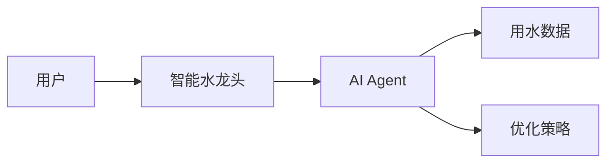
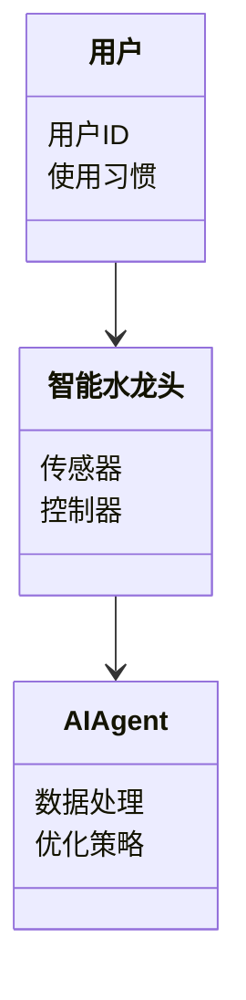
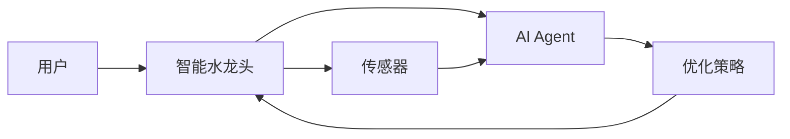
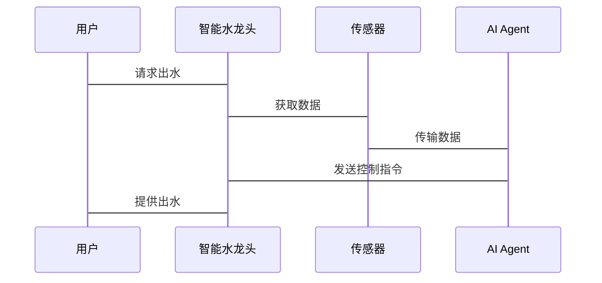

                 


# 智能水龙头：AI Agent的用水效率优化控制

## 关键词：
智能水龙头，AI Agent，用水效率优化，算法原理，系统架构设计，项目实战

## 摘要：
本文探讨了智能水龙头如何通过AI Agent技术优化用水效率。从背景介绍到系统架构设计，再到项目实战，详细分析了AI在水龙头控制中的应用，展示了如何通过技术手段实现节水目标。

---

## 第1章：智能水龙头的背景与问题背景

### 1.1 水资源利用现状与挑战
1.1.1 全球水资源分布与利用现状  
全球水资源分布不均，部分地区面临严重短缺。传统水龙头的使用方式存在水资源浪费的问题，亟需智能化优化。

1.1.2 水资源浪费问题及其影响  
水资源浪费不仅影响环境，还增加了用户的用水成本。优化用水效率对可持续发展至关重要。

1.1.3 智能化节水技术的必要性  
通过智能技术优化用水效率，减少水资源浪费，实现可持续发展目标。

### 1.2 智能水龙头的定义与特点
1.2.1 智能水龙头的基本定义  
智能水龙头通过传感器和AI技术，实现智能控制和节水优化。

1.2.2 智能水龙头的核心特点  
实时感知、智能决策、精准控制、用户友好。

1.2.3 与传统水龙头的主要区别  
传统水龙头无法优化用水，而智能水龙头通过AI技术实现节水。

### 1.3 AI Agent在智能水龙头中的应用前景
1.3.1 AI Agent的基本概念  
AI Agent是一种智能体，能够感知环境、决策并执行任务。

1.3.2 AI Agent在智能水龙头中的作用  
优化用水策略、实时调整出水模式、用户行为分析。

1.3.3 未来发展趋势与应用潜力  
AI技术不断进步，智能水龙头将在更多场景中应用，进一步提升节水效果。

---

## 第2章：智能水龙头的用水效率优化问题描述

### 2.1 用水效率优化的定义与目标
2.1.1 用水效率的定义  
单位水量的使用效益最大化。

2.1.2 优化的目标与意义  
减少水资源浪费，降低用户成本，支持可持续发展。

### 2.2 用水效率优化的核心要素
2.2.1 水龙头使用场景分析  
家庭、公共场所、工业场景的用水特点不同，优化策略也不同。

2.2.2 用户行为对用水效率的影响  
用户习惯、用水频率、用水量波动等因素影响优化效果。

2.2.3 系统设计对用水效率的影响  
传感器精度、算法优化、控制精度等系统设计因素影响用水效率。

### 2.3 问题解决思路与边界条件
2.3.1 问题解决的基本思路  
通过AI技术实时感知和优化，动态调整出水模式。

2.3.2 边界条件与限制因素  
设备成本、用户接受度、技术实现难度。

2.3.3 优化的范围与优先级  
优先优化主要用水场景，逐步扩展应用范围。

---

## 第3章：智能水龙头AI Agent的核心概念与联系

### 3.1 AI Agent的基本原理
3.1.1 感知与数据采集  
通过传感器收集用水数据，包括流量、温度、用户行为等。

3.1.2 决策与控制  
基于数据，AI Agent制定优化策略，动态调整出水模式。

3.1.3 执行与反馈  
执行决策，实时反馈优化效果，持续改进策略。

### 3.2 核心概念之间的关系
3.2.1 智能水龙头与AI Agent的关系  
AI Agent是智能水龙头的核心，负责优化控制。

3.2.2 数据流与信息处理流程  
传感器数据→AI Agent处理→优化策略→执行。

3.2.3 系统各模块的交互关系  
用户需求、传感器数据、AI决策、执行机构。

### 3.3 实体关系与概念结构


---

## 第4章：智能水龙头AI Agent的算法原理

### 4.1 算法原理概述
4.1.1 强化学习的基本概念  
通过奖励机制优化决策策略。

4.1.2 基于数据的优化算法  
利用历史数据，训练模型优化用水策略。

4.1.3 智能控制的数学模型  
建立数学模型，模拟用水过程，优化参数。

### 4.2 算法流程图
```mermaid
graph
start
    --> 输入数据
    --> 处理数据
    --> 训练模型
    --> 优化策略
    --> 输出控制指令
end
```

### 4.3 算法实现细节
4.3.1 强化学习算法代码  
```python
class Agent:
    def __init__(self):
        self.model = DQN()
    
    def act(self, state):
        action = self.model.predict(state)
        return action
```

4.3.2 数学模型与公式  
优化模型：$$\min_{x} \sum_{i=1}^{n} c_i x_i$$  
约束条件：$$\sum_{i=1}^{n} x_i \leq B$$

---

## 第5章：智能水龙头AI Agent的系统架构设计

### 5.1 问题场景介绍
5.1.1 智能水龙头的应用场景  
家庭、公共场所、工业场景。

5.1.2 系统需要解决的问题  
实时感知、智能决策、精准控制。

### 5.2 项目介绍
5.2.1 项目目标  
优化用水效率，减少浪费。

5.2.2 项目范围  
设计智能水龙头系统，实现AI优化控制。

### 5.3 系统功能设计
5.3.1 领域模型  


### 5.4 系统架构设计
5.4.1 系统架构图  


### 5.5 系统接口设计
5.5.1 接口定义  
API接口：获取传感器数据，发送控制指令。

5.5.2 接口交互流程  
传感器数据→AI处理→优化策略→执行。

### 5.6 系统交互设计
5.6.1 交互流程图  


---

## 第6章：智能水龙头AI Agent的项目实战

### 6.1 环境安装
6.1.1 安装Python环境  
安装Python 3.8以上版本，安装必要的库。

6.1.2 安装AI框架  
安装TensorFlow或Keras，用于模型训练。

### 6.2 系统核心实现
6.2.1 传感器数据采集  
使用Raspberry Pi和超声波传感器采集数据。

6.2.2 AI Agent实现  
训练强化学习模型，实现优化策略。

6.2.3 系统控制实现  
编写代码，实现智能控制功能。

### 6.3 代码应用解读
6.3.1 数据采集代码  
```python
import RPi.GPIO as GPIO
def read_sensor():
    # 传感器数据读取代码
    pass
```

6.3.2 AI Agent代码  
```python
class DQN:
    def __init__(self):
        self.model = Sequential()
        # 网络结构定义
        pass
```

### 6.4 实际案例分析
6.4.1 优化效果测试  
测试AI Agent在不同场景下的优化效果。

6.4.2 优化结果对比  
对比优化前后的用水效率，展示节水效果。

### 6.5 项目小结
6.5.1 项目总结  
项目实现了智能水龙头的优化控制，节水效果显著。

6.5.2 经验与教训  
传感器精度影响优化效果，用户接受度需要提升。

---

## 第7章：智能水龙头AI Agent的总结与展望

### 7.1 总结
7.1.1 核心内容回顾  
通过AI技术优化智能水龙头的用水效率，实现节水目标。

7.1.2 经验与教训  
技术实现的挑战，用户需求的理解。

### 7.2 展望
7.2.1 未来发展趋势  
AI技术进步，算法优化，应用场景扩展。

7.2.2 持续改进方向  
提升系统稳定性，优化用户体验，拓展应用场景。

---

## 第8章：最佳实践与注意事项

### 8.1 最佳实践
8.1.1 系统设计建议  
模块化设计，便于维护和扩展。

8.1.2 传感器选型建议  
选择精度高、响应快的传感器。

### 8.2 注意事项
8.2.1 系统安全性  
防止未经授权的访问，确保数据安全。

8.2.2 用户隐私保护  
保护用户数据，遵守隐私保护法规。

### 8.3 拓展阅读
8.3.1 推荐技术资料  
推荐相关书籍和论文。

8.3.2 推荐实践项目  
类似智能设备的优化控制项目。

---

通过以上章节的详细阐述，我们可以看到，智能水龙头结合AI Agent技术，能够有效优化用水效率，减少水资源浪费，为可持续发展做出贡献。

