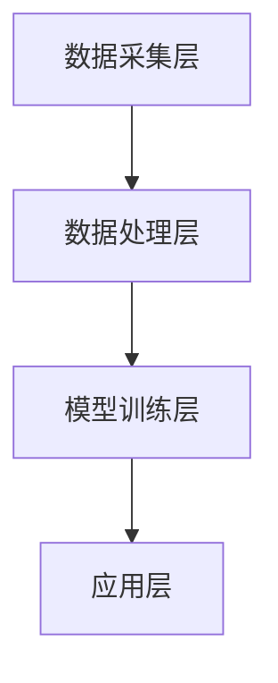
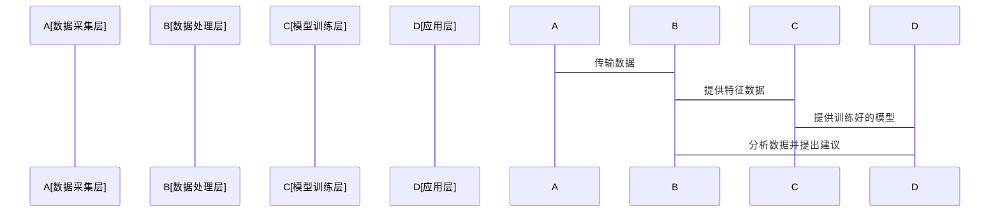

                 

# 智能汽车：AI Agent的预测性维护与故障诊断

> 关键词：智能汽车, AI Agent, 预测性维护, 故障诊断, 机器学习, 时间序列分析, 系统架构

> 摘要：本文探讨了AI Agent在智能汽车中的应用，重点分析了其在预测性维护和故障诊断中的作用。通过机器学习和时间序列分析，AI Agent能够提前预测设备故障并进行诊断，从而提高车辆的可靠性和安全性。本文详细介绍了相关技术原理，并通过实际案例展示了AI Agent在智能汽车中的应用价值。

---

## 第一部分: 引言

### 第1章: 智能汽车与AI Agent概述

#### 1.1 智能汽车的背景与现状

智能汽车是汽车技术与信息技术融合的产物，它通过传感器、通信技术和人工智能算法，实现车辆的智能化控制和决策。随着自动驾驶技术的快速发展，智能汽车已经成为现代交通的重要组成部分。

- **定义与特点**：智能汽车是指能够通过环境感知、决策算法和执行机构实现自主或辅助驾驶的车辆。其核心特点包括高感知能力、强计算能力和智能决策能力。

- **市场现状**：当前，全球主要汽车制造商和科技公司都在积极布局智能汽车市场，例如特斯拉、谷歌的Waymo和中国的百度Apollo等。

- **技术趋势**：智能汽车的发展趋势主要体现在自动驾驶技术的不断升级、车联网（V2X）的普及以及人工智能算法的优化。

#### 1.2 AI Agent的基本概念

AI Agent（智能代理）是一种能够感知环境、自主决策并执行任务的智能实体。在智能汽车中，AI Agent通常负责处理传感器数据、执行驾驶决策、优化能源使用等任务。

- **AI Agent的定义与特点**：AI Agent通过感知环境信息，利用内部模型进行推理和决策，从而实现特定目标。其特点包括自主性、反应性、目标导向和学习能力。

- **AI Agent在智能汽车中的作用**：AI Agent在智能汽车中扮演着“大脑”的角色，负责处理复杂的环境信息，优化驾驶策略，并与周围环境和其他车辆进行通信。

- **AI Agent与传统汽车系统的区别**：传统汽车系统主要依赖人工操作和机械控制，而AI Agent能够通过自主学习和优化，实现更高效、更安全的驾驶体验。

#### 1.3 预测性维护与故障诊断的重要性

预测性维护是指通过分析设备的运行状态，提前预测可能出现的故障，并采取预防性措施。故障诊断则是通过分析设备的异常信号，定位故障原因并提出解决方案。

- **预测性维护的定义与优势**：预测性维护通过实时监测设备状态，利用数据驱动的方法预测设备的健康状况，从而避免突发故障的发生。其优势包括减少停机时间、降低维护成本和提高设备可靠性。

- **故障诊断的基本原理**：故障诊断通过分析设备的运行数据，识别异常信号并定位故障源。常见的故障诊断方法包括基于规则的方法、统计方法和机器学习方法。

- **AI Agent在预测性维护中的应用价值**：AI Agent能够通过实时分析车辆的传感器数据，预测潜在故障并提出维护建议，从而提高车辆的可靠性和安全性。

#### 1.4 本章小结

本章介绍了智能汽车和AI Agent的基本概念，分析了预测性维护与故障诊断的重要性，并探讨了AI Agent在智能汽车中的应用价值。

---

## 第二部分: AI Agent的预测性维护原理

### 第2章: 机器学习与预测性维护

#### 2.1 机器学习在预测性维护中的应用

机器学习是一种通过数据训练模型，实现对未知数据进行预测或分类的技术。在预测性维护中，机器学习主要用于分析设备的运行数据，预测设备的健康状态。

- **机器学习的基本概念**：机器学习是一种人工智能技术，通过训练模型从数据中学习规律，并利用这些规律对新数据进行预测或分类。

- **机器学习在预测性维护中的优势**：机器学习能够处理复杂的非线性关系，具有良好的泛化能力和适应性。

- **常见机器学习算法在预测性维护中的应用**：
  - **监督学习**：如随机森林和XGBoost，用于根据历史数据预测设备的剩余寿命。
  - **无监督学习**：如K-means和聚类分析，用于发现数据中的异常模式。

#### 2.2 时间序列分析在预测性维护中的应用

时间序列分析是一种通过分析数据随时间变化的模式，预测未来趋势的技术。在预测性维护中，时间序列分析常用于分析设备的运行状态，预测可能出现的故障。

- **时间序列分析的基本概念**：时间序列分析是一种研究数据随时间变化的模式和趋势的方法。

- **常见时间序列分析方法**：
  - **ARIMA模型**：通过自回归和滑动平均的方法，预测未来的趋势。
  - **LSTM网络**：一种基于循环神经网络的深度学习模型，能够捕捉时间序列中的长期依赖关系。

- **时间序列分析在预测性维护中的案例**：例如，通过分析发动机的振动数据，预测发动机可能出现的故障。

#### 2.3 基于AI Agent的预测性维护模型

基于AI Agent的预测性维护模型是一种通过AI Agent实时分析设备数据，预测设备健康状态，并提出维护建议的系统。

- **模型的构建过程**：
  1. 数据收集：通过传感器收集设备的运行数据。
  2. 数据预处理：对数据进行清洗、归一化和特征提取。
  3. 模型训练：利用训练数据训练机器学习模型。
  4. 模型部署：将训练好的模型部署到AI Agent中，实时分析设备数据。

- **模型的训练与优化**：通过交叉验证和超参数调优，优化模型的性能。

- **模型的评估与验证**：通过准确率、召回率和F1分数等指标评估模型的性能。

#### 2.4 本章小结

本章介绍了机器学习和时间序列分析在预测性维护中的应用，详细讲解了基于AI Agent的预测性维护模型的构建过程和优化方法。

---

## 第三部分: AI Agent的故障诊断原理

### 第3章: 故障诊断的基本原理

#### 3.1 故障诊断的基本概念

故障诊断是一种通过分析设备的异常信号，定位故障源并提出解决方案的技术。

- **故障诊断的定义与分类**：故障诊断可以分为基于规则的诊断、基于统计的诊断和基于机器学习的诊断。

- **故障诊断的基本流程**：
  1. 数据采集：通过传感器收集设备的运行数据。
  2. 数据分析：通过分析数据识别异常模式。
  3. 故障定位：根据异常模式定位故障源。
  4. 故障修复：提出修复建议并实施修复。

#### 3.2 基于AI Agent的故障诊断方法

基于AI Agent的故障诊断方法是一种通过AI Agent实时分析设备数据，识别异常模式并定位故障源的技术。

- **基于规则的故障诊断**：通过预定义的规则和阈值，识别设备的异常状态。

- **基于统计的故障诊断**：通过统计分析方法，识别数据中的异常模式。

- **基于机器学习的故障诊断**：通过训练机器学习模型，识别设备的异常状态并定位故障源。

#### 3.3 常见故障诊断算法的实现

- **基于规则的故障诊断**：
  - 例如，通过预定义的阈值判断设备的振动数据是否异常。

- **基于统计的故障诊断**：
  - 例如，通过均值和标准差判断设备的运行数据是否异常。

- **基于机器学习的故障诊断**：
  - 例如，通过随机森林或支持向量机（SVM）分类器，识别设备的异常状态。

#### 3.4 本章小结

本章介绍了故障诊断的基本原理，分析了基于AI Agent的故障诊断方法，并详细讲解了常见故障诊断算法的实现。

---

## 第四部分: 系统架构设计

### 第4章: 智能汽车AI Agent的系统架构

#### 4.1 系统架构设计

智能汽车AI Agent的系统架构通常包括数据采集层、数据处理层、模型训练层和应用层。

- **数据采集层**：负责采集车辆的传感器数据。
- **数据处理层**：负责对数据进行预处理和特征提取。
- **模型训练层**：负责训练机器学习模型。
- **应用层**：负责实时分析数据并提出维护建议。

#### 4.2 系统功能设计

- **数据采集功能**：通过CAN总线采集车辆的传感器数据。
- **数据处理功能**：对数据进行清洗、归一化和特征提取。
- **模型训练功能**：训练预测性和诊断模型。
- **应用功能**：实时分析数据并提出维护建议。

#### 4.3 系统架构图

#### 4.4 系统接口设计

- **数据接口**：与传感器和CAN总线通信。
- **模型接口**：与训练好的机器学习模型对接。
- **用户接口**：与驾驶员或维护人员交互。

#### 4.5 系统交互流程图

#### 4.6 本章小结

本章详细介绍了智能汽车AI Agent的系统架构设计，包括各层的功能和接口设计。

---

## 第五部分: 项目实战

### 第5章: 实战项目：智能汽车预测性维护系统

#### 5.1 环境搭建

- **工具安装**：安装Python、TensorFlow、Pandas等工具。
- **数据集获取**：获取车辆传感器数据集。

#### 5.2 数据预处理

- **数据清洗**：处理缺失值和异常值。
- **数据归一化**：将数据标准化。
- **特征提取**：提取有用的特征。

#### 5.3 模型训练

- **选择算法**：选择随机森林或XGBoost模型。
- **训练模型**：利用训练数据训练模型。
- **优化模型**：调整超参数优化模型性能。

#### 5.4 系统实现

- **开发接口**：开发数据接口和模型接口。
- **实现功能**：实现数据采集、处理和分析功能。

#### 5.5 测试与优化

- **功能测试**：测试系统的主要功能。
- **性能优化**：优化系统的运行效率。

#### 5.6 项目总结

- **案例分析**：分析实际案例，验证系统的效果。
- **项目小结**：总结项目的经验和教训。

#### 5.7 本章小结

本章通过一个实战项目，详细讲解了智能汽车预测性维护系统的开发过程。

---

## 第六部分: 最佳实践与未来展望

### 第6章: 最佳实践与未来展望

#### 6.1 最佳实践

- **数据质量**：确保数据的准确性和完整性。
- **模型选择**：根据实际需求选择合适的算法。
- **系统架构**：设计合理的系统架构，确保系统的可扩展性和可维护性。

#### 6.2 未来展望

- **算法优化**：优化机器学习算法，提高预测准确率。
- **数据融合**：结合多源数据，提高系统的智能化水平。
- **边缘计算**：通过边缘计算技术，提高系统的实时性和响应速度。

#### 6.3 本章小结

本章总结了智能汽车AI Agent开发中的最佳实践，并展望了未来的发展方向。

---

## 附录

### 附录A: 数据集

- 数据集描述：车辆传感器数据集。

### 附录B: 工具与库

- 工具与库列表：Python、TensorFlow、Pandas等。

### 附录C: 参考文献

- 参考文献列表：相关技术文献和书籍。

---

## 作者简介

简要介绍作者的背景和专长，例如：作为人工智能专家和软件架构师，长期从事智能系统和预测性维护技术的研究与开发。

---

## 结语

智能汽车AI Agent的预测性维护与故障诊断是一项具有挑战性的技术，但通过机器学习和时间序列分析，我们可以实现更高效、更安全的车辆维护。未来，随着人工智能技术的不断发展，智能汽车AI Agent将在预测性维护和故障诊断中发挥更大的作用。

