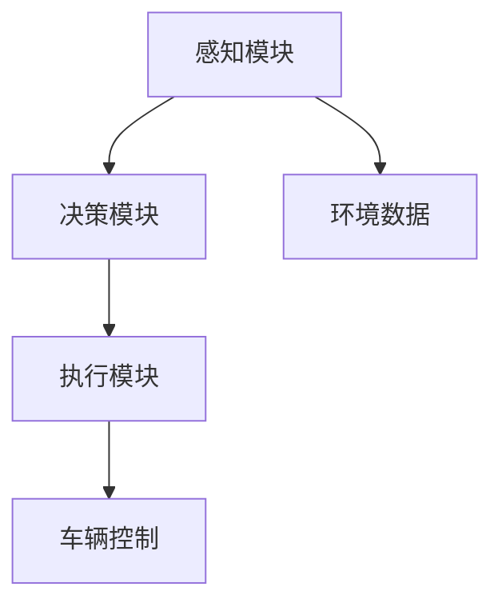
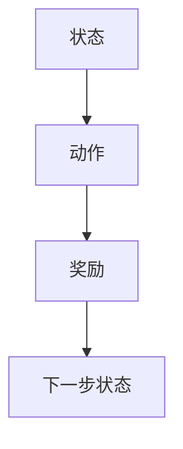
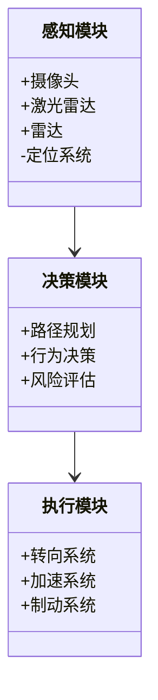
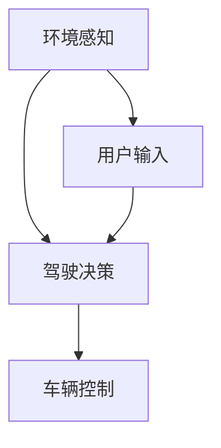

                 


# 智能汽车：AI Agent的驾驶行为分析

> 关键词：智能汽车，AI Agent，驾驶行为分析，强化学习，DQN算法，系统架构，安全驾驶

> 摘要：本文深入分析了智能汽车中AI Agent的驾驶行为，从概念、算法、系统架构到实际应用，全面探讨了AI Agent在智能汽车中的核心作用。文章首先介绍了智能汽车与AI Agent的基本概念和应用场景，然后从算法原理、数学模型、系统架构等多个维度详细解析了AI Agent的实现机制。最后，通过项目实战和案例分析，展示了AI Agent在智能汽车中的实际应用价值和未来发展方向。

---

## 第一部分: 智能汽车与AI Agent的背景介绍

### 第1章: 智能汽车与AI Agent概述

#### 1.1 智能汽车的定义与特点
- **1.1.1 智能汽车的定义**  
智能汽车是指通过先进的传感器、计算平台、执行机构和软件的集成，实现车辆的智能化控制，能够部分或完全替代人类驾驶员的汽车。  
- **1.1.2 智能汽车的核心特点**  
智能汽车具有以下特点：  
  - **环境感知能力**：通过摄像头、激光雷达、雷达等传感器感知周围环境。  
  - **自主决策能力**：通过AI算法做出驾驶决策。  
  - **人机交互能力**：与用户进行自然交互。  
  - **持续优化能力**：通过数据反馈不断优化驾驶行为。  
- **1.1.3 智能汽车与传统汽车的区别**  
智能汽车的核心区别在于其智能化和网联化能力，能够实现自动驾驶、智能导航、主动安全等功能。

#### 1.2 AI Agent的基本概念
- **1.2.1 AI Agent的定义**  
AI Agent（人工智能代理）是指在计算机系统中，能够感知环境并采取行动以实现目标的智能实体。  
- **1.2.2 AI Agent的核心属性**  
AI Agent具有以下核心属性：  
  - **自主性**：能够在没有外部干预的情况下独立运行。  
  - **反应性**：能够实时感知环境并做出反应。  
  - **目标导向性**：通过实现目标来驱动行为。  
  - **学习能力**：能够通过经验或数据优化自身行为。  
- **1.2.3 AI Agent与传统算法的区别**  
AI Agent与传统算法的区别在于其具有自主性和目标导向性，能够根据环境动态调整行为。

#### 1.3 智能汽车中AI Agent的应用场景
- **1.3.1 自动驾驶**  
AI Agent在自动驾驶中负责感知、决策和执行，实现车辆的完全自主驾驶。  
- **1.3.2 智能交通管理**  
AI Agent可以通过车联网技术优化交通流量，减少拥堵和事故。  
- **1.3.3 用户行为预测**  
AI Agent可以根据用户的驾驶行为和偏好，提供个性化的驾驶建议。

### 第2章: 智能汽车AI Agent的背景与问题描述

#### 2.1 智能汽车发展的背景
- **2.1.1 交通拥堵与能源危机**  
随着城市化进程的加快，交通拥堵和能源消耗问题日益严重。  
- **2.1.2 智能化与网联化趋势**  
人工智能和5G技术的发展推动了智能汽车的普及。  
- **2.1.3 AI技术的快速发展**  
AI技术的突破为智能汽车的实现提供了技术保障。

#### 2.2 AI Agent在驾驶行为中的问题背景
- **2.2.1 驾驶安全问题**  
传统驾驶模式下，人为错误是交通事故的主要原因。  
- **2.2.2 驾驶效率问题**  
交通拥堵和不合理的驾驶行为会导致能源浪费和时间浪费。  
- **2.2.3 用户体验问题**  
驾驶过程中的疲劳和压力影响用户体验。

#### 2.3 问题解决的思路
- **2.3.1 AI Agent的核心作用**  
AI Agent通过智能化决策和自主执行，提高驾驶安全和效率。  
- **2.3.2 多目标优化策略**  
AI Agent需要在安全、效率和用户体验之间进行多目标优化。  
- **2.3.3 系统集成与协同**  
AI Agent需要与车辆系统、交通系统和其他智能设备进行协同工作。

### 第3章: AI Agent的边界与外延

#### 3.1 AI Agent的功能边界
- **3.1.1 独立决策边界**  
AI Agent在特定场景下能够独立完成决策和执行。  
- **3.1.2 依赖外部系统边界**  
AI Agent需要依赖高精度地图、车联网等外部系统完成任务。  
- **3.1.3 用户干预边界**  
在特定情况下，用户可以干预AI Agent的行为，例如在紧急情况下切换到人工驾驶模式。

#### 3.2 AI Agent的外延
- **3.2.1 多模态感知**  
AI Agent可以通过多种传感器（如视觉、听觉、触觉）感知环境。  
- **3.2.2 跨场景适应**  
AI Agent需要能够适应不同场景（如城市道路、高速公路、乡村道路）的驾驶需求。  
- **3.2.3 个性化行为定制**  
AI Agent可以根据不同用户的驾驶习惯和偏好，提供个性化的驾驶服务。

#### 3.3 AI Agent的概念结构图


---

## 第二部分: AI Agent的算法原理与数学模型

### 第4章: AI Agent的核心算法原理

#### 4.1 强化学习算法
- **4.1.1 Q-learning算法**  
Q-learning是一种经典的强化学习算法，通过更新Q值表来学习最优策略。  
- **4.1.2 DQN算法**  
DQN（Deep Q-Network）算法通过深度神经网络近似Q值函数，解决了Q-learning的离散动作空间问题。  
- **4.1.3 算法流程图**  


#### 4.2 监督学习算法
- **4.2.1 回归算法**  
回归算法用于预测连续型目标变量，例如预测刹车距离。  
- **4.2.2 分类算法**  
分类算法用于分类任务，例如识别交通信号灯颜色。  
- **4.2.3 算法对比表**  
| 算法类型 | 输入 | 输出 |
|----------|------|------|
| Q-learning | 状态、动作、奖励 | 最优策略 |
| DQN       | 状态、动作、奖励 | 最优策略 |
| 回归      | 特征向量 | 预测值 |
| 分类      | 特征向量 | 类别标签 |

#### 4.3 数学模型与公式
- **Q-learning更新公式**  
$$ Q(s, a) = Q(s, a) + \alpha (r + \max Q(s', a') - Q(s, a)) $$  
其中，$\alpha$是学习率，$r$是奖励，$s'$是下一步状态。  
- **DQN算法的核心公式**  
$$ Q(s, a) = \arg \max_{a'} Q(s', a') $$  

---

## 第三部分: 系统架构与项目实战

### 第5章: 系统架构设计

#### 5.1 问题场景介绍
智能汽车AI Agent需要在复杂的交通环境中实现自主驾驶，涉及感知、决策和执行三大模块的协同工作。

#### 5.2 系统功能设计
- **5.2.1 领域模型**  


#### 5.3 系统架构设计


#### 5.4 系统接口设计
- **感知模块接口**  
输入：环境数据（如图像、点云、雷达数据）  
输出：目标检测、语义分割结果  
- **决策模块接口**  
输入：环境感知结果  
输出：驾驶决策（如转向、加速、制动）  
- **执行模块接口**  
输入：驾驶决策  
输出：车辆控制信号

#### 5.5 系统交互流程图


### 第6章: 项目实战

#### 6.1 环境搭建
- **开发环境**  
Python 3.8及以上版本，安装TensorFlow、Keras、OpenCV、NumPy等库。  
- **代码实现**  
```python
import tensorflow as tf
from tensorflow.keras import layers

# 定义DQN网络
class DQNetwork:
    def __init__(self, state_size, action_size):
        self.model = self.build_model(state_size, action_size)
        
    def build_model(self, state_size, action_size):
        model = tf.keras.Sequential([
            layers.Dense(64, activation='relu', input_shape=(state_size,)),
            layers.Dense(64, activation='relu'),
            layers.Dense(action_size, activation='linear')
        ])
        return model
```

#### 6.2 核心代码实现
- **Q-learning实现**  
```python
class QLearning:
    def __init__(self, state_size, action_size, alpha=0.1, gamma=0.99):
        self.q_table = np.zeros((state_size, action_size))
        self.alpha = alpha
        self.gamma = gamma
        
    def update(self, state, action, reward, next_state):
        self.q_table[state, action] += self.alpha * (reward + self.gamma * np.max(self.q_table[next_state]) - self.q_table[state, action])
```

#### 6.3 实际案例分析
- **紧急刹车场景**  
当检测到前方有障碍物时，AI Agent会触发紧急刹车机制，优先保证安全。  
- **变道超车场景**  
AI Agent会根据交通规则和环境信息，自主完成变道超车操作。

#### 6.4 项目小结
通过实际案例分析，我们可以看到AI Agent在智能汽车中的应用价值。然而，仍需进一步优化算法和系统架构，以应对更复杂的驾驶场景。

---

## 第四部分: 总结与展望

### 第7章: 总结与展望

#### 7.1 核心观点总结
- AI Agent在智能汽车中的核心作用体现在环境感知、决策优化和行为执行三大方面。  
- 强化学习算法（如Q-learning和DQN）是实现AI Agent的关键技术。  
- 系统架构设计需要考虑感知、决策和执行模块的协同工作。

#### 7.2 未来展望
- **算法优化**：探索更高效的强化学习算法，如PPO、TD3等。  
- **系统集成**：进一步优化系统架构，实现更高效的多模态感知和决策。  
- **应用场景扩展**：探索AI Agent在智能交通管理、共享出行等领域的应用。  

---

## 第五部分: 最佳实践与注意事项

### 第8章: 最佳实践 tips

#### 8.1 开发建议
- **数据质量**：确保训练数据的多样性和代表性。  
- **算法选择**：根据具体场景选择合适的算法。  
- **系统测试**：进行全面的系统测试，确保安全性。  

#### 8.2 注意事项
- **安全第一**：AI Agent的决策必须以安全为前提。  
- **用户体验**：设计友好的人机交互界面。  
- **法律合规**：遵守相关法律法规，确保合法合规。  

---

## 第六部分: 拓展阅读

### 第9章: 拓展阅读

#### 9.1 相关书籍推荐
- 《自动驾驶：模型与算法》  
- 《强化学习：理论与实践》  
- 《智能交通系统》  

#### 9.2 技术博客与开源项目
- 推荐阅读自动驾驶领域的技术博客和开源项目，如Waymo Open Dataset、Carla Simulator等。

---

通过以上目录和内容设计，我们可以看到，智能汽车中的AI Agent是一个复杂而有趣的技术领域，涉及多学科的交叉融合。希望本文能够为读者提供清晰的思路和有价值的见解。

