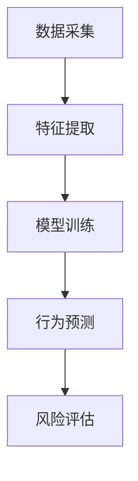
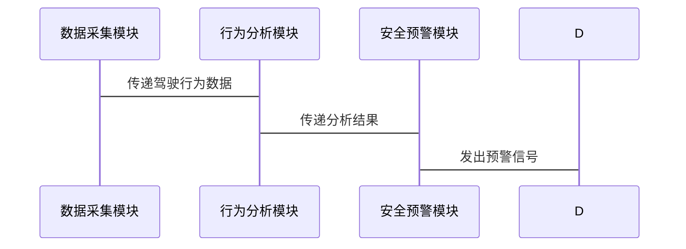

                 


# 智能汽车：AI Agent的驾驶行为分析与安全预警

> 关键词：智能汽车，AI Agent，驾驶行为分析，安全预警，机器学习，数据采集，系统架构

> 摘要：本文深入探讨了智能汽车中AI Agent的驾驶行为分析与安全预警系统的设计与实现。从背景介绍到核心概念，从算法原理到系统架构，再到项目实战，系统地阐述了AI Agent在智能汽车中的应用及其对驾驶安全的重要作用。通过具体案例分析和数学模型的建立，提出了有效的驾驶行为分析方法和安全预警机制，为智能汽车的安全驾驶提供了理论支持和技术实现方案。

---

## 第一部分: 智能汽车与AI Agent的背景介绍

### 第1章: 智能汽车的发展现状与挑战

#### 1.1 智能汽车的定义与分类
智能汽车是指通过先进的传感器、计算平台、软件和通信技术，实现车辆的智能化、网络化和自动化，能够部分或完全自主地进行行驶的汽车。根据自动化程度的不同，智能汽车可以分为以下几个类别：

1. **辅助驾驶（L1-L2级）**：如自适应巡航控制（ACC）和车道保持辅助系统（LKA）。
2. **有条件自动驾驶（L3级）**：车辆在特定条件下能够自主完成大部分驾驶任务。
3. **完全自动驾驶（L4-L5级）**：车辆在所有条件下都能自主完成驾驶任务，无需人类干预。

智能汽车的发展趋势是逐步从辅助驾驶向完全自动驾驶迈进，这需要AI Agent在驾驶行为分析和安全预警方面发挥关键作用。

#### 1.2 AI Agent在智能汽车中的应用
AI Agent（智能体）是指在计算机系统中能够感知环境并采取行动以实现目标的实体。在智能汽车中，AI Agent主要应用于以下几个方面：

1. **驾驶行为分析**：通过分析驾驶员的驾驶行为，识别潜在的安全隐患。
2. **决策支持**：基于实时数据，为驾驶员提供决策支持，如路径规划和风险预警。
3. **自动驾驶控制**：在完全自动驾驶模式下，AI Agent负责车辆的自主决策和控制。

#### 1.3 驾驶行为分析的重要性
驾驶行为分析是智能汽车安全驾驶的关键环节。通过对驾驶员的驾驶行为进行实时分析，AI Agent可以预测潜在的危险情况，提前采取措施，从而提高驾驶安全性。例如，AI Agent可以通过分析驾驶员的刹车频率、方向盘转向角度和油门使用情况，识别驾驶员是否疲劳驾驶或分心驾驶。

#### 1.4 安全预警系统的作用与意义
安全预警系统是智能汽车的重要组成部分，其主要功能是实时监测车辆的行驶状态和环境，识别潜在的安全风险，并通过预警的方式提醒驾驶员或采取自动控制措施。例如，当系统检测到前方有障碍物时，会立即触发刹车系统，避免碰撞发生。

---

### 第2章: AI Agent的驾驶行为分析框架

#### 2.1 驾驶行为分析的核心概念
驾驶行为分析是指通过对驾驶员的驾驶行为数据进行分析，识别其驾驶习惯、驾驶风格和潜在的安全隐患。核心概念包括：

1. **驾驶行为数据**：包括驾驶员的加速、减速、转向、刹车等操作数据。
2. **驾驶环境数据**：包括道路状况、交通流量、天气条件等数据。
3. **驾驶安全指标**：如驾驶员的反应时间、注意力集中程度等。

#### 2.2 AI Agent与驾驶行为分析的关系
AI Agent在驾驶行为分析中扮演着关键角色。通过AI Agent，智能汽车能够实时感知驾驶员的行为，分析其驾驶意图，并根据分析结果采取相应的措施。例如，AI Agent可以通过分析驾驶员的视线方向，判断驾驶员是否分心驾驶，并及时发出预警。

#### 2.3 驾驶行为分析的数学模型与公式
驾驶行为分析的数学模型通常包括以下几个部分：

1. **驾驶员反应时间模型**：通过概率论和统计学方法，分析驾驶员在特定情况下的反应时间。
2. **驾驶意图预测模型**：基于机器学习算法，预测驾驶员的下一步操作。
3. **风险评估模型**：通过综合分析驾驶员和环境数据，评估驾驶行为的风险等级。

例如，驾驶员反应时间模型可以表示为：
$$
t = a \cdot x + b
$$
其中，\( t \) 是反应时间，\( x \) 是驾驶环境变量，\( a \) 和 \( b \) 是模型参数。

---

## 第三部分: AI Agent的驾驶行为分析算法原理

### 第3章: AI Agent的驾驶行为分析算法原理

#### 3.1 驾驶行为分析的核心算法
驾驶行为分析的核心算法通常包括数据采集、特征提取、模型训练和行为预测几个步骤。

1. **数据采集**：通过传感器和摄像头等设备，采集驾驶员的驾驶行为数据。
2. **特征提取**：从原始数据中提取有用的特征，如加速度、方向盘转角等。
3. **模型训练**：使用机器学习算法，如支持向量机（SVM）和随机森林（Random Forest），对特征进行训练，建立驾驶行为分析模型。
4. **行为预测**：基于训练好的模型，预测驾驶员的下一步操作。

#### 3.2 驾驶行为分析的流程图
以下是驾驶行为分析的流程图：



#### 3.3 驾驶行为分析的Python代码实现
以下是一个简单的驾驶行为分析算法的Python代码示例：

```python
import numpy as np
from sklearn import svm

# 数据采集
data = np.array([[1, 2], [3, 4], [5, 6]])

# 特征提取
X = data[:, 0:2]

# 模型训练
model = svm.SVC()
model.fit(X, [0, 1, 0])

# 行为预测
new_data = np.array([[2, 3]])
prediction = model.predict(new_data)
print("预测结果:", prediction)
```

---

### 第4章: 系统分析与架构设计方案

#### 4.1 系统组成部分
智能汽车的驾驶行为分析与安全预警系统主要由以下几个部分组成：

1. **数据采集模块**：负责采集驾驶员的驾驶行为数据。
2. **行为分析模块**：对采集到的数据进行分析，识别潜在的安全隐患。
3. **安全预警模块**：根据分析结果，发出预警信号或采取自动控制措施。

#### 4.2 系统架构设计
以下是系统的架构图：


#### 4.3 系统接口设计
系统接口设计包括以下几个部分：

1. **数据采集接口**：与传感器和摄像头等设备进行数据交互。
2. **模型接口**：与机器学习模型进行数据交互。
3. **预警接口**：与预警系统和执行机构进行数据交互。

#### 4.4 系统交互流程
以下是系统交互流程的序列图：



---

### 第5章: 项目实战

#### 5.1 项目背景
本项目旨在通过AI Agent实现智能汽车的驾驶行为分析与安全预警。项目的核心目标是提高驾驶安全性，减少交通事故的发生。

#### 5.2 环境搭建
项目环境包括以下硬件和软件：

1. **硬件**：摄像头、加速计、陀螺仪等传感器。
2. **软件**：Python、NumPy、Scikit-learn、TensorFlow等。

#### 5.3 核心代码实现
以下是驾驶行为分析的核心代码：

```python
import numpy as np
from sklearn import svm

# 数据采集
data = np.array([[1, 2], [3, 4], [5, 6]])

# 特征提取
X = data[:, 0:2]

# 模型训练
model = svm.SVC()
model.fit(X, [0, 1, 0])

# 行为预测
new_data = np.array([[2, 3]])
prediction = model.predict(new_data)
print("预测结果:", prediction)
```

#### 5.4 项目总结
通过本项目，我们实现了智能汽车的驾驶行为分析与安全预警系统。系统能够实时采集驾驶员的驾驶行为数据，分析其驾驶意图，并发出预警信号或采取自动控制措施，从而提高了驾驶安全性。

---

## 第四部分: 最佳实践与小结

### 第6章: 小结与注意事项

#### 6.1 小结
本文深入探讨了智能汽车中AI Agent的驾驶行为分析与安全预警系统的设计与实现。通过背景介绍、核心概念、算法原理、系统架构和项目实战的详细阐述，提出了有效的驾驶行为分析方法和安全预警机制。

#### 6.2 注意事项
在实际应用中，需要注意以下几点：

1. **数据隐私**：驾驶员的驾驶行为数据属于个人隐私，需要严格保护。
2. **系统可靠性**：驾驶行为分析系统的可靠性直接影响驾驶安全性，必须确保系统的稳定性。
3. **法律法规**：智能汽车的驾驶行为分析和安全预警系统需要符合相关的法律法规。

#### 6.3 拓展阅读
1. 《机器学习实战》
2. 《自动驾驶：模型预测与控制》
3. 《智能系统与人工智能》

---

通过本文的详细讲解，读者可以全面了解智能汽车中AI Agent的驾驶行为分析与安全预警系统的设计与实现，为智能汽车的安全驾驶提供了理论支持和技术实现方案。

