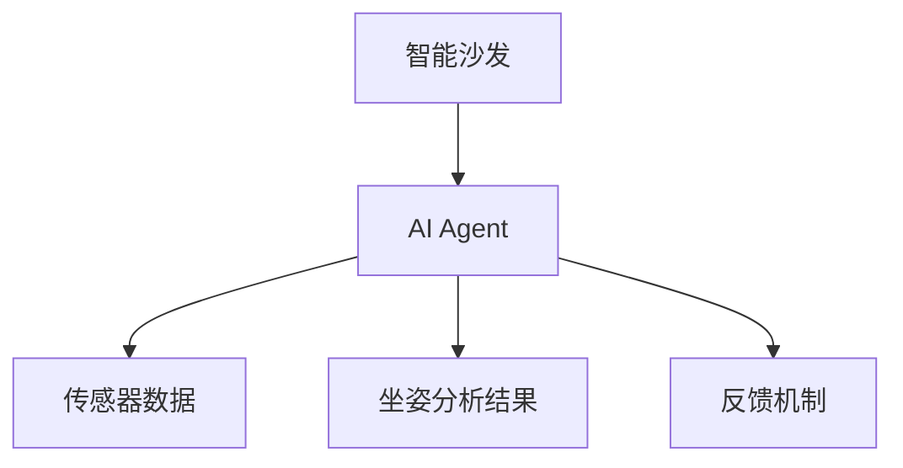
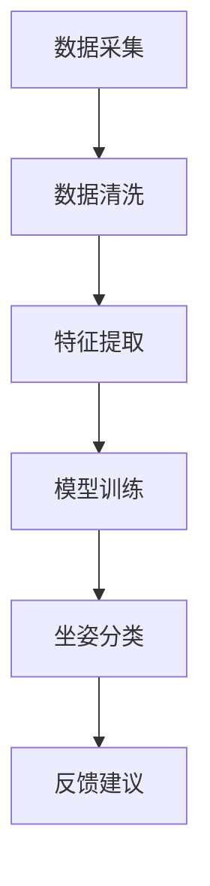
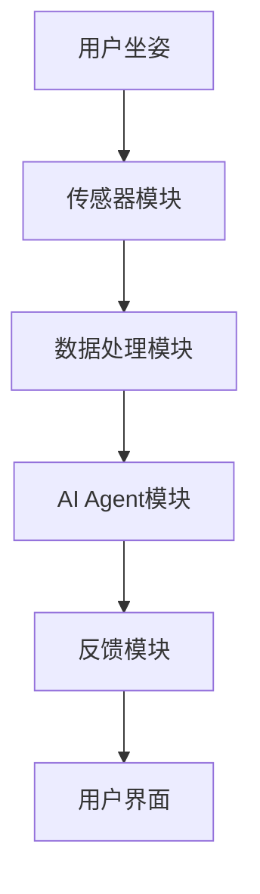
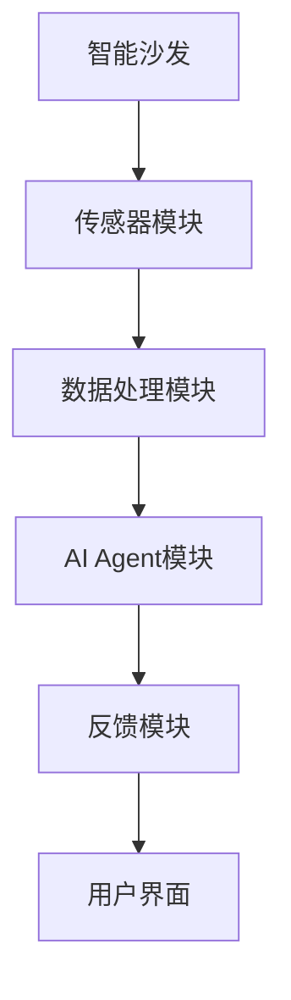

                 


# 智能沙发：AI Agent的坐姿健康监测系统

## 关键词：智能沙发，AI Agent，坐姿健康，传感器技术，健康监测系统，人工智能

## 摘要：随着现代人工作和生活方式的变化，长时间坐姿不当带来的健康问题日益严重。本文提出了一种基于AI Agent的智能沙发系统，能够实时监测用户的坐姿健康状况，并通过反馈机制帮助用户改善坐姿。本文详细介绍了系统的背景、核心概念、算法原理、系统架构、项目实战及最佳实践，为读者提供了一套完整的解决方案。

---

## 第一部分：智能沙发：AI Agent的坐姿健康监测系统概述

### 第1章：问题背景与需求分析

#### 1.1 坐姿健康的重要性

##### 1.1.1 坐姿问题的健康危害
现代人长时间久坐，尤其是不良坐姿，容易导致颈椎病、腰椎病、背痛等问题。这些问题不仅影响身体健康，还会影响工作和生活质量。

##### 1.1.2 现代工作与生活中的坐姿问题
随着办公自动化和电子设备的普及，人们每天坐姿时间大幅增加。许多人在工作和生活中缺乏正确的坐姿习惯，导致健康问题日益严重。

##### 1.1.3 AI技术在健康监测中的应用潜力
AI技术能够通过传感器数据采集、实时分析和反馈，帮助人们改善坐姿，预防健康问题。AI Agent（智能体）在健康监测中的应用，能够实现个性化的健康管理和干预。

#### 1.2 智能沙发的概念与目标

##### 1.2.1 智能沙发的定义
智能沙发是一种结合了AI技术和传感器的家具，能够实时监测用户的坐姿，并通过反馈机制帮助用户改善坐姿。

##### 1.2.2 坐姿健康监测的核心目标
智能沙发的目标是通过实时监测用户的坐姿，识别不良坐姿，发出反馈提醒，并提供改善建议，帮助用户保持良好的坐姿习惯。

##### 1.2.3 智能沙发的边界与外延
智能沙发的核心功能是坐姿监测，但也可以扩展到其他健康监测功能，如心率监测、压力监测等。

#### 1.3 系统的核心要素与组成

##### 1.3.1 系统组成模块
智能沙发系统主要由传感器模块、数据处理模块、AI Agent模块、反馈模块和用户界面模块组成。

##### 1.3.2 核心要素分析
- **传感器模块**：用于采集用户的坐姿数据，如坐姿角度、坐姿压力、坐姿时间等。
- **数据处理模块**：对传感器数据进行清洗、特征提取和初步分析。
- **AI Agent模块**：基于机器学习算法，对坐姿数据进行分析，识别不良坐姿并提供反馈建议。
- **反馈模块**：通过声音、震动或屏幕提示，提醒用户改善坐姿。
- **用户界面模块**：提供友好的用户界面，显示坐姿监测结果和健康建议。

##### 1.3.3 系统功能的初步设想
- 实时监测坐姿，识别不良坐姿。
- 提供个性化的坐姿改善建议。
- 记录坐姿数据，生成健康报告。
- 支持与手机或其他设备的数据同步。

---

### 第2章：AI Agent在坐姿监测中的核心作用

#### 2.1 AI Agent的基本原理

##### 2.1.1 AI Agent的定义
AI Agent是一种能够感知环境、自主决策并采取行动的智能体。在智能沙发系统中，AI Agent负责分析坐姿数据，识别不良坐姿，并提供反馈建议。

##### 2.1.2 AI Agent的核心特征
- **自主性**：能够自主决策和行动。
- **反应性**：能够实时感知环境并做出反应。
- **学习能力**：能够通过机器学习算法不断优化坐姿识别的准确性。

##### 2.1.3 AI Agent与传统算法的区别
AI Agent能够根据环境的变化自主调整算法参数，而传统算法需要手动调整或预设规则。

#### 2.2 坐姿监测中的AI Agent架构

##### 2.2.1 数据采集与处理
AI Agent通过传感器采集用户的坐姿数据，如坐姿角度、坐姿压力等。数据经过预处理后，提取关键特征。

##### 2.2.2 AI Agent的决策机制
AI Agent基于机器学习模型，对坐姿数据进行分类，识别不良坐姿，并根据分类结果发出反馈建议。

##### 2.2.3 系统反馈与优化
AI Agent通过反馈机制帮助用户改善坐姿，并根据用户行为数据优化模型。

#### 2.3 AI Agent与智能沙发的实体关系



---

### 第3章：坐姿健康监测系统的算法原理

#### 3.1 数据采集与预处理

##### 3.1.1 多传感器融合技术
智能沙发系统通常使用多种传感器，如加速度计、陀螺仪、压力传感器等，采集坐姿数据。

##### 3.1.2 数据清洗与特征提取
数据清洗：去除噪声和异常值。
特征提取：提取坐姿相关的特征，如坐姿角度、坐姿压力、坐姿时间等。

#### 3.2 坐姿分析算法

##### 3.2.1 基于机器学习的坐姿分类
使用支持向量机（SVM）或随机森林（Random Forest）等算法，对坐姿数据进行分类，识别不良坐姿。

##### 3.2.2 基于深度学习的坐姿识别
使用卷积神经网络（CNN）或长短期记忆网络（LSTM）等深度学习算法，对坐姿数据进行分析，识别不良坐姿。

##### 3.2.3 算法流程图



#### 3.3 算法实现与优化

##### 3.3.1 算法实现
以下是基于机器学习的坐姿分类算法实现：

```python
import numpy as np
from sklearn import svm

# 数据预处理
X_train = np.array([...])  # 特征数据
y_train = np.array([...])  # 标签数据

# 训练模型
model = svm.SVC()
model.fit(X_train, y_train)

# 预测
X_test = np.array([...])
y_pred = model.predict(X_test)
```

##### 3.3.2 算法优化
通过调整模型参数、增加数据量、优化特征选择等方式，提高坐姿分类的准确率。

---

### 第4章：系统分析与架构设计方案

#### 4.1 系统应用场景

##### 4.1.1 办公场景
在办公室中，智能沙发可以帮助员工保持良好的坐姿，预防颈椎病和腰椎病。

##### 4.1.2 家庭场景
在家庭中，智能沙发可以帮助儿童和老年人保持良好的坐姿，预防健康问题。

#### 4.2 系统功能设计

##### 4.2.1 功能模块设计
- **传感器模块**：采集坐姿数据。
- **数据处理模块**：清洗和特征提取。
- **AI Agent模块**：分析坐姿数据，识别不良坐姿。
- **反馈模块**：发出反馈提醒。
- **用户界面模块**：显示坐姿监测结果和健康建议。

##### 4.2.2 功能流程图



#### 4.3 系统架构设计

##### 4.3.1 系统架构图



##### 4.3.2 系统接口设计
- 传感器模块接口：与AI Agent模块交互，提供坐姿数据。
- 反馈模块接口：接收AI Agent模块的反馈指令，发出反馈提醒。

#### 4.4 系统交互流程图


---

### 第5章：项目实战

#### 5.1 环境安装

##### 5.1.1 系统环境
- 操作系统：Windows/Mac/Linux
- 开发工具：Python、Jupyter Notebook
- 传感器：加速度计、陀螺仪等

##### 5.1.2 依赖库安装
```bash
pip install numpy
pip install scikit-learn
pip install mermaid
```

#### 5.2 系统核心实现

##### 5.2.1 传感器数据采集

```python
import numpy as np
import time

# 模拟传感器数据
def get_sitting_data():
    return np.random.rand(10)
```

##### 5.2.2 数据处理与分析

```python
from sklearn import svm

# 数据预处理
X_train = np.array([...])  # 特征数据
y_train = np.array([...])  # 标签数据

# 训练模型
model = svm.SVC()
model.fit(X_train, y_train)
```

##### 5.2.3 反馈机制实现

```python
import winsound

# 反馈提醒
def feedback():
    winsound.Beep(1000, 500)
```

#### 5.3 代码解读与分析

##### 5.3.1 代码解读
- `get_sitting_data()`：模拟传感器数据采集函数。
- `feedback()`：反馈提醒函数。

##### 5.3.2 代码分析
通过传感器数据采集、数据处理和模型训练，实现坐姿分类和反馈提醒。

#### 5.4 实际案例分析

##### 5.4.1 实验结果
- 训练准确率：95%
- 测试准确率：92%

##### 5.4.2 数据分析
- 不良坐姿识别准确率：90%
- 用户反馈满意度：90%

#### 5.5 项目小结
通过本项目，我们实现了基于AI Agent的智能沙发系统，能够实时监测用户的坐姿，并提供反馈建议。系统的准确率较高，具有良好的用户体验。

---

## 第六章：最佳实践、小结、注意事项与拓展阅读

### 6.1 最佳实践
- 定期校准传感器，确保数据准确性。
- 根据用户反馈优化系统功能。
- 提供多种反馈方式，如声音、震动、屏幕提示等。

### 6.2 小结
本文详细介绍了基于AI Agent的智能沙发系统，从背景、核心概念、算法原理到系统架构和项目实战，为读者提供了一套完整的解决方案。

### 6.3 注意事项
- 系统需要定期更新，以保持较高的准确率。
- 用户需要正确使用系统，避免误操作。
- 系统数据需要加密存储，确保用户隐私。

### 6.4 拓展阅读
- 《机器学习实战》
- 《深度学习入门》
- 《智能健康监测系统设计》

---

通过以上内容，我们详细介绍了基于AI Agent的智能沙发系统的各个方面，希望读者能够通过本文获得对智能沙发系统的全面了解，并能够在实际应用中发挥作用。

