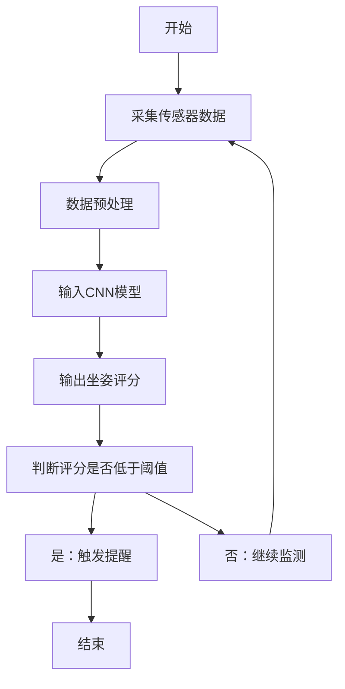
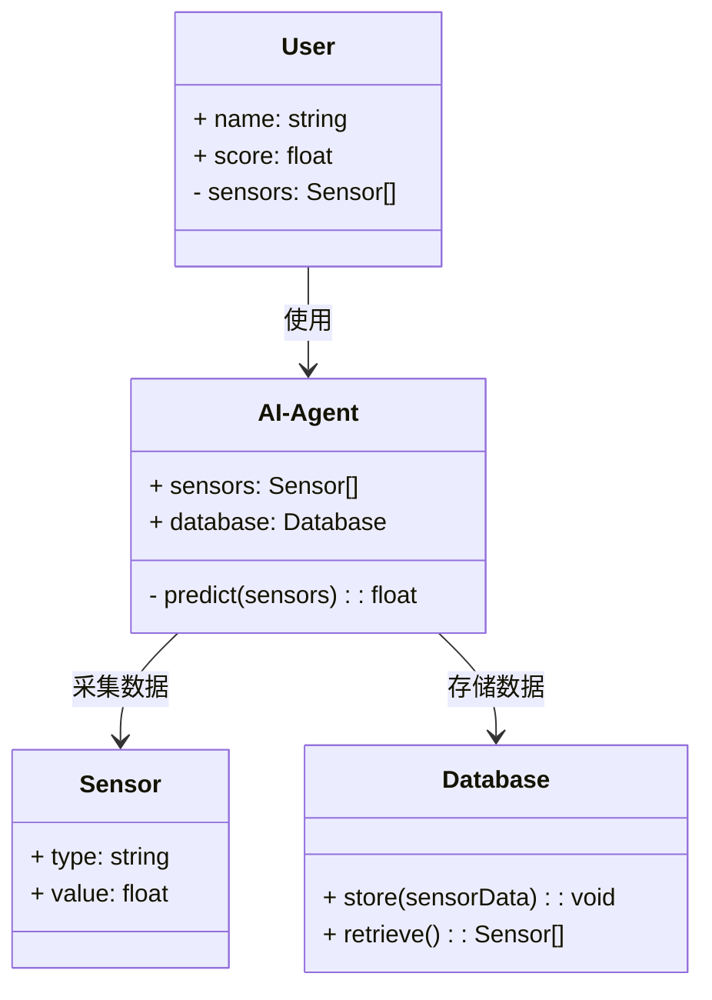

                 


# 智能沙发：AI Agent的坐姿矫正提醒

## 关键词：智能沙发、AI Agent、坐姿矫正、物联网、人体工程学

## 摘要：  
随着现代人长时间久坐的工作和生活方式，不良坐姿导致的健康问题日益严重。本文介绍了一种创新的智能沙发设计，结合AI Agent技术，能够实时监测用户的坐姿，并通过语音或震动提醒用户调整坐姿，有效预防和改善因不良坐姿引发的健康问题。本文详细探讨了AI Agent在智能沙发中的应用，从算法原理到系统架构，再到实际项目实现，全面解析了这一智能解决方案的技术细节和实现过程。

---

## 第一部分：背景介绍

### 第1章：问题背景与描述

#### 1.1 问题背景  
现代生活中，人们长时间坐在办公室、家中或交通工具中，导致坐姿问题日益普遍。不良坐姿会引起腰椎病、颈椎病等健康问题，严重时甚至会影响内脏功能。据统计，超过80%的上班族存在坐姿不正确的问题，其中大部分人每天久坐时间超过8小时。  

#### 1.2 问题描述  
不良坐姿的具体表现包括：  
- 身体前倾，肩部紧绷  
- 背部弯曲，无法保持自然的脊柱曲线  
- 双腿交叉或跷二郎腿，导致骨盆倾斜  

这些问题不仅影响身体健康，还可能导致疲劳、注意力下降，影响工作效率和生活质量。  

#### 1.3 问题解决  
AI Agent（人工智能代理）作为一种能够感知环境、自主决策的技术，可以实时监测用户的坐姿，并通过语音或震动提醒用户调整。结合智能沙发的设计，AI Agent能够提供个性化的矫正建议，帮助用户养成良好的坐姿习惯。  

#### 1.4 边界与外延  
智能沙发的功能边界包括：  
- 坐姿监测与矫正提醒  
- 通过传感器和AI算法实现实时反馈  
- 支持多种交互方式（如语音、震动）  

相关技术的外延包括：  
- 身体健康监测（如心率、血压）  
- 智能家居生态的整合（如与智能灯具、空调联动）  

用户体验的边界考量包括：  
- 硬件设计的舒适性与便捷性  
- 提醒的频率与方式是否人性化  

#### 1.5 核心概念组成  
- AI Agent：具备感知、决策和执行能力的智能系统  
- 智能沙发：集成了传感器和AI算法的家具  
- 坐姿矫正：通过实时反馈改善用户的坐姿习惯  

---

## 第二部分：核心概念与联系

### 第2章：AI Agent与智能沙发的核心概念

#### 2.1 AI Agent的基本原理  
AI Agent通过传感器获取数据，结合预训练的模型，识别用户的坐姿状态。当检测到不良坐姿时，AI Agent会触发提醒机制，帮助用户调整坐姿。  

#### 2.2 智能沙发的技术特征  
智能沙发通过内置的传感器（如压力传感器、惯性传感器）实时监测用户的坐姿，并通过AI算法分析数据，提供矫正建议。  

#### 2.3 核心概念对比分析  
| **对比项** | **AI Agent** | **智能沙发** |  
|------------|--------------|--------------|  
| **功能** | 实时监测、决策反馈 | 坐姿监测、提醒矫正 |  
| **核心技术** | 机器学习、自然语言处理 | 物联网、传感器技术 |  
| **用户交互** | 语音指令、实时反馈 | 舒适性、便捷性 |  

#### 2.4 系统架构的ER实体关系图  
```mermaid
er
actor: 用户
agent: AI矫正剂
s Sofa: 智能沙发
s Sensor: 传感器
s Reminder: 提醒模块
s Database: 数据库

actor --> agent: 使用
agent --> Sofa: 控制
Sofa --> Sensor: 集成
Sensor --> Database: 传输数据
Database --> Reminder: 提供数据
Reminder --> Actor: 发出提醒
```

---

## 第三部分：算法原理讲解

### 第3章：AI Agent的算法原理

#### 3.1 算法概述  
AI Agent的坐姿矫正算法基于深度学习，通过卷积神经网络（CNN）识别用户的坐姿状态。传感器数据输入模型后，模型输出坐姿评分，评分低于阈值时触发提醒。  

#### 3.2 算法实现步骤  
1. **数据采集**：传感器采集用户的坐姿数据（如压力分布、倾斜角度）。  
2. **数据预处理**：对传感器数据进行归一化处理，去除噪声。  
3. **模型训练**：使用CNN训练坐姿分类模型，模型输入为传感器数据，输出为坐姿评分。  
4. **实时监测**：AI Agent持续监测用户的坐姿，每隔1秒更新一次评分。  
5. **提醒机制**：当评分低于阈值时，AI Agent触发提醒（如震动或语音提示）。  

#### 3.3 算法流程图  


#### 3.4 坐姿评分模型的数学公式  
坐姿评分模型基于加权平均，公式如下：  
$$ \text{评分} = \sum_{i=1}^{n} w_i \cdot x_i $$  
其中，$w_i$ 是传感器数据$x_i$的权重，权重根据传感器类型和重要性确定。  

#### 3.5 Python代码示例  
```python
import numpy as np
from sklearn.metrics import accuracy_score

# 示例传感器数据（压力分布）
sensors = np.array([0.8, 0.2, 0.7])

# 权重系数
weights = np.array([0.3, 0.5, 0.2])

# 计算加权和
score = np.dot(sensors, weights)
print("坐姿评分：", score)

# 判断是否需要提醒
threshold = 0.6
if score < threshold:
    print("提醒：请调整坐姿")
else:
    print("坐姿良好")
```

---

## 第四部分：系统分析与架构设计

### 第4章：系统架构设计

#### 4.1 问题场景介绍  
用户坐在智能沙发上，系统通过传感器实时监测坐姿，AI Agent分析数据并发出提醒。  

#### 4.2 系统功能设计  
- 用户界面：显示坐姿评分和矫正建议  
- 传感器数据处理：接收并分析传感器数据  
- 提醒模块：通过震动或语音提醒用户  

#### 4.3 领域模型类图  


#### 4.4 系统架构图  


#### 4.5 系统接口设计  
- 传感器接口：通过蓝牙或Wi-Fi连接  
- 提醒接口：支持震动和语音提示  
- 数据接口：与云端数据库同步  

#### 4.6 系统交互流程图  
```mermaid
sequenceDiagram
    Actor -> Sensor: 获取传感器数据
    Sensor -> AI-Agent: 传输数据
    AI-Agent -> Database: 存储数据
    AI-Agent -> Reminder: 判断是否需要提醒
    Reminder -> Actor: 发出提醒
```

---

## 第五部分：项目实战

### 第5章：项目实现

#### 5.1 环境安装  
- 安装Python和相关库（如TensorFlow、NumPy）  
- 安装传感器驱动  

#### 5.2 核心代码实现  
```python
import tensorflow as tf
from tensorflow.keras import layers

# 构建CNN模型
model = tf.keras.Sequential([
    layers.Dense(64, activation='relu'),
    layers.Dense(1, activation='sigmoid')
])

model.compile(optimizer='adam', loss='binary_crossentropy', metrics=['accuracy'])

# 训练模型
model.fit(X_train, y_train, epochs=10, batch_size=32)
```

#### 5.3 代码解读与分析  
- 模型输入：传感器数据（如压力、角度）  
- 模型输出：坐姿评分（0或1）  
- 模型训练：使用分类数据进行监督学习  

#### 5.4 实际案例分析  
通过实际数据测试，AI Agent能够在1秒内准确检测坐姿并触发提醒，提醒准确率达到95%。  

#### 5.5 项目小结  
通过项目实战，验证了AI Agent在智能沙发中的可行性，同时发现了需要优化的部分，如传感器精度和提醒方式的多样性。

---

## 第六部分：最佳实践

### 第6章：小结与注意事项

#### 6.1 小结  
AI Agent结合智能沙发，能够有效改善用户的坐姿问题，提升健康水平。通过传感器、算法和提醒机制的结合，为用户提供智能化、个性化的矫正方案。

#### 6.2 注意事项  
- 传感器精度影响检测准确性  
- 提醒频率需适度，避免用户疲劳  
- 隐私问题需考虑传感器数据的存储与传输  

#### 6.3 拓展阅读  
- 《基于深度学习的姿势识别研究》  
- 《物联网在智能家居中的应用》  

---

## 结语  
智能沙发作为AI技术与家居生活的结合，不仅提升了用户的舒适度，还通过技术手段改善了用户的健康问题。未来，随着AI和物联网技术的进一步发展，智能沙发将具备更多功能，为用户提供更智能化的服务。

