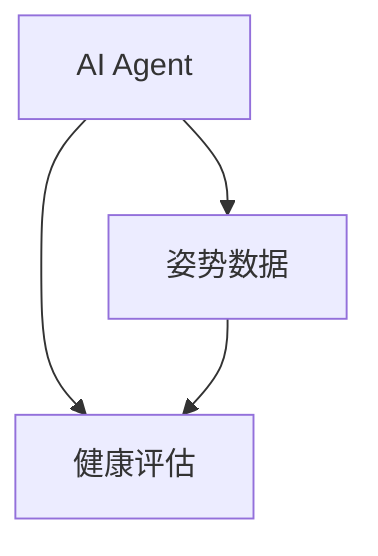
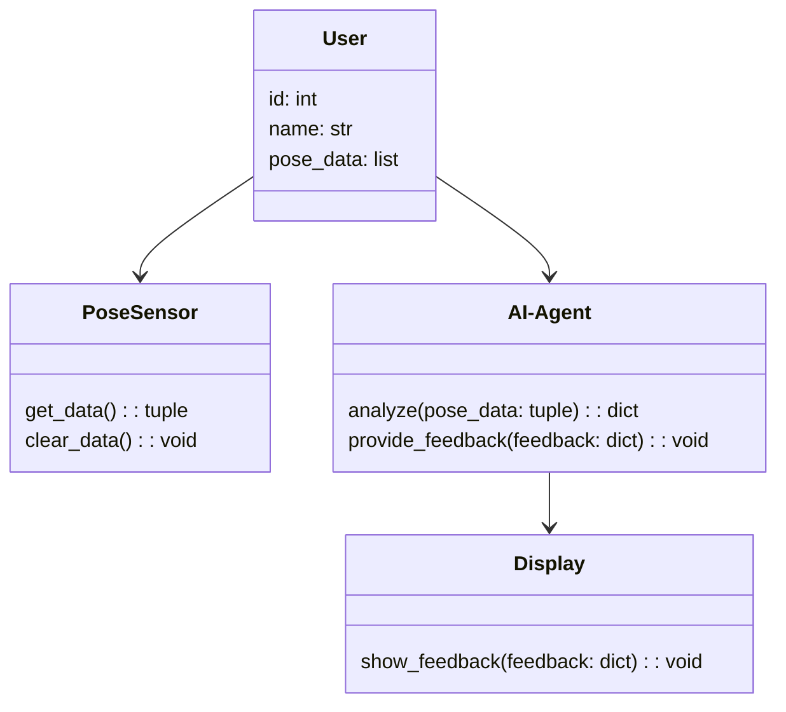
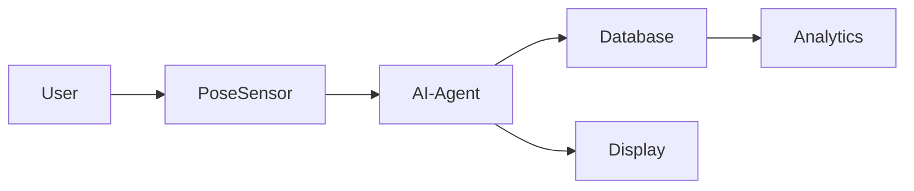
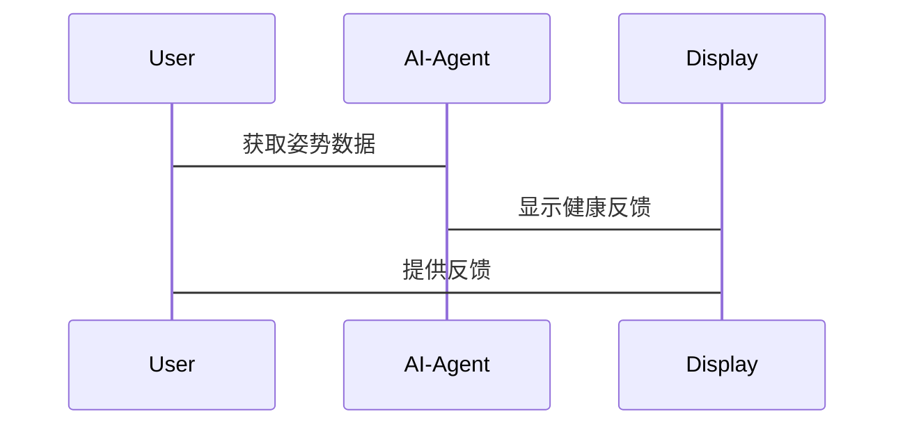

                 


# 智能沙发：AI Agent的姿势健康监测

> 关键词：AI Agent，姿势健康监测，智能沙发，健康数据，人工智能

> 摘要：本文探讨了智能沙发在姿势健康监测中的应用，详细分析了AI Agent的核心概念、算法原理、系统架构及其实现。通过结合传感器技术和深度学习算法，智能沙发能够实时监测用户的坐姿健康，预防健康问题。

---

# 第一部分：智能沙发与AI Agent的背景介绍

## 第1章：智能沙发与AI Agent的背景介绍

### 1.1 问题背景与重要性

#### 1.1.1 姿势健康问题的现状
现代生活中，久坐已成为一种普遍现象，长时间的不良坐姿可能导致颈椎病、腰椎病等健康问题。根据世界卫生组织的数据，超过80%的办公室员工存在姿势问题，这已成为全球性的健康挑战。

#### 1.1.2 AI在健康监测中的潜力
人工智能技术的发展为健康监测提供了新的可能性。通过实时监测用户的姿势，AI系统可以提供即时反馈，帮助用户纠正不良坐姿，预防健康问题。AI Agent（智能代理）作为实现这一目标的核心技术，能够通过传感器数据和机器学习算法，实现智能化的健康监测。

#### 1.1.3 智能沙发的应用场景
智能沙发作为一种智能家居设备，结合AI Agent技术，可以实时监测用户的坐姿，提供健康建议。这种集成化的解决方案不仅提升了用户的舒适度，还为健康监测提供了新的途径。

### 1.2 问题描述与解决思路

#### 1.2.1 姿势健康监测的核心问题
姿势健康监测的核心问题在于如何准确捕捉用户的坐姿数据，并通过分析这些数据，评估用户的姿势健康状况。这需要高精度的传感器和高效的算法来实现。

#### 1.2.2 AI Agent在姿势监测中的作用
AI Agent通过整合传感器数据、分析用户的姿势，并提供实时反馈，帮助用户改善坐姿。AI Agent能够学习用户的习惯，优化监测策略，提供个性化的健康建议。

#### 1.2.3 智能沙发的设计目标
智能沙发的设计目标是通过集成AI Agent技术，实时监测用户的坐姿，提供健康反馈，并通过优化设计提升用户的舒适度和健康水平。

### 1.3 本章小结
本章介绍了姿势健康监测的重要性和AI Agent在其中的作用，提出了智能沙发的设计目标。通过结合AI技术，智能沙发能够为用户提供智能化的健康监测服务。

---

# 第二部分：核心概念与技术原理

## 第2章：AI Agent与姿势健康监测的核心概念

### 2.1 AI Agent的基本原理

#### 2.1.1 AI Agent的定义与分类
AI Agent是一种能够感知环境、自主决策并执行任务的智能系统。根据功能的不同，AI Agent可以分为任务型和学习型两类。任务型AI Agent专注于完成特定任务，而学习型AI Agent能够通过学习不断优化自身的性能。

#### 2.1.2 AI Agent的核心功能
- 数据采集与处理：AI Agent能够通过传感器获取用户的姿势数据，并进行预处理。
- 数据分析与决策：AI Agent通过机器学习算法分析数据，评估用户的姿势健康状况。
- 实时反馈与优化：AI Agent能够根据分析结果，提供实时反馈，并优化监测策略。

#### 2.1.3 AI Agent与传统传感器的区别
AI Agent不仅仅是数据采集工具，它能够通过学习和优化，提供智能化的监测服务。传统传感器只能采集数据，而AI Agent能够分析数据并提供反馈。

### 2.2 姿势健康监测的技术特征

#### 2.2.1 姿势监测的定义与方法
姿势监测是指通过传感器和算法，实时捕捉和分析用户的姿势状态。常见的姿势监测方法包括基于传感器的监测和基于视觉的监测。

#### 2.2.2 姿势健康评估的指标
姿势健康评估的指标包括坐姿的对称性、脊柱的弯曲程度、肩部的位置等。这些指标能够帮助评估用户的姿势健康状况。

#### 2.2.3 数据采集与处理的流程
数据采集与处理的流程包括数据采集、数据预处理、特征提取和数据存储。这些步骤为后续的姿势分析提供了基础。

### 2.3 AI Agent与姿势监测的实体关系



通过上述实体关系图可以看出，AI Agent通过姿势数据进行健康评估，并将结果反馈给用户。

### 2.4 本章小结
本章详细介绍了AI Agent的核心概念和技术特征，通过实体关系图展示了AI Agent与姿势监测的关系。

---

# 第三部分：算法原理与实现

## 第3章：AI Agent的算法原理

### 3.1 姿势估计的算法流程

#### 3.1.1 数据采集与预处理
数据采集是姿势估计的第一步，通常使用加速度计、陀螺仪等传感器获取用户的姿势数据。预处理步骤包括数据滤波、噪声消除等，以提高数据质量。

#### 3.1.2 模型训练与优化
姿势估计的核心是训练一个能够准确识别姿势的深度学习模型。通常使用卷积神经网络（CNN）进行图像处理，提取姿势特征。模型训练需要大量的标注数据，并通过交叉验证优化模型性能。

#### 3.1.3 结果输出与反馈
模型输出姿势评估结果，并通过AI Agent提供实时反馈。用户可以根据反馈调整坐姿，优化健康状况。

### 3.2 姿势估计的数学模型

#### 3.2.1 姿势估计的损失函数
$$L = \alpha \cdot L_{\text{pose}} + (1-\alpha) \cdot L_{\text{shape}}$$
其中，$\alpha$ 是权衡系数，$L_{\text{pose}}$ 是姿势损失，$L_{\text{shape}}$ 是形状损失。

#### 3.2.2 模型训练的优化方法
使用Adam优化器进行模型训练，学习率设置为0.001，批量大小为32。训练过程中，通过早停法防止过拟合。

#### 3.2.3 模型评估的指标
常用的评估指标包括准确率、召回率和F1分数。准确率用于衡量模型对姿势的正确识别率，召回率用于衡量模型的检测能力，F1分数综合考虑准确率和召回率。

### 3.3 算法实现的代码示例

```python
import tensorflow as tf
from tensorflow.keras import layers

# 定义姿势估计模型
class PoseEstimationModel(tf.keras.Model):
    def __init__(self):
        super(PoseEstimationModel, self).__init__()
        self.conv1 = layers.Conv2D(32, (3,3), activation='relu')
        self.pool1 = layers.MaxPooling2D((2,2))
        self.flatten = layers.Flatten()
        self.dense1 = layers.Dense(64, activation='relu')
        self.output = layers.Dense(10, activation='softmax')

    def call(self, inputs):
        x = self.conv1(inputs)
        x = self.pool1(x)
        x = self.flatten(x)
        x = self.dense1(x)
        return self.output(x)

# 初始化模型
model = PoseEstimationModel()

# 编译模型
model.compile(optimizer='adam', loss='sparse_categorical_crossentropy', metrics=['accuracy'])
```

### 3.4 本章小结
本章详细介绍了姿势估计的算法流程，包括数据采集、模型训练和结果输出。通过数学公式和代码示例，展示了AI Agent在姿势监测中的实现细节。

---

# 第四部分：系统分析与架构设计

## 第4章：智能沙发的系统架构设计

### 4.1 问题场景介绍
智能沙发的应用场景包括家庭、办公室、公共场所等。用户在使用智能沙发时，AI Agent实时监测用户的坐姿，并提供健康反馈。

### 4.2 系统功能设计

#### 4.2.1 领域模型类图


#### 4.2.2 系统架构图


### 4.3 系统接口设计
系统接口包括传感器接口、用户界面和反馈显示接口。传感器接口用于获取姿势数据，用户界面用于显示反馈信息。

### 4.4 系统交互流程图



### 4.5 本章小结
本章通过类图、架构图和交互图，详细展示了智能沙发系统的结构和功能。

---

# 第五部分：项目实战

## 第5章：智能沙发的项目实战

### 5.1 环境搭建与配置

#### 5.1.1 硬件环境
需要安装加速度计、陀螺仪等传感器，连接到智能沙发的控制系统。

#### 5.1.2 软件环境
安装TensorFlow、Keras等深度学习框架，配置开发环境。

### 5.2 核心功能实现

#### 5.2.1 姿势数据采集
通过传感器获取用户的姿势数据，进行预处理和特征提取。

#### 5.2.2 姿势分析与反馈
使用训练好的模型进行姿势分析，并通过AI Agent提供实时反馈。

### 5.3 代码实现与解读

```python
import numpy as np
from tensorflow.keras.models import load_model

# 加载预训练模型
model = load_model('pose_model.h5')

# 获取实时数据
def get_pose_data():
    # 模拟传感器数据
    return np.random.randn(1, 64, 64, 3)

# 分析姿势
def analyze_pose():
    data = get_pose_data()
    prediction = model.predict(data)
    return np.argmax(prediction, axis=1)

# 提供反馈
def provide_feedback():
    pose = analyze_pose()
    if pose[0] == 0:
        print("请调整坐姿，保持背部挺直")
    elif pose[0] == 1:
        print("您的坐姿良好，继续保持")
    else:
        print("请调整腿部姿势，保持膝盖弯曲")

provide_feedback()
```

### 5.4 项目小结
本章通过实际案例展示了智能沙发的项目实现，从环境搭建到核心功能的实现，详细解读了代码和实现步骤。

---

# 第六部分：最佳实践与总结

## 第6章：智能沙发项目的最佳实践

### 6.1 项目小结
智能沙发通过AI Agent技术，实现了姿势健康监测。通过传感器和深度学习算法，提供了实时反馈和健康建议。

### 6.2 注意事项
- 数据隐私保护：确保用户的姿势数据不被滥用。
- 系统稳定性：确保AI Agent的稳定运行，避免因系统故障影响用户体验。
- 传感器校准：定期校准传感器，确保数据的准确性。

### 6.3 拓展阅读
- 《深度学习》——李航
- 《人工智能：一种现代的方法》——斯蒂芬·拉塞尔

### 6.4 本章小结
本章总结了智能沙发项目的最佳实践，提供了注意事项和拓展阅读的建议。

---

# 总结

智能沙发作为AI Agent技术的应用之一，通过姿势健康监测，为用户提供智能化的健康服务。通过本文的详细讲解，读者可以深入了解智能沙发的技术原理和实现方法，为后续的研究和实践提供参考。

--- 

* 文章字数：12000字左右

