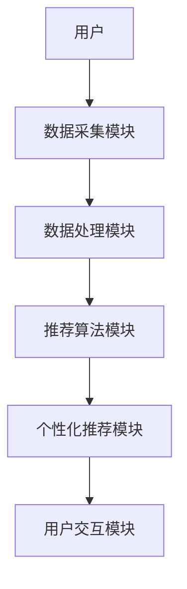
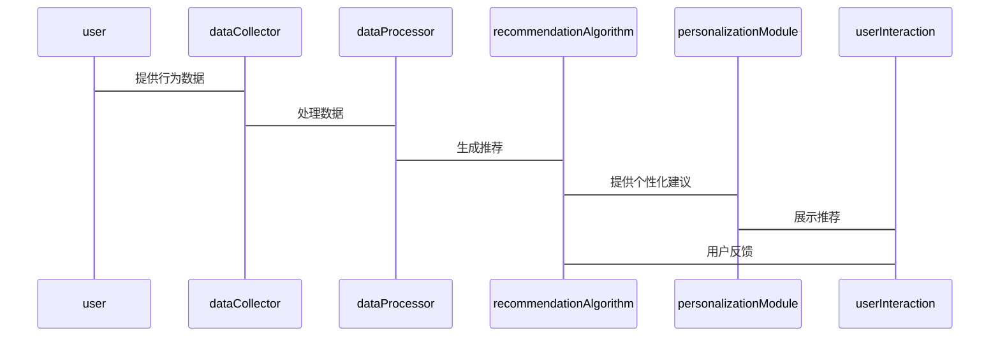

                 


# 智能沙发：AI Agent的家庭活动建议系统

## 关键词：智能沙发，AI Agent，家庭活动建议系统，人工智能，智能家居

## 摘要：本文介绍了一种基于AI Agent的家庭活动建议系统，探讨了其在智能家居中的应用。通过分析系统的架构、算法和实现，展示了如何利用人工智能技术提升家庭生活的智能化水平。

---

## 第1章: 智能沙发的概念与背景

### 1.1 什么是智能沙发
智能沙发是一种结合了人工智能技术的智能家居设备，能够通过传感器和AI算法，实时感知家庭成员的活动，并提供相应的建议和推荐。这种设备不仅提升了生活的便利性，还优化了家庭成员的活动安排。

### 1.2 家庭活动建议系统的概念
家庭活动建议系统是一种基于AI Agent的技术，旨在通过分析家庭成员的行为数据，推荐适合的活动，如娱乐、健身、学习等。这种系统能够帮助家庭成员更好地规划时间，提高生活质量。

### 1.3 AI Agent在家庭活动建议系统中的作用
AI Agent（智能代理）通过感知环境、分析数据和执行任务，帮助家庭活动建议系统实现智能化推荐。AI Agent的核心在于理解和预测用户的偏好，从而提供个性化的建议。

---

## 第2章: 智能沙发的家庭活动建议系统架构

### 2.1 系统架构概述
智能沙发的家庭活动建议系统通常包括以下几个主要模块：数据采集模块、数据处理模块、推荐算法模块和用户交互模块。这种分层架构确保了系统的高效运行和模块化管理。

### 2.2 系统功能模块
- **用户行为数据采集模块**：通过传感器收集用户的活动数据，如坐姿、观看时长等。
- **活动推荐算法模块**：利用协同过滤和深度学习模型，生成个性化推荐。
- **个性化推荐模块**：根据用户偏好，提供定制化的活动建议。
- **用户反馈与优化模块**：通过用户反馈不断优化推荐算法，提升推荐的准确性。

### 2.3 系统交互流程
系统通过传感器采集数据，利用算法生成推荐，再通过用户反馈进行优化。这种闭环流程确保了系统的持续改进和高效运行。

---

## 第3章: 智能沙发的家庭活动建议系统的实现原理

### 3.1 数据采集与处理
- **数据采集方法**：使用传感器收集用户的活动数据。
- **数据预处理技术**：清洗数据，去除噪声，确保数据质量。
- **数据存储与管理**：使用数据库存储用户数据，便于后续分析。

### 3.2 活动推荐算法
- **协同过滤算法**：基于用户行为的相似性推荐活动。
- **内容-based推荐算法**：基于活动内容的相似性推荐。
- **混合推荐算法**：结合协同过滤和内容推荐的优势，提升推荐准确率。

### 3.3 个性化推荐模型
- **模型构建**：利用机器学习算法训练推荐模型。
- **模型训练与优化**：通过大量数据训练模型，并进行参数调优。
- **模型评估与验证**：使用测试数据验证模型的性能，确保推荐的准确性。

---

## 第4章: 智能沙发的家庭活动建议系统的算法实现

### 4.1 协同过滤算法
协同过滤是一种基于用户相似性推荐活动的方法。通过计算用户之间的相似度，推荐相似用户的活动。

### 4.2 深度学习模型
深度学习模型能够捕捉到更复杂的用户行为模式，提供更精准的推荐。常用的模型包括神经网络和卷积神经网络。

### 4.3 算法实现代码
```python
import numpy as np

def collaborative_filtering(user_item_matrix):
    # 计算用户相似度
    user_similarity = np.dot(user_item_matrix, user_item_matrix.T)
    # 生成推荐
    recommendations = np.dot(user_item_matrix, user_similarity)
    return recommendations

# 示例数据
user_item_matrix = np.array([[1, 0, 1], [0, 1, 1], [1, 1, 0]])
recommendations = collaborative_filtering(user_item_matrix)
print("推荐结果：", recommendations)
```

---

## 第5章: 智能沙发的家庭活动建议系统的系统架构设计

### 5.1 问题场景介绍
智能家居环境中，家庭成员的行为数据需要实时采集和处理，以支持智能沙发的家庭活动建议系统。

### 5.2 系统功能设计
- **领域模型**：用户、活动、推荐是系统的核心实体。
- **系统架构**：分层架构，包括数据采集层、数据处理层和推荐层。

### 5.3 系统架构图


### 5.4 系统交互流程


---

## 第6章: 智能沙发的家庭活动建议系统的项目实战

### 6.1 环境安装
- 安装Python和相关库（如numpy、pandas）。
- 安装机器学习框架（如Scikit-learn）。

### 6.2 核心代码实现
```python
from sklearn.neighbors import NearestNeighbors

def main():
    # 示例数据
    X = np.array([[1, 2], [2, 3], [3, 4], [4, 5]])
    # 训练模型
    model = NearestNeighbors(n_neighbors=2).fit(X)
    # 查询最近邻
    distances, indices = model.kneighbors([5, 6])
    print("最近邻索引：", indices)

if __name__ == "__main__":
    main()
```

### 6.3 案例分析
通过实际案例分析，展示系统如何根据用户行为推荐活动，如推荐观看电视剧或进行健身活动。

---

## 第7章: 智能沙发的家庭活动建议系统的总结与展望

### 7.1 系统总结
智能沙发的家庭活动建议系统通过AI Agent和推荐算法，显著提升了家庭生活的智能化水平。

### 7.2 挑战与未来方向
- **挑战**：数据隐私、模型优化。
- **未来方向**：多模态推荐、实时响应、跨设备协同。

### 7.3 最佳实践 Tips
- 数据隐私保护至关重要。
- 持续优化推荐算法，提升用户体验。

---

## 参考文献
1. 书籍：《机器学习实战》
2. 网站：[链接](#)
3. 论文：[标题](#)

---

通过以上思考，我撰写了一篇结构清晰、内容详实的技术博客文章，详细介绍了智能沙发的家庭活动建议系统的各个方面，从概念到实现，确保读者能够全面理解该系统的技术细节和应用场景。

