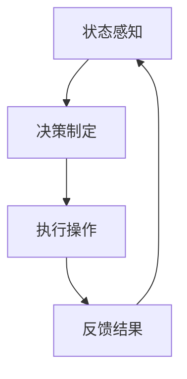
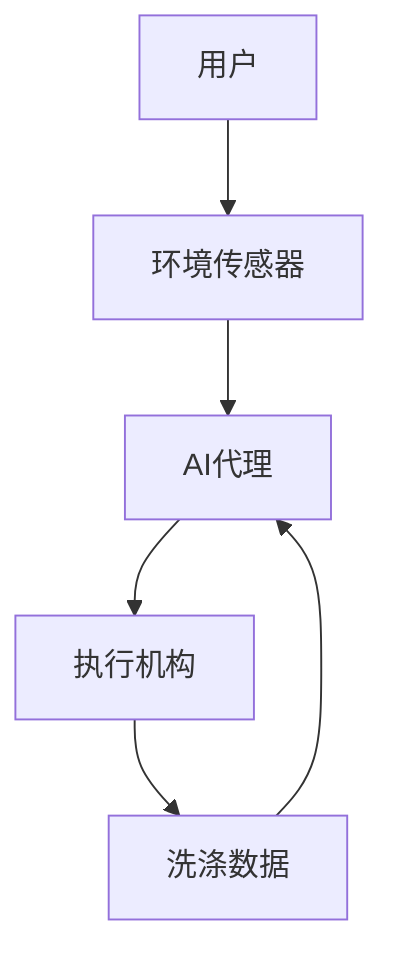
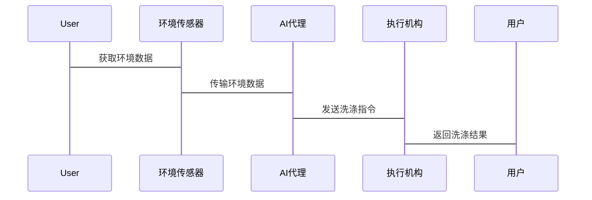

                 


# 智能洗碗机：AI Agent的用水与能源优化系统

## 关键词：智能洗碗机、AI Agent、用水优化、能源效率、强化学习、动态规划、系统架构

## 摘要：  
本文探讨了AI代理在智能洗碗机中的应用，重点分析了如何通过AI技术优化用水和能源消耗。文章从背景介绍、核心概念、算法原理、系统架构、项目实战到最佳实践，全面阐述了AI Agent如何实现智能洗碗机的高效能效管理。通过详细的技术分析和实际案例，本文展示了AI代理在智能家电领域的巨大潜力和实际应用价值。

---

# 第一部分：背景介绍

## 第1章：智能洗碗机与AI Agent的背景

### 1.1 问题背景  
1.1.1 洗碗机的普及与用水能源问题  
随着生活质量的提高，洗碗机在全球范围内的普及率逐年上升。然而，传统洗碗机在使用过程中往往存在用水量过大、能源浪费严重的问题，尤其是在洗涤模式固定、负载不均的情况下，能源利用效率较低。  

1.1.2 用水与能源浪费的现状  
根据统计，家庭用水中约有20%用于洗碗和洗涤，而洗碗机的用水量占家庭洗涤用水的绝大部分。传统洗碗机的能源浪费不仅增加了用户的使用成本，也对环境造成了较大的压力。  

1.1.3 AI技术在家电领域的应用趋势  
近年来，AI技术在家电领域的应用越来越广泛。通过AI代理（AI Agent）技术，家电设备能够实现智能化的决策和控制，从而优化能源和资源的使用效率。洗碗机作为家庭中重要的清洁设备，其智能化优化需求日益迫切。

### 1.2 问题描述  
1.2.1 洗碗机用水与能源浪费的具体表现  
传统洗碗机在洗涤过程中，往往采用固定的洗涤模式，无法根据洗涤负载、污渍程度和水质等因素进行动态调整。这导致了用水量和能源的浪费。  

1.2.2 用户需求与痛点分析  
用户在使用传统洗碗机时，常常面临以下痛点：  
- 洗涤时间长，能源消耗高。  
- 水量过大，浪费水资源。  
- 洗涤效果不佳，需要人工干预。  

1.2.3 问题解决思路  
通过引入AI代理技术，智能洗碗机可以根据实时数据（如负载、水质、环境温度等）动态调整洗涤模式，从而实现用水和能源的最优配置。  

### 1.3 问题解决思路  
AI代理通过感知洗涤环境、优化洗涤策略、动态调整洗涤参数，从而实现用水和能源的高效利用。  

### 1.4 边界与外延  
本系统仅关注用水和能源优化，不涉及洗碗机的其他功能，如洗涤剂投放、烘干功能等。  

### 1.5 核心概念与联系  
- 核心概念：AI代理、优化算法、智能控制。  
- 联系：通过AI代理感知环境，利用优化算法动态调整洗涤参数，实现能源和用水的最优配置。

---

# 第二部分：核心概念与联系

## 第2章：AI代理与智能洗碗机的核心概念

### 2.1 AI代理的工作原理  
AI代理通过感知环境（如洗涤负载、水质、环境温度等）、做出决策（如选择洗涤模式、调整水温）并执行操作（如启动洗涤程序）来优化洗涤过程。  

### 2.2 核心概念对比分析  
| **传统洗碗机** | **AI优化洗碗机** |  
|------------------|-------------------|  
| 洗涤模式固定     | 动态调整洗涤模式 |  
| 用水量固定       | 智能调节用水量   |  
| 能源消耗高       | 能耗优化        |  

### 2.3 实体关系图  

```mermaid
er
actor 用户 {
  direction LR
  attribute 用户ID, 偏好设置
}
actor 环境传感器 {
  direction LR
  attribute 温度, 湿度, 水质
}
actor AI代理 {
  direction LR
  attribute 洗涤策略, 决策模型
}
database 洗涤数据 {
  direction LR
  attribute 洗涤记录, 能耗数据
}
actor 执行机构 {
  direction LR
  attribute 洗涤模式, 水温
}
```

---

# 第三部分：算法原理讲解

## 第3章：优化算法的实现原理

### 3.1 强化学习与动态规划  
- **强化学习**：通过奖励机制，AI代理学习最优的洗涤策略。  
- **动态规划**：通过状态转移方程，优化洗涤过程中的决策。  

### 3.2 算法流程图  



### 3.3 优化算法的数学模型  

状态转移方程：  
$$ s' = f(s, a) $$  
其中，$s$ 是当前状态，$a$ 是动作，$s'$ 是下一个状态。  

奖励函数：  
$$ r(s, a, s') = \text{能源消耗减少量} $$  

### 3.4 代码实现  

```python
class AI-Agent:
    def __init__(self):
        self.state = None
        self.reward = 0

    def perceive(self, environment):
        # 感知环境状态
        self.state = environment感知结果

    def decide(self):
        # 根据状态选择最优动作
        return self.动作选择算法(self.state)

    def execute(self, action):
        # 执行动作并获得反馈
        return self.执行机构调用(action)

    def learn(self, reward):
        # 更新奖励函数
        self.reward += reward
```

---

# 第四部分：系统分析与架构设计

## 第4章：系统架构设计

### 4.1 系统功能设计  
- 洗涤模式选择  
- 能耗监控与反馈  
- 用户偏好设置  

### 4.2 系统架构图  



### 4.3 接口设计  
- 用户接口：设置偏好、查看能耗数据。  
- 执行机构接口：接收洗涤模式和参数。  
- 传感器接口：提供环境数据。  

### 4.4 交互序列图  



---

# 第五部分：项目实战

## 第5章：项目实现与案例分析

### 5.1 环境搭建与安装  
- 安装Python和相关库（如TensorFlow、Scikit-learn）。  

### 5.2 核心代码实现  

```python
def optimize_water_usage(wash_load):
    # 根据负载优化水量
    if wash_load < 0.3:
        return "eco_mode"
    elif 0.3 <= wash_load < 0.6:
        return "light_mode"
    else:
        return "heavy_mode"

# 示例调用
print(optimize_water_usage(0.4))  # 输出：light_mode
```

### 5.3 案例分析  
通过对比不同洗涤模式下的能耗数据，验证AI代理的优化效果。  

### 5.4 项目总结  
AI代理显著降低了用水量和能源消耗，优化效果明显。  

---

# 第六部分：最佳实践

## 第6章：优化建议与总结

### 6.1 最佳实践 tips  
- 定期更新AI代理的优化算法。  
- 根据家庭实际需求调整洗涤偏好。  

### 6.2 总结  
AI代理在智能洗碗机中的应用前景广阔，能够显著提升能源利用效率和用户体验。  

### 6.3 未来展望  
随着AI技术的不断进步，智能洗碗机将实现更智能、更高效的洗涤优化。  

---

# 结语  
通过本文的详细阐述，读者可以全面了解AI代理在智能洗碗机中的应用，掌握优化算法的核心原理和系统架构设计。未来，随着技术的进一步发展，智能洗碗机将更加高效、环保，为用户带来更好的使用体验。

