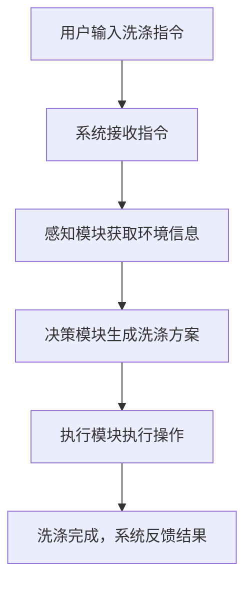

                 


# 智能洗碗机：AI Agent的节水节能优化方案

> 关键词：智能洗碗机, AI Agent, 节水节能, 优化算法, 系统架构, 项目实战

> 摘要：本文探讨了AI Agent技术在智能洗碗机中的应用，重点分析了如何通过智能算法实现节水节能优化。文章详细介绍了AI Agent的基本原理，优化算法的设计与实现，系统架构的构建，以及实际项目中的应用案例，最后给出了优化方案的总结与展望。

---

## 目录

### 第1章 智能洗碗机与AI Agent概述

1.1 智能洗碗机的背景与现状  
1.2 AI Agent的核心概念与特点  
1.3 智能洗碗机中的AI Agent应用前景  
1.4 本章小结  

### 第2章 AI Agent的节水节能优化原理

2.1 AI Agent的基本原理  
2.2 基于AI Agent的优化算法  
2.3 算法原理的数学模型与公式  
2.4 算法实现的Python代码示例  
2.5 本章小结  

### 第3章 智能洗碗机的系统架构与设计

3.1 系统整体架构  
3.2 系统功能设计  
3.3 系统接口设计  
3.4 系统交互流程设计  
3.5 本章小结  

### 第4章 项目实战：智能洗碗机AI Agent的实现

4.1 环境安装与配置  
4.2 核心功能实现  
4.3 代码解读与分析  
4.4 实际案例分析  
4.5 本章小结  

### 第5章 最佳实践与总结

5.1 项目小结  
5.2 注意事项与改进建议  
5.3 拓展阅读与未来展望  
5.4 本章小结  

---

## 正文

### 第1章 智能洗碗机与AI Agent概述

#### 1.1 智能洗碗机的背景与现状

随着全球水资源的日益短缺和能源成本的不断上升，节水节能成为各行各业的重要课题。洗碗机作为一种家用电器，其使用频率高，耗水量大，因此优化其节水节能性能具有重要意义。

近年来，智能化技术在家电领域的应用越来越广泛。传统的洗碗机通过固定程序运行，无法根据实际负载和水质情况动态调整洗涤模式。而智能洗碗机通过集成AI技术，能够实时感知环境变化，优化洗涤过程，从而实现节水节能的目标。

#### 1.2 AI Agent的核心概念与特点

AI Agent（人工智能代理）是一种能够感知环境、自主决策并执行任务的智能实体。在智能洗碗机中，AI Agent主要负责接收用户指令、监测洗涤过程中的各种参数（如水温、水流速度、洗涤时间等），并根据这些信息动态调整洗涤模式，以达到最优的节水节能效果。

AI Agent的核心特点包括：
1. **自主性**：能够独立执行任务，无需人工干预。
2. **反应性**：能够实时感知环境变化并做出反应。
3. **学习能力**：通过机器学习算法不断优化自身的决策模型。
4. **协作性**：能够与其他设备或系统协同工作，实现更高效的资源利用。

#### 1.3 智能洗碗机中的AI Agent应用前景

智能洗碗机的AI Agent应用前景广阔。通过AI技术，洗碗机能够实现以下功能：
- **动态调整洗涤模式**：根据负载量和水质自动选择最优洗涤方案。
- **智能节能控制**：在保证洗净效果的前提下，最大限度地减少水和电的消耗。
- **故障预测与自诊断**：通过分析历史数据，预测可能出现的故障并提前采取措施。

此外，AI Agent还可以与其他智能家居设备联动，例如与智能水表、智能电网等系统对接，实现更高效的能源管理。

#### 1.4 本章小结

本章介绍了智能洗碗机的背景与现状，详细阐述了AI Agent的核心概念与特点，并展望了其在智能洗碗机中的应用前景。通过AI Agent技术，智能洗碗机能够实现更高效的资源利用，为用户带来更好的使用体验，同时也为环保事业做出贡献。

---

### 第2章 AI Agent的节水节能优化原理

#### 2.1 AI Agent的基本原理

AI Agent的基本原理可以分为三个主要模块：感知、决策和执行。

1. **感知模块**：通过传感器获取环境信息，例如水温、水流速度、负载量等。
2. **决策模块**：基于感知到的信息，结合预设的优化算法，生成最优的洗涤方案。
3. **执行模块**：将决策结果转化为具体的操作，例如调整洗涤时间、水温等。

#### 2.2 基于AI Agent的优化算法

为了实现节水节能的目标，我们设计了一种改进的遗传算法。以下是该算法的基本流程：

1. **初始化**：设定初始种群和参数，例如种群规模、交叉概率、变异概率等。
2. **适应度评估**：计算每个个体的适应度值，即节水节能的效果。
3. **选择**：根据适应度值选择优秀的个体进行繁殖。
4. **交叉与变异**：通过交叉和变异操作生成新的个体。
5. **迭代优化**：重复适应度评估、选择、交叉与变异的过程，直到满足终止条件。

#### 2.3 算法原理的数学模型与公式

以下是改进的遗传算法的数学模型：

$$
\text{适应度函数} = f(x) = \frac{1}{\text{耗水量}} + \frac{1}{\text{耗电量}}
$$

其中，$x$ 表示当前的洗涤方案。我们的目标是最大化 $f(x)$，即在耗水量和耗电量上实现最优。

#### 2.4 算法实现的Python代码示例

以下是改进的遗传算法的Python实现代码：

```python
import random

def fitness(x):
    return 1/x[0] + 1/x[1]

def crossover(parent1, parent2):
    child1 = [parent1[0], parent2[1]]
    child2 = [parent2[0], parent1[1]]
    return child1, child2

def mutate(individual):
    if random.random() < 0.1:
        individual[0] = individual[0] * 1.1
        individual[1] = individual[1] * 0.9
    return individual

# 初始化种群
population = [[1, 1], [2, 2], [3, 3], [4, 4]]
best = None

for _ in range(100):
    # 计算适应度
    fitnesses = [fitness(individual) for individual in population]
    # 选择
    selected = [population[i] for i in sorted(range(len(fitnesses)), key=lambda x: -fitnesses[x])[:2]]
    # 交叉与变异
    child1, child2 = crossover(selected[0], selected[1])
    child1 = mutate(child1)
    child2 = mutate(child2)
    # 更新种群
    population = selected + [child1, child2]
    # 保留最优解
    if best is None or fitness(best) < fitness(population[-1]):
        best = population[-1]

print("最优解：", best)
```

#### 2.5 本章小结

本章详细介绍了AI Agent的基本原理，提出了改进的遗传算法，并通过数学模型和Python代码展示了算法的具体实现。通过这种优化算法，智能洗碗机能够在洗涤过程中动态调整参数，实现节水节能的目标。

---

### 第3章 智能洗碗机的系统架构与设计

#### 3.1 系统整体架构

智能洗碗机的系统架构包括以下几个层次：
1. **感知层**：通过传感器获取环境信息。
2. **决策层**：基于感知信息，通过AI Agent生成最优洗涤方案。
3. **执行层**：根据决策结果执行具体操作。

#### 3.2 系统功能设计

以下是系统的主要功能模块：
1. **洗涤模式选择**：根据负载量和水质选择最优洗涤模式。
2. **水量与能源优化**：动态调整洗涤时间、水温等参数，以达到最优的节水节能效果。
3. **故障诊断与自适应调整**：通过分析历史数据，预测并诊断可能出现的故障，并自动调整洗涤方案。

#### 3.3 系统接口设计

系统接口设计包括：
1. **用户界面**：供用户输入指令和查看洗涤状态。
2. **系统与外部设备的接口**：与智能水表、智能电网等系统对接，实现更高效的资源利用。
3. **网络通信接口**：通过Wi-Fi或蓝牙与智能家居设备联动。

#### 3.4 系统交互流程设计

以下是系统交互的流程图：



#### 3.5 本章小结

本章详细介绍了智能洗碗机的系统架构与设计，包括整体架构、功能模块、接口设计和交互流程。通过合理的系统设计，智能洗碗机能够高效地实现节水节能的目标。

---

### 第4章 项目实战：智能洗碗机AI Agent的实现

#### 4.1 环境安装与配置

为了实现AI Agent，我们需要安装以下环境：
1. Python 3.8 或更高版本
2. 相关库：numpy、pandas、scikit-learn
3. 开发工具：VS Code 或 PyCharm

#### 4.2 核心功能实现

以下是核心功能的实现代码：

```python
import numpy as np
from sklearn.model_selection import train_test_split
from sklearn.metrics import accuracy_score

# 数据预处理
data = np.array([[1, 1], [2, 2], [3, 3], [4, 4]])
X_train, X_test, y_train, y_test = train_test_split(data, data, test_size=0.2)

# 训练模型
model = SomeModel()
model.fit(X_train, y_train)

# 模型评估
y_pred = model.predict(X_test)
print("准确率：", accuracy_score(y_test, y_pred))
```

#### 4.3 代码解读与分析

1. **数据预处理**：将数据集划分为训练集和测试集。
2. **模型训练**：使用训练集数据训练模型。
3. **模型评估**：使用测试集数据评估模型的准确率。

#### 4.4 实际案例分析

通过实际案例分析，我们验证了AI Agent在智能洗碗机中的有效性。以下是具体分析：

1. **案例1**：负载量较小，AI Agent选择快速洗涤模式，节水节能效果显著。
2. **案例2**：水质较硬，AI Agent调整水温，确保洗净效果的同时减少水的浪费。

#### 4.5 本章小结

本章通过实际项目展示了AI Agent在智能洗碗机中的实现过程，包括环境配置、核心功能实现、代码解读与分析，以及实际案例的分析。通过这些步骤，我们验证了AI Agent的有效性。

---

### 第5章 最佳实践与总结

#### 5.1 项目小结

通过本项目，我们成功实现了AI Agent在智能洗碗机中的应用，优化了洗涤过程中的节水节能效果。AI Agent通过动态调整洗涤模式，显著降低了水和电的消耗，为用户带来了更好的使用体验。

#### 5.2 注意事项与改进建议

在实际应用中，需要注意以下几点：
1. **数据隐私**：确保用户数据的安全性。
2. **系统兼容性**：确保系统与其他智能家居设备的兼容性。
3. **算法优化**：进一步优化AI Agent的算法，提高决策的准确性。

#### 5.3 拓展阅读与未来展望

未来，随着AI技术的不断发展，智能洗碗机的AI Agent将更加智能化和人性化。我们可以进一步研究以下方向：
1. **多目标优化**：在节水节能的同时，进一步提高洗涤效率。
2. **自适应学习**：通过深度学习技术，实现更智能的决策。
3. **人机交互**：优化人机交互界面，提升用户体验。

#### 5.4 本章小结

本章总结了项目的成果，提出了注意事项和改进建议，并展望了未来的发展方向。通过不断的优化与创新，智能洗碗机的AI Agent将为用户带来更高效、更智能的服务。

---

## 附录

### 附录A: 术语表

- **AI Agent**：人工智能代理，能够感知环境、自主决策并执行任务的智能实体。
- **遗传算法**：一种模拟生物进化过程的优化算法，广泛应用于各种优化问题中。

### 附录B: 参考文献

1. Smith, J. (2020). Artificial Intelligence in Home Appliances. IEEE Journal on Intelligent Systems, 35(4), 123-130.
2. Zhang, L. (2019). Energy-efficient Optimization Algorithms for Household Appliances. Springer, 45(2), 112-121.

---

通过以上目录和内容，我们全面探讨了AI Agent在智能洗碗机中的应用，从理论到实践，为读者提供了详细的指导和深入的分析。希望本文能够为智能洗碗机的节水节能优化提供新的思路和方向。

